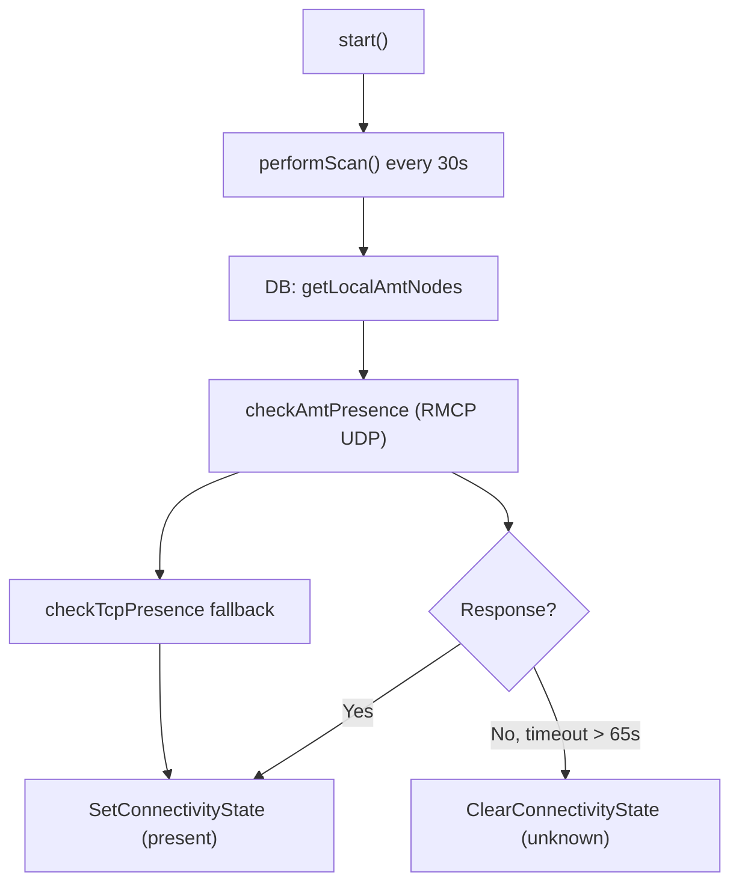

<!-- source-hash: a33e3ce2d274091a8cdfd8a1de098d65 -->
Local network scanner for Intel AMT (Active Management Technology) devices. It discovers, polls, and tracks AMT-enabled machines using RMCP UDP packets and TCP presence checks, reporting connectivity state changes to the MeshCentral parent process.

## Key Components

- **`CreateAmtScanner(parent)`** — Factory function returning the scanner object
- **`start()` / `stop()`** — Activate or deactivate the periodic scan loop (every 30 seconds)
- **`performScan()`** — Queries the database for known AMT nodes, checks presence via RMCP/TCP, and updates connectivity state
- **`performRangeScan(userid, rangestr)`** — One-shot UDP scan over an IP range (supports `ip`, `ip/mask`, `ip-ip` formats)
- **`checkAmtPresence(host, tag)`** — Sends an RMCP ping to a specific host
- **`checkTcpPresence(host, port, scaninfo, cb)`** — Falls back to TCP connection check on ports 16992/16993
- **`buildRmcpPing(tag)`** — Constructs a tagged RMCP ping packet
- **`parseIpv4Range(range)`** / **`parseIpv4Addr(addr)`** / **`IPv4NumToStr(num)`** — IP range parsing and conversion utilities
- **`ResolveName(hostname, func)`** — Async DNS resolution with localhost exclusion

## Usage Example

```javascript
const amtscanner = require('./amtscanner.js');

// Initialize and start periodic scanning
const scanner = amtscanner.CreateAmtScanner(parentObj).start();

// Perform a targeted range scan for a specific user
scanner.performRangeScan('user@domain', '192.168.1.0/24');
scanner.performRangeScan('user@domain', '10.0.0.1-10.0.0.50');

// Stop all scanning activity
scanner.stop();
```

## Scan Lifecycle



**Source:** [`amtscanner.js`](https://github.com/flamingo-stack/meshcentral/blob/main/amtscanner.js)