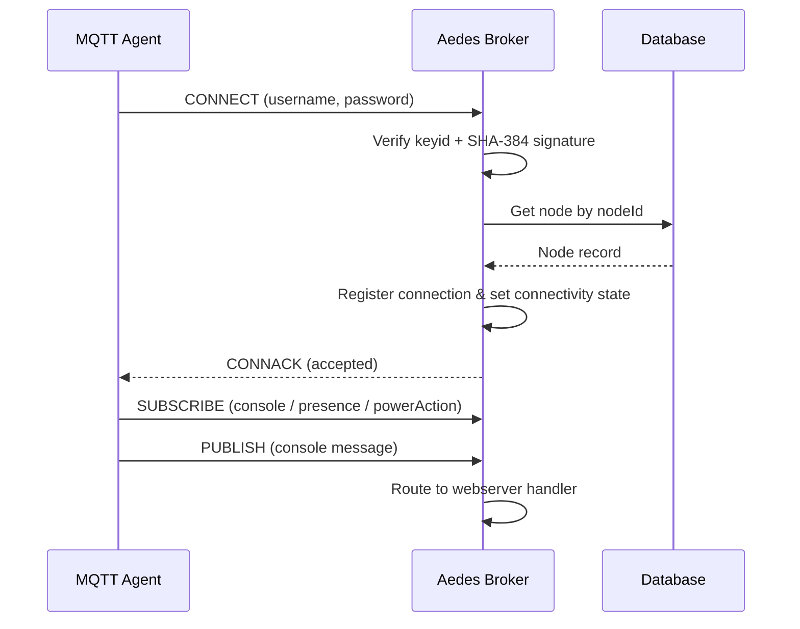

<!-- source-hash: e40c910db87b44214bab6b28726d3b9f -->
MQTT broker implementation for MeshCentral built on top of the [Aedes](https://github.com/moscajs/aedes) library, providing authenticated MQTT connectivity for managed nodes with per-topic subscription control.

## Key Components

| Export / Member | Description |
|---|---|
| `CreateMQTTBroker(parent, db, args)` | Factory function that initializes and returns the broker object |
| `obj.generateLogin(meshid, nodeid)` | Generates a signed username/password pair for MQTT client authentication |
| `aedes.authenticate` | Validates client credentials using SHA-384 HMAC and verifies node existence in the database |
| `aedes.authorizeSubscribe` | Restricts subscriptions to the allowlist: `presence`, `console`, `powerAction` |
| `aedes.authorizePublish` | Intercepts published messages and routes them internally without forwarding |
| `obj.publish(nodeid, topic, message)` | Publishes a message to a node and propagates it to peer servers via `multiServer` |
| `obj.publishNoPeers(nodeid, topic, message)` | Publishes to locally connected MQTT clients only |
| `obj.changeDeviceMesh(nodeid, newMeshId)` | Updates the mesh association for all active connections of a node |
| `handleMessage(...)` | Internal router for inbound client messages (e.g., `console` topic → web server handler) |
| `obj.connections` | Map of `nodeId → client[]` tracking all active MQTT sessions |

## Usage Example

```javascript
// Initialize the broker inside MeshCentral server startup
const mqttBroker = require('./mqttbroker').CreateMQTTBroker(parent, db, args);

// Attach to a TCP or WebSocket server
const net = require('net');
const server = net.createServer(mqttBroker.handle);
server.listen(1883);

// Generate credentials for a managed node before connecting
const login = mqttBroker.generateLogin(
  'mesh/domain/meshId64chars...',
  'node/domain/nodeId64chars...'
);
// login.user and login.pass are passed to the MQTT client

// Push a message to a subscribed node
mqttBroker.publish('node/domain/nodeId64chars...', 'powerAction', 'restart');

// Update mesh association after a device is moved
mqttBroker.changeDeviceMesh('node/domain/nodeId64chars...', 'mesh/domain/newMeshId...');
```

## Authentication Flow



> **Source:** [`mqttbroker.js`](https://github.com/flamingo-stack/meshcentral/blob/main/mqttbroker.js)