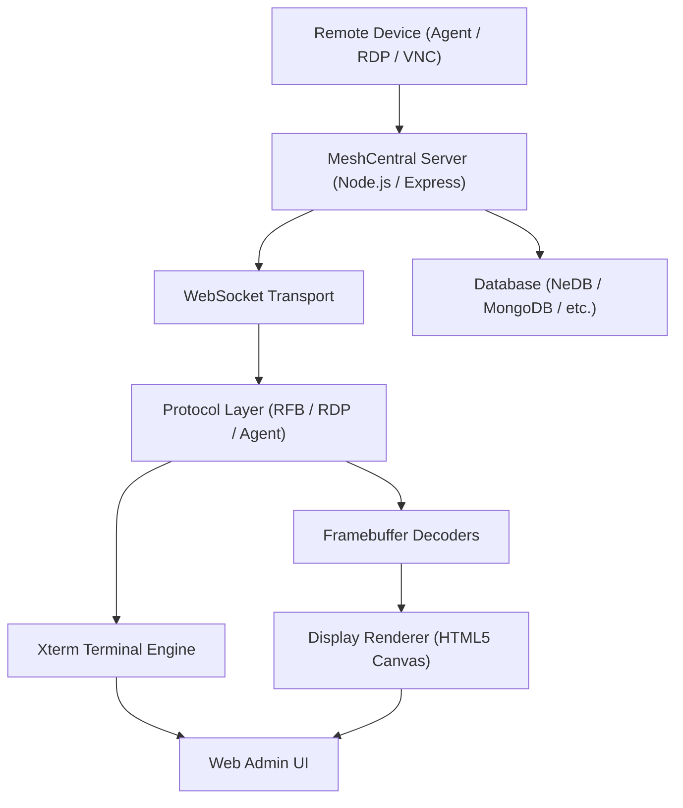

<div align="center">
  <picture>
    <source media="(prefers-color-scheme: dark)" srcset="https://shdrojejslhgnojzkzak.supabase.co/storage/v1/object/public/public/doc-orchestrator/logos/1771371901777-lc3cse-logo-openframe-full-dark-bg.png">
    <source media="(prefers-color-scheme: light)" srcset="https://shdrojejslhgnojzkzak.supabase.co/storage/v1/object/public/public/doc-orchestrator/logos/1771372526604-k3y1w-logo-openframe-full-light-bg.png">
    
  </picture>
</div>

<p align="center">
  <a href="LICENSE.md"></a>
</p>

# MeshCentral

**MeshCentral** is an open-source, web-based remote device management platform that enables IT administrators and MSPs to securely monitor, access, and control devices anywhere in the world — all from a browser. As part of the [Flamingo](https://flamingo.run) / [OpenFrame](https://openframe.ai) ecosystem, this fork of MeshCentral is enhanced with multi-tenant support, OpenFrame plugin integration, and AI-driven MSP automation.

MeshCentral replaces expensive proprietary remote-access tools with a self-hosted, open-source solution built on Node.js, featuring a full browser-based VNC/RFB client, an advanced Xterm.js terminal engine, RDP clipboard synchronization, and modern UI infrastructure.

---

## Features

- **Remote Desktop (VNC/RFB)** — Browser-based KVM using the embedded noVNC client with hardware-accelerated canvas rendering and multi-encoding support (Raw, Tight, ZRLE, JPEG)
- **Remote Terminal** — Full ANSI/VT100-compatible shell sessions over WebSocket via Xterm.js, with SIXEL/OSC 1337 inline image rendering
- **File Management** — Upload, download, and browse files on remote devices directly from the browser
- **Device Monitoring** — Real-time dashboards, charts, and live connectivity tracking across your device fleet
- **RDP Clipboard Sync** — Virtual channel clipboard synchronization for RDP sessions via the `cliprdr` module
- **Secure Transport** — TLS everywhere with Let's Encrypt/ACME certificate automation
- **Multi-Database Support** — NeDB (default, zero-config), MongoDB, MariaDB, MySQL, PostgreSQL, SQLite, and AceBase
- **Intel AMT Management** — Out-of-band management for Intel vPro devices (CIRA, WSMAN, ACM activation, 802.1x/Wi-Fi profiles)
- **Multi-Factor Authentication** — TOTP (otplib), WebAuthn/FIDO2, and hardware security key support
- **Multi-Tenant** — OpenFrame multi-tenant domain isolation for MSP use cases
- **Session Recording** — Binary and text recording of terminal and desktop sessions
- **Plugin Architecture** — Extensible hook-based plugin system, including the OpenFrame integration plugin
- **MeshAgent Protocol** — WebSocket-based agent with binary protocol for full device communication

---

## Architecture

MeshCentral follows a layered architecture from remote device to browser, cleanly separating transport, protocol, rendering, input handling, and UI presentation.



### Core Subsystems

| Subsystem | Role |
|-----------|------|
| **Web Server** | Express HTTPS server, session management, routing |
| **MeshAgent Handler** | WebSocket communication with installed agents |
| **MeshRelay** | Bidirectional WebSocket relay between clients and devices |
| **Database Layer** | Unified abstraction over 7 database backends |
| **Intel AMT Manager** | Out-of-band AMT device lifecycle management |
| **Crypto Layer** | AES-EAX, DES, RSA, DH, FIDO2/WebAuthn |
| **Let's Encrypt** | Automated TLS certificate provisioning via ACME |
| **Plugin Handler** | Hook-based plugin loader, including OpenFrame integration |

---

## Technology Stack

| Layer | Technology |
|-------|-----------|
| Runtime | Node.js 16+ |
| HTTP Framework | Express 4.x |
| WebSockets | `ws` / `express-ws` |
| Template Engine | Express Handlebars |
| Default Database | NeDB (`@seald-io/nedb`) |
| Cryptography | `node-forge`, `otplib`, native `crypto` module |
| Remote Desktop (browser) | noVNC (RFB protocol) |
| Terminal (browser) | Xterm.js |
| UI Framework | Bootstrap (bundled) |

---

## Quick Start

### Option 1: Install via npm (Recommended)

**Step 1: Install MeshCentral**

```bash
npm install -g meshcentral
```

**Step 2: Start the server**

```bash
meshcentral
```

**Step 3: Open the web interface**

Navigate to `https://localhost/` and create your administrator account on the first visit.

---

### Option 2: Run from Source

**Step 1: Clone the repository**

```bash
git clone https://github.com/flamingo-stack/meshcentral.git
cd meshcentral
```

**Step 2: Install dependencies**

```bash
npm install
```

**Step 3: Start the server**

```bash
node meshcentral.js
```

> **Self-signed certificate warning:** Your browser will show a TLS warning on first launch. Click "Advanced" → "Proceed" to continue. For production, configure Let's Encrypt in `meshcentral-data/config.json`.

---

### System Requirements

| Resource | Minimum | Recommended |
|----------|---------|-------------|
| Node.js | 16.0.0+ | 18.x or 20.x LTS |
| RAM | 512 MB | 1 GB+ |
| Disk | 1 GB free | 5 GB+ |
| OS | Linux, Windows, macOS | Linux (Ubuntu 20.04+) |

**Open ports:** 443 (HTTPS/WSS), 80 (Let's Encrypt redirect), 4433 (Intel AMT CIRA)

---

### Connect Your First Device

1. In the web interface, go to **My Devices** → **Add Device Group**
2. Click on the group → **Add Agent** → select your OS
3. Download and run the agent installer on the remote device
4. The device appears in your dashboard within seconds

---

## OpenFrame Integration

This repository includes the **OpenFrame plugin** (`plugins/openframe.js`) that powers the [OpenFrame AI platform](https://openframe.ai):

- `GET /generate-msh` — Generates `.msh` agent configuration files for device enrollment
- `GET /api/deviceStatus` — Returns live device connectivity status with multi-tenant isolation

**Environment variables for the OpenFrame plugin:**

| Variable | Default | Description |
|----------|---------|-------------|
| `MESH_DIR` | `/opt/mesh` | Directory containing mesh ID files |
| `MESH_DEVICE_GROUP` | _(empty)_ | Device group name for generated `.msh` files |

---

## Documentation

📚 See the [Documentation](./docs/README.md) for comprehensive guides including:

- [Getting Started](./docs/getting-started/introduction.md) — Introduction and setup
- [Quick Start Guide](./docs/getting-started/quick-start.md) — Up and running in minutes
- [Architecture Overview](./docs/development/architecture/README.md) — System design and component map
- [Development Setup](./docs/development/setup/environment.md) — Local development environment

---

## Community & Support

Development discussion, questions, and support happen on the **OpenMSP Slack** — not GitHub Issues or Discussions.

- **OpenMSP Community:** [https://www.openmsp.ai/](https://www.openmsp.ai/)
- **Join Slack:** [https://join.slack.com/t/openmsp/shared_invite/zt-36bl7mx0h-3~U2nFH6nqHqoTPXMaHEHA](https://join.slack.com/t/openmsp/shared_invite/zt-36bl7mx0h-3~U2nFH6nqHqoTPXMaHEHA)
- **Flamingo Platform:** [https://flamingo.run](https://flamingo.run)
- **OpenFrame:** [https://openframe.ai](https://openframe.ai)

---

## Contributing

Contributions are welcome! Please read the [Contributing Guidelines](./CONTRIBUTING.md) before submitting a pull request. Discuss significant features on Slack before starting work to align with the project roadmap.

---

<div align="center">
  Built with 💛 by the <a href="https://www.flamingo.run/about"><b>Flamingo</b></a> team
</div>
