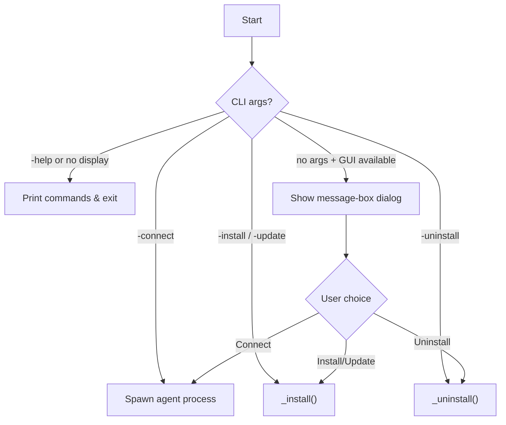

<!-- source-hash: 1d8cf9e383999861b044685d47588bc9 -->
Linux installer script for the MeshCentral agent that handles installation, uninstallation, and connection workflows with multi-language support and both CLI and GUI (kdialog/zenity) interaction modes.

## Key Components

- **`getParameterEx` / `getParameter`** — Array prototype extensions for parsing CLI arguments in `name=value` or `-name=value` format
- **`_install(parms)`** — Writes the `.msh` config file and spawns a `fullinstall` child process with appropriate flags
- **`_uninstall()`** — Spawns a `fulluninstall` child process to remove the agent service
- **`msh`** — Configuration object injected by MeshCentral at build time (MeshName, MeshID, MeshServer, etc.)
- **`translation`** — Localization map parsed from `msh.translation`; falls back to English for missing entries
- **CLI flags** — `-connect`, `-install`, `-update`, `-uninstall`, `-help`, `-mesh`, `-translations`, `-lang`

## Usage Example

```bash
# Show available commands
./meshagent -help

# Install the agent (requires root)
sudo ./meshagent -install

# Install to a custom path
sudo ./meshagent -install --installPath="/opt/mesh"

# Connect without installing (foreground, Ctrl+C to stop)
./meshagent -connect

# Uninstall the agent service
sudo ./meshagent -uninstall

# Switch display language
./meshagent -lang=fr

# Dump embedded mesh configuration as JSON
./meshagent -mesh
```

## Flow Summary



**Source:** [`meshinstall-linux.js`](https://github.com/flamingo-stack/meshcentral/blob/main/meshinstall-linux.js)