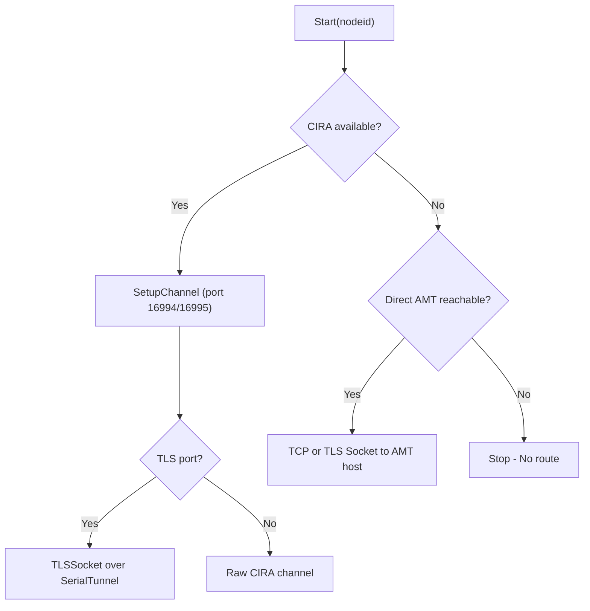

<!-- source-hash: 5b178ba4c5bbafe8f5d1ecbeefef16b9 -->
Implements the Intel AMT (Active Management Technology) redirection stack for MeshCentral, enabling remote control sessions (Serial-over-LAN, KVM, IDER) via either CIRA (Client Initiated Remote Access) tunnels or direct TCP/TLS socket connections.

## Key Components

- **`CreateAmtRedirect(module, domain, user, webserver, meshcentral)`** — Factory function that constructs and returns an AMT redirect object managing the full connection lifecycle.
- **`obj.Start(nodeid)`** — Initiates a redirection session by fetching node info, verifying permissions (`MESHRIGHT_REMOTECONTROL`), detecting available connectivity (CIRA or direct), and establishing the appropriate transport.
- **`SerialTunnel`** — A `Duplex` stream adapter that bridges TLS socket communication over a CIRA APF channel, enabling encrypted tunneling without native TLS support at the CIRA layer.
- **`obj.forwardclient`** — The active transport channel (CIRA channel or raw TCP/TLS socket) used to relay AMT protocol data.
- **`obj.xxOnSocketConnected` / `obj.xxOnSocketData`** — Internal hooks called on connection events and incoming data (implemented in the inner module).
- **CIRA TLS chain** — `TLSSocket` ↔ `SerialTunnel` ↔ CIRA APF channel pipeline for TLS ports (16993/16995).

## Usage Example

```javascript
const amtRedir = require('./amt-redir-mesh');

// Create a KVM redirect session
const redirect = amtRedir.CreateAmtRedirect(
    kvmModule,   // Inner module (protocol = 2 for KVM)
    domain,
    currentUser,
    webserver,
    meshcentral
);

// Start redirection to a specific node
redirect.Start('node//domain//nodeid123');

// Listen for state changes
redirect.onStateChanged = function(state) {
    console.log('AMT redirect state:', state);
};
```

## Connection Priority

