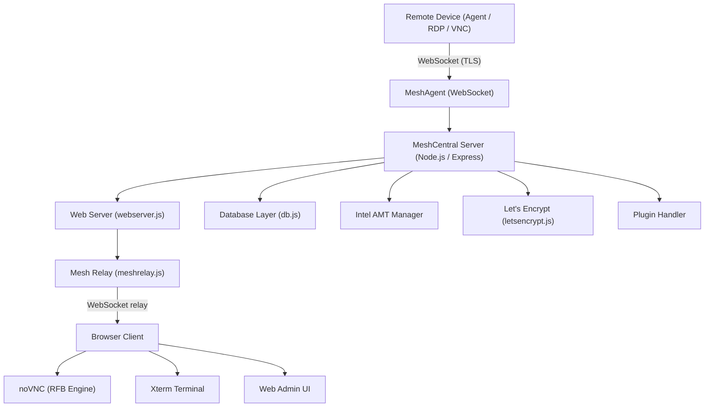
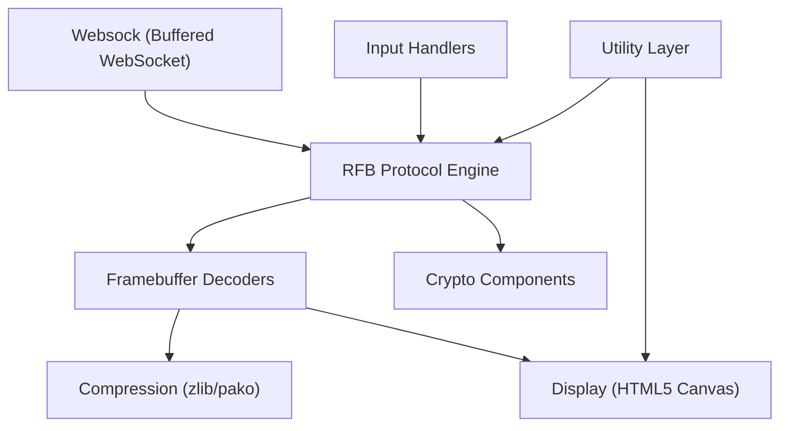
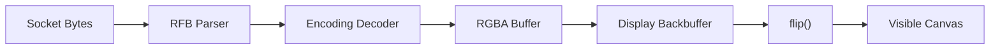
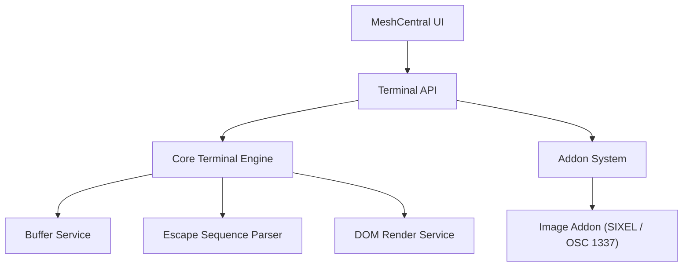
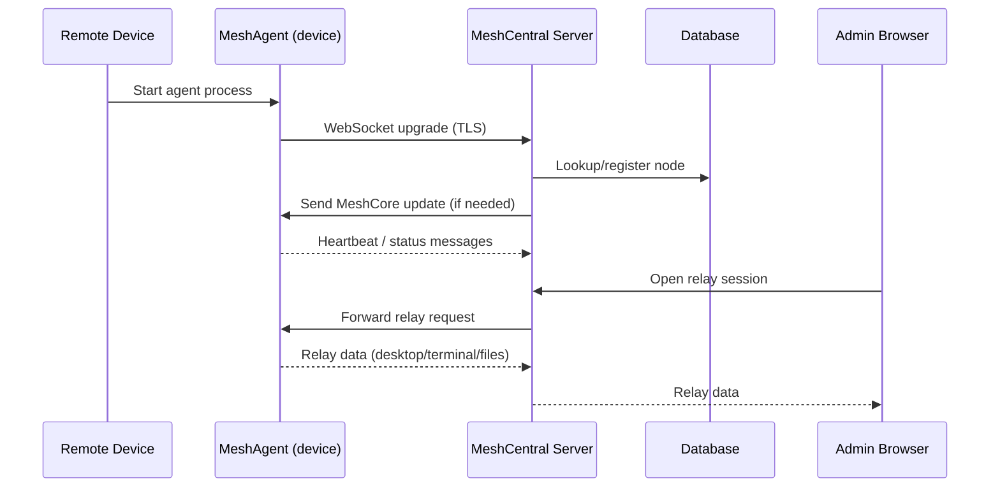
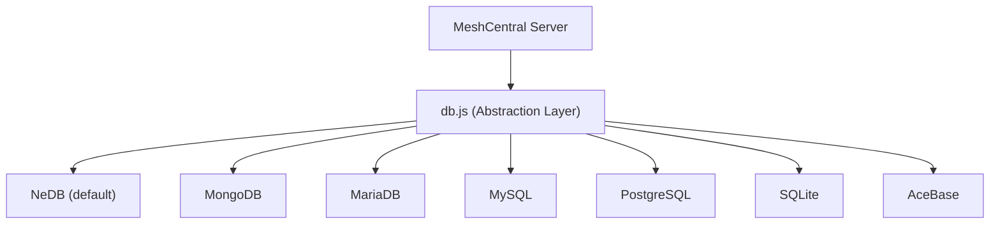
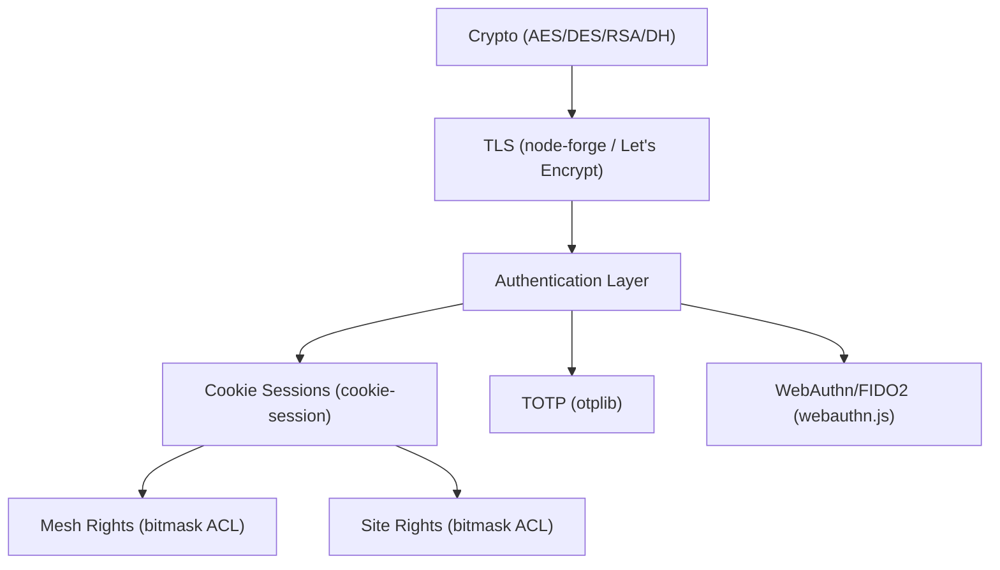

# Architecture Overview

MeshCentral is a full-stack remote device management platform built on Node.js. Its architecture is layered and modular, cleanly separating transport, protocol, rendering, and UI concerns.

---

## High-Level System Architecture

---

## Core Server Components

| Component | File | Role |
|-----------|------|------|
| Main Server | `meshcentral.js` | Entry point; initializes and orchestrates all subsystems |
| Web Server | `webserver.js` | Express HTTP/HTTPS server; session, routing, TLS, user/mesh management |
| Mesh Agent Handler | `meshagent.js` | WebSocket handler for installed device agents |
| Mesh Relay | `meshrelay.js` | Bidirectional relay between browser clients and remote devices |
| Database Layer | `db.js` | Unified abstraction over 7 database backends |
| Intel AMT Manager | `amtmanager.js` | Out-of-band Intel AMT device lifecycle management |
| Certificate Ops | `certoperations.js` | TLS cert generation, ACM activation signing |
| Let's Encrypt | `letsencrypt.js` | Automated ACME certificate provisioning and renewal |
| WebAuthn | `webauthn.js` | FIDO2/WebAuthn registration and authentication |
| Plugin Handler | `pluginHandler.js` | Hook-based extensible plugin loader |
| Task Manager | `taskmanager.js` | Async task scheduling and limiting |

---

## Frontend Runtime Architecture (noVNC Stack)

The browser-based remote desktop is built on a modular noVNC-derived stack:

| Module | Responsibility |
|--------|---------------|
| **Websock** | Buffered WebSocket abstraction with binary framing |
| **RFB** | Protocol state machine, authentication, framebuffer update parsing |
| **Decoders** | Raw, CopyRect, RRE, Hextile, Tight, TightPNG, JPEG, ZRLE decoding |
| **Compression** | Zlib deflate/inflate via pako |
| **Crypto** | AES-EAX, AES-ECB, DES, RSA, Diffie-Hellman |
| **Display** | Canvas rendering engine, backbuffer management |
| **Input Handlers** | Keyboard normalization, gesture recognition |
| **Utility** | Cursor management, event abstraction, browser detection |

---

## Remote Desktop Rendering Pipeline

Supported framebuffer encodings:

- Raw, CopyRect, RRE, Hextile, Tight, TightPNG, JPEG, ZRLE

---

## Terminal Architecture (Xterm.js)

---

## Agent Communication Flow

---

## Database Architecture

MeshCentral abstracts over seven database backends through a single `db.js` module:

---

## Security Architecture

---

## Plugin Architecture

The plugin system uses hooks that are called at defined points in the server lifecycle:

| Hook | Trigger Point |
|------|--------------|
| `hook_setupHttpHandlers` | Express app route registration |
| `hook_processAgentData` | Incoming agent data frame |
| `hook_onNodeConnect` | Device connects |
| `hook_onNodeDisconnect` | Device disconnects |

The **OpenFrame plugin** (`plugins/openframe.js`) uses `hook_setupHttpHandlers` to register:

- `GET /generate-msh` — MSH agent config file generator
- `GET /api/deviceStatus` — Live device connectivity status

---

## Key Design Decisions

| Decision | Rationale |
|----------|-----------|
| Single Node.js process | Simplifies deployment; no microservices coordination overhead |
| NeDB as default DB | Zero-configuration embedded database for simple installs |
| noVNC (browser-side RFB) | No plugins required; runs in any modern browser |
| Express Handlebars | Server-side rendering for the admin UI without a frontend build step |
| Bitmask ACL | Efficient per-user, per-device-group permission encoding |
| WebSocket for everything | Single protocol for agent comms, relay, and real-time updates |

---

## Reference Documentation

The following auto-generated reference docs are available for each major subsystem:

- [RFB and Display](../../reference/architecture/rfb-and-display/rfb-and-display.md)
- [Crypto Components](../../reference/architecture/crypto-components/crypto-components.md)
- [Xterm Terminal](../../reference/architecture/xterm/xterm.md)
- [UI Components](../../reference/architecture/ui-components/ui-components.md)
- [Input Handlers](../../reference/architecture/input-handlers/input-handlers.md)
- [Decoders](../../reference/architecture/decoders/decoders.md)
- [Compression](../../reference/architecture/compression/compression.md)
- [Charts](../../reference/architecture/charts/charts.md)
- [Localization](../../reference/architecture/localization/localization.md)
