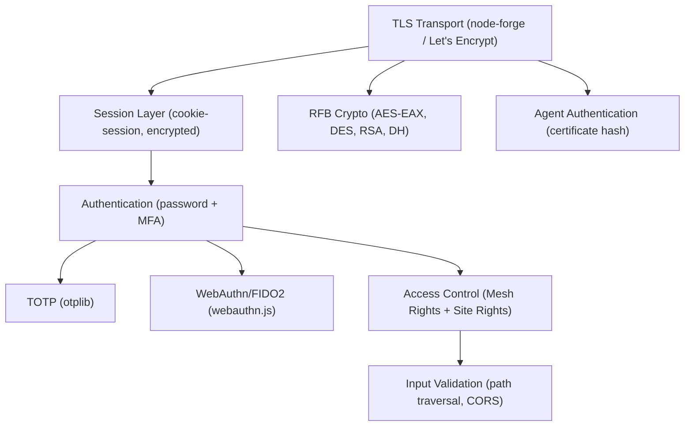

# Security Best Practices

This guide covers the security architecture, authentication mechanisms, encryption patterns, and development best practices for MeshCentral.

---

## Security Architecture Overview

MeshCentral is built with security as a first-class concern. Its security stack spans TLS transport, multi-factor authentication, bitmask access control lists, and multiple cryptographic protocols for both modern and legacy VNC security schemes.



---

## Transport Security (TLS)

MeshCentral enforces TLS for all communications. Never run in production without a valid TLS certificate.

### Certificate Options

| Method | Configuration | Recommended For |
|--------|-------------|----------------|
| Self-signed (auto) | No config required | Development only |
| Let's Encrypt (auto) | `letsencrypt` block in `config.json` | Public-facing deployments |
| Custom certificate | Manual paths in `config.json` | Enterprise PKI |

### Let's Encrypt Configuration

```json
{
  "letsencrypt": {
    "email": "admin@yourdomain.com",
    "production": true,
    "rsakeysize": 3072,
    "names": ["mesh.yourdomain.com"]
  }
}
```

> **Do not use `"production": false`** (staging mode) in production — staging certificates are not browser-trusted.

### Agent Certificate Authentication

Agents authenticate to the server by validating the server's TLS certificate SHA hash. The server computes and caches SHA-384 hashes of its certificates (`webserver.js`). This prevents man-in-the-middle attacks against agent connections.

---

## Authentication and Multi-Factor Authentication

### Password Hashing

User passwords are hashed using a strong cryptographic hash. Never store or log plaintext passwords.

### TOTP (Time-Based One-Time Password)

MeshCentral uses the `otplib` library for TOTP-based 2FA:

- Generates standard RFC 6238 TOTP codes
- Compatible with Google Authenticator, Authy, and any TOTP app
- 30-second token window

**Enforce MFA for all users** by adding to `config.json`:

```json
{
  "domains": {
    "": {
      "require2factor": true
    }
  }
}
```

### WebAuthn / FIDO2 (Hardware Security Keys)

The `webauthn.js` module implements FIDO2 WebAuthn:

- Supports `none`, `fido-u2f`, and `packed` attestation formats
- Validates authenticator data, signatures, and counters to prevent replay attacks
- Uses 64-byte random challenges generated via `crypto.randomBytes(64)`

**Always update the stored counter** after a successful assertion to prevent replay attacks:

```javascript
// After successful assertion:
// authResult.counter must be greater than storedAuthr.counter
if (authResult.verified && authResult.counter > storedAuthr.counter) {
    // Update stored counter
    updateUserCredentialCounter(keyId, authResult.counter);
}
```

---

## Access Control: Mesh Rights and Site Rights

MeshCentral uses bitmask integers for efficient, per-user, per-device-group permissions.

### Mesh Rights (per device group)

| Constant | Meaning |
|----------|---------|
| `MESHRIGHT_EDITGROUP` | Edit device group settings |
| `MESHRIGHT_REMOTECONTROL` | Remote control access |
| `MESHRIGHT_AGENTCONSOLE` | Agent console access |
| `MESHRIGHT_SERVERFILES` | Server file access |
| `MESHRIGHT_WAKEDEVICE` | Wake-on-LAN |
| `MESHRIGHT_NOTERMINAL` | Deny terminal access |
| `MESHRIGHT_NODESKTOP` | Deny remote desktop |
| `MESHRIGHT_NOFILES` | Deny file access |
| `MESHRIGHT_RELAY` | Relay protocol access |

### Site Rights (server-wide privileges)

| Constant | Meaning |
|----------|---------|
| `SITERIGHT_SERVERBACKUP` | Backup the server |
| `SITERIGHT_MANAGEUSERS` | Manage all users |
| `SITERIGHT_SERVERRESTORE` | Restore server from backup |
| `SITERIGHT_FILEACCESS` | Access server files |
| `SITERIGHT_SERVERUPDATE` | Update the server |
| `SITERIGHT_RECORDINGS` | Access session recordings |
| `SITERIGHT_LOCKSETTINGS` | Lock server settings |
| `SITERIGHT_ALLEVENTS` | View all server events |

---

## Input Validation and Injection Prevention

### Path Traversal Prevention

`webserver.js` includes `resolveSafeUploadTempPath()` — a security utility that validates all upload temp paths are confined to allowed root directories. Never bypass this check when handling file uploads.

**Pattern used internally:**

```javascript
// Validates that resolved path stays within allowed roots
function resolveSafeUploadTempPath(filePath, allowedRoots) {
    const resolved = path.resolve(filePath);
    return allowedRoots.some(root => resolved.startsWith(path.resolve(root)));
}
```

### Cross-Origin Requests (CORS)

The OpenFrame plugin applies CORS headers explicitly. When implementing new routes or plugins, always define explicit CORS policies — do not rely on implicit browser restrictions.

### Multi-Tenant Isolation

The OpenFrame plugin's `deviceStatus` route returns `404` (not `403`) for cross-tenant node IDs to prevent acting as a device enumeration oracle. Apply the same pattern in any custom plugins:

```javascript
// Return 404, not 403, for cross-tenant resources
if (nodeId.split('/')[1] !== tenantDomain) {
    return res.status(404).json({ error: 'Not found' });
}
```

---

## Cryptography

### RFB / VNC Protocol Cryptography

The noVNC RFB engine supports multiple security schemes negotiated during connection:

| Scheme | Algorithm | Use Case |
|--------|-----------|---------|
| None | — | Unauthenticated (development only) |
| VNC Auth | DES challenge-response | Classic VNC compatibility |
| VeNCrypt (Plain) | TLS + plaintext | Standard TLS-wrapped auth |
| Apple Remote Desktop | DH + AES | ARD compatibility |
| RA2ne | RSA + AES-EAX | Strongly authenticated sessions |
| MSLogonII | MS-specific auth | Windows VNC servers |

### AES-EAX (Preferred Modern Mode)

`AESEAXCipher` provides authenticated encryption:

- Combines AES-CTR (encryption) + AES-CMAC (authentication)
- Appends a 16-byte authentication tag
- Returns `null` and aborts on MAC verification failure — **always check for null**:

```javascript
const plaintext = await cipher.decrypt(ciphertext, nonce, additionalData);
if (plaintext === null) {
    // Authentication failed — terminate the connection
    throw new Error('Authentication tag verification failed');
}
```

### DES (Legacy Compatibility Only)

DES is retained **only** for classic VNC challenge-response authentication. Do not use DES for any new functionality.

---

## Secrets Management

### Environment Variables

Sensitive values should never be hardcoded. Use environment variables for:

| Secret | Environment Variable | Notes |
|--------|---------------------|-------|
| Session encryption key | `MESHCENTRAL_SESSIONKEY` | Must be a long random string |
| MongoDB connection URL | `MESHCENTRAL_MONGODBURL` | Includes credentials |
| SMTP credentials | Config file (encrypted fields) | Use Let's Encrypt for TLS |

**Generate a strong session key:**

```bash
node -e "console.log(require('crypto').randomBytes(48).toString('base64'))"
```

### Configuration File Security

The `config.json` file may contain sensitive values. Secure it appropriately:

```bash
# Linux: restrict config file access to the service user
chmod 600 meshcentral-data/config.json
chown meshcentral:meshcentral meshcentral-data/config.json
```

> **Never commit `config.json` to version control.** Add it to `.gitignore`.

---

## Session Security

MeshCentral uses `cookie-session` for session management:

- Sessions are signed and encrypted using the `sessionKey` from config
- Set `sessionKey` to a securely generated random value (minimum 32 bytes, recommended 48+ bytes)
- Session cookies are `httpOnly` and `secure` (HTTPS-only)

**Rotate the session key** to invalidate all existing sessions (e.g., after a security incident):

```bash
node -e "console.log(require('crypto').randomBytes(48).toString('base64'))"
# Update "sessionKey" in config.json and restart the server
```

---

## Security Testing Checklist

Before submitting a pull request or deploying a change, verify:

- [ ] No hardcoded secrets, passwords, or API keys in code
- [ ] All file path operations use safe path resolution (no traversal)
- [ ] CORS headers are explicitly set on new routes
- [ ] Cross-tenant isolation: tenant domain validated before returning data
- [ ] WebAuthn counter updated after successful assertion
- [ ] AES-EAX decryption: null return checked and connection terminated
- [ ] All user input is validated before use in database queries or file operations
- [ ] New plugins follow the `404` (not `403`) pattern for cross-tenant resources
- [ ] TLS enforced for all new server endpoints
- [ ] `config.json` is not committed and is protected with appropriate file permissions

---

## Common Vulnerabilities to Avoid

| Vulnerability | Prevention |
|--------------|-----------|
| Path traversal | Use `resolveSafeUploadTempPath()` for all upload paths |
| Session fixation | Regenerate session on privilege escalation |
| CSRF | Validate `Origin` header or use CSRF tokens for state-changing routes |
| Replay attacks (WebAuthn) | Always increment and validate the authenticator counter |
| Unauthenticated WebSocket | All relay sessions validate `user`, `ruserid`, or `nouser` flag |
| Cross-tenant data leakage | Validate tenant domain on all data access; return `404` for mismatches |
| Weak ciphers | Never use DES or AES-ECB for new features; use AES-EAX |
| Exposed stack traces | Never return full error stack traces to clients in production |

---

## Reporting Security Issues

Security issues should be reported via the OpenMSP Slack community rather than GitHub Issues:

- **OpenMSP Slack:** [https://www.openmsp.ai/](https://www.openmsp.ai/)
- **Join:** [https://join.slack.com/t/openmsp/shared_invite/zt-36bl7mx0h-3~U2nFH6nqHqoTPXMaHEHA](https://join.slack.com/t/openmsp/shared_invite/zt-36bl7mx0h-3~U2nFH6nqHqoTPXMaHEHA)
