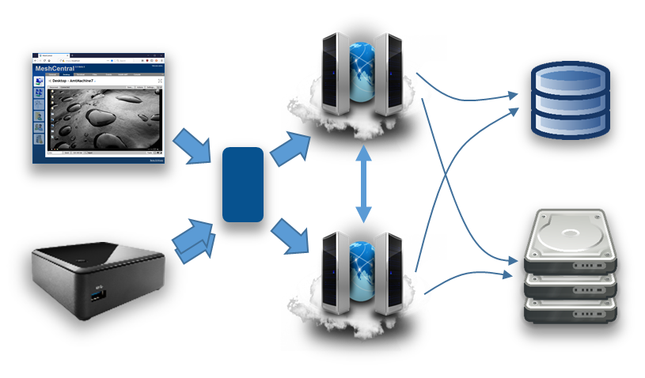
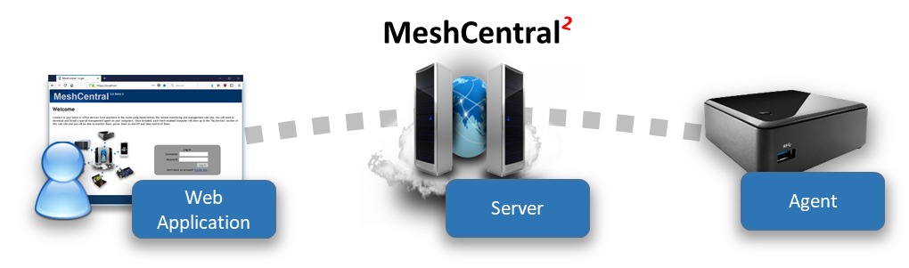
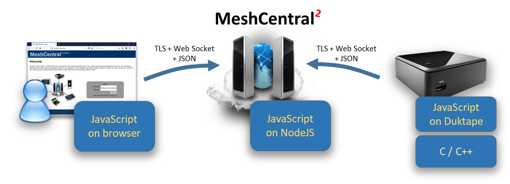
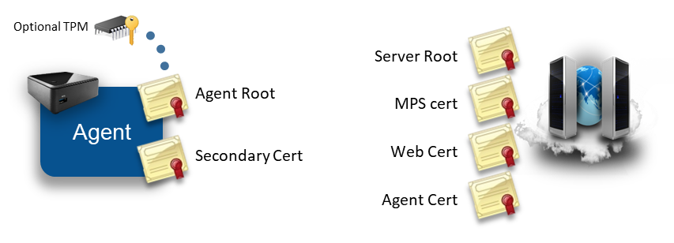
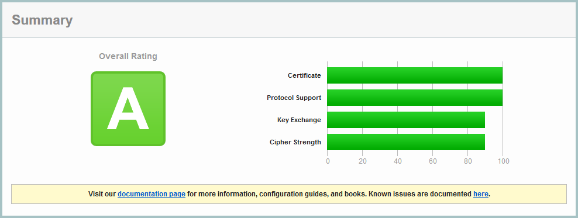
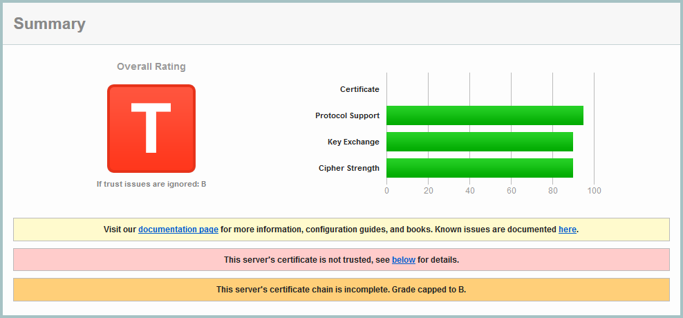
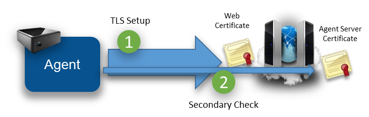
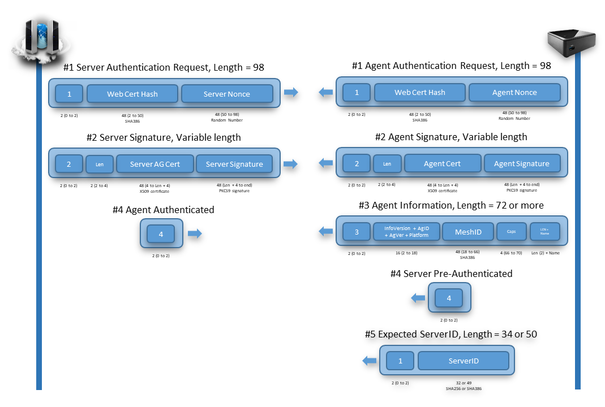
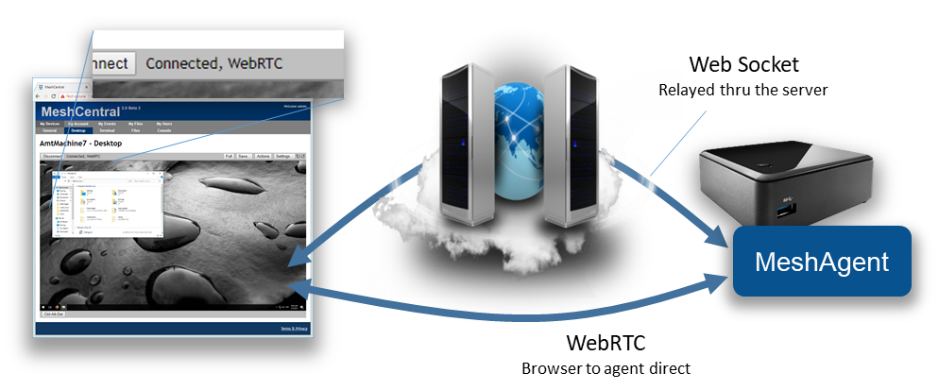

# Design and Architecture



Design and Architecture Guide [as .pdf](https://meshcentral.com/info/docs/MeshCentral2DesignArchitecture.pdf) [as .odt](https://github.com/Ylianst/MeshCentral/blob/master/docs/MeshCentral Design & Architecture v0.0.4.odt?raw=true)
## Video Walkthru

<div class="video-wrapper">
  <iframe width="320" height="180" src="https://www.youtube.com/embed/MOQ0uCUs7_M" frameborder="0" allowfullscreen></iframe>
</div>

## Abstract

This  document  attempts  to  describe  the  architecture  and  design  of  the  second  version  of MeshCentral on which work started in late 2016. The document covers the overview of the design, goes in details about the protocol and various decisions and trade-offs. This document is intended for anyone that wants to understand the inner workings of MeshCentral or someone that wants to make a security review of the software. The software and added documentation and tutorial videos are available at:[ https://www.meshcommander.com/meshcentral2 ](https://www.meshcommander.com/meshcentral2)

## Introduction

MeshCentral is a free open source web-based remote computer management software. After over 8 years of working on the first version of MeshCentral, work as moved to version 2 which this document described. In 2010, when MeshCentral v1 was first designed, the Internet was very different. HTML5 and WebSocket did not exists, no such thing as a software container, etc. With MeshCentral version 2, a complete redesign was made to make the software much more in line with modern Internet deployment models. 

The advent of NodeJS, WebSocket, WebRTC and other web technologies coming out in the last 10 years has really made the design of MeshCentral v2 not only possible, but quite amazing. Being able to use a single programming language across platforms to JavaScript. Being able to easily exchange objects using web socket and JSON, being able to scale with WebRTC, deploy quickly with containers, etc. Looking back at the incredible advances in web technologies lead to an almost mandatory MeshCentral redesign. 

## Goals & Requirements

The goal of MeshCentral is to be the best open source remote management software in the world. Remote computer management is a big area with many different usages and requirements. To best suite this, it’s important to have software that is as flexible as possible. Additionally, there are many other goals: 

- Must be quick and easy to install. 
- Must install on all major operating systems and platforms. 
- Can be deployed on small computers and the cloud. 
- Can be deployed within containers. 
- Can be deployed in many network environments. 
- Must support both software agent and Intel® AMT hardware agent. 
- Must only use open source dependencies. 
- Must provide all basic remote management features (desktop, terminal, files…) 
- Must use the network efficiently. 
- Must have a real time user interface. 
- Must be easy to use. 
- Must be fast. 
- Etc. 

Basically, all the requirements you would expect from open source software that can go viral. Since this software is sponsored by Intel, it’s going to support Intel® AMT really well, making it possible to manage a remote computer regardless of its OS or power state. Intel® AMT is not required to use this software, however it’s a great fit. 

## Design Overview

In this section, we do a very high level overview of MeshCentral’s design. MeshCentral has 3 big components: the server, the agent and the web application. 



There is of course more software that support these 3 components like the Windows Server Installer, ClickOnce application, MeshCentral Discovery Tool and more. These will be covered later. Most of the document will focus on these 3 main components. Another component that is significant but not part of the software itself is Intel® AMT (Intel® Active Management Technology). MeshCentral supports Intel AMT that acts like an optional hardware based agent for MeshCentral. 

When it comes to programming languages used, MeshCentral is mostly built with JavaScript with the agent having significant portable C code. This makes things pretty simple since the browser, server and agents can share some of the code. More importantly, JavaScript is great at parsing JSON and so, the main protocol used between the components is JSON over Web Socket. 



It’s important to note that while JavaScript is used in all 3 components, the JavaScript runtime is very different. The JavaScript written to run within a browser sandbox uses different calls than the one running in NodeJS on the server or on the agent with DukTape. 

This is probably a good time to introduce DukTape [(https://www.duktape.org/)](https://www.duktape.org/). Unlike the browser and NodeJS JavaScript engines, DukTape is a less known JavaScript runtime written in C. The agent is built in C code with little smarts other than being able to securely connect back to the server. The server then pushes to the agent a JavaScript file that the agent runs. This makes the agent very flexible since a developers can quickly change the JavaScript that is pushed to the agent and change the agent’s behavior instantly. 

Another interesting design decision is that MeshCentral makes almost no use of RESTful API’s. Instead, almost everything is done using WebSocket. This allows JSON objects to be exchanged fully asynchronously. There is no pushing the refresh button or polling as events are sent by all actors in real time. 

## MeshCentral server

The MeshCentral server is a NodeJS application that is published on NPM at: [https://www.npmjs.com/package/meshcentral](https://www.npmjs.com/package/meshcentral) Many administrators can get started quickly using “npm install meshcentral” once NodeJS is installed. MeshCentral will work on Node 6.x and higher. 

## Dependencies

The server makes use of the following dependencies on NPM. These are all automatically installed by NPM when installing MeshCentral. 

Can be found in the file: `MeshCentralServer.njsproj`

The main takeaway is that MeshCentral is mostly an ExpressJS application. This is not a complete list of dependencies as many of these packages have their own dependencies creating a large tree. The security of these packages is a concern and all of the dependency tree is a concern. In addition to the dependencies that are “hard coded”, there are a few more that are installed only when needed. These are: 

### node-windows

**greenlock, le-store-certbot, le-challenge-fs**: Installed on all Windows install. Allows background service install: 

**le-acme-core**: Installed only when Let’s Encrypt must be used: 

**mongojs**: Installed when MongoDB is in used. 

**nodemailer**: Installed when SMTP server support is in used. 

MeshCentral will run `npm install` automatically when any of these optional modules are needed but not currently available. 

## Understanding the different modes: LAN, WAN and Hybrid

<div class="video-wrapper">
  <iframe width="320" height="180" src="https://www.youtube.com/embed/gx5Fh3pQOns" frameborder="0" allowfullscreen></iframe>
</div>

## Code files and folders

Someone would think the server is rather simple when taking a look at the MeshCentral server code files. At a high level, the entire server has 3 folders, 3 text files and a manageable number of .js files that are fairly self-descriptive. Here is a list of the source files and folders. 

### Folders

`agents`:  Compiled agents, install scripts, tools and agent JavaScript.

`public`: Static web elements such as images, CSS, HTML and more.

`views`: Main web application, login screen and messenger app.

### Configuration & text files

`package.json`: Description of the MeshCentral package on NPM.
`sample-config.json`: A sample “config.json” file to get started.
`readme.txt`: Readme file published with the MeshCentral package.

### Code files

```
 amtevents.js       | Used to scan a local network for Intel AMT machines.    
 amtscanner.js      | Used to run Intel AMT scripts from MeshCommander.       
 amtscript.js       | Used to generate and perform certificate operations.    
 certoperations.js  | Various commonly used methods.                          
 common.js          | Used to access the MongoDB or NeDB database.            
 db.js              | Used to modify windows executables.                     
 exeHandler.js      | Used to insert credentials in an HTTP stream.           
 interceptor.js     | Used to obtain and use a Let’s Encrypt certificate.     
 letsencrypt.js     | Used to offload RSA sign to other CPU cores.            
 meshaccelerator.js | Used to communicate to agents.                          
 meshagent.js       | The is the main module, gets the server started.        
 meshcentral.js     | Used to send SMTP mails.                                
 meshmail.js        | Used to relay agent and browser web socket connections. 
 meshrelay.js       | MeshCentral server discovery when in LAN mode.          
 meshscanner.js     | Used to communicate with browsers.                      
 meshuser.js        | Used to communicate to Intel® AMT CIRA.                 
 mpsserver.js       | Used for server-to-server communication.                
 multiserver.js     | Performs password hash + salt.                          
 pass.js            | Used to handle HTTP traffic.                            
 redirserver.js     | Used to upgrade legacy MeshCentralv1 agents.            
 swarmserver.js     | Handles HTTPS traffic.                                  
 webserver.js       | Server background install on Windows.                   
 winservice.js      | Server background install on Windows.                   
```

At a high level, the MeshCentral.js file will get the server started. By default, it will start the webserver.js on port 443, redirectserver.js on port 80 and mpssrver.js on port 4433. The webserver.js file will create a meshuser.js or meshagent.js instance each time a user or agent connects. The other files support various usages, but this is the basic working on the server. 

### Server database

One of the big design decision on the server is its database. We want something that scales and so, opted to deal with the good and the bad of a NoSQL database, MongoDB. On the other hand, we want the server to be really simple to install for people who want to try it out or want to manage 100 computers or less. We don’t want the added learning curve of MongoDB for people that don’t really need it. It turned out, we can have both. NeDB is a NPM package that provides a simple MongoDB-like API while being completely implemented in NodeJS. For most people, this is plenty good to get started. 

By default, MeshCentral will just create and use a NeDB database, but can be configured to use MongoDB. The internal code path for both databases are almost exactly identical so the “db.js” file handles both, almost the same way and the exact database in use is completely abstracted from the rest of the server code. 

## Certificates

MeshCentral makes use of many certificates to accomplish many security tasks. When first running the server or an agent, both of these actors will generate certificates. The agent will generate one or two certificates on the first run and the server will generate four certificates. 



In this section we review what certificates are created, what are their uses and how they are stored. Most administrators using MeshCentral will not need a deep understanding of this section to run the server, however, a basic understanding of this section can help understand how to best protect the server’s critical security assets. 

### Server Certificates

As indicated above, the MeshCentral server creates four certificates when it first runs. It uses ForgeJS to perform certificate creation and all four certificates below are saved in the “meshcentral-data” folder. The four certificates are: 

#### Server root

`root-cert-public.crt`

This is a self-signed root certificate that is used only to issue the 3 next certificates. This certificate can be useful when it’s installed as a root of trust in some situations. For example, when Intel AMT connects to the MPS server on port 4433, it will correctly connect only if this root certificate is loaded into Intel AMT as a trusted certificate. Browser can also be setup to trust this root certificate in order to create a trusted connection between a browser and the servers HTTPS port. This certificate is RSA3072 unless the option “--fastcert" is used, in that case a RSA2048 certificate is generated. 

#### MPS certificate

`mpsserver-cert-public.crt`

This is a TLS certificate signed by the root above used as a TLS server certificate on the MPS port 4433. Intel AMT computers will connect to this port and verify the certificate time, common name and that it’s signed by the root above. This certificate is not typically changed, even when the server is running in production. This certificate is always generated as RSA2048 because older Intel AMT firmware will not accept certificates with larger keys. 

#### Web certificate

`webserver-cert-public.crt`

This is the default certificate used to secure the HTTPS port 443. It is signed by the root above and is the certificate users will first see then connecting the browser to the server. Often, users will need to ignore the browser security warning. This certificate is RSA3072 unless the option “--fastcert" is used, in that case a RSA2048 certificate is generated. In production environments, this certificate is replaced with a real certificate. There are many ways to change this certificate for a more appropriate certificate in production environments: 

- You can replace the “webserver-cert-\*” files in the “meshcentral-data” folder. 
- You can use Let’s Encrypt which will override this certificate automatically. 
- You can use a reverse-proxy in front of the server with “--tlsoffload". 

#### Agent certificate

`agentserver-cert-public.crt`

This certificate is used to authenticate the server to agents. It’s signed by the root above and when installing an agent, the hash of this certificate is given to the agent so that it can connect back to the server securely. This certificate is RSA3072 unless the option “--fastcert" is used, in that case a RSA2048 certificate is generated. 

The “meshcentral-data” folder contains critical server information including private keys therefore, it’s important that it be well protected. It’s important to backup the “meshcentral-data” folder and keep the backup in a secure place. If, for example the “agent certificate” on the server is lost, there is no hope for agents ever be able to connect back to this server. All agents will need to be re-installed with a new trusted certificate. 

If someone re-installs a server, placing the “meshcentral-data” folder back with these certificates should allow the server to resume normal operations and accept connections for Intel AMT and agents as before. 

### Agent Certificates

The mesh agent generates one or two RSA certificates when it first starts. On smaller IoT devices such as a Raspberry Pi, this can take a little while to do and the CPU will spike to 100% during this time. This is normal and only occurs the first time the agent runs. 


The certificates are generated a little differently depending on the platform. On Windows, the Mesh Agent will use Microsoft cryptographic providers to harder the agent root cert. If available, the agent will use the platform TPM to harden the certificate. On other platforms, only one certificate is generated and used for both agent authentication to the server and WebRTC session authentication. 

#### Agent root certificate

This certificate is the root trust of the agent. The SHA384 hash of this certificates public key is the agent’s identifier on the server. When a agent connects to the server using web socket, it performs a secondary authentication check using this certificate. The server will compute the agent’s identifier after the agent sent a signed proof to the server. This certificate is also used to sign the secondary certificate below when it’s needed. 

#### Secondary certificate

This is a certificate signed by the agent root above. It’s currently only used by WebRTC to perform dTLS authentication to a remote browser. This certificate does not need to be signed by a trusted CA for WebRTC purposes since the hash of the certificate will be sent to the browser using a trusted path. If the agent root certificate is not hardened using platform cryptography, the secondary certificate is not created and the agent root cert is used for all purposes. 

A possible attack would occur if someone were to be able to access the agent root certificate. They could impersonate the agent to the server. Agents don’t have any rights to perform management operations on the server or other agents, but by impersonating a agent, a rogue agent would pretend to be an office computer to which administrator would login with their username & password, especially when the root is not hardened. Some care should be taken to protect the “meshagent.db” file and to not give important information to untrusted agents. 

## TLS Security

MeshCentral makes heavy use of Transport Layer Security (TLS) and datagram-TLS (dTLS) to authenticate and encrypt network traffic between the browser, server and agent. Configuring TLS settings correctly is essential to making sure communications are secure and to minimize attacks on open ports. 

Probably the most important TLS configuration is for the MeshCentral server ports 443 and 4433. These two ports are exposed to the Internet and so, should be setup as securely as possible. 

### MeshCentral HTTPS port 443

The HTTPS port on the MeshCentral server will only support TLS 1.2 and above, and makes use of only 6 cypher suites: 

```
TLS\_ECDHE\_RSA\_WITH\_AES\_256\_GCM\_SHA384 (0xc030) 
TLS\_ECDHE\_RSA\_WITH\_AES\_256\_CBC\_SHA384 (0xc028) 
TLS\_ECDHE\_RSA\_WITH\_AES\_256\_CBC\_SHA (0xc014) 
TLS\_ECDHE\_RSA\_WITH\_AES\_128\_GCM\_SHA256 (0xc02f) 
TLS\_ECDHE\_RSA\_WITH\_AES\_128\_CBC\_SHA256 (0xc027) 
TLS\_ECDHE\_RSA\_WITH\_AES\_128\_CBC\_SHA (0xc013) 
```

Note that these cipher suites are all perfect forward secrecy (PFS) suites and are considered cryptographically secure as of the writing of this document. When the server is deployed on the Internet,[ https://ssllabs.com ](https://ssllabs.com/)gives the server an A rating with no known vulnerabilities and no weak ciphers detected. 



SSL Labs confirms that all major browsers should be able to connect correctly to this server. 

### MeshCentral MPS port 4433

The Manageability Presence Server (MPS) port 4433 is used for incoming Intel AMT CIRA connections. By default it uses a TLS certificate that is signed by a self-signed root certificates. This port is not intended to be connected to by typical browsers, only Intel AMT should connect to this port. Note that the TLS certificate generated by MeshCentral for port 4433 is RSA 2048bits, this is because older Intel AMT firmware don’t support RSA 3072. Because the port is not secured using a trusted certificate, SSL Labs will not rate the security of this server. 



This is fully expected. Note that SSL Labs will not test servers that are not on port 443. To perform a test like this MeshCentral must be set temporarily with the MPS port set to 443 and the normal HTTPS port set to a different value. 

Because older Intel AMT computers that only support TLS 1.0 are common, the server supports TLS v1.0, v1.1 and v1.2 with the following 12 cipher suites: 

```
TLS\_ECDHE\_RSA\_WITH\_AES\_256\_GCM\_SHA384 (0xc030) 
TLS\_ECDHE\_RSA\_WITH\_AES\_256\_CBC\_SHA384 (0xc028) 
TLS\_ECDHE\_RSA\_WITH\_AES\_256\_CBC\_SHA (0xc014) 
TLS\_RSA\_WITH\_AES\_256\_GCM\_SHA384 (0x9d) 
TLS\_RSA\_WITH\_AES\_256\_CBC\_SHA256 (0x3d) 
TLS\_RSA\_WITH\_AES\_256\_CBC\_SHA (0x35) 
TLS\_ECDHE\_RSA\_WITH\_AES\_128\_GCM\_SHA256 (0xc02f) 
TLS\_ECDHE\_RSA\_WITH\_AES\_128\_CBC\_SHA256 (0xc027) 
TLS\_ECDHE\_RSA\_WITH\_AES\_128\_CBC\_SHA (0xc013) 
TLS\_RSA\_WITH\_AES\_128\_GCM\_SHA256 (0x9c) 
TLS\_RSA\_WITH\_AES\_128\_CBC\_SHA256 (0x3c) 
TLS\_RSA\_WITH\_AES\_128\_CBC\_SHA (0x2f)  

```

The suites starting with “TLS\_RSA\_” don’t have perfect forward secrecy (PFS) and so, are considered weak by SSL Labs. However, these are generally the suites that are supported by Intel AMT. 

## Agent to server handshake

One interesting aspect of MeshCentral’s design is how the agent connects to the server. We wanted a way for the agent to connect to the server that would be similar to how browsers connect to web servers. This allows for a large number of agents to connect just like if a large number of browsers where connecting. All of the infrastructure that helps web server’s scale would be put to use in the same way for agent connections. For example: TLS offload hardware, load balancers, reverse-proxies, web server scaling, etc. could all be put to use. It also makes the server easier to setup because only one port (HTTPS 443) is needed for both users and agents. 

One big difference between the agent connecting and a typical browser is how the server is authenticated. Browsers have a set of known trusted root certificates. The server’s web certificate is checked for validity including the name, time trusted CA and more. The agent does not have this. Instead, it just has a hash to a private server certificate. 

The public facing web certificate of the server can change frequently. For example, Let’s Encrypt certificates are valid 90 days. Agents need to be able to validate a specific server for a long time and don’t really need to trust anything else except one specific server. We also don’t want to tie the agents to a specific domain name as we could change that in the future or want to support servers with dynamic IP addresses and no fixed DNS names. 

To handle all this, the agent performs a TLS connection to the server and will first see the web certificate of the server. It will then exchange a set of web socket binary messages to the server to perform a secondary authentication with the server. 



The secondary check allows the agent to confirm that this server does own the private key of the private certificate expected by the agent. The agent caches the hash of the “outer” web certificate. When re-connecting, if the agent sees the same outer web certificate, it will skip the secondary check. For obvious security raisons, it’s important that the agent not accept any management messages until the secondary check is completed or skipped. 

To prevent man-in-the-middle attacks, the secondary check also “pins” the outer web certificate. That is, the server both confirms it’s the right server and indicates to the agent the hash of the outer certificate that it must have seen during the TLS connection. The agent must check this hash to make sure there is no attacker in the middle. 

The agent connection design allows for reverse-proxies and TLS offload hardware. The agent will first connect a TLS session to the offload hardware. Clear traffic flows between the offload hardware and the server which will perform the secondary check if needed. 


To makes all this work, the MeshCentral server must be able to fetch the hash of the outer web certificate from the reverse proxy. In this case, the server does not need the private key to the web certificate. Note that when the outer web certificate is updated, the server may have to perform many secondary checks at the same time causing a server slowdown during this time. To help with this, MeshCentral will offload the RSA signing operation to many slave processes (as many as the CPU core count on the server) to speed this up. In addition, native NodeJS RSA signing is used (not ForgeJS). 

The details of the secondary certificate check look like the diagram below. To boost speed, the exchange is fully asynchronous and both sides send the first message as soon as the TLS connection completes. 



Note that these messages are binary (not JSON). The agent must be able to connect to the server independently of the JavaScript that is running in DukTape. So this exchange is handled by native C code in the agent. Binary message 1 is sent immediately after the TLS connection is setup. Both sides will send binary message 2 when message 1 is received and message 3 when message 2 is received. 

In addition, there are two extra messages of interest that can be sent by the agent right at the start. The agent may send the server message number 4 if the secondary check can be skipped and may send binary message number 5 indicating what server hash it expects to verify. Message number 5 is interesting because a server may have many “identities” at the same time, and so, the server will use message number 5 in order to use the right Agent Server certificate. 

In order to be as secure as possible, all hashes use SHA384 and certificates are RSA3072 and nonces are generated on both sides using a cryptographic random source. The server and agent signatures are computed like this: 


While the server will often skip its RSA signature operation due to the agents caching the outer web certificate, the server must perform an RSA verify to each agent connection. This can’t be skipped but is needed to authenticate the agent. 

Once connected, the trust relationship between the server and the agent is one-way. That is, the server has management rights on the agent, but the agent does not have any right on the server. This is important since the agent does not, by default, have any credentials to the server. Any agent can connect to the server and claim to be part of a device group. 

## Browser to agent relay and WebRTC

Browsers and agents often need to communicate to each other. Data sessions are used for desktop, terminal, file transfers, etc. and must be setup securely. 

To setup a session between a browser and the agent, the server will send a URL to both sides to connect to. The URL is generated by the server and includes a unique connection token. It is sent to both the browser and agent using the web socket control channel and a JSON message. Both sides perform a websocket connection to the target URL and the server will “pipe” both sessions together to act as a passive relay. For security, the agent will only accept connections to the URL given by the server if the server has the same outer web certificate as its control connection. Also note that in this mode, the session is not end-to-end encrypted. The server is performing a TLS decrypt and re-encrypt and the traffic cost is high as each byte of data has to be received and sent again. 


The relay server is just websocket server that will wait for connections with session tokens. When two connection with the same connection token arrive, the server makes sure that at least one of the two connections is an authenticated user, it then sends the character “c” on both sides to inform both parties that the relay is starting and then pipes both sessions together. Once the session is started, the browser and agent are free to send messages to each other. Note that when the server sends the relay URL to the agent, it also sends to the agent the user’s permissions flags. This may be used by the agent to limit what the user can do on this session. 

With this design, the flow control between the browser and agent is simple, each session gets its own end-to-end connection and the server will apply appropriate TCP back pressure on both sides as needed. 

A unique feature of MeshCentral is its use of WebRTC. WebRTC was introduced in major browsers as a way to allow browsers to directly communicate to each other and perform audio/video streaming. The mesh agent has a WebRTC data-only stack that is custom built for this project in C code. It’s compatible with Chrome and Firefox implementations and once a session is set up, allows data to flow directly from the browser to the agent, bypassing the server. 



The use of WebRTC allows MeshCentral to scale better, to offer a faster user experience and lower hosting costs all at the same time. However, WebRTC is not easy, especially when you must maintain the C code for it and have to keep up with browser implementations, but the benefits are clear. 

To setup WebRTC, browsers typically use STUN and TURN servers to get traffic thru any network obstacles (routers, proxies, firewalls). This infrastructure can be complex to setup especially if an administrator is not familiar with WebRTC concepts. To make things easy, MeshCentral opted to always start by using a websocket relay thru the server to get things started. While a session is active, the browser and agent will attempt to automatically switch the session traffic to WebRTC when possible. This way, the session always works and gets more efficient when network conditions allow. 

To perform the switch-over, both browser and agent will exchange WebRTC control messages over the newly established web socket relay session. 


In order to differentiate session traffic from WebRTC control traffic, the browser and agent agree to send WebRTC setup traffic using web socket text fragments. All other session traffic is sent using binary fragments. The agent has a special API allowing a session to be piped for a single fragment type. So we can perform a remote desktop session to the agent while trying to setup WebRTC at the same time. 

The browser will kick off the WebRTC setup sending the initial WebRTC offer with the agent responding with a WebRTC answer. If the WebRTC session gets setup, both sides need to negotiate a clear transition from the web socket session to the WebRTC session. To do this, both sides send a start switch control fragment (this is a text fragment), the other side will respond with an ACK when the web socket session is flushed out and it’s safe to switch. 

On the agent side, the new WebRTC session inherits the user access rights of the web socket. Currently, the web socket channel is still maintained open. While it’s not strickly needed, the web socket session terminates more cleanly than WebRTC and so, oddly its closure is used to signal the end of the WebRTC session. 

## Messenger

MeshCentral includes its own messaging web application it can be used to chat, transfer files and optionally used for audio and video chat. It’s used to support two different usages: User-to-user and user-to-computer communication. In the first usage, two users that are connected to the same MeshCentral server at the same time can chat. If you are a MeshCentral administrator, you can see the list of currently logged in users and hit the chat button to launch a chat invitation. If accepted, the Messenger is open on both sides and the session starts. Alternatively, while managing a remote computer, an administrator can hit the chat button to cause the remote computer to open a web browser to the chat application. 


The chat app is standalone web application that is served by the MeshCentral server using a connection token and title in the URL. Once loaded in its own web frame, the messenger web application will get the connection token and title from the URL and proceed to connect to the URL using web socket. The same web socket relay that is used for browser-to-agent connections is also used in this case for browser-to-browser connections. The server relay acts the same and pipes both sessions together after sending the character “c” to both sides. At this point, the messenger application will show the remote user as connected and chat and file transfers can start. File transfers are just a set of binary messages sent over the web socket session with lots of JSON control messages. 

Once the web socket session is setup, the messenger application will then attempt to perform a switch over to WebRTC. Both web application start by selecting a random number (not cryptographic) and the highest number will initiate the WebRTC offer. The other party will answer and both sides will trade interface candidates as they are discovered. If successful, the web socket session are flushed and the traffic is switched over to WebRTC. Because the switchover is done cleanly, it can occur while in the middle of a file transfer without the file being corrupted. 


Finally, the web application will determine if the local computer is attached to a microphone and if it has a camera. If so, these options are offered in the chat window and audio/video chat is available for use. The chat app allows for one way setup of audio & video sessions. This is typically what is needed in support scenarios where the audio/video session is one-way. 

The messenger web application will setup a separate WebRTC connection for audio/video in each direction but the code is present to augment the WebRTC control channel with audio/video which is a bit more efficient but more testing is needed before defaulting to this mode. 

## Additional Resources

In addition to this document, there are a growing set of MeshCentral resources at: [https://www.meshcommander.com/meshcentral2.](https://www.meshcommander.com/meshcentral2) This includes an Installer’s documents, a User’s Guide and plenty of YouTube tutorial videos. For developers, it’s best to start on the MeshCentral GitHub repository at:[ https://github.com/Ylianst/MeshCentral](https://github.com/Ylianst/MeshCentral). If any issues are found, it’s best to create a new issue in GitHub or mail [ylianst@gmail.com](mailto:ylianst@gmail.com)

## Conclusion

MeshCentral is a free, open source and powerful remote management solution that is cross- platform. In this document, we have covered the goals, overview, design and some details of the software. It’s hoped that this document will encourage developers to take a look at MeshCentral for more usages and review its security in detail. MeshCentral’s use of modern web technologies make it a unique and amazing solution for remote management of computers. As with any good software, MeshCentral will continue to be updated and evolve. 

## License

MeshCentral and this document are both opens source and licensed using Apache 2.0, the full license can be found at [https://www.apache.org/licenses/LICENSE-2.0](https://www.apache.org/licenses/LICENSE-2.0)
