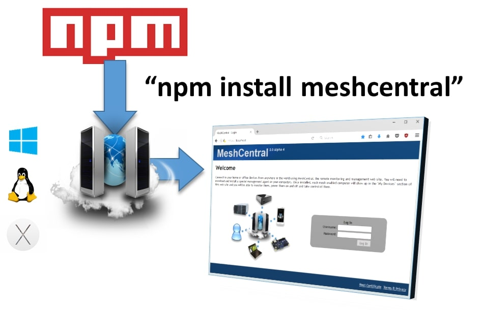

# 📦 NPM Installation for Advanced Users



## Prerequisites and Verification

Before beginning the installation, ensure **Node.js** and **NPM** (Node Package Manager) are installed on your host operating system.

If your server is behind an HTTP/HTTPS proxy, you may need to configure NPM's proxy settings.

### 1\. Verify Node.js and NPM

Open your command-line terminal (CMD/PowerShell on Windows, or Shell on Linux) and run the following commands to check the installed versions:

  * **Node.js:**
    ```shell
    node -v
    ```
  * **NPM:**
    ```shell
    npm -v
    ```

-----

### 2\. Configure Proxy Settings (If Applicable)

If your server requires a proxy to access the internet, you must set the proxy configurations for NPM. **Skip this step if not needed.**

```shell
# Set HTTP proxy
npm config set proxy http://proxy.com:88
# Set HTTPS proxy
npm config set https-proxy http://proxy.com:88
```

-----

## MeshCentral Installation

### 3\. Install MeshCentral

Create a dedicated directory for the installation, change into it, and use NPM to install the MeshCentral package.

**Recommendation:** On Linux, use the `/opt` directory.

> ⚠️ **Important:** Do not use `sudo` when executing the `npm install meshcentral` command.

```shell
# Create the directory
mkdir -p /opt/meshcentral
# Move into the directory
cd /opt/meshcentral
# Install MeshCentral
npm install meshcentral
```

-----

### 4\. Start the Server

Once the download is complete, start the MeshCentral server.

> ⚠️ **Crucial:** **Do not** `cd` into the `node_modules/meshcentral` directory to run the server. Running it from the directory **above** `node_modules` is required for features like auto-install and self-update to function correctly.

```shell
node node_modules/meshcentral [arguments]
```

> **LAN-Only Mode:** If you run the command without arguments, MeshCentral will default to **LAN-only mode**, meaning you can only manage computers on the local network.

-----

### 5\. Configure for WAN/Internet Access (Optional)

To manage computers over the internet (**WAN** or **Hybrid Mode**), your server needs a **static IP** or a **DNS record** that resolves to its public address. This is how remote mesh agents "call home."

While command-line parameters exist, it's **highly recommended to use a configuration file** for persistent settings.

Here are examples of starting the server and generating initial certificates for a public address:

```shell
# Using a domain name
node node_modules/meshcentral --cert servername.domain.com
# Using an IP address
node node_modules/meshcentral --cert 1.2.3.4
```

> **Note:** The first time you run in WAN or Hybrid Mode, MeshCentral will generate necessary **certificates**, which may take a few minutes.

Once running, immediately create your **admin account** by navigating to `https://127.0.0.1` (or your public hostname) in a web browser.