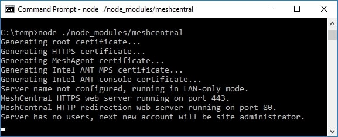

# NPM Installation for Advanced Users

For advanced users or administrators, MeshCentral can be installed with NPM, a NodeJS package manager that can be accessed via web browser (https://www.npmjs.com/) or command line tool, `npm`. 


!!!Note
    As a prerequisite, NodeJS and NPM must be installed on host OS and HTTP/HTTPS proxy settings maybe required if server host resides behind a HTTP proxy server. 

1. To begin, start a command line terminal (Windows Command Prompt or Linux Terminal) and type the following to verify if nodeJS and npm has been installed correctly as shown below 
    a. To check on nodeJS installed version, type `node –v` and hit `enter` key
    b. To check on npm installed version, type `npm –v` and hit `enter` key

2. If MeshCentral installation is performed on a server host that resides behind a HTTP proxy, NPM’s proxy settings must be updated with respective proxy settings associated with the network environment. Skip this step if not applicable. 
    ```
    .e.g. for http proxy `npm config set proxy http://proxy.com:88`
    .e.g. for https proxy `npm config set https-proxy http://proxy.com:88`
    ```
3. Create a new directory `MeshCentral` and run the NPM install command as shown below:
```
mkdir meshcentral
cd meshcentral
npm install meshcentral
```
**Warning**: Do not use `sudo` in front of `npm install meshcentral`.
4. Upon download completion, the server can be started with the commands below:
```
node node_modules/meshcentral [arguments]
```
    **Warning**: Do not run MeshCentral by going into the `node_modules/meshcentral` folder as this may cause auto-install and self-update features to fail. Instead, go into the directory above `node_modules` and run `node node_modules/meshcentral`.

**Note**: If MeshCentral is started without any arguments, default settings in LAN-only mode will be in effect and user/administrator will only be able to manage computers that reside within the local network.
5. To manage computers over the internet, the server needs to have static IP settings or a DNS record that resolves back to the right server. The mesh agents will be using the mechanism to call home to MeshCentral server. For WAN or Hybrid mode, run one of the commands below
```
node node_modules/meshcentral --cert servername.domain.com
node node_modules/meshcentral --cert hostname.domain.com
node node_modules/meshcentral --cert 1.2.3.4
```
**Note**: On first attempt running on WAN or Hybrid Mode:
    - Certificates will be generated for the first time and this may take a few minutes to complete. 

!!!Note
    At this point, no user account will be created or available for the user hence 1st user account will be the most privileged user with Administrator rights 

- User is advised to create an `admin` account immediately by navigating to https://127.0.0.1 with a web browser. 

**Note**: To run MeshCentral as a service, run it using `--install` argument. Once running, start a web browser and access MeshCentral application with respective URL.