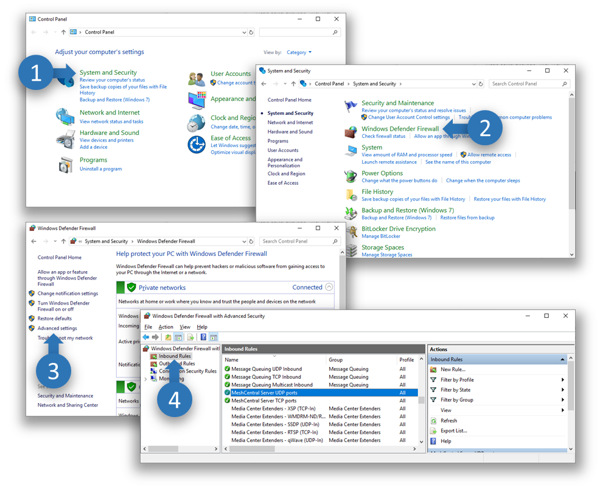
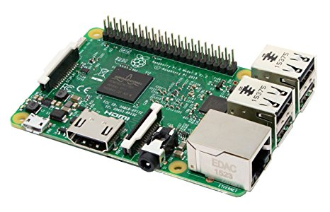
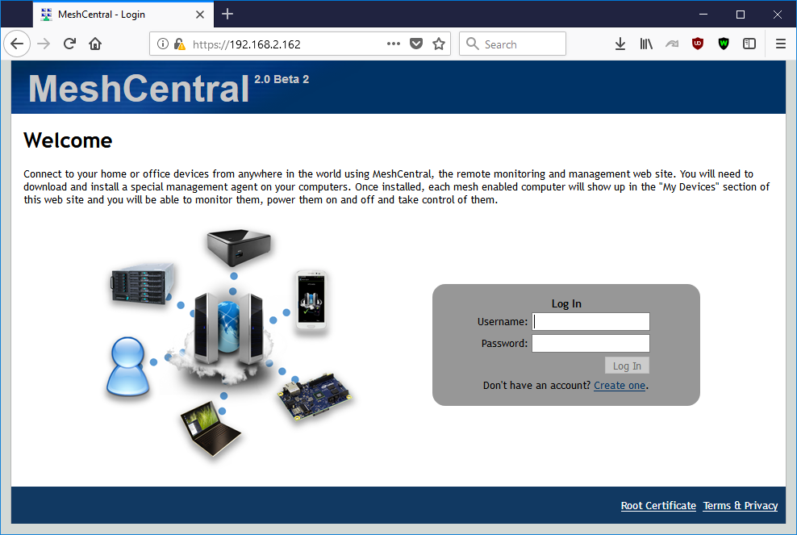
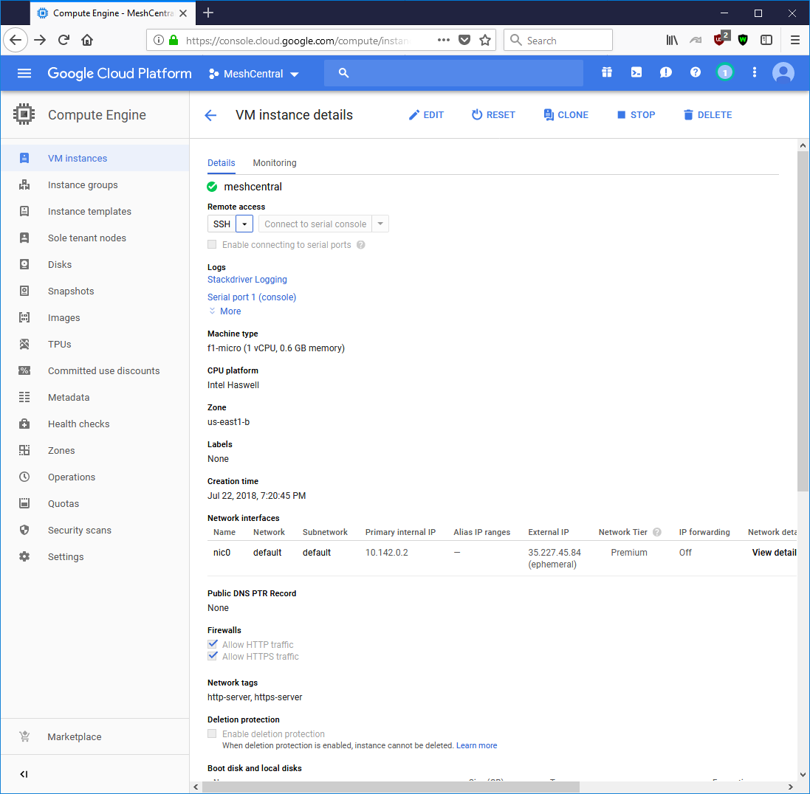
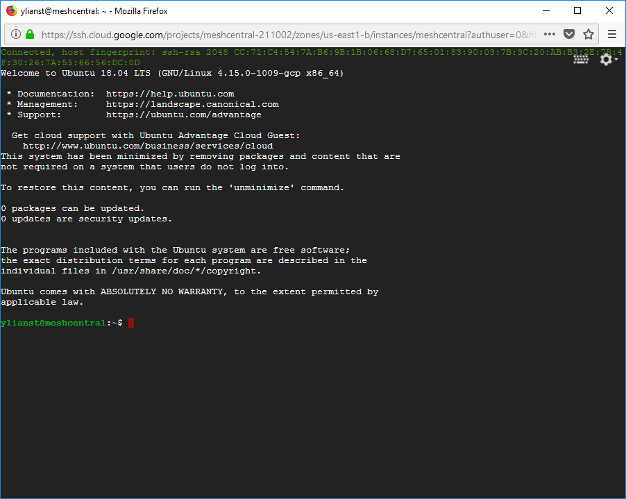

# Full Install Guide

## Abstract

This guide is specifically intended to help users install MeshCentral from start to finish. Once installed, you can take a look at the MeshCentral user’s guide for information on how to configure MeshCentral for your specific use. In this document, we will look at installing MeshCentral on AWS Linux, Raspberry Pi and Ubuntu.

## Quick Start

For some who want to skip this document entirely, there are quick install scripts that will get a MeshCentral2 instance up and running on Linux in a few minutes. These scripts will pretty much do what this document explains very rapidly. Right now, there are two such scripts available:

### Amazon Linux 2

For Amazon EC2 users, that want to manage 100 devices or less. Launch a t3.nano or t3.micro EC2 instance with Amazon Linux 2 with TCP ports 22 (SSH), 80 (HTTP), 443 (HTTPS) and 4433 (CIRA) open. Then login as `ec2-user` and enter the following commands:

```
wget http://info.meshcentral.com/scripts/mc-aws-linux2.sh
chmod 755 mc-aws-linux2.sh
./mc-aws-linux2.sh
```

This will download the fast install script and once run, will install nodejs, meshcentral, setup systemd and start the server. For a larger instance like a t3.small, t3.medium or larger you can run the following that does the same but also installs MongoDB.

```
wget http://info.meshcentral.com/scripts/mc-aws-linux2-mongo.sh
chmod 755 mc-aws-linux2-mongo.sh
./mc-aws-linux2-mongo.sh
```

After these scripts are run, try accessing the server using a browser. MeshCentral will take a minute or two to create certificates after that, the server will be up. The first account to be created will be the site administrator – so don’t delay and create an account right away. Once running, move on to the MeshCentral’s user’s guide to configure your new server.

### Microsoft Azure

For 100 devices or less, launch an instance of Ubuntu 18.04 using a small B1s instance. Set the username to `default` in all lower case and open ports 22, 80, 443 and 3389 using the basic network profile. Then start the instance and run the following lines.

```
wget http://info.meshcentral.com/scripts/mc-azure-ubuntu1804.sh
chmod 755 mc-azure-ubuntu1804.sh
./mc-azure-ubuntu1804.sh
```

In this situation, port 3389 will be used to receive Intel AMT CIRA connections instead of port 4433. After these scripts are run, try accessing the server using a browser. MeshCentral will take a minute or two to create certificates after that, the server will be up. The first account to be created will be the site administrator – so don’t delay and create an account right away. Once running, move on to the MeshCentral’s user’s guide to configure your new server.

## Server Security - Adding Crowdsec

MeshCentral has built-in support for a CrowdSec bouncer. This allows MeshCentral to get threat signals from the community and block or CAPTCHA requests coming from known bad IP addresses.

## Video Walkthru

<div class="video-wrapper">
  <iframe width="320" height="180" src="https://www.youtube.com/embed/TVKF9gBJFCE" frameborder="0" allowfullscreen></iframe>
</div>

## Windows Installation
MeshCentral is constructed entirely with NodeJS, an asynchronous event driven JavaScript runtime (https://nodejs.org/). A basic understanding on NodeJS may be preferable but not compulsory. MeshCentral server which heavily relies on NodeJS runtime will be able run on almost any computing platform with contemporary operating systems including Windows*, Linux* and macOS*.

There are two ways to get MeshCentral setup. 

- For Linux*, macOS*, or advanced users can use CLI based NPM tool.
- For Windows users, you can use the MeshCentral installation tool. 

### Windows Installation Tool

The MeshCentral installer tool for Microsoft Windows can be downloaded at <https://www.meshcommander.com/meshcentral2> or by clicking this link. This tool will automatically detect and install NodeJS if needed. NodeJS will be downloaded from <https://nodejs.org> checked and installed. We recommend the installer be run on a modern version of Windows (.e.g. Win8.1, Win10, Win Server 2012* or better)


During installation, the installation tool will prompt for the following settings:

- Multi-user Server : By enabling this option, the server will be open to any user with a web browser app. Users will be able to create accounts and start managing computers associated in their respective accounts. 

!!!Note
    If this option is disabled (unchecked), the server will run as a single-user server, no login screen will be presented and MeshCentral application will be limited to the server host machine only.

- Auto-update Server: By enabling this option, the server will check new version releases daily and perform automatic update. 

!!!Note
    Update check occurs at 0000 between 0100 hours (local time). During update, the server will not be accessible until update is completed. 

- Server Modes, LAN, WAN or Hybrid: 

    `LAN mode`: Recommended for small installation within a local network. Server host does not need a fixed IP address or DNS record to operate. 

    `WAN or Hybrid modes`: Server host will require a fixed IP address or DNS record to function correctly. If selected, user will need to enter server’s DNS name or static IP address in the `Server Name` field. This name or IP address will be used by browsers and agents to connect back to the server, this name MUST be correct or the server will not work. If you do not have a fixed name, select LAN mode to get started.

Acquiring a static IP or DNS record is beyond the scope of this document. Please seek advice or consult your network administrator if unsure. If unsure, leave the settings as default (as-is) and proceed setup in LAN mode to manage computers that reside within the same network.

Once installed MeshCentral will run as a background Windows Service and can be accessed using a web browser with the link provided by the installer.

The installation tool can be run again to perform server update, re-installation or un-installation. When performing an update check, the tool will look at the currently installed version and compare it to the one present on NPM.


By default, MeshCentral will use TCP ports 80 (HTTP), 443 (HTTPS) and 4433 (Intel® AMT CIRA). The installer will add Windows Defender Firewall rules to allow incoming connections on these ports. In addition, if the server is in LAN or Hybrid mode, an addition rule on UDP port 16990 is added to allow for server discovery.

### NPM Installation for Advanced Users

For advanced users or administrators, MeshCentral can be installed with NPM, a NodeJS package manager that can be accessed via web browser (https://www.npmjs.com/) or command line tool, `npm`. 


!!!Note
    As a prerequisite, NodeJS and NPM must be installed on host OS and HTTP/HTTPS proxy settings maybe required if server host resides behind a HTTP proxy server. 

1. To begin, start a command line terminal (Windows Command Prompt or Linux Terminal) and type the following to verify if nodeJS and npm has been installed correctly as shown below 
    a. To check on nodeJS installed version, type `node –v` and hit `enter` key
    b. To check on npm installed version, type `npm –v` and hit `enter` key

2. If MeshCentral installation is performed on a server host that resides behind a HTTP proxy, NPM’s proxy settings must be updated with respective proxy settings associated with the network environment. Skip this step if not applicable. 
    ```
    .e.g. for http proxy `npm config set proxy http://proxy.com:88`
    .e.g. for https proxy `npm config set https-proxy http://proxy.com:88`
    ```
3. Create a new directory `MeshCentral` and run the NPM install command as shown below:
```
mkdir meshcentral
cd meshcentral
npm install meshcentral
```
**Warning**: Do not use `sudo` in front of `npm install meshcentral`.
4. Upon download completion, the server can be started with the commands below:
```
node node_modules/meshcentral [arguments]
```
    **Warning**: Do not run MeshCentral by going into the `node_modules/meshcentral` folder as this may cause auto-install and self-update features to fail. Instead, go into the directory above `node_modules` and run `node node_modules/meshcentral`.

**Note**: If MeshCentral is started without any arguments, default settings in LAN-only mode will be in effect and user/administrator will only be able to manage computers that reside within the local network.
5. To manage computers over the internet, the server needs to have static IP settings or a DNS record that resolves back to the right server. The mesh agents will be using the mechanism to call home to MeshCentral server. For WAN or Hybrid mode, run one of the commands below
```
node node_modules/meshcentral --cert servername.domain.com
node node_modules/meshcentral --cert hostname.domain.com
node node_modules/meshcentral --cert 1.2.3.4
```
**Note**: On first attempt running on WAN or Hybrid Mode:
    - Certificates will be generated for the first time and this may take a few minutes to complete. 

!!!Note
    At this point, no user account will be created or available for the user hence 1st user account will be the most privileged user with Administrator rights 

- User is advised to create an `admin` account immediately by navigating to https://127.0.0.1 with a web browser. 

**Note**: To run MeshCentral as a service, run it using `--install` argument. Once running, start a web browser and access MeshCentral application with respective URL.

### Windows Defender Firewall Settings

On Windows, the built-in firewall will need to be configured to allow TCP ports 80, 443 and 4433 and sometimes UDP port 16990. The MeshCentral Windows Installer will add incoming rules for these ports automatically. If using the advanced NPM installation or when changing the default ports, it may be needed to add or edit these firewall rules. In this section we look at how to do this.

To get started, we need to go in the control panel, click `System and Security` then `Windows Defender Firewall` and `Advanced Settings` on the left side then click on `Inbound rules`. This will get us on the right place to add or edit firewall rules.



If the MeshCentral Windows Installer was used, the `MeshCentral Server TCP ports` and optionally `MeshCentral Server UDP ports` rules should already be present.

#### Editing the existing rules

To edit an existing rule, simply double click on it. To change the allowed inbound ports, go to the `Protocols and Ports` tab and change the local ports.


#### Add new firewall rules

To add a new firewall rule, click on the `New Rule…` then select `Port` and ok. TCP or UDP and enter the specific local ports needed and ok. Then click ok twice, enter the rule name and ok again.


Typically, inbound TCP ports 80, 443 and 4433 are used, but the rule can be added with different ports as needed.

## Amazon Linux 2

In this section, we will look at installing MeshCentral on Amazon AWS with `Amazon Linux 2`. This is a low cost instance and a free tier is available so you can experiment or run a small instance of MeshCentral and it will work perfectly fine.

### Getting the AWS instance setup

On AWS EC2, you can launch an instance and select `Amazon Linux 2`. In this case, it’s the first option available.


When launching a new instance, you are asked to use or create a security group with the allowed inbound TCP and UDP ports. The security group should look like this:


All security group rules should have a source of `0.0.0.0/0` and `::/0`. The last rule for port 8080 is only needed if migrating from a MeshCentral1 server, most people don’t need it and should not be added.

If you are not going to be managing Intel AMT computers, you can remove port 4433. One can also remove port 80, however it’s needed to get a Let’s Encrypt certificate and useful to route users from the HTTP to the HTTPS web page.

For all the following sections, we assume that we are in the `ec2-user` home path. You can do: 

```
cd ~
```

This will change the current path to the home folder. 

### Installing NodeJS

To get started, launch an instance and start a SSH session to it. You can use SSH on Linux or Putty on Windows to login to the AWS instance.

The first thing to do is get NodeJS installed on the instance. We will be installing a long term support (LTS) version of NodeJS. Additional information on how to do this can be found here. We first install the node version manager then activate it and install the NodeJS LTS. It’s done with 3 commands:

```
curl -o- https://raw.githubusercontent.com/creationix/nvm/v0.33.8/install.sh | bash
. ~/.nvm/nvm.sh
nvm install --lts
```

We can test what version of NodeJS is installed using:

```
node -v
```

### Installing MongoDB

If we are going to run a large instance, it’s best to use MongoDB as the database. If you are using a small instance, you can skip installing MongoDB and MeshCentral will use NeDB instead which is a light weight database that is probably great for managing less than 100 computers.

If you want to use MongoDB, we can install MongoDB Community Edition. More information on how to do this can be found here.

Using `nano` create the file `/etc/yum.repos.d/mongodb-org-4.0.repo`:

```
sudo nano /etc/yum.repos.d/mongodb-org-4.0.repo
```

Then, put this in it:

```
[mongodb-org-4.0]
name=MongoDB Repository
baseurl=https://repo.mongodb.org/yum/amazon/2/mongodb-org/4.0/x86_64/
gpgcheck=1
enabled=1
gpgkey=https://www.mongodb.org/static/pgp/server-4.0.asc
```

This file will setup the repository that we will be using to bet MongoDB. Once done, you can install the package using yum and get it started like this:

```
sudo yum install -y mongodb-org
sudo service mongod start
```

To verify that MongoDB is running, you can enter the MongoDB shell like this:

```
mongo --host 127.0.0.1:27017
```

You can leave the shell using Ctrl-C. The database and log files will be create at these locations:

```
/var/log/mongodb
/var/lib/mongo
```

This is useful to know if you want to make a backup of the database file.

### Port permissions

On Linux, ports below 1024 are reserved for the `root` user. This is a security feature. In our case MeshCentral will need to listen to ports 80 and 443. To allow this, we need to allow node to listen to ports below 1024 like this:

```
whereis node
node: /home/ec2-user/.nvm/versions/node/v8.11.3/bin/node

sudo setcap cap_net_bind_service=+ep /home/ec2-user/.nvm/versions/node/v8.11.3/bin/node
```

We first locate the node binary, using `whereis node`, we then use the `setcap` command to add permissions to node. Note that we take the path given by whereis and place it in the setcap command. The `setcap` command will set permissions allowing node to use ports 1024 and below. This permission may be lost when updating the Linux kernel, so this command may need to be applied again in some case.

### Installing MeshCentral

It’s almost time to install MeshCentral but first, we need to know the public name of our AWS instance, you can run the following command:

```
curl http://169.254.169.254/latest/meta-data/public-hostname
```

It will return the public name of the AWS instance, for example:

```
ec2-1-2-3-4.us-west-2.compute.amazonaws.com
```

You can use this name, or if you have another registered DNS name pointing to the server instance, you can also use that now. Note that you must setup any alternative name on your own, MeshCentral will not do this for you. This name must be correct and must resolve to this AWS instance as all mesh agents will use this name to connect back to this server.

Now, we can use the node package manager (NPM) to install MeshCentral.

```
npm install meshcentral
```
!!!warning
    Do not use `sudo` in front of `npm install meshcentral`. 

After that, we can run MeshCentral for the first time. We want to run in WAN-only mode since we will not be managing any computers on the same local network at this server. We also want to create a server with a certificate name that is the same at the AWS instance name. So, we will use `--wanonly` and `--cert [name]` arguments to get the server started. For example:

```
node ./node_modules/meshcentral --wanonly --cert ec2-1-2-3-4.us-west-2.compute.amazonaws.com

```
At this point, the server will create its certificates and start running.
```

MeshCentral HTTP redirection web server running on port 80.
Generating certificates, may take a few minutes...
Generating root certificate...
Generating HTTPS certificate...
Generating MeshAgent certificate...
Generating Intel AMT MPS certificate...
Generating Intel AMT console certificate...
MeshCentral Intel(R) AMT server running on ec2-54-245-141-130.us-west-2.compute.amazonaws.com:4433.
MeshCentral HTTPS web server running on ec2-54-245-141-130.us-west-2.compute.amazonaws.com:443.
Server has no users, next new account will be site administrator.
```

You can now open a browser to the name of the server, for example:

```
https://ec2-1-2-3-4.us-west-2.compute.amazonaws.com
```

You will see the server working as expected. You will get a certificate error since the server is used an untrusted certificate for now. Just ignore the error and see the MeshCentral User’s Guide to fix this.


At this point, the server is usable but, there are two things that may still need to be done. First, if we opted to use MongoDB, we have to configure MeshCentral to use a MongoDB database. By default, NeDB will be used which should only be used for small deployments managing less than 100 computers. We also need to automatically start the server when the AWS instance starts.

To continue, stop the MeshCentral server with CTRL-C.

### Configuring for MongoDB

By default, MeshCentral uses NeDB with a database file located in ~/meshcentral-data/meshcentral.db. This is great for small servers, but if we opted to install MongoDB, let’s make use of it. We need to edit the config.json file located in the meshcentral-data folder.

```
nano ~/meshcentral-data/config.json
```

Then, make the start of the file look like this:

```json
{
  "settings": {
    "MongoDb": "mongodb://127.0.0.1:27017/meshcentral",
    "WANonly": true,
    "_Port": 443,
    "_RedirPort": 80,
    "_AllowLoginToken": true,
    "_AllowFraming": true,
    "_WebRTC": false,
    "_ClickOnce": false,
    "_UserAllowedIP" : "127.0.0.1,::1,192.168.0.100"
  },
…
}
```

If you start with the default config.json created by MeshCentral, you will need to remove some `_` characters in front of settings, mongodb and wanonly. You can also add a `_` to other values.

You can then same the same and run MeshCentral again. This time, you don’t need to specify the certificate name or `--wanonly`. You just need to run it like this:

```
node ./node_modules/meshcentral
```

The server should now run correctly and use MongoDB. You can even delete the file `~/meshcentral-data/meshcentral.db` as it’s not going to be used anymore. You can check that it runs correctly by browsing to the server’s address again and creating a new account. The first account that is created will be administrator for the server, so don’t delay and create the first account right away.

Once you are done, we can stop the server again using CTRL-C and in the next sections, we will look at starting the server in the background.

### Manually starting the server

We can manually start and stop the MeshCentral server in the background in different ways. In this section, we are going to create two commands `mcstart` and `mcstop` to take care of this. Type this to create the two commands:

```
echo "node ./node_modules/meshcentral > stdout.txt 2> stderr.txt &" > mcstart
chmod 755 mcstart

echo "pkill –f node_modules/meshcentral" > mcstop
chmod 755 mcstop
```

You can now run the `./mcstart` command to launch the server in the background and stop it using the `./mcstop` to stop it. This should work pretty well, but if the AWS instance is ever stopped and started again, the server will not automatically launch.

### Automatically starting the server

Since Amazon Linux 2 supports systemd, we are going to use that to auto-start MeshCentral in the background. First, we need to know our own username and group. If we do `ls -l` in our home folder we get for example:

```
drwxr-xr-x   2 default default 4096 Jul 20 00:03 Desktop
drwxr-xr-x   2 default default 4096 Jul 20 00:03 Documents
drwxr-xr-x   2 default default 4096 Jul 20 00:03 Downloads
…
```

Note the username and group name, in this example it’s `default` for both. We need this information to create the system service description file. To create this file type:

```
sudo pico /etc/systemd/system/meshcentral.service
```

Then enter the following lines:

```
[Unit]
Description=MeshCentral Server

[Service]
Type=simple
LimitNOFILE=1000000
ExecStart=/usr/bin/node /home/default/node_modules/meshcentral
WorkingDirectory=/home/default
Environment=NODE_ENV=production
User=default
Group=default
Restart=always
# Restart service after 10 seconds if node service crashes

RestartSec=10
# Set port permissions capability
AmbientCapabilities=cap_net_bind_service

[Install]
WantedBy=multi-user.target
```

Note that the user and group values have to be set correctly for your specific situation. Also, the ExecStart and WorkingDirectory lines includes the path to the user’s home folder which includes the username in it. Make sure that is set correctly.

Once this is done, you can now start, enable, stop and disable using the following commands:

```
sudo systemctl enable meshcentral.service
sudo systemctl start meshcentral.service
sudo systemctl stop meshcentral.service
sudo systemctl disable meshcentral.service
```

Type in the first two commands to start and enable the service. Enabling the service will make it automatically start when the computer restarts.

Once the server is launched, you can access it using a web browser as before. From this point on, refer to the MeshCentral User’s Guide for information on how to configure and use MeshCentral.

## Raspberry Pi

In this section, we will look at installing MeshCentral on the famous Raspberry Pi. This computer’s low price makes it a perfect always-on system for managing computers on a home or small business network. This installation will work on any version of the Raspberry Pi, but version 3 certainly much faster.



For this installation, we are going to use the Raspbian operating system. You can use the NOOBS version to install this operating system on your Raspberry Pi and install Raspbian. For best performance you can use the `Raspbian Stretch Lite` image which is much smaller and does not have the X desktop interface. To keep things even smaller, we are not going to be installing MongoDB, instead we are just going to be using NeBD as a database that comes by default with MeshCentral.

### Installing NodeJS

Start by opening a terminal. For all of the installation, we will assume we are the default `pi` user and we are in the home (~) folder. Let’s get started by installing NodeJS.

```
sudo apt-get update
sudo apt-get dist-upgrade
curl -sL https://deb.nodesource.com/setup_8.x | sudo -E bash
sudo apt-get -y install nodejs
```

We can now check what version of Node was installed by typing:

```
node -v
```

If all goes well, we can now move on to port permissions and installing MeshCentral itself.

### Port permissions

On Linux, ports below 1024 are reserved for the `root` user. This is a security feature. In our case MeshCentral will need to listen to ports 80 and 443. To allow this, we need to allow node to listen to ports below 1024 like this:

```
whereis node
node: /usr/bin/node /usr/include/node /usr/share/man/man1/node.1.gz

sudo setcap cap_net_bind_service=+ep /usr/bin/node
```

We first locate the node binary, using `whereis node`, we then use the `setcap` command to add permissions to node. Note that we take the path given by whereis and place it in the setcap command. The `setcap` command will set permissions allowing node to use ports 1024 and below. This permission may be lost when updating the Linux kernel, so this command may need to be applied again in some case.


### Installing MeshCentral

Now, we can use the Node Package Manager (NPM) to install MeshCentral.

```
npm install meshcentral
```

!!!warning
    Do not use `sudo` in front of `npm install meshcentral`. 

After that, we can run MeshCentral for the first time. We want to run in WAN-only mode since we will not be managing any computers on the same local network at this server. We also want to create a server with a certificate name that is the same at the AWS instance name. So, we will use `--wanonly` and `--cert [name]` arguments to get the server started. For example:

```
node node_modules/meshcentral --lanonly --fastcert
```

At this point, the server will create its certificates and start running.

```
MeshCentral HTTP redirection web server running on port 80.
Generating certificates, may take a few minutes...
Generating root certificate...
Generating HTTPS certificate...
Generating MeshAgent certificate...
Generating Intel AMT MPS certificate...
Generating Intel AMT console certificate...
Server name not configured, running in LAN-only mode.
MeshCentral HTTPS web server running on port 443.
Server has no users, next new account will be site administrator.
```

The next step is to get the IP address of the Raspberry Pi. Use `ipconfig`:

```
eth0: flags=4163<UP,BROADCAST,RUNNING,MULTICAST>  mtu 1500
        inet 192.168.2.162  netmask 255.255.255.0  broadcast 192.168.2.255
        inet6 fe80::8841:34b7:685:14a7  prefixlen 64  scopeid 0x20<link>
        ether b8:27:eb:01:13:3f  txqueuelen 1000  (Ethernet)
        RX packets 58325  bytes 72302196 (68.9 MiB)
        RX errors 0  dropped 271  overruns 0  frame 0
        TX packets 28457  bytes 3576126 (3.4 MiB)
        TX errors 0  dropped 0 overruns 0  carrier 0  collisions 0
```

You can now open a browser to the name of the server, for example:

```
https://192.168.2.162
```

You will see the server working as expected. You will get a certificate error since the server is used an untrusted certificate for now. Just ignore the error and see the MeshCentral User’s Guide to fix this.



### Configuring for LAN-only mode

By default, MeshCentral will assume that you are managing devices both on a local network and on the internet. In the case of this Raspberry Pi installation, we only want to manage device on the local network and so, we can configure MeshCentral to do this. It will adapt the server for this usages. To do this, edit the config.json file:

```
pico ~/meshcentral-data/config.json
```

Then, make the start of the file look like this:

```json
{
  "settings": {
    "LANonly": true,
    "FastCert": true,
    "_Port": 443,
    "_RedirPort": 80,
    "_AllowLoginToken": true,
    "_AllowFraming": true,
    "_WebRTC": false,
    "_ClickOnce": false,
    "_UserAllowedIP" : "127.0.0.1,::1,192.168.0.100"
  },
…
}
```

While we are at it, we can put `FastCert` to true so that RSA2048 certificates are created instead of RSA3072. This is less secure but runs much faster on small processors like the Raspberry Pi. This is the same as specifying `--fastcert" in the prior section.

### Manually starting the server

We can manually start and stop the MeshCentral server in the background in different ways. In this section, we are going to create two commands `mcstart` and `mcstop` to take care of this. Type this to create the two commands:

```
echo "node ./node_modules/meshcentral > stdout.txt 2> stderr.txt &" > mcstart
chmod 755 mcstart

echo "pkill -f node_modules/meshcentral" > mcstop
chmod 755 mcstop
```

You can now run the `./mcstart` command to launch the server in the background and stop it using the `./mcstop` to stop it. This should work pretty well, but if the AWS instance is ever stopped and started again, the server will not automatically launch.

### Automatically starting the server

Since Raspbian OS supports systemd, we are going to use that to auto-start MeshCentral in the background. First, we need to know our own username and group. If we do `ls -l` in our home folder we 

```
drwxr-xr-x   2 pi pi  4096 Jul 19 21:23 Desktop
drwxr-xr-x   2 pi pi  4096 Jun 26 18:23 Documents
drwxr-xr-x   2 pi pi  4096 Jun 26 18:23 Downloads
…
```

Note the username and group name, in this example it’s `pi` for both. We need this information to create the system service description file. To create this file type:

```
sudo nano /etc/systemd/system/meshcentral.service

```
Then enter the following lines:

```
[Unit]
Description=MeshCentral Server

[Service]
Type=simple
LimitNOFILE=1000000
ExecStart=/usr/bin/node /home/pi/node_modules/meshcentral
WorkingDirectory=/home/pi
Environment=NODE_ENV=production
User=pi
Group=pi
Restart=always
# Restart service after 10 seconds if node service crashes
RestartSec=10
# Set port permissions capability
AmbientCapabilities=cap_net_bind_service

[Install]
WantedBy=multi-user.target
```

Note that the user and group values have to be set correctly for your specific situation. Also, the ExecStart and WorkingDirectory lines includes the path to the user’s home folder which includes the username in it. Make sure that is set correctly.

Once this is done, you can now enable, start, stop and disable using the following commands:

```
sudo systemctl enable meshcentral.service
sudo systemctl start meshcentral.service
sudo systemctl stop meshcentral.service
sudo systemctl disable meshcentral.service
```

Type in the first two commands to start and enable the service. Enabling the service will make it automatically start when the computer restarts.

Once the server is launched, you can access it using a web browser as before. From this point on, refer to the MeshCentral User’s Guide for information on how to configure and use MeshCentral.

## Ubuntu 18.04

In this section, we will look at installing MeshCentral on Ubuntu 18.04 LTS. This is a long term support of Ubuntu freely available for download at <https://www.ubuntu.com>. Both the desktop and server versions of Ubuntu will work. If this is a remote server and the desktop will not be needed, the server version of Ubuntu can be used. This section will describe a way to install MeshCentral in a user’s home folder, however there is a more secure way to do it, see `Increased Security Installation` at the end of this section.

In all cases, MeshCentral must not be installed as root user. It’s not secure and the instructions below will not work correctly.

### Installing NodeJS

The first thing to do is get NodeJS installed on the computer. We first install the node version manager then activate it and install the NodeJS LTS. It’s done with 4 commands:

```
sudo add-apt-repository universe
sudo apt update
sudo apt install nodejs -y
sudo apt install npm -y
```

We can test what version of Node and NPM are installed using:

```
node –v
npm -v
```

### Installing MongoDB

If we are going to run a large instance, it’s best to use MongoDB as the database. If you are using a small instance, you can skip installing MongoDB and MeshCentral will use NeDB instead which is a light weight database that is probably great for managing less than 100 computers.

If you want to use MongoDB, we can install MongoDB Community Edition. More information on how to do this for Ubuntu can be found here.

You can install the package using apt and get it started like this:

```
sudo apt install mongodb -y
```

Then start the Mongodb service in the background and enable it for auto-restart.

```
sudo systemctl start mongodb
sudo systemctl enable mongodb
```

To verify that MongoDB is running, you can enter the MongoDB shell like this:

```
mongo --host 127.0.0.1:27017
```

You can leave the shell using Ctrl-C. The database and log files will be create at these locations:

```
/var/log/mongodb
/var/lib/mongo
```

This is useful to know if you want to make a backup of the database file.

### Port permissions

On Linux, ports below 1024 are reserved for the `root` user. This is a security feature. In our case MeshCentral will need to listen to ports 80 and 443. To allow this, we need to allow node to listen to ports below 1024 like this:

```
whereis node
node: /usr/bin/node /usr/include/node /usr/share/man/man1/node.1.gz

sudo setcap cap_net_bind_service=+ep /usr/bin/node
```

We first locate the node binary, using `whereis node`, we then use the `setcap` command to add permissions to node. Note that we take the path given by whereis and place it in the setcap command. The `setcap` command will set permissions allowing node to use ports 1024 and below. This permission may be lost when updating the Linux kernel, so this command may need to be applied again in some case.

### Installing MeshCentral

Now, we can use the node package manager (NPM) to install MeshCentral.

```
npm install meshcentral
```

!!!warning
    Do not use `sudo` in front of `npm install meshcentral`. 

After that, we can run MeshCentral for the first time. For example:

```
node ./node_modules/meshcentral
```

If the computer has a well-known DNS name that users and agents will use to connect to this server, run MeshCentral like this:

```
node ./node_modules/meshcentral --cert example.servername.com
```

At this point, the server will create its certificates and start running.

```
MeshCentral HTTP redirection web server running on port 80.
Generating certificates, may take a few minutes...
Generating root certificate...
Generating HTTPS certificate...
Generating MeshAgent certificate...
Generating Intel AMT MPS certificate...
Generating Intel AMT console certificate...
MeshCentral Intel(R) AMT server running on ec2-54-245-141-130.us-west-2.compute.amazonaws.com:4433.
MeshCentral HTTPS web server running on ec2-54-245-141-130.us-west-2.compute.amazonaws.com:443.
Server has no users, next new account will be site administrator.
```

You can now open a browser and try the server. If you can on the same computer, you navigate to this URL:

```
http://localhost
```

If installing on a server that does not have a desktop GUI, use a different computer and enter http:// followed by the IP address or name of the server you installed.

You should see the server working as expected. You will get a certificate error since the server is used an untrusted certificate for now. Just ignore the error and see the MeshCentral User’s Guide to fix this.


At this point, the server is usable but, there are two things that may still need to be done. First, if we opted to use MongoDB, we have to configure MeshCentral to use a MongoDB database. By default, NeDB will be used which should only be used for small deployments managing less than 100 computers. We also need to automatically start the server when the computer starts.

To continue, stop the MeshCentral server with CTRL-C.

### Configuring for MongoDB

By default, MeshCentral uses NeDB with a database file located in ~/meshcentral-data/meshcentral.db. This is great for small servers, but if we opted to install MongoDB, let’s make use of it. We need to edit the config.json file located in the meshcentral-data folder.

```
pico ~/meshcentral-data/config.json
```

Then, make the start of the file look like this:

```json
{
  "settings": {
    "MongoDb": "mongodb://127.0.0.1:27017/meshcentral",
    "WANonly": true,
    "_Port": 443,
    "_RedirPort": 80,
    "_AllowLoginToken": true,
    "_AllowFraming": true,
    "_WebRTC": false,
    "_ClickOnce": false,
    "_UserAllowedIP" : "127.0.0.1,::1,192.168.0.100"
  },
…
}
```

If you start with the default config.json created by MeshCentral, you will need to remove some `_` characters in front of settings, mongodb and wanonly. You can also add a `_` to other values. For details on all of the config.json options, including the `WANonly` option, refer to the MeshCentral User’s Guide.

You can then save the config.json file and run MeshCentral again. This time, you don’t need to specify the certificate name. You just need to run it like this:

```
node ./node_modules/meshcentral
```

The server should now run correctly and use MongoDB. You can even delete the file ~/meshcentral-data/meshcentral.db as it’s not going to be used anymore. You can check that it runs correctly by browsing to the server’s address again and creating a new account. The first account that is created will be administrator for the server, so don’t delay and create the first account right away.

Once you are done, we can stop the server again using CTRL-C and in the next sections, we will look at starting the server in the background.

### Manually starting the server

We can manually start and stop the MeshCentral server in the background in different ways. In this section, we are going to create two commands `mcstart` and `mcstop` to take care of this. Type this to create the two commands:

```
echo "node ./node_modules/meshcentral > stdout.txt 2> stderr.txt &" > mcstart
chmod 755 mcstart

echo "pkill –f node_modules/meshcentral" > mcstop
chmod 755 mcstop
```

You can now run the `./mcstart` command to launch the server in the background and stop it using the `./mcstop` to stop it. This should work pretty well, but if the AWS instance is ever stopped and started again, the server will not automatically launch.

### Automatically starting the server

Since Ubuntu 18.04 supports systemd, we are going to use that to auto-start MeshCentral in the background. First, we need to know our own username and group. If we do `ls -l` in our home folder we get for example:

```
drwxr-xr-x   2 default default 4096 Jul 20 00:03 Desktop
drwxr-xr-x   2 default default 4096 Jul 20 00:03 Documents
drwxr-xr-x   2 default default 4096 Jul 20 00:03 Downloads
…
```

Note the username and group name, in this example it’s `default` for both. We need this information to create the system service description file. To create this file type:

```
sudo pico /etc/systemd/system/meshcentral.service
```

Then enter the following lines:

```
[Unit]
Description=MeshCentral Server

[Service]
Type=simple
LimitNOFILE=1000000
ExecStart=/usr/bin/node /home/default/node_modules/meshcentral
WorkingDirectory=/home/default
Environment=NODE_ENV=production
User=default
Group=default
Restart=always
# Restart service after 10 seconds if node service crashes
RestartSec=10
# Set port permissions capability
AmbientCapabilities=cap_net_bind_service

[Install]
WantedBy=multi-user.target
```

Note that the user and group values have to be set correctly for your specific situation. Also, the ExecStart and WorkingDirectory lines includes the path to the user’s home folder which includes the username in it. Make sure that is set correctly. Lastly the path to node may need to be changed. Type `whereis node` to find the correct path.

Once this is done, you can now start, enable, stop and disable using the following commands:
	
```
sudo systemctl enable meshcentral.service
sudo systemctl start meshcentral.service
sudo systemctl stop meshcentral.service
sudo systemctl disable meshcentral.service
```

Type in the first two commands to start and enable the service. Enabling the service will make it automatically start when the computer restarts.

Once the server is launched, you can access it using a web browser as before. From this point on, refer to the MeshCentral User’s Guide for information on how to configure and use MeshCentral.

### Increased Security Installation

On Debian based Linux distributions like Ubuntu, a better and more secure way to install MeshCentral is to have it run within a user account this restricted privileges. When installed like this, the self-update capability of MeshCentral will not work. Instead of installing MeshCentral in the user’s home folder, we install it in /opt/meshcentral and we create a meshcentral user that does not have rights to login or change any of the MeshCentral files. To do this, start by creating a new user called `meshcentral`

```
sudo useradd -r -d /opt/meshcentral -s /sbin/nologin meshcentral
```

We can then create the installation folder, install and change permissions of the files so that the `meshcentral` account gets read-only access to the files.

```
sudo mkdir /opt/meshcentral
cd /opt/meshcentral
sudo npm install meshcentral
sudo -u meshcentral node ./node_modules/meshcentral
```

The last line will run MeshCentral manually and allow it to install any missing modules and create the MeshCentral data folders. Once it’s running, press CTRL-C and continue. The following two lines will change the ownership of files to the meshcentral user and restrict access to the files.

```
sudo chown -R meshcentral:meshcentral /opt/meshcentral
sudo chmod 755 –R /opt/meshcentral/meshcentral-*
```

To make this work, you will need to make MeshCentral work with MongoDB because the /meshcentral-data folder will be read-only. In addition, MeshCentral will not be able to update itself since the account does not have write access to the /node_modules files, so the update will have to be manual. First used systemctl to stop the MeshCentral server process, than use this:

```
cd /opt/meshcentral
sudo npm install meshcentral
sudo -u meshcentral node ./node_modules/meshcentral
sudo chown -R meshcentral:meshcentral /opt/meshcentral
```

This will perform the update to the latest server on NPM and re-set the permissions so that the meshcentral user account has read-only access again. You can then use systemctl to make the server run again.

MeshCentral allows users to upload and download files stores in the server’s `meshcentral-files` folder. In an increased security setup, we still want the server to be able to read and write files to this folder and we can allow this with:

```
sudo chmod 755 –R /opt/meshcentral/meshcentral-files
```

If you plan on using the increased security installation along with MeshCentral built-in Let’s Encrypt support you will need to type the following commands to make the `letsencrypt` folder in `meshcentral-data` writable.

```
sudo mkdir /opt/meshcentral/meshcentral-data
sudo mkdir /opt/meshcentral/meshcentral-data/letsencrypt
sudo chmod 755 –R /opt/meshcentral/meshcentral-data/letsencrypt
```

This will allow the server to get and periodically update its Let’s Encrypt certificate. If this is not done, the server will generate an `ACCES: permission denied` exception.

### Restore backup in Ubuntu

- Stop Meshcentral service `sudo systemctl stop meshcentral.service`
- In your old server, get your backup : meshcentral-data folder, and mongodump-xxxx.archive
- In the new server, replace the actual meshcentral-data with your backup (it will handle your LestEncrypt cert also)
- Restore mongodb : mongorestore --archive=mongodump-xxxx.archive
- Restart meshcentral.service `sudo systemctl start meshcentral.service`

## Microsoft Azure

In this section, we will look installing MeshCentral on Microsoft Azure. Microsoft Azure offers many operating system options and we will be selecting `Ubuntu Server` as our choice. From the Azure portal, we select `Virtual machines` on the left and `Add`.


Once you click on Ubuntu Server, you will see a list of available versions. In this example, we selected Ubuntu 18.04 LTS (Long Term Support). We then have to create an instance name and a way to authenticate to the instance.


Next is the type of instance to launch. Any instance will do including the `B1s` which is the smallest possible instance. Of course, as you manage more computers, using an instance that is a bit more powerful is a good idea.


After selecting the instance type, you can configure storage. 30 gigabytes is plenty. Then the Network Security Group. This is where it’s important to open at least TCP ports 22, 80 and 443.


Optionally if you wish to use the instance with Intel AMT, open port 4433. In addition port 8080 must be open if you are migrating from MeshCentral1 (not typical).

Lastly we launch the instance, it will take a few minutes to setup.


You can then find the public IP address and use a SSH client like PUTTY on Windows to connect to the instance and start getting MeshCentral setup. From this point on, just use the Ubuntu section above to complete the installation.

## Google Cloud

In this section, we will look installing MeshCentral on Google Cloud. You can sign up easily at https://cloud.google.com/ and you can run a small instance for less than 5$ a month. 


Once you have create an account, you can go to the main console and on the left side, go to `Compute Engine` and create a new VM instance. For our demonstration, we are going to create the smallest instance possible which is a single shared CPU and only 0.6 gigs of RAM.


We select the proper settings and select `Ubuntu 18.04 LTS Minimal` as the boot operating system. This is convenient as we already covered how to install MeshCentral on this operating system.



Make sure to allow HTTP and HTTPS traffic. Setup like this, we will not be able to manage Intel AMT unless we also open TCP port 4433. Once done with all these options, we can launch the VM instance.


The new instance will take a few minutes to start up. An interesting feature of Google Cloud is that you can access the VM instance shell directly from the web browser. No need for a separate SSH client. This is exactly what we need and we opt to go ahead and option the web console.



If will log you in automatically, no additional credentials needed. We can then follow the `Ubuntu 18.04 LTS` section above to complete the installation. If you opt for a very small instance, it’s probably a good idea to skip installing MongoDB. Just to get started quickly, we can use the following commands:

```
sudo apt update
sudo apt install nodejs -y
sudo apt install npm -y
sudo setcap cap_net_bind_service=+ep /usr/bin/node
npm install meshcentral
node ./node_modules/meshcentral --fastcert –wanonly --cert 35.227.45.84
```

!!!warning
    Do not use `sudo` in front of `npm install meshcentral`. 

This will install node and npm. Will allow non-root access to ports 80 and 443 and install and start MeshCentral. Because this example uses a very small server instance, we opted to use the `fastcert` option to create RSA 2048 certificates (the default is RSA 3072 which is more secure). 

We use the `wantonly` option because MeshCentral will not be managing computers on a local network, and for this demonstration just used the external IP address of the instance as the server name.

If you plan on using an instance without the Intel AMT CIRA port being open (TCP 4433), it’s recommended to add `--mpsport 0` so to inform MeshCentral that this port is not open and to not offer Intel AMT CIRA features.

Of course, this set of commands is just to get the server started quickly. Follow the Ubuntu 18.04 instructions to setup the server to automatically start using system.

## Ubuntu 16.04

In this section, we will look at installing MeshCentral on Ubuntu 16.04 LTS. This is the same installation at Ubuntu 18.04 LTS, however you need to install NodeJS in a special way. If you use `apt install node`, you will get an older version 4.x of NodeJS that will not work with MeshCentral.

### Installing NodeJS

The first thing to do is get NodeJS installed on the computer. We first install the node version manager then activate it and install the NodeJS LTS. It’s done with 3 commands:

```
cd ~
wget https://deb.nodesource.com/setup_8.x
sudo bash setup_8.x
sudo apt-get –y install nodejs
```

We can test what version of Node and NPM are installed using:

```
node –v
npm -v
```

You should see Node version 8 and NPM version 5. At this point, you can continue installing MeshCentral using the Ubuntu 18.04 installation instructions.

## OpenBSD 6.4

In this section, we will look at installing MeshCentral on OpenBSD 6.4. This section was originally written by Daulton and placed here with this permission. The original instructions are located at: https://daulton.ca/meshcentral-server-on-openbsd/. The section will setup MeshCentral on non-standard ports HTTPS/3000 and HTTP/3001. Thank you to Daulton for his contribution.

### Installing MongoDB

Install the Mongodb package.

```
pkg_add mongodb
```

Start and enable Mongodb at boot.

```
rcctl start mongod
rcctl enable mongod
```

Temporary remount /usr with wxallowed while we compile the port. For Cloud VPS they usually only have a root partition instead of how OpenBSD splits it up by default, you will need to edit /etc/fstab and add wxallowed to the options for the root partition and then reboot. Assure to remove this from the fstab options after you are done.

```
mount -r -o wxallowed /usr/
```

### Installing NodeJS

Install NodeJS from ports as it is not available by a package.

```
$ cd /tmp
$ ftp https://cdn.openbsd.org/pub/OpenBSD/$(uname -r)/{ports.tar.gz,SHA256.sig}
# cd /usr
# tar xzf /tmp/ports.tar.gz
# cd /usr/ports/lang/node
# make install
# make clean
```

### Installing MeshCentral

Create the MeshCentral user. The parameters used here are important as we will not let this user login, it has no home directory, and its class is set to daemon. In line with the OpenBSD daemon user naming scheme, we preface the username with an underscore `_` to make it easily identifiable as a daemon user.

```
useradd -s /sbin/nologin -d /nonexistent -L daemon -u 446 _meshcentral
```

Let’s install MeshCentral and adjust the permissions.

```
mkdir -p /usr/local/meshcentral
cd /usr/local/meshcentral
npm install meshcentral
chown -R _meshcentral:_meshcentral /usr/local/meshcentral
```

Configuring for MongoDB and adjusting some other settings such as the network port. Open up the following config in an editor then, make the start of the file look like below. If the setting does not exist yet, just add it below one of the ones we are adjusting in the main settings block.

If you start with the default config.json created by MeshCentral, you will need to remove some underscore character in front of settings to enable the setting, such as mongodb and wanonly. You can also add an underscore to other values. For details on all of the config.json options, including the `WANonly` option, refer to the MeshCentral User’s Guide.

Before you can edit the configuration, start the Meshcentral briefly so it generates the default configurations and certificates. Once you see that it says "MeshCentral HTTPS server running...", Ctrl-C to exit then edit the configuration file next.

```
cd /usr/local/meshcentral/node_modules/meshcentral/ && doas -u _meshcentral /usr/local/bin/node /usr/local/meshcentral/node_modules/meshcentral/meshcentral.js --launch
```

Edit the MeshCentral config.json. For example using vi:

```
vi /usr/local/meshcentral/meshcentral-data/config.json
```

In the settings section, set the following key value pairs:

```json
{
"settings": {
"Cert": "meshcentral.example.com",
"MongoDb": "mongodb://127.0.0.1:27017/meshcentral",
"WANonly": true,
"Port": 3000,
"ExactPorts": true,
"RedirPort": 3001,
"allowLoginToken": true,
"allowFraming": true,
"NewAccounts": 0,
},
…
}
```

Add the following to the root crontab to start MeshCentral at boot. Edit the root crontab by doing the following command as root: crontab -e

```
@reboot cd /usr/local/meshcentral/node_modules/meshcentral/ && doas -u _meshcentral /usr/local/bin/node /usr/local/meshcentral/node_modules/meshcentral/meshcentral.js --launch
```

As root launch Meshcentral while it installs mongojs, once that finishes and Meshcentral launches close it by doing Ctrl-C. Adjust the permissions again as we ran Meshcentral and it generated new files we need to change the ownership of.

/usr/local/bin/node /usr/local/meshcentral/node_modules/meshcentral
```
chown -R _meshcentral:_meshcentral /usr/local/meshcentral
```

!!!Warning
    Do not keep this running or use this command in the future to start the Meshcentral server as it starts the server as root!

This is a reference /etc/pf.conf for you to keep your server secure. Add any locally connected networks which should have access and any public IP address of a network which will have client PCs connect from to target_whitelist table. Add your own home and/or business IP to my_own_IPs table.

```
ext_if = vio0
set reassemble yes
set block-policy return
set loginterface egress
set ruleset-optimization basic
set skip on lo

icmp_types = "{ 0, 8, 3, 4, 11, 30 }"

table <target_whitelist> const { 45.63.15.84, 10.18.5.0/24 }
table <my_own_IPs> const { 45.63.15.84 }
table <bruteforce>

match in all scrub (no-df max-mss 1440)
match out all scrub (no-df max-mss 1440)

block in quick log from urpf-failed label uRPF
block quick log from <fail2ban>

block in from no-route to any
block in from urpf-failed to any
block in quick on $ext_if from any to 255.255.255.255
block in log quick on $ext_if from { 10.0.0.0/8, 172.16.0.0/12, 192.168.0.0/16, 255.255.255.255/32 } to any antispoof for $ext_if
block log all

pass in quick inet proto icmp icmp-type $icmp_types
pass in quick inet6 proto icmp6

pass in quick proto tcp from <my_own_IPs> \
to (egress) port { 22 } \
flags S/SA modulate state \
(max-src-conn 5, max-src-conn-rate 5/5, overload <bruteforce> flush global)

pass in quick inet proto tcp from <target_whitelist> to port 3000
pass in quick inet6 proto tcp from <target_whitelist> to port 3000

block in quick log on egress all

pass out quick on egress proto tcp from any to any modulate state
pass out quick on egress proto udp from any to any keep state
pass out quick on egress proto icmp from any to any keep state
pass out quick on egress proto icmp6 from any to any keep state
```

After saving the configuration in /etc/pf.conf, reload the pf rules with:

```
pfctl -f /etc/pf.conf

```

To save rebooting and have MeshCentral launch then, launch it so you can begin using it. This time it is running as _meshcentral, now it is safe to keep running and you can use this command in the future.

```
cd /usr/local/meshcentral/node_modules/meshcentral/ && doas -u _meshcentral /usr/local/bin/node /usr/local/meshcentral/node_modules/meshcentral/meshcentral.js --launch
```

You can now access MeshCentral at https://youraddress:3000 or https://meshcentral.example.com:3000 if you named the machine meshcentral or create an A record named meshcentral. The first user you create will be the Administrator, there is no default user.
