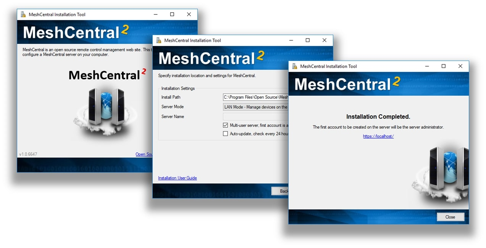

# 🪟 Windows

The MeshCentral installer tool for Microsoft Windows can be downloaded at <https://www.meshcommander.com/meshcentral2> or by clicking this link. This tool will automatically detect and install NodeJS if needed. NodeJS will be downloaded from <https://nodejs.org> checked and installed.

We recommend the installer be run on a modern version of Windows (.e.g. Win8.1, Win10, Win Server 2012* or better)

During installation, the installation tool will prompt for the following settings:

> **- Multi-user Server :**

By enabling this option, the server will be open to any user with a web browser app. Users will be able to create accounts and start managing computers associated in their respective accounts.

---
> **📌 Note:**
>
> If this option is disabled (unchecked), the server will run as a single-user server, no login screen will be presented and MeshCentral application will be limited to the server host machine only.
---

> **- Auto-update Server:**

By enabling this option, the server will check new version releases daily and perform automatic update.

---
> **📌 Note:**
>
> Update check occurs at 0000 between 0100 hours (local time). During update, the server will not be accessible until update is completed.
---

> **- Server Modes, LAN, WAN or Hybrid:**

*LAN mode:*

Recommended for small installation within a local network. Server host does not need a fixed IP address or DNS record to operate. 

*WAN or Hybrid modes:*

Server host will require a fixed IP address or DNS record to function correctly. If selected, user will need to enter server’s DNS name or static IP address in the `Server Name` field. This name or IP address will be used by browsers and agents to connect back to the server, this name MUST be correct or the server will not work. If you do not have a fixed name, select LAN mode to get started.

Acquiring a static IP or DNS record is beyond the scope of this document. Please seek advice or consult your network administrator if unsure. If unsure, leave the settings as default (as-is) and proceed setup in LAN mode to manage computers that reside within the same network.

Once installed MeshCentral will run as a background Windows Service and can be accessed using a web browser with the link provided by the installer.

The installation tool can be run again to perform server update, re-installation or un-installation. When performing an update check, the tool will look at the currently installed version and compare it to the one present on NPM.

By default, MeshCentral will use TCP ports 80 (HTTP), 443 (HTTPS) and 4433 (Intel® AMT CIRA). The installer will add Windows Defender Firewall rules to allow incoming connections on these ports. In addition, if the server is in LAN or Hybrid mode, an addition rule on UDP port 16990 is added to allow for server discovery.

### 🔒 Windows Defender Firewall Settings

On Windows, the built-in firewall will need to be configured to allow TCP ports 80, 443 and 4433 and sometimes UDP port 16990. The MeshCentral Windows Installer will add incoming rules for these ports automatically. If using the advanced NPM installation or when changing the default ports, it may be needed to add or edit these firewall rules. In this section we look at how to do this.

To get started, we need to go in the control panel, click `System and Security` then `Windows Defender Firewall` and `Advanced Settings` on the left side then click on `Inbound rules`. This will get us on the right place to add or edit firewall rules.

If the MeshCentral Windows Installer was used, the `MeshCentral Server TCP ports` and optionally `MeshCentral Server UDP ports` rules should already be present.

#### ✏️ Editing the existing rules

To edit an existing rule, simply double click on it. To change the allowed inbound ports, go to the `Protocols and Ports` tab and change the local ports.

#### ➕ Add new firewall rules

To add a new firewall rule, click on the `New Rule…` then select `Port` and ok. TCP or UDP and enter the specific local ports needed and ok. Then click ok twice, enter the rule name and ok again.

Typically, inbound TCP ports 80, 443 and 4433 are used, but the rule can be added with different ports as needed.