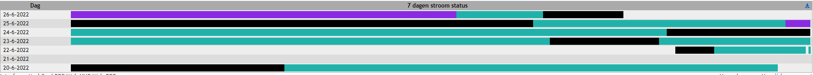
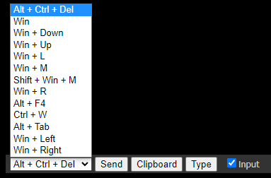
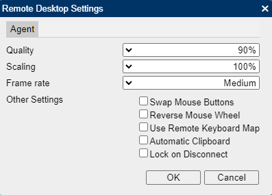
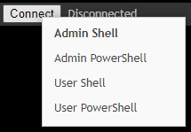

# Device Tabs

## Search or Filter

You can search your list of agents using any of these criteria using the filter box (also viewable in the tooltip of the Filter box):

user:xxx or u:xxx
ip:xxx
group:xxx or g:xxx
tag:xxx or t:xxx
atag:xxx or a:xxx
os:xxx
amt:xxx
desc:xxx
wsc:ok
wsc:noav
wsc:noupdate
wsc:nofirewall
wsc:any

## General

For viewing general information about the agent

* Group
* Description
* IP-KVM Port Number
* IP-KVM Port Type
* Intel AMT
* Intel AMT Tag
* Mesh Agent
* Operating System
* Windows Security
* Antivirus
* Active User
* User Consent
* Notifications
* Tags

### Fields

### Buttons

Actions
Notes
Log Event
Message
PDU On/Off/Control
Chat

### 7 Day Power State

Legend

* **_Black color_**: Device is powered on (Intel AMT & agents)
* **_Purple color_**: Device is in sleep state (Intel AMT agents only)
* **_Teal color_**: Device is connected through AMT/CIRA, but not powered on (Intel AMT agents only)
* **_Grey color_**: Device is powered off (Intel AMT & agents)

### Text Links

You can set alternate port in the link if it's not default by right-clicking.

* Interfaces
* Location
* MeshCmd
* RDP
* Web-VNC
* Web-RDP
* Web-SSH
* XTerm
* HTTP
* HTTPS
* SSH
* SCP
* MQTT Login

## Desktop

For connecting to the machines KVM interface.

### Connect Button

Right-clicking on Connect button will give you additional options:

* Ask Consent + Bar
* Ask Consent
* Privacy Bar

### RDP Connect Button

Right-clicking on RDP Connect button allows you to specify Alternate Port.

### Intel AMT Connect Button

Uses Intel AMT to control video output of the hardware video card.

### During a desktop session

**Bottom left include:**

* Sending special Keys

**Top Right include:**

Actions

* Wake Up
* Run Commands
* Sleep
* Reset
* Power Off
* Uninstall Agent

Settings

* Quality
* Scaling
* Frame rate
* Swap Mouse Buttons
* Reverse Mouse Wheel
* Use Remote Keyboard Map
* Automatic Clipboard
* Lock on Disconnect

* Session recording indicator
* Screen rotating
* switching view mode
* full screen

Bottom right include:

* Session Sharing with Guest
* Toggling keyboard lockout on guest
* Refresh Desktop view
* Upload Clipboard
* Download Clipboard
* Record Session to file
* Take screenshot
* Toggle Remote Desktop Background
* Open URL on remote desktop
* Lock the Remote computer
* Display a notification on the remote computer
* Open Chat Window

## Terminal

For connecting to a command line based interface on the agent

Right-clicking on Connect button allows you to:

!!!note
    Linux and Windows have different options:

* Admin Shell (Windows)
* Admin Powershell (Windows)
* User Shell (Windows)
* User Powershell (Windows)
* SSH (Linux)

## Files

For transferring files to and from the agent.

## Events

Mesh Events related to the agent. This is your audit log to see what actions have been taken on the agent from the MeshCentral server.

## Details

Agent information that includes:

* OS
* Agent Info
* Network Info
* BIOS
* Motherboard
* Memory
* Storage
* Intel AMT

Note you can show CPU and Memory usage info by clicking the icon in the top right corner

## Intel AMT

## Console

For debugging and communicating with the mesh agent.

It allows JS commands to be issued to the device but also run extra commands from the meshcore. Type `help` for all available options

- 2falock
- acceleratorsstats
- agentissues
- agentstats
- amtacm
- amtmanager
- amtpasswords
- amtstats
- args
- autobackup
- backupconfig
- bad2fa
- badlogins
- certexpire
- certhashes
- closeusersessions
- cores
- dbcounters
- dbstats
- dispatchtable
- dropallcira
- dupagents
- email
- emailnotifications
- firebase
- heapdump
- heapdump2
- help
- info
- le
- lecheck
- leevents
- maintenance
- migrationagents
- mps
- mpsstats
- msg
- nodeconfig
- print
- relays
- removeinactivedevices
- resetserver
- serverupdate
- setmaxtasks
- showpaths
- sms
- swarmstats
- tasklimiter
- trafficdelta
- trafficstats
- updatecheck
- usersessions
- versions
- watchdog
- webpush
- webstats
