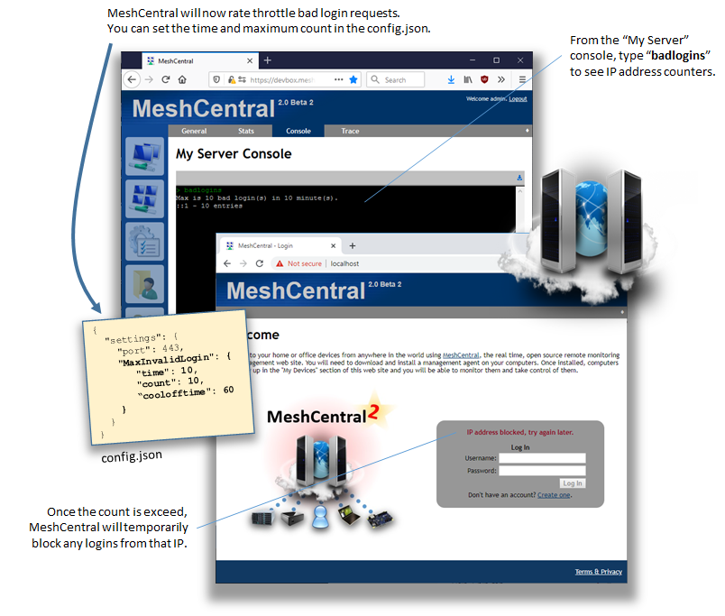

# Security

## Rate Limiting login attempts

You can use the MeshCentral Server Console with the command `badlogins` to see the current settings.

Adjust these items in your `config.json`

```json
"settings": {
    "_maxInvalidLogin": {
    "time": 10,
    "count": 10,
    "coolofftime": 10
    },
}
```



## Disabling TLS 1.0/1.1 for AMT

```json
{
  "settings": {
    "mpshighsecurity": true
  }
}
```
