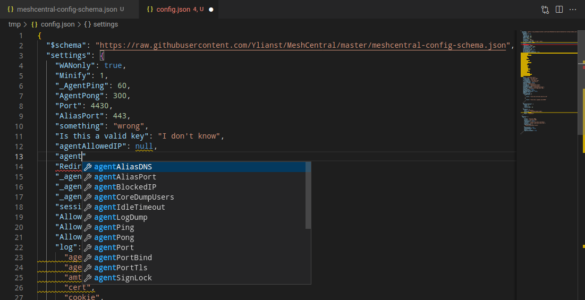

# Tips n' Tricks

## Colors in SSH

The SSH terminal does support color. The issue is going to be the terminal configuration of the shell. Try typing this:

```bash
ls -al --color /tmp
```

## Fancy config editing with VS Code

A common problem in the issues is an incorrect config.json. What makes a config incorrect? How can you verify your config is correct?

Easy! Use Visual Studio Code to edit your config.json and add the schema at the top.

If you haven't already, download VS code.
Download or copy the config.json to your computer.
Open config.json in code and add the schema as the top line. This schema is the raw JSON file in the MeshCentral repo.

```json
{
  "$schema": "https://raw.githubusercontent.com/Ylianst/MeshCentral/master/meshcentral-config-schema.json",
  "settings": {
    "your settings go here": "..."
  }
}
```

Now you have autocomplete, auto-format and validation for your config.json! If you start typing, Code will show the values that are valid for the location you are editing. Words with a red squiggle line are errors. Words with a orange squiggle line are warnings. Hover over both to see the error message and possible fixes. Code can even format your config.

While this is a huge step up, it's not perfect. If you notice, there are some invalid keys in the screenshot. This is perfectly valid JSON and MeshCentral will ignore them (maybe?). If you paste some configs into the wrong section, code will not tell you it's in the wrong section. Autocomplete will tell you what keys are valid and the type of the value (i.e. string, number, boolean).

Hopefully this will help verify your config is syntactically correct and prevent needless formatting errors, misspellings, etc.

