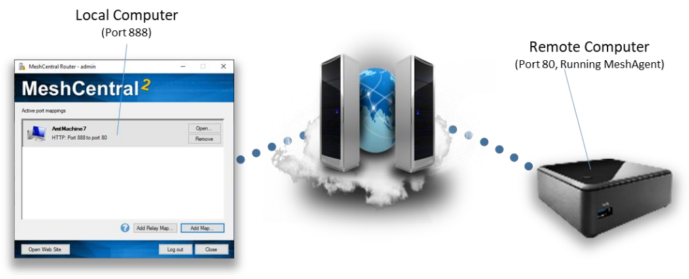

# MeshCentral Router


MeshCentral Router Guide [as .pdf](https://meshcentral.com/info/docs/MeshCentral2RouterUserGuide.pdf) [as .odt](https://github.com/Ylianst/MeshCentral/blob/master/docs/MeshCentral%20Router%20User%20Guide%20v0.0.2.odt?raw=true)

## Video Walkthru

<div class="video-wrapper">
  <iframe width="320" height="180" src="https://www.youtube.com/embed/BubeVRmbCRM" frameborder="0" allowfullscreen></iframe>
</div>

## Abstract

This document takes a look at MeshCentral Router, a Windows application that performs TCP and UDP port mapping from a local machine to any remote computer thru a MeshCentral servers. This document should allow the user to Internet relay traffic thru NAT routers and firewalls. 

## Introduction

MeshCentral is a remote management web site that connects users to remote computers over a local network or the internet. In addition to remote management features, MeshCentral is capable of relaying TCP and UDP traffic thru the server and thru mesh agents installed on remote computers. This feature can be useful to, for example, perform a remote desktop session using RDP or route custom traffic that would otherwise be difficult to route. 

## Downloading

MeshCentral router is a Windows application that comes built-into the MeshCentral server or can
be downloaded at: <https://meshcentral.com/info/tools/MeshCentralRouter.exe>

It’s probably best to use the MeshCentral router that comes with your version of the MeshCentral
server as the two will likely be most compatible. A given MeshCentral Router version may not
work with any MeshCentral server versions. On MeshCentral, you can download MeshCentral
Router with this link:


_The router link will only show up on Windows browsers._

## Login

MeshCentral router will need to login to your MeshCentral server just like any browser. You can
do this by entering the server name and account username and password. Depending on your
server and account situation, you may see some or all of the following screens.


If the second factor authentication is required, MeshCentral Router does not support hardware
keys (WebAuthn), but does support the YubiKey™ OTP.

## Creating Port Maps

Once logged in, you can start adding port maps using the “Add Map…” and “Add Relay Map…”
buttons on the bottom right. You can then create a map and open the associated application
using the “Open…” button and remote to port map using the “Remove” button.


There are two different types of ports mappings. A normal port map and a relay port map. A
normal port map will route packets to the selected destination computer that is running the mesh
agent as shown here.



A relay port map will route traffic thru the server and thru the remote agent to a target IP address
on the remote agent’s network as shown here.


Note that all traffic is encrypted using TLS from MeshCentral Router to the MeshCentral server
and from the server to the MeshAgent. The server and the agent do have access the traffic so it’s
recommended to use port mappings to tunnel data that is also encrypted for that end-to-end
encryption is assured.

## Custom Apps

_Starting v1.0.21_


## Command Line Arguments

MeshCentral router can be run with command line arguments to make it quicker and easier to
use. The arguments range from debugging to being able to quickly login and setting up port
maps.

```bash
-debug
```

Causes MeshCentral Router to generate a “debug.log” dump file that can be useful for
debugging.

```bash
-host:<hostname>
-user:<username>
-pass:<password>
-ignorecert
```

This set of command line arguments make logging into the MeshCentral server easier. Note that
specifying the password using a command line argument may not be secure as the command
shell can record the password in the command history. The “ignorecert” argument is not
recommended as it’s going to cause MeshCentral Router to ignore untrusted server certificates.
This should only be used for debugging.

```bash
-map:<protocol>:<localport>:<computername>:<app>:<remoteport>
```

The “map” argument will automatically create a network map once MeshCentral Router is logged
In. The protocol must be “TCP” or “UDP, the local port can be 0 for any. The computer name is
the server-side name of the computer, if many computers have the same one, one of them will be
selected. The app can be empty for a custom application, or can be “HTTP”, “HTTPS”, “RDP”,
“PuTTY” or “WinSCP”. For the UDP protocol, no apps are currently supported so it should be left
blank. For example you can use:

```bash
-map:TCP:0:"MyComputer":HTTP:80
-map:UDP:1235:"MyComputer"::1234
```

The first example will map a random local port to port 80 of “MyComputer” and is expected for
use with HTTP traffic. The second example maps local UDP port 1235 to port 1234 on
“MyComputer”. It’s best for the computer name to be in quotes.

In addition to port mapping, you can also setup relay maps where a remote computer is used as a
traffic relay like this:

```bash
-relaymap:<protocol>:<localport>:<computername>
 :<app>:<remoteip>:<remoteport>
```

This will relays a local port to thru the server and thru a remote agent to a target IP address and
port. For example:

```bash
-relaymap:TCP:555:"MyComputer":HTTP:192.168.1.1:80
```

This will relay local port 555 to a 192.168.1.1:80 for HTTP traffic. A typical use of this is to be able
to remotely configure a home router from anywhere on the Internet.

```bash
-all
```

The “all” switch will bind local ports to all network interfaces so that other computers on the
network can use the port maps provided by MeshCentral Router. By default, local ports will be
bound to the loopback interface so that only local application can use the port mappings.

```bash
-tray
```

The “tray” switch will place MeshCentral Router on the Windows system tray instead of the
normal application bar.

## MeshCentral Router with SAML or OAuth

You can't use the MeshCentral Router (MCR) login dialog box to login to a server that uses SAML or OAuth. However, you can still use MCR

1. Download MCR and run it. 
2. In the first dialog box, there will be an "Install..." button to setup MeshCentral router with the "mcrouter://" protocol in your system registry. 
3. Once done, close MCR.
4. Now log into the web UI of your MeshCentral server. Go in the bottom of the "My Devices" tab, hit the "Router" link and hit "Launch MeshCentral Router".
5. This will launch the router and connect directly to your server using a login cookie.

!!!note
    The only drawback is you will have to manually load mappings saved in an .mcrouter file. When not using SAML, you can click on the .mcrouter file to load the mappings and MCR at the same time. 

## Conclusion

MeshCentral Router is a free, open source tool for routing TCP and UDP traffic over the internet. It’s a powerful as it allows for any traffic to go thru NAT routers and firewalls while being encrypted using TLS. 

## License

MeshCentral, MeshCentral Router and this document are all opens source and licensed using
Apache 2.0, the full license can be found at <https://www.apache.org/licenses/LICENSE-2.0>.
