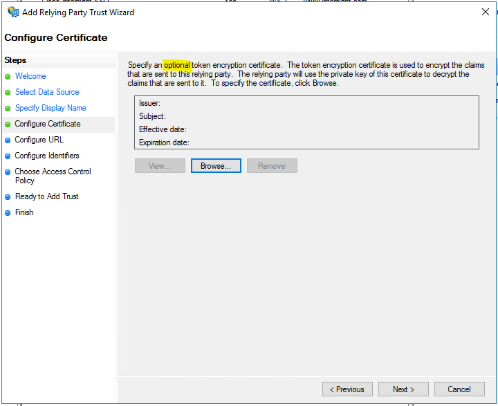
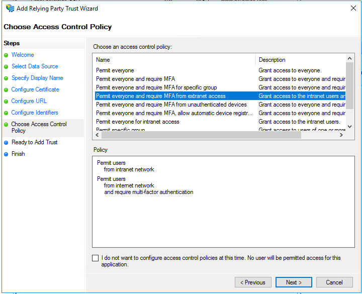
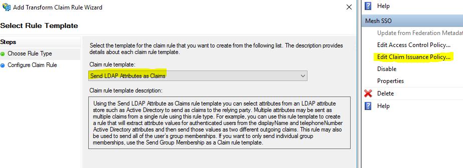

# ADFS SSO Guide

## Assumptions

The following guide was built under the assumptions that:

1. ADFS 4.0 running on Server 2016 using Active Directory
2. Main ADFS setup already completed / working. SSL certs installed and port forwarded as expected.

The guide was built to deal specifically with adding mesh as a Relying Party. I’m far from an ADFS expert and some configurations may not be needed. Most of this was built by reading the code and taking guesses as to the needed values.

## Guide

As with anything SSO, you need 2 pieces – the IDP setup (in this case ADFS) and the SP setup (in this case Mesh).

### Mesh Setup

Add the following to your mesh config file in the domains part:


`Callback URL`: Should be the FQDN for your Mesh Server, ending with /auth-saml-callback

`Entity ID`: This is how ADFS IDs which party the request goes to. You can set this to whatever you want, but you will need this value later on when working in ADFS.

`IDP URL`: This is the URL to ADFS. Ends with /adfs/ls unless you did something very weird in ADFS.

`Cert`: You will need to export the token signing cert from ADFS, then convert it to PEM format. This cert can be found in `ADFS -> Service -> Certificates`. You can use this openssl command to convert it from CRT to PEM format: 

```
openssl x509 -in mycert.crt -out mycert.pem -outform PEM
```

Save the config and restart the mesh server. 

### Windows Server Configuration

ADFS setup (in pictures):

Relying Party Trust -> New Relying Party Trust








Edit the new “Relying Party Trust” Properties:


Then it’s time to add Claims…





For the outgoing claim type, where it says firstname, lastname, and email, manually type it in as shown. All other fields should be selected from the dropdown.

Add another rule:


For all fields, select from the dropdowns
