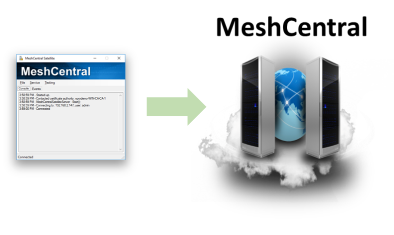
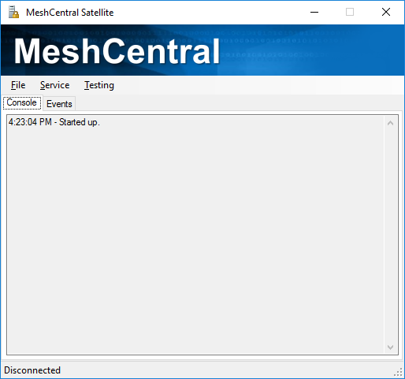
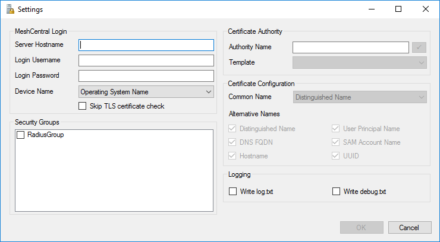
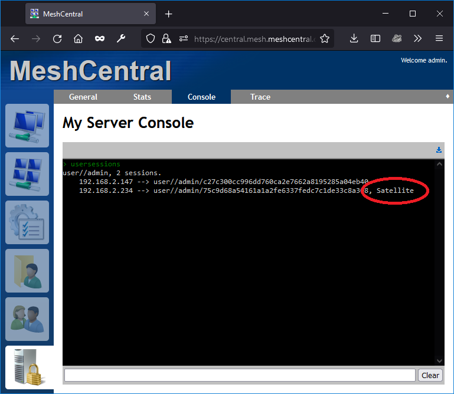
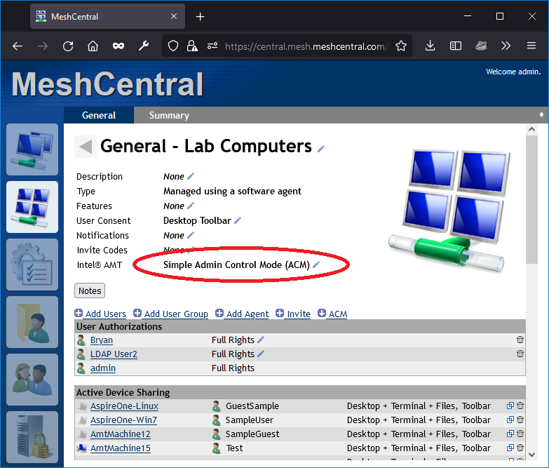
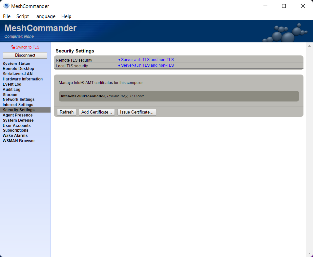
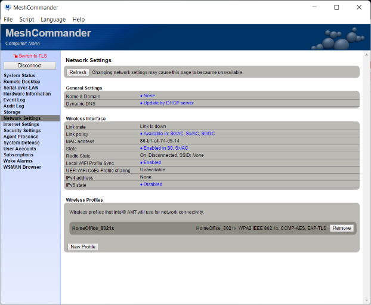

# MeshCentral Satellite

Coming Soon


## Abstract

MeshCentral Satellite is a Windows application that acts as a relay between a Windows Active Directory Domain and a MeshCentral Server. Once setup, the MeshCentral server can request that MeshCentral Satellite create an 802.1x computer profile for Intel AMT in the domain, or ask a certificate authority to issue or revoke a certificate.

## Introduction

A MeshCentral server can run in the cloud on a Linux server, but it may occasionally need to interact with a domain controller to perform some operations. MeshCentral Satellite is built to perform this function. MeshCentral Satellite is a Windows application built in C# and must run on a computer that is part of a domain and must run with sufficient rights to perform LDAP object addition and removal. If a certificate authority (CA) needs to be used, MeshCentral Satellite needs to have sufficient rights to ask the CA issue or revoke certificates.

MeshCentral Satellite should run on a computer that is always on. Once running, it will attempt to connect to the MeshCentral server and keep the connection open awaiting requests.



Currently, MeshCentral Satellite can perform four operations on behalf of the MeshCentral server:

- Create an Intel AMT domain computer.
- Remove an Intel AMT domain computer.
- Issue a certificate for Intel AMT.
- Revoke an Intel AMT certificate.

MeshCentral Satellite can run both as a standalone application which is practical to get started and it can be setup as a background Windows Service for long term operations. To get started, we will run it as a standalone application and start working on getting it setup.

## Installation and Configuration

Start by creating an empty folder on a computer that is part of the domain you need to interact with. For example, create a “c:\MeshCentralSatellite” then copy “MeshCentralSatellite.exe” into that folder. You can find that executable in the “node_modules/meshcentral/agents” folder of your server. If it’s not present, update your server to the latest version and look again.

Once started you should see something this:



Go in the file menu and select “Settings…”, this is where all of the MeshCentral Satellite setting are. It includes sections to connect to your MeshCentral server. Security groups you want device to join and Certificate settings.



First, enter your MeshCentral server hostname and username and password. MeshCentral Satellite can’t use two-factor authentication (2FA) so you need to create a user account in MeshCentral for Satellite or you can create a login token in the “My Account” section of MeshCentral with an unlimited expire time and cut & paste the username and password given into MeshCentral Satellite.


If your MeshCentral server is a test server that does not have a real TLS certificate, you can opt to ignore the TLS certificate on connection but this is not secure and so, not recommended.


The “Device Name” has two options, “Operating System Name” or “Node Identifier”. If you opt for “Operating System Name”, Intel AMT devices will show as, for example, “iME-ComputerName” in the list of domain computers. If “node identifier” is used, Intel AMT devices will look like “iME-xxxxxxxxxxx” where xxx is the start of the MeshCentral node identifier for this device.

Using the node identifier is more secure as it can’t easily be replicate by any other device. The operating system name would be impersonated by another device causing various security issues.

The security groups section will list any security groups created until the “Computers” section of the domain controller. Checking one or more of these security groups will automatically going new Intel AMT devices to these groups.


Lastly, we have the certificate authority and certificate settings. If a certificate authority needs to used, enter the name of the CA which is in the format “<computername>\<caname>” you can then hit the check box next to the name and select the certificate template to use.


For certificate configuration, you can leave it as-is with “SAM Account Name” and the common name and all alternative names selected.

Once done, you can hit ok. The settings will be saved in a file called “config.txt” in plain text in the same folder as “MeshCentralSatellite.exe”. Make sure not to grant access to this file to anyone not authorized to do so as it will have the MeshCentral login username and password.

Once done, select “Local Connect” the “Files” menu to connect to the MeshCentral server.


MeshCentral Satellite should be connected and ready to receive commands from the server.

## Checking the connection

In order to make sure the server correctly recognizes the MeshCentral Satellite connection, you can go to the server console and type “usersession”. The Satellite session should be marked.



Currently, you should only have a single satellite session per user. In the future, multiple sessions could be supported for redundancy.

## Configuring Intel® AMT 802.1x

To start using MeshCentral Satellite, you can configure Intel AMT with an 802.1x profile, this is done in the domain section of the config.json. Here is an example of an 802.1x EAP-TLS profile that will require that Intel AMT be issued a certificate:

```
      "AmtManager": {
        "802.1x": {
          "AuthenticationProtocol": "EAP-TLS",
          "SatelliteCredentials": "admin"
        },
        "WifiProfiles": [
          {
            "ssid": "Network-8021x",
            "authentication": "wpa2-802.1x",
            "encryption": "ccmp-aes"
          }
        ]
      }
```

In this following example, MSCHAPv2 is used and so, MeshCentral Satellite will need to generate a random password, save it in the active directory and send the password back to MeshCentral for Intel AMT configuration:

```
      "AmtManager": {
        "802.1x": {
          "AuthenticationProtocol": "PEAPv0/EAP-MSCHAPv2",
          "SatelliteCredentials": "admin"
        },
        "WifiProfiles": [
          {
            "ssid": "Network-8021x",
            "authentication": "wpa2-802.1x",
            "encryption": "ccmp-aes"
          }
        ]
      }
```

The second example does not require that a certificate authority be setup, the first example does. In both cases, the WIFI profile is set to “wpa2-802.1x” and so, the 802.1x profile will be setup for both the Intel AMT wired interface and the specified WIFI profile for wireless.

Note that is both examples, “SatelliteCredentials” indicates the account name that MeshCentral Satellite will be connected on. In our case, we used the “admin” account that matches the account configuration we used in sections 3 and 4.

Make these changes to the config.json and restart the MeshCentral server. Once done, any device groups that are set to configure Intel AMT will generate operations for MeshCentral Satellite.

## Computer and certificate operations

Once MeshCentral and MeshCentral Satellite are setup, make sure a device group has an active Intel AMT policy. In the example below, we have a device group with an Admin Control Mode (ACM) activation policy.



Computers connecting to this device group will automatically be setup with the new 802.1x and WIFI profile, but you can go in an agent console and type “amtconfig” to force the check of the Intel AMT configuration. In our case, it looks like this:


MeshCentral is adding a new WIFI profile, setting up 802.1x and issuing a new Intel AMT certificate from the domain CA. This was all done in a few seconds. On the MeshCentral Satellite side, we see this:


The MeshCentral Satellite received an 802.1x EAP-TLS request. It asked Intel AMT to generate a RSA key pair, to sign a certificate request, forwarded the request to the domain CA for signature and finally returned the final certificate to Intel AMT. The computer account in the domain was also updated and looks like this:


The new Intel AMT device was added to the domain along with the Intel AMT version and node identifier in the description. If “Node Identifier” was selected as the computer name in MeshCentral Satellite settings, the friendly name would be in the description and the node identifier would be used as the device name.

Finally, it’s worth taking a look at how Intel AMT was configured before and after this operation. Before setting up the 802.1x profile, Intel AMT looked like this:




Note that there is no 802.1x profiles or WIFI profiles. After the new configuration, MeshCommander shows Intel AMT looking like this:




There are now two new certificates in the “Security” tab. One if the root of the domain CA, the other is the certificate assigned to the Intel AMT device by the CA. You also see the WIFI 802.1x profile. In this example, the device did not have a wired network interface, but if it did, 802.1x would also be setup for the wired interface.

## Running as a Background Service

MeshCentral Satellite can be run as a background service. This is useful when running for lang periods on a domain server. You can use the “Service” menu in MeshCentral Satellite to install, start, stop and uninstall the Windows service. Make sure to come and run “MeshCentralSatellite.exe” from the correct location you want to install the Windows Service from.


Since MeshCentral Satellite need to have domain rights to add and remove computer objects from the active directory and to have certificate authority (CA) rights, you may want to install the service, go in the service manager and change the “Log On” account to one with the proper rights.


Once set, you can start the service from within MeshCentral Satellite. Once the service is started, there is a communication channel that will be create with the local application so you can still monitor what the service is doing.


The lines starting with “Service:“ are coming from the background service. At this point, you can close the local application and the service will keep running in the background.

## License

MeshCentral, MeshCentral Satellite and this document are both opens source and licensed using Apache 2.0, the full license can be found at <https://www.apache.org/licenses/LICENSE-2.0>.