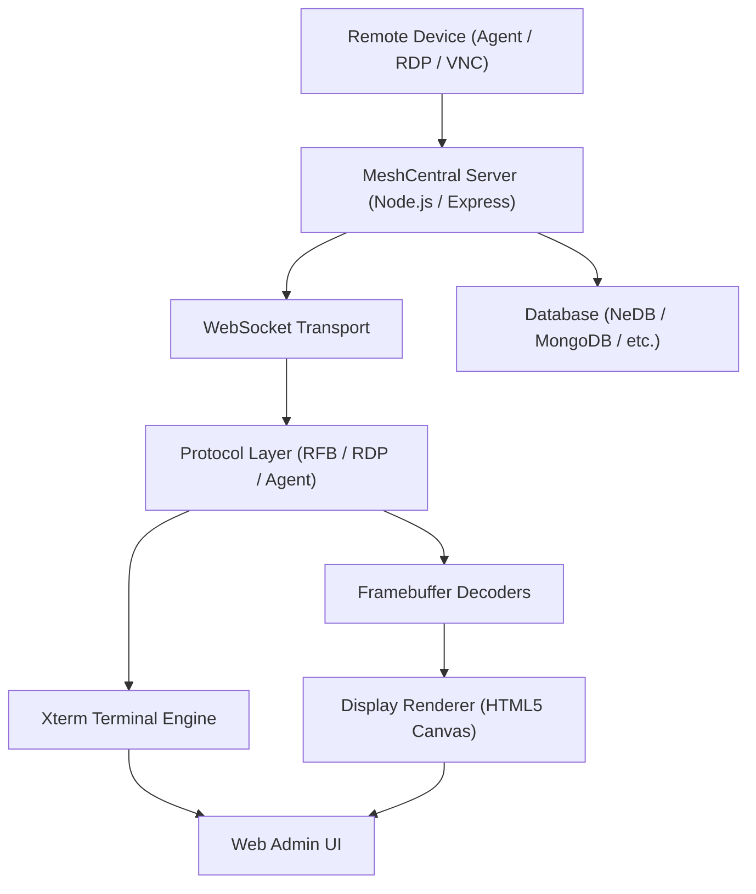

# Introduction to MeshCentral

**MeshCentral** is an open-source, web-based remote device management platform that enables IT administrators and MSPs to securely monitor, access, and control devices anywhere in the world — all from a browser.

As part of the [Flamingo](https://flamingo.run) / [OpenFrame](https://openframe.ai) ecosystem, this fork of MeshCentral is enhanced with multi-tenant support, OpenFrame plugin integration, and AI-driven MSP automation.

---

## What Is MeshCentral?

MeshCentral is a full-stack remote management server written in Node.js. It replaces expensive proprietary remote-access tools with a self-hosted, open-source solution that provides:

- **Remote Desktop** — VNC/RFB protocol, rendered directly in a browser via an embedded noVNC client
- **Remote Terminal** — Full ANSI/VT100-compatible shell sessions over WebSocket (via Xterm.js)
- **File Management** — Upload, download, and browse files on remote devices
- **Device Monitoring** — Real-time dashboards, charts, and connectivity tracking
- **Intel AMT Support** — Out-of-band management for Intel vPro devices (CIRA, WSMAN, ACM activation)
- **Session Recording** — Binary and text recording of terminal and desktop sessions
- **Multi-Factor Authentication** — TOTP (otplib), WebAuthn/FIDO2, hardware security keys
- **Plugin System** — Extensible plugin architecture, including the OpenFrame integration plugin

---

## Key Features at a Glance

| Feature | Description |
|---------|-------------|
| Remote Desktop (VNC/RFB) | Browser-based KVM using noVNC with hardware-accelerated canvas rendering |
| Remote Terminal | Xterm.js terminal with SIXEL/OSC 1337 inline image support |
| RDP Clipboard Sync | Virtual channel clipboard synchronization for RDP sessions |
| Secure Transport | TLS everywhere; Let's Encrypt / ACME certificate automation |
| Multi-Database Support | NeDB (default), MongoDB, MariaDB, MySQL, PostgreSQL, SQLite, AceBase |
| Intel AMT Management | CIRA, WSMAN, LMS, ACM activation, 802.1x/Wi-Fi profiles |
| Multi-Tenant | OpenFrame multi-tenant domain isolation |
| MeshAgent Protocol | WebSocket-based agent with binary protocol for device communication |
| WebAuthn/FIDO2 | Hardware security key authentication |
| Plugin Architecture | Extensible hook-based plugin system |

---

## Target Audience

MeshCentral is designed for:

- **Managed Service Providers (MSPs)** — Manage fleets of client devices with role-based access control
- **IT Administrators** — Self-host a secure remote access solution without per-seat licensing fees
- **Enterprise Teams** — Integrate with existing infrastructure via multi-server, multi-domain configuration
- **Developers** — Extend the platform via the plugin system or contribute to the open-source codebase

---

## Architecture Overview

MeshCentral follows a layered architecture from remote device to browser:

### Core Subsystems

| Subsystem | Role |
|-----------|------|
| **Web Server** | Express-based HTTPS server, session management, routing |
| **MeshAgent Handler** | WebSocket communication with installed agents |
| **MeshRelay** | Bidirectional WebSocket relay between clients and devices |
| **Database Layer** | Unified abstraction over 7 database backends |
| **Intel AMT Manager** | Out-of-band AMT device lifecycle management |
| **Crypto Layer** | AES, DES, RSA, DH, FIDO2/WebAuthn |
| **Let's Encrypt** | Automated TLS certificate provisioning via ACME |
| **Plugin Handler** | Hook-based plugin loader, including OpenFrame integration |

---

## OpenFrame Integration

This repository includes the **OpenFrame plugin** (`plugins/openframe.js`) that exposes:

- `GET /generate-msh` — Generates `.msh` agent configuration files for device enrollment
- `GET /api/deviceStatus` — Returns live device connectivity status with multi-tenant isolation

These endpoints power the OpenFrame AI platform's device management capabilities.

---

## Getting Started

To get up and running quickly:

1. Review the [Prerequisites](prerequisites.md) to check system requirements
2. Follow the [Quick Start Guide](quick-start.md) to install and launch MeshCentral
3. Complete your setup with the [First Steps Guide](first-steps.md)

---

## Community & Support

MeshCentral is part of the OpenMSP community. Questions, discussions, and support happen on Slack:

- **OpenMSP Community:** [https://www.openmsp.ai/](https://www.openmsp.ai/)
- **Join Slack:** [https://join.slack.com/t/openmsp/shared_invite/zt-36bl7mx0h-3~U2nFH6nqHqoTPXMaHEHA](https://join.slack.com/t/openmsp/shared_invite/zt-36bl7mx0h-3~U2nFH6nqHqoTPXMaHEHA)
- **Source Code:** [https://github.com/flamingo-stack/meshcentral](https://github.com/flamingo-stack/meshcentral)
- **Flamingo Platform:** [https://flamingo.run](https://flamingo.run)
