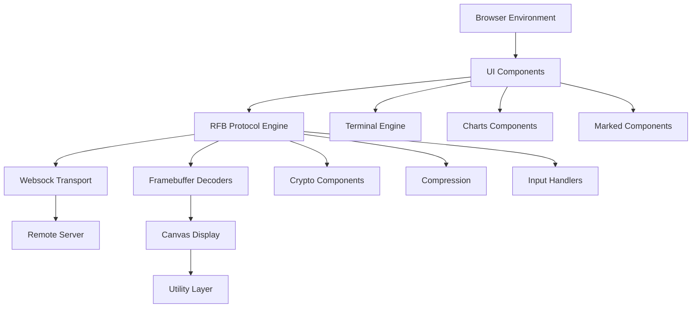
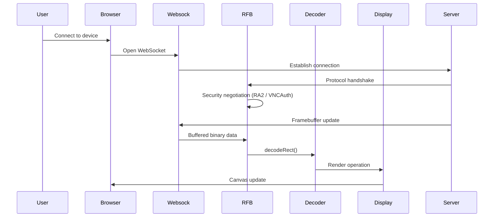
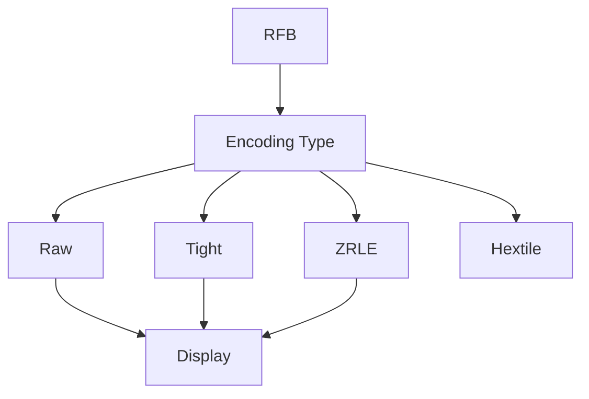
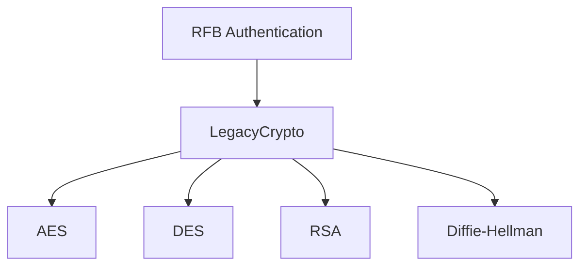
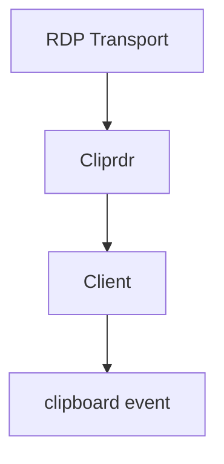

# MeshCentral Repository Overview

**Repository:** https://github.com/flamingo-stack/meshcentral  
**Owner:** flamingo-stack  
**Project:** MeshCentral

MeshCentral is a full-stack, browser-based remote management platform that provides secure remote desktop (RDP/VNC), terminal access, device monitoring, and web-based administration.  

This repository contains the **client-side web runtime**, including:

- noVNC-based remote desktop engine
- RDP clipboard virtual channel implementation
- WebSocket transport abstraction
- Cryptographic primitives for secure authentication
- Canvas-based rendering pipeline
- Interactive UI layer (Bootstrap + custom components)
- Terminal emulation (xterm.js)
- Markdown rendering and charting subsystems

The system is modular, layered, and event-driven — designed for real-time remote session performance, protocol compatibility, and UI extensibility.

---

# High-Level Architecture

MeshCentral’s browser client is composed of multiple interacting subsystems:

### Architectural Layers

| Layer | Responsibility |
|--------|----------------|
| UI Layer | Web UI, modals, dashboards, charts |
| Protocol Layer | RFB (VNC), RDP clipboard |
| Transport Layer | WebSocket / RTCDataChannel |
| Security Layer | AES, DES, RSA, DH, RA2 |
| Rendering Layer | Framebuffer decoding + Canvas rendering |
| Input Layer | Keyboard, gestures, mouse |
| Utility Layer | Cursor handling, event abstraction |

---

# End-to-End Remote Desktop Flow

The remote desktop pipeline (VNC/noVNC stack) operates as follows:

This deterministic pipeline ensures:

- Secure handshake
- Incremental parsing
- Streaming-safe decoding
- Efficient canvas rendering
- Cross-platform input handling

---

# Repository Structure and Core Modules

Below are the primary modules and their responsibilities.

---

## 1. UI Components  
**Path:** `public/js`  

Reusable, standardized UI abstractions for modals, cards, and upload components.

### Core Classes
- `ModernModal`
- `ModernCard`
- `IconUploadComponent`

### Responsibilities
- Encapsulated Bootstrap modal usage
- Status-aware card rendering
- Icon upload + preview workflows
- Reduction of template duplication

### Documentation
See: **Ui Components**

---

## 2. Localization  
**Path:** `public/novnc/app`

Client-side internationalization system.

### Core Class
- `Localizer`

### Responsibilities
- Browser language detection
- Fallback strategy (region → language → English)
- Dynamic dictionary loading
- DOM translation

### Documentation
See: **Localization**

---

## 3. Websock (Transport Layer)  
**Path:** `public/novnc/core`

Buffered abstraction over:

- `WebSocket`
- `RTCDataChannel`

### Core Class
- `Websock`

### Responsibilities
- Receive queue (`rQ`)
- Send queue (`sQ`)
- Incremental binary parsing
- Fragmentation safety
- Transport normalization

### Documentation
See: **Websock**

---

## 4. RFB and Display (VNC Client Engine)  
**Path:** `public/novnc/core`

Implements the complete RFB protocol.

### Core Classes
- `RFB`
- `Display`
- `RSAAESAuthenticationState`
- `RA2Cipher`

### Responsibilities
- Protocol negotiation
- Security handshake
- Framebuffer update orchestration
- Input transmission
- Clipboard integration
- Canvas rendering with damage tracking

### Documentation
See: **Rfb And Display**

---

## 5. Decoders  
**Path:** `public/novnc/core/decoders`

Implements RFB encoding algorithms:

- Raw
- CopyRect
- RRE
- Hextile
- Tight
- TightPNG
- JPEG
- ZRLE

### Documentation
See: **Decoders**

---

## 6. Compression  
**Path:** `public/novnc/core`

Zlib-compatible compression utilities.

### Core Classes
- `Deflator`
- `Inflate`

### Responsibilities
- Zlib stream management
- Deterministic decompression size validation
- Stream reuse for performance

### Documentation
See: **Compression**

---

## 7. Crypto Components  
**Path:** `public/novnc/core/crypto`

Implements cryptographic primitives required for authentication.

### Algorithms Supported
- AES-ECB
- AES-EAX (authenticated encryption)
- DES (legacy VNC)
- RSA (PKCS#1 v1.5)
- Diffie-Hellman
- MD5

### Documentation
See: **Crypto Components**

---

## 8. Input Handlers  
**Path:** `public/novnc/core/input`

### Components
- `GestureHandler`
- `Keyboard`

### Responsibilities
- Multi-touch gesture detection
- Cross-platform keyboard normalization
- X11 keysym translation
- Browser compatibility handling

### Documentation
See: **Input Handlers**

---

## 9. Utility Layer  
**Path:** `public/novnc/core/util`

### Components
- `Cursor`
- `EventTargetMixin`

### Responsibilities
- Custom cursor rendering
- Event-driven abstraction for decoupled modules

### Documentation
See: **Utility**

---

## 10. Xterm Components (Terminal Engine)  
**Path:** `public/scripts`

Embedded xterm.js-based terminal.

### Responsibilities
- ANSI escape parsing
- Scrollback buffer management
- DOM rendering
- Accessibility support
- Mouse and keyboard handling

### Documentation
See: **Xterm Components**

---

## 11. Charts Components  
**Path:** `public/scripts`

Full charting subsystem for dashboards.

### Capabilities
- Dataset processing
- Scale computation
- Animation lifecycle
- Plugin architecture
- Canvas rendering

### Documentation
See: **Charts Components**

---

## 12. Marked Components (Markdown Engine)  
**Path:** `public/scripts`

Markdown → HTML rendering engine.

### Core Pipeline
- Tokenizer
- Lexer
- Parser
- Renderer
- Hooks

### Documentation
See: **Marked Components**

---

## 13. Bootstrap Components  
**Path:** `public/scripts`

Bootstrap v5 runtime integration.

### Responsibilities
- Modal lifecycle
- Dropdowns
- Tooltips
- Accessibility enforcement
- Data API support

### Documentation
See: **Bootstrap Components**

---

## 14. Cliprdr (RDP Clipboard Channel)  
**Path:** `rdp/protocol/pdu`

Implements RDP Clipboard Virtual Channel.

### Core Classes
- `Cliprdr`
- `Client`

### Responsibilities
- Capability negotiation
- Format list exchange
- Clipboard data request/response
- UTF-16 encoding/decoding

### Documentation
See: **Cliprdr**

---

# System Characteristics

✅ Layered architecture  
✅ Incremental streaming-safe parsing  
✅ Authenticated encryption support (AES-EAX)  
✅ Legacy protocol compatibility (DES, VNCAuth)  
✅ Canvas-based rendering with damage tracking  
✅ Cross-platform input normalization  
✅ Event-driven modular design  
✅ Plugin-friendly chart and markdown systems  

---

# Summary

The `meshcentral` repository provides a complete browser-side remote management runtime.  

It integrates:

- Secure protocol negotiation  
- Buffered transport abstraction  
- Cryptographic authentication  
- Framebuffer decoding and rendering  
- Terminal emulation  
- Clipboard synchronization  
- Modular UI infrastructure  

Its architecture cleanly separates:

- Transport
- Protocol
- Security
- Rendering
- Input
- Presentation

This modular design enables maintainability, protocol flexibility, and high-performance remote session delivery within the MeshCentral platform.