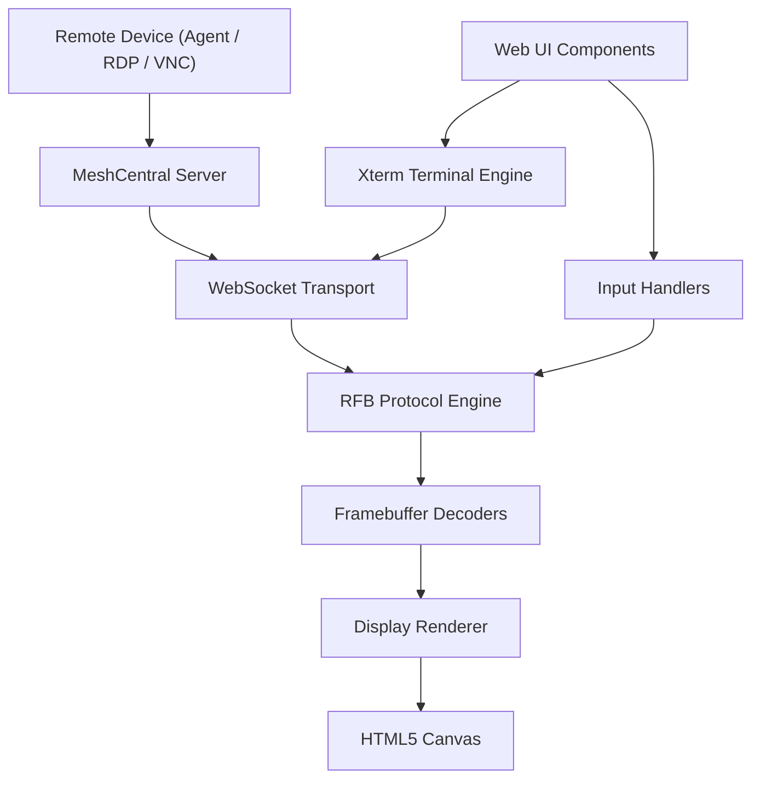
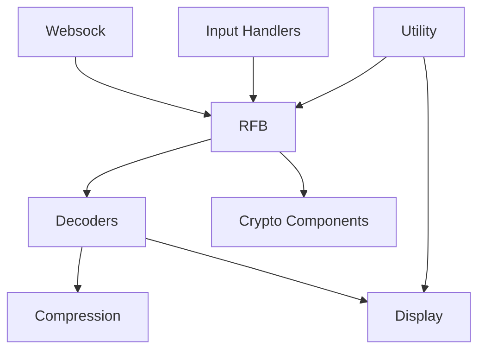
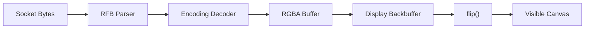
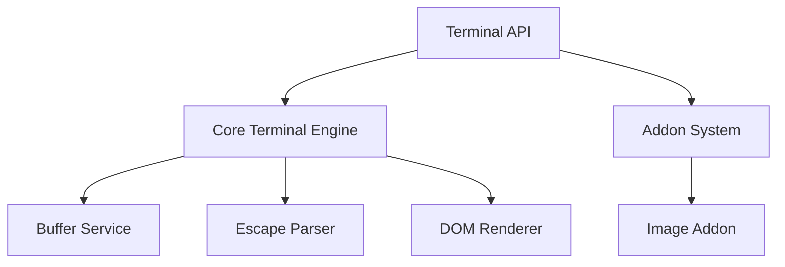
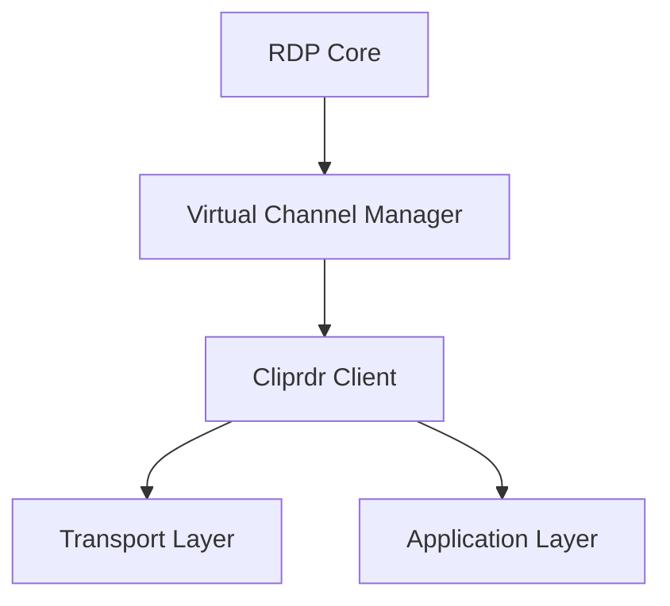
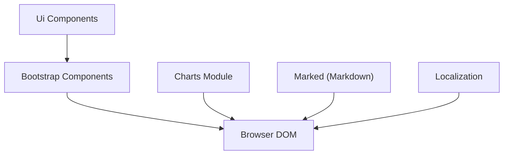
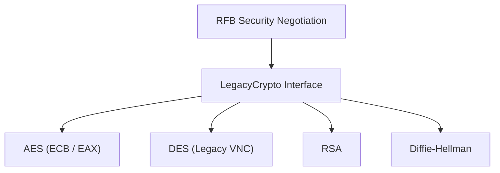

# MeshCentral – Repository Overview

**Repository:** https://github.com/flamingo-stack/meshcentral  
**Owner:** flamingo-stack  

MeshCentral is a full-stack remote device management platform that provides:

- ✅ Remote desktop (VNC / RDP via browser)
- ✅ Remote terminal access (Xterm-based shell)
- ✅ Secure device control and monitoring
- ✅ Clipboard synchronization
- ✅ File and session management
- ✅ Web-based administration UI
- ✅ Real-time dashboards and charts

The repository contains both:

- **Server-side components** (RDP protocol, virtual channels, clipboard handling)
- **Client-side web runtime** (noVNC stack, Xterm, UI, charts, markdown, Bootstrap integration)

It is architected as a layered system where:

- Transport and protocol layers handle secure communications.
- Decoders and rendering engines process framebuffer data.
- Input handlers normalize browser events.
- UI components provide administrative and user interfaces.
- Auxiliary modules (crypto, compression, localization, utilities) provide cross-cutting infrastructure.

---

# 1. End-to-End Architecture

The following diagram shows the complete high-level architecture of MeshCentral from remote device to browser UI:

---

# 2. Frontend Runtime Architecture (noVNC Stack)

The browser-based remote desktop implementation is built on a modular noVNC-derived stack:

### Responsibilities

| Module | Responsibility |
|--------|---------------|
| Websock | Buffered WebSocket abstraction |
| RFB | Protocol state machine and negotiation |
| Decoders | Framebuffer decoding (Raw, Tight, ZRLE, JPEG, etc.) |
| Compression | Zlib deflate/inflate (pako wrapper) |
| Crypto Components | AES, DES, RSA, DH, LegacyCrypto |
| Display | Canvas rendering engine |
| Input Handlers | Keyboard and gesture normalization |
| Utility | Cursor + event abstraction |

---

# 3. Remote Desktop Rendering Pipeline

Framebuffer updates flow through a deterministic transformation pipeline:

Supported encodings include:

- Raw
- CopyRect
- RRE
- Hextile
- Tight
- TightPNG
- JPEG
- ZRLE

---

# 4. Terminal Architecture (Xterm)

MeshCentral provides full browser-based terminal sessions built on Xterm:

### Terminal Capabilities

- ANSI / VT100 compatibility
- Keyboard + mouse input
- Accessibility support
- Inline image rendering (SIXEL, OSC 1337)
- Addon-based extensibility

---

# 5. RDP Clipboard Virtual Channel (Cliprdr)

The repository also includes RDP clipboard support via the `cliprdr` virtual channel:

This module handles:

- Clipboard capability negotiation
- Format list exchange
- Data request/response PDUs
- Event-driven clipboard synchronization

---

# 6. Web UI Architecture

MeshCentral's administrative interface is built using modular UI systems:

### UI Subsystems

- **Bootstrap Components** – Modal, Dropdown, Tooltip, Tabs, etc.
- **Ui Components** – ModernCard, ModernModal, IconUploadComponent
- **Charts** – Dashboard and analytics visualization
- **Marked** – Markdown rendering pipeline
- **Localization** – i18n DOM translation engine

---

# 7. Security and Cryptography Layer

The Crypto Components module ensures protocol-level security:

Security capabilities include:

- DES challenge-response (classic VNC)
- AES-EAX authenticated encryption
- RSA-PKCS1 v1.5 encryption
- Diffie-Hellman key exchange
- Web Crypto API integration where available

---

# 8. Core Modules Documentation Reference

Below are the primary documented modules within this repository:

## Remote Desktop Stack
- Websock
- RFB And Display
- Decoders
- Compression
- Crypto Components
- Input Handlers
- Utility

## Terminal Stack
- Xterm
- Xterm Addon Image

## UI Layer
- Bootstrap Components
- Ui Components
- Charts
- Marked
- Localization

## RDP Protocol
- Cliprdr (Clipboard Virtual Channel)

Each module is independently documented and follows a layered, modular architecture to maintain:

- Clear separation of concerns
- Extensibility
- Backward compatibility (legacy protocols)
- Browser portability
- Performance optimization

---

# 9. Architectural Characteristics

MeshCentral is designed around:

- ✅ Layered architecture (transport → protocol → decoding → rendering → UI)
- ✅ Protocol abstraction (RFB, RDP virtual channels)
- ✅ Incremental decoding and rendering
- ✅ Typed binary parsing
- ✅ Event-driven state machines
- ✅ Modular extension points (charts, terminal addons, markdown extensions)
- ✅ Memory and buffer safety guards
- ✅ Cross-browser compatibility

---

# Summary

The **flamingo-stack/meshcentral** repository provides a complete remote device management platform combining:

- A robust browser-based VNC/RFB client
- An advanced browser terminal engine
- RDP clipboard synchronization
- Modern UI infrastructure
- Charting and analytics capabilities
- Secure cryptographic negotiation
- Modular extensibility

It cleanly separates:

- Transport
- Protocol
- Rendering
- Input handling
- UI presentation
- Extension systems

This structured architecture allows MeshCentral to scale from simple remote sessions to full enterprise-grade remote management environments.