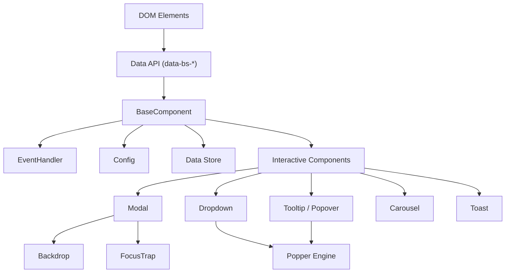
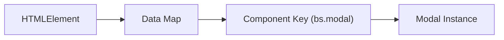
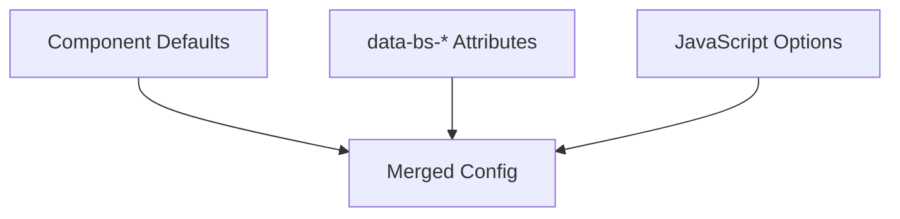
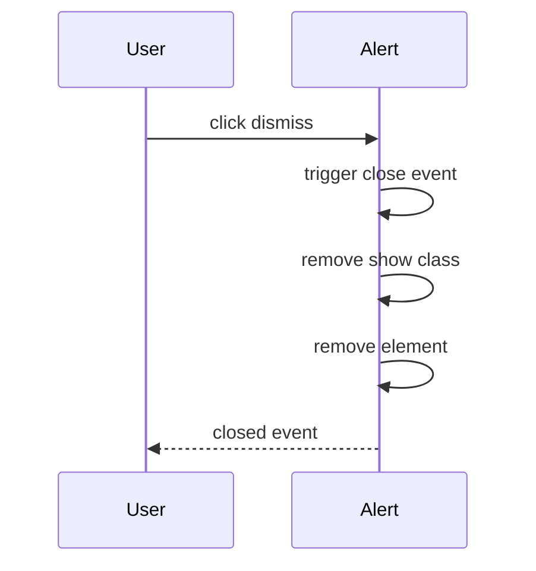
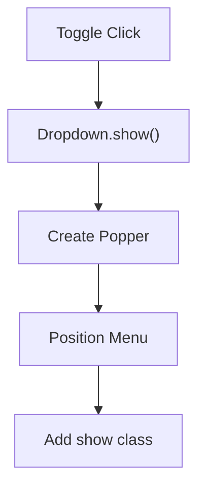
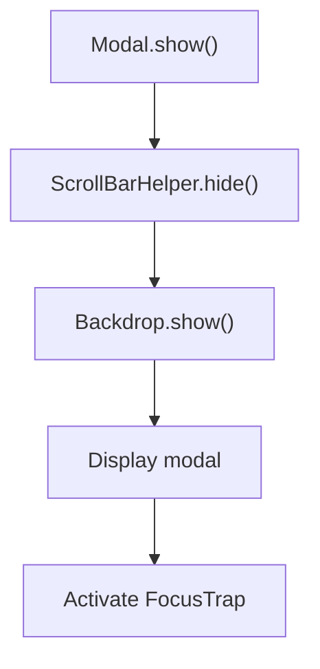
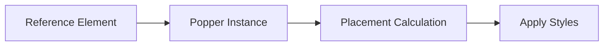
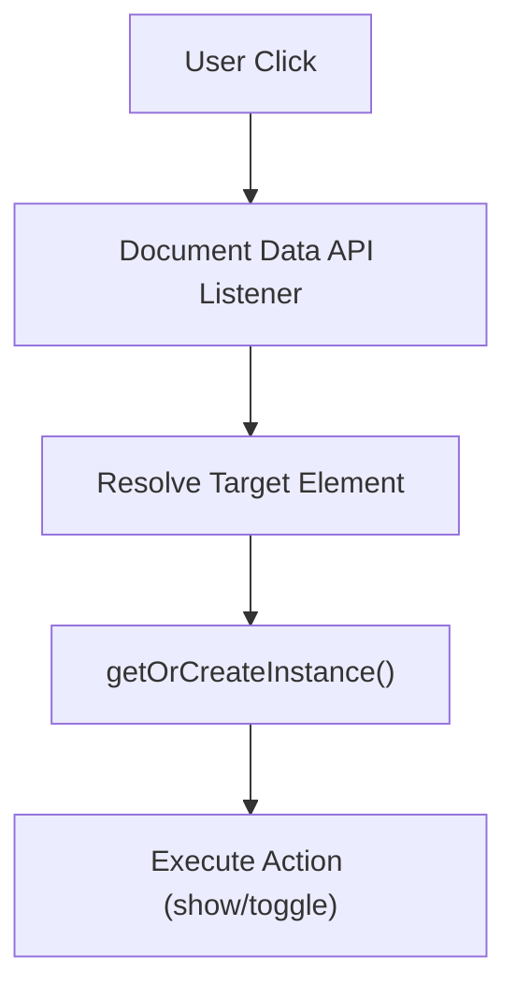

# Bootstrap Components

The **Bootstrap Components** module integrates Bootstrap v5.3.3 into the MeshCentral web interface. It provides a complete set of interactive UI primitives—modals, dropdowns, tooltips, tabs, toasts, carousels, and more—built on top of a shared component infrastructure.

This module is responsible for:

- Standardized UI behavior across the application
- Declarative configuration using `data-bs-*` attributes
- Event-driven component lifecycle management
- Accessibility (ARIA attributes, keyboard support, focus management)
- Overlay and positioning logic powered by Popper

At runtime, the module exposes a `bootstrap` namespace containing the primary components.

---

## 1. Architectural Overview

Bootstrap Components follow a layered architecture:

- **Core Infrastructure Layer** – Data storage, configuration, event handling, selector engine
- **Utility Layer** – Backdrop, FocusTrap, ScrollBarHelper, Swipe, TemplateFactory
- **Interactive Component Layer** – Alert, Modal, Dropdown, Tooltip, etc.
- **Positioning Engine** – Popper integration for dynamic placement



---

## 2. Core Infrastructure

### 2.1 BaseComponent

`BaseComponent` is the foundation for all interactive components.

Responsibilities:

- Element resolution
- Configuration merging and type checking
- Instance registration via `Data`
- Lifecycle management (`dispose`, `_queueCallback`)
- Static helpers: `getInstance`, `getOrCreateInstance`

All components (Modal, Dropdown, Tooltip, etc.) extend this class.

---

### 2.2 Data Store

The internal `Data` object maintains a `Map<Element, Map<Key, Instance>>`.

Key characteristics:

- One component instance per element per component type
- Automatic cleanup when disposed
- Prevents accidental duplicate bindings



---

### 2.3 EventHandler

Centralized event abstraction layer providing:

- Namespaced events (`click.bs.modal`)
- Delegated events
- One-time listeners
- Synthetic triggering

This ensures consistent lifecycle hooks:

- `show`
- `shown`
- `hide`
- `hidden`

---

### 2.4 Config System

The `Config` base class:

- Merges defaults + data attributes + user options
- Performs runtime type validation
- Supports per-component `Default` and `DefaultType`

Configuration precedence:



---

## 3. Utility Components

These classes support higher-level interactive behavior.

### Backdrop
- Creates and manages overlay elements
- Supports animation and click callbacks
- Used by Modal and Offcanvas

### FocusTrap
- Keeps keyboard focus within a container
- Handles Tab and Shift+Tab cycling
- Used by Modal and Offcanvas

### ScrollBarHelper
- Detects scrollbar width
- Adjusts body padding during overlays
- Prevents layout shift when modals open

### Swipe
- Touch and pointer gesture detection
- Used by Carousel

### TemplateFactory
- Generates sanitized HTML from templates
- Used by Tooltip and Popover
- Enforces allow-list sanitization

---

## 4. Interactive Components

### 4.1 Alert
Dismissible notification blocks.

Lifecycle:



---

### 4.2 Button

- Toggles `.active`
- Synchronizes `aria-pressed`
- Driven via `data-bs-toggle="button"`

---

### 4.3 Carousel

Image/content slider with:

- Auto cycling
- Keyboard navigation
- Swipe support
- Indicator synchronization

Depends on:

- Swipe utility
- Transition helpers

---

### 4.4 Collapse

Expands or hides content regions.

Features:

- Accordion support via `parent`
- Horizontal or vertical collapsing
- ARIA synchronization

---

### 4.5 Dropdown

Context menu system.

Key behaviors:

- Uses Popper for dynamic placement
- Auto-close modes (`true`, `inside`, `outside`, `false`)
- Keyboard navigation



---

### 4.6 Modal

Overlay dialog system.

Core responsibilities:

- Backdrop management
- Scroll locking
- Focus trapping
- Keyboard handling (Escape)
- Transition handling



---

### 4.7 Offcanvas

Slide-in panel component.

- Shares Backdrop + FocusTrap logic
- Optional body scroll preservation
- Responsive hide on resize

---

### 4.8 Tooltip

Small contextual overlay.

- Uses Popper for placement
- Supports hover, focus, click, manual triggers
- Sanitized HTML templates

---

### 4.9 Popover

Extends Tooltip.

Adds:

- Title section
- Content body
- Click-based default trigger

---

### 4.10 ScrollSpy

Observes scroll position and activates navigation links.

- Uses `IntersectionObserver`
- Maintains active state
- Optional smooth scrolling

---

### 4.11 Tab

Manages tabbed interfaces.

- ARIA role management
- Keyboard navigation
- Dropdown integration

---

### 4.12 Toast

Transient notification messages.

- Optional auto-hide
- Mouse and keyboard interaction detection
- Animation support

---

## 5. Popper Integration

Dropdowns, Tooltips, and Popovers rely on Popper for dynamic positioning.



Popper modifiers used:

- `offset`
- `flip`
- `preventOverflow`
- `arrow`
- `applyStyles`

---

## 6. Data API Pattern

Most components support declarative initialization via HTML attributes.

Example pattern:

```text
<button data-bs-toggle="modal" data-bs-target="#myModal">
```

Runtime flow:



---

## 7. Lifecycle Model

All interactive components share a predictable lifecycle:

1. **Instantiation** – via constructor or `getOrCreateInstance`
2. **Configuration Merge** – defaults + data attributes + options
3. **Event Registration**
4. **Action Execution** (`show`, `hide`, `toggle`)
5. **Transition Handling**
6. **Event Emission** (`shown`, `hidden`)
7. **Disposal** (cleanup + Data removal)

This consistency simplifies debugging and extension across the UI layer.

---

## 8. Role Within the System

Bootstrap Components provide the interactive presentation layer for the MeshCentral UI:

- Forms and alerts → Alert, Toast
- Navigation → Tab, ScrollSpy, Dropdown
- Dialog workflows → Modal, Offcanvas
- Contextual help → Tooltip, Popover
- Media/visual rotation → Carousel

They operate entirely in the browser and do not directly interact with backend modules. Instead, they enhance DOM-driven views rendered elsewhere in the application.

---

# Summary

The **Bootstrap Components** module is a comprehensive UI behavior framework built on:

- A shared `BaseComponent` abstraction
- A centralized event and data infrastructure
- Utility helpers for overlays and accessibility
- Popper-powered positioning
- A consistent lifecycle and configuration system

Together, these elements provide a stable, extensible, and accessible foundation for all interactive interface elements within the MeshCentral web client.