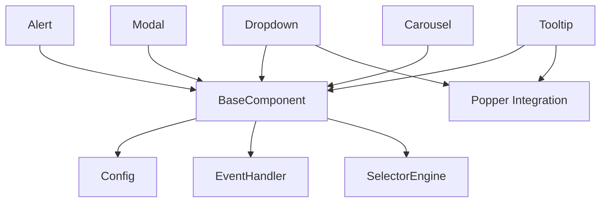
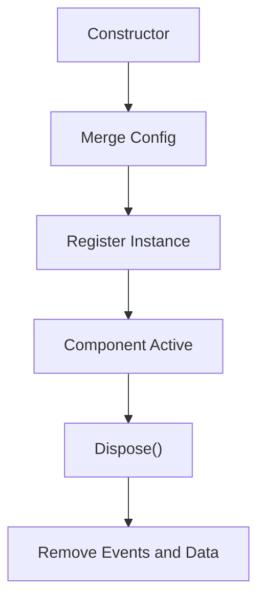
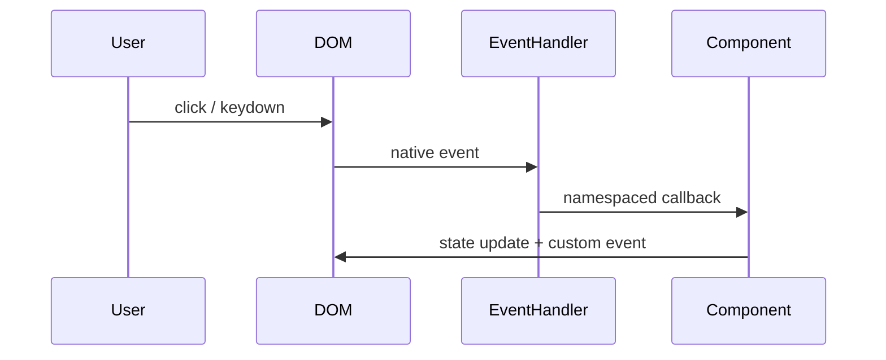
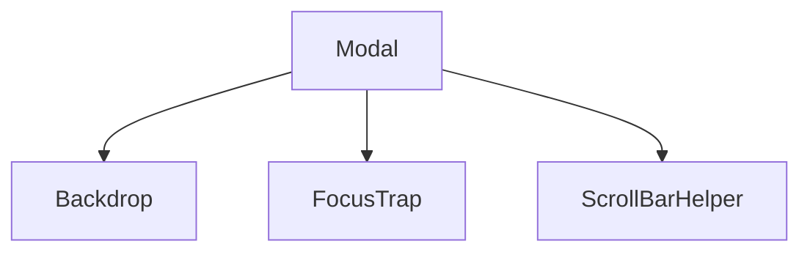
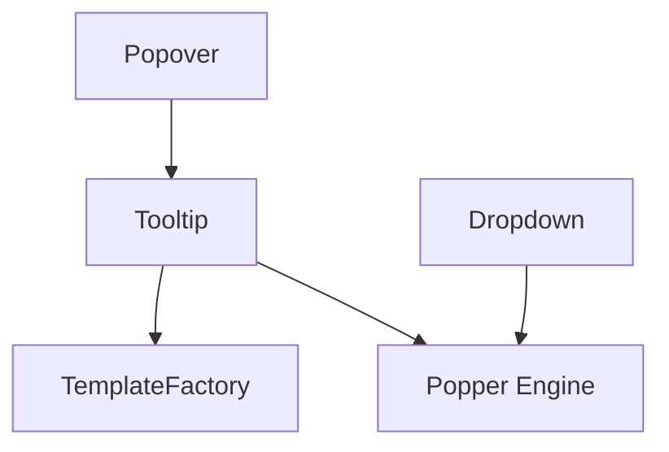

# Bootstrap Components

The **Bootstrap Components** module integrates the Bootstrap v5.3.3 JavaScript runtime into the MeshCentral web interface. It provides interactive UI behaviors such as modals, dropdowns, tooltips, tabs, carousels, toasts, and more.

This module acts as the foundational UI behavior layer for higher-level interface modules such as [UI Components](../ui-components/ui-components.md) and [Charts Components](../charts-components/charts-components.md). While those modules define structure and visuals, Bootstrap Components enables dynamic interaction, accessibility, state management, and DOM orchestration.

---

## 1. Purpose and Responsibilities

Bootstrap Components is responsible for:

- Managing component lifecycle (init, show, hide, dispose)
- Coordinating DOM manipulation and transitions
- Handling events via a unified event system
- Integrating Popper.js for dynamic positioning
- Enforcing accessibility attributes (ARIA roles, focus management)
- Providing a Data API via `data-bs-*` attributes

The module is distributed as a UMD bundle and exposes the following primary components:

- Alert
- Button
- Carousel
- Collapse
- Dropdown
- Modal
- Offcanvas
- Popover
- ScrollSpy
- Tab
- Toast
- Tooltip

Supporting infrastructure includes:

- BaseComponent
- Config
- EventHandler
- SelectorEngine
- Backdrop
- FocusTrap
- ScrollBarHelper
- TemplateFactory
- Swipe
- Sanitizer

---

## 2. High-Level Architecture

### Architectural Layers

1. **Infrastructure Layer**  
   - `Config` (configuration merging and validation)  
   - `EventHandler` (namespaced event management)  
   - `SelectorEngine` (DOM querying utilities)  
   - `Manipulator` (data attribute abstraction)

2. **Core Abstraction Layer**  
   - `BaseComponent` (common lifecycle + instance registry)

3. **Behavioral Components Layer**  
   - Alert, Modal, Dropdown, Tooltip, etc.

4. **Positioning Layer**  
   - Popper.js integration for Tooltip, Popover, Dropdown

---

## 3. BaseComponent and Instance Management

All interactive components extend `BaseComponent`, which provides:

- Instance registration via internal `Data` map
- Static `getInstance()` and `getOrCreateInstance()`
- Unified `dispose()` lifecycle
- Event namespace isolation
- Config merging and type validation

### Instance Lifecycle

This ensures:

- One instance per element
- Deterministic cleanup
- No memory leaks from dangling listeners

---

## 4. Event System Architecture

Bootstrap Components uses a custom event abstraction layer.

### Event Flow

### Features

- Namespaced events (e.g., `click.bs.modal`)
- Delegated event handling
- One-off listeners
- Custom event triggering with metadata
- jQuery bridge compatibility

---

## 5. Data API and Declarative Initialization

Components can be initialized via:

- JavaScript constructors
- `data-bs-*` attributes
- Automatic DOMContentLoaded scanning

Example behavior:

- `data-bs-toggle="modal"`
- `data-bs-dismiss="alert"`

This allows declarative behavior wiring without explicit JavaScript calls.

---

## 6. Component Categories

### 6.1 Structural Overlays

- **Modal**
- **Offcanvas**
- **Backdrop**
- **FocusTrap**
- **ScrollBarHelper**

These components manage:

- Body scroll locking
- Focus containment
- Backdrop rendering
- Transition handling

---

### 6.2 Navigation and Layout

- Tab
- ScrollSpy
- Collapse
- Carousel

These components coordinate UI sections and active states.

---

### 6.3 Interactive Controls

- Button
- Dropdown
- Alert
- Toast

These components handle toggles, dismissals, and ephemeral UI state.

---

### 6.4 Positioned Floating UI

- Tooltip
- Popover
- Dropdown (dynamic mode)

These rely on Popper.js for intelligent positioning.

---

## 7. TemplateFactory and Sanitization

Dynamic components (Tooltip, Popover) use `TemplateFactory` to:

- Generate DOM from templates
- Inject content
- Apply sanitization rules
- Enforce allow-list security

Sanitization prevents:

- Script injection
- Malicious attribute usage
- Unsafe URL schemes

Security is enforced using:

- `DefaultAllowlist`
- URL pattern validation
- Optional custom sanitize function

---

## 8. Accessibility Model

Bootstrap Components systematically enforce:

- `aria-expanded`
- `aria-selected`
- `aria-modal`
- `role="dialog"`
- `aria-describedby`

Keyboard support includes:

- ESC to dismiss overlays
- Arrow navigation for tabs and dropdowns
- Focus trapping in modals/offcanvas
- Home/End navigation in tab lists

---

## 9. Transition and Animation Handling

All transitions rely on:

- CSS transition duration detection
- Emulated transition fallback
- `_queueCallback()` abstraction

This guarantees:

- Reliable event sequencing
- No race conditions on animation completion
- Consistent behavior across browsers

---

## 10. Integration Within the System

Bootstrap Components serves as the behavioral foundation for:

- [UI Components](../ui-components/ui-components.md)
- [Charts Components](../charts-components/charts-components.md)

It does not render business logic or domain data directly. Instead, it:

- Provides reusable UI behavior primitives
- Handles lifecycle and accessibility
- Coordinates DOM state

Higher-level modules compose these primitives to build:

- Admin dashboards
- Device management panels
- Interactive configuration dialogs
- Notification systems

---

## 11. Summary

The **Bootstrap Components** module is a structured, event-driven UI behavior engine built on top of Bootstrap v5.3.3.

Key characteristics:

- Strong lifecycle management via BaseComponent
- Unified event abstraction
- Secure templating and sanitization
- Accessibility-first design
- Declarative Data API support
- Popper-powered positioning

It forms the core interactive layer of the MeshCentral web UI and enables consistent, accessible, and modular front-end behavior across the application.
