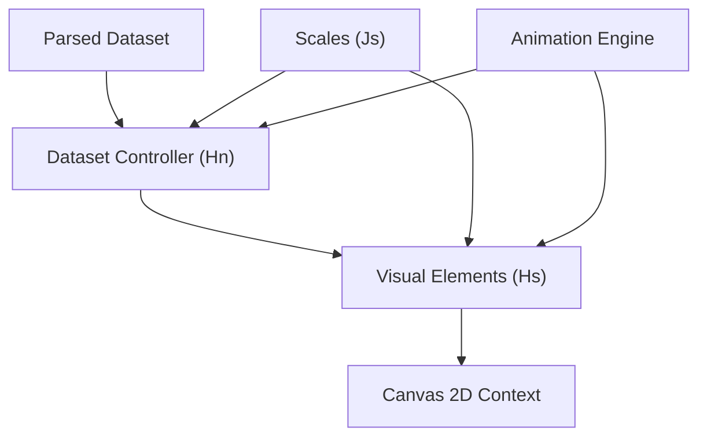
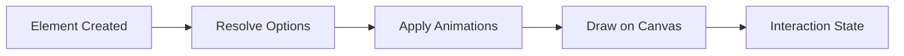
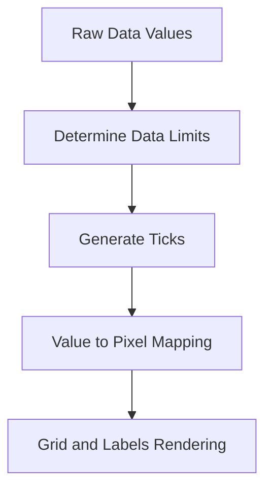
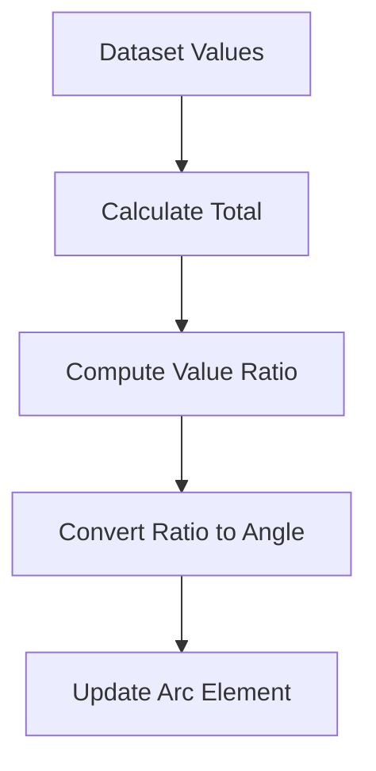
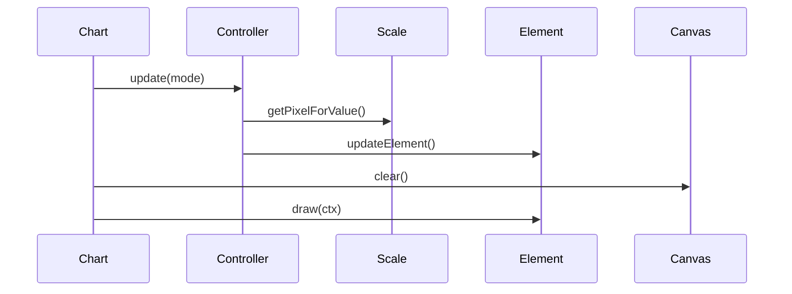
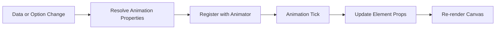
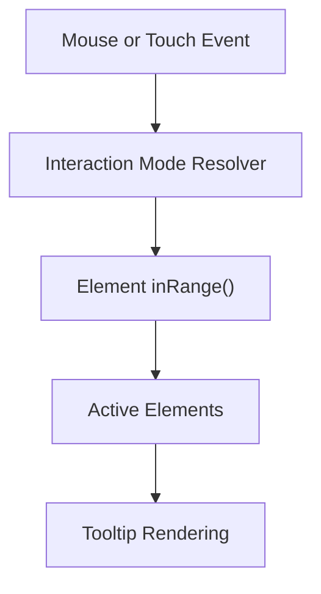
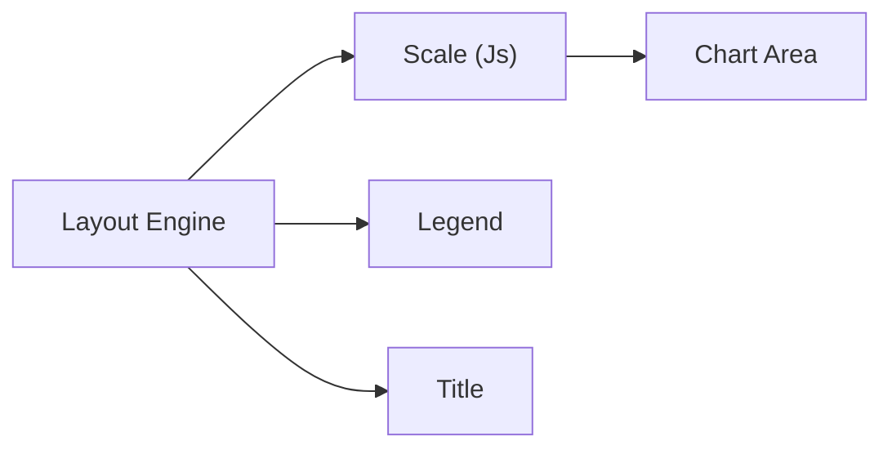

# Chart Core Rendering

Chart Core Rendering is the low-level drawing and layout engine for the MeshCentral charting stack. Built on top of Chart.js v4, it is responsible for:

- Translating parsed datasets into visual primitives
- Managing canvas drawing context and rendering lifecycle
- Handling animations, transitions, and easing
- Coordinating scales, elements, and plugins during render

This module contains the core rendering classes:

- `Hn` – Doughnut and Pie controller logic
- `Hs` – Base visual element abstraction
- `Js` – Base scale implementation

Together, these components form the backbone of chart visualization in the UI.

---

## 1. Architectural Overview

Chart Core Rendering sits between processed chart data and the HTML5 Canvas API. It does not fetch or transform data itself; instead, it consumes parsed datasets and scale outputs, then renders them using elements and controllers.

### Key Responsibilities

| Component | Responsibility |
|------------|----------------|
| Hs (Element) | Defines drawable primitives and hit detection |
| Js (Scale) | Maps data domain → pixel coordinates |
| Hn (Controller) | Coordinates dataset parsing and element updates |
| Animator | Drives transitions and easing |

---

## 2. Core Classes

### 2.1 Hs – Base Element

`Hs` is the abstract base class for all drawable components (bars, arcs, points, lines, etc.).

#### Responsibilities

- Store resolved style options
- Expose animated properties via `getProps()`
- Provide hit-testing helpers
- Define a `draw(ctx)` contract

#### Element Lifecycle

All concrete elements inherit from `Hs` and implement their own `draw()` logic while leveraging shared animation and styling behavior.

---

### 2.2 Js – Base Scale

`Js` is the foundational scale abstraction. All chart axes (linear, category, radial, time) extend this class.

#### Responsibilities

- Determine data limits (`min`, `max`)
- Generate ticks
- Convert values to pixels
- Convert pixels back to values
- Render grid lines, labels, and titles

#### Scale Data Flow

Scales are injected into controllers and elements so they can position visual primitives accurately.

---

### 2.3 Hn – Doughnut Controller

`Hn` implements the dataset controller for doughnut and pie charts.

#### Responsibilities

- Parse numeric slice values
- Compute total and proportions
- Convert values to angles
- Position arcs using inner and outer radius
- Manage ring weights and stacking

#### Angle Computation Flow

Each data item is mapped to an arc element whose:

- `startAngle`
- `endAngle`
- `innerRadius`
- `outerRadius`

are animated and rendered via the element layer.

---

## 3. Rendering Lifecycle

Rendering follows a structured pipeline managed by the Chart instance.

### Steps

1. **Update phase**
   - Scales compute bounds and ticks
   - Controllers update element models
   - Animations are scheduled

2. **Layout phase**
   - Chart area and scale boxes are calculated

3. **Draw phase**
   - Background
   - Scales
   - Datasets
   - Overlays (tooltip, legend, etc.)

---

## 4. Animation Engine Integration

Chart Core Rendering integrates tightly with the internal animator.

### Animation Components

- `Cs` – Individual animation descriptor
- `Os` – Animation resolver per dataset/element
- `xt` – Global animator loop

#### Animation Flow

Properties such as position, radius, border width, and opacity interpolate smoothly using easing functions.

---

## 5. Interaction and Hit Detection

Elements provide geometric hit detection via methods such as:

- `inRange(x, y)`
- `getCenterPoint()`
- `tooltipPosition()`

Controllers aggregate interaction results and pass them to higher-level systems (like Tooltip).

---

## 6. Layout System Integration

Chart Core Rendering works with the layout engine to allocate space for:

- Scales
- Legend
- Title and Subtitle
- Chart area

Each scale (`Js`) acts as a layout box with measurable dimensions.

This ensures consistent alignment and spacing across chart types.

---

## 7. Plugin Hooks and Extensibility

The rendering pipeline is plugin-driven. Core hooks include:

- `beforeUpdate`
- `afterUpdate`
- `beforeDraw`
- `afterDraw`
- `beforeDatasetDraw`
- `afterDatasetDraw`

Plugins such as:

- Colors
- Decimation
- Filler
- Legend
- Tooltip

integrate directly into the rendering lifecycle.

---

## 8. Performance Considerations

Chart Core Rendering includes optimizations such as:

- Data decimation for large datasets
- Segment-based path drawing
- Cached text measurement
- Lazy animation resolution
- Device pixel ratio scaling

These features ensure responsive rendering even with large time-series datasets.

---

## 9. How It Fits Into the Charts Stack

Within the MeshCentral charting system, Chart Core Rendering provides:

- The foundational drawing engine
- Scale-to-pixel transformation
- Dataset-to-element mapping
- Animation orchestration

Higher-level modules:

- Chart data handling
- Chart utilities
- Chart interactions
- Chart extensions

build on top of this module to provide complete, interactive visualizations.

---

## 10. Summary

Chart Core Rendering is the execution layer of the charting system. It:

- Converts numeric values into visual geometry
- Manages scale transformations
- Coordinates animations and interactions
- Executes canvas drawing operations

By separating parsing, utilities, interaction logic, and rendering, the system maintains a clean architecture where Chart Core Rendering focuses purely on visual output and lifecycle orchestration.