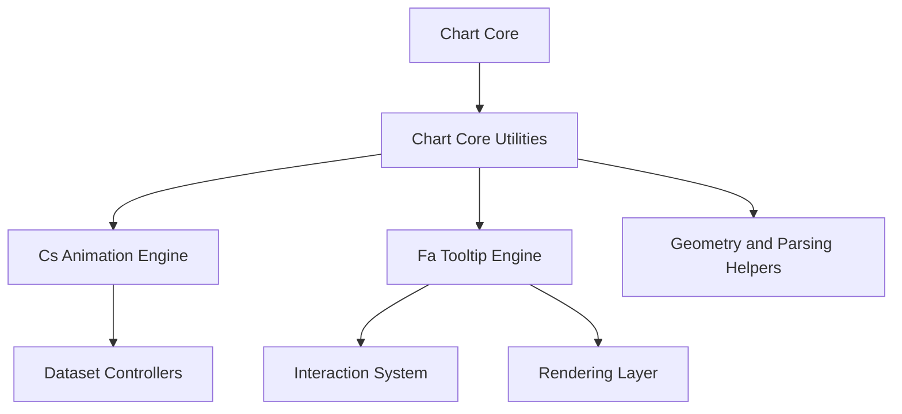
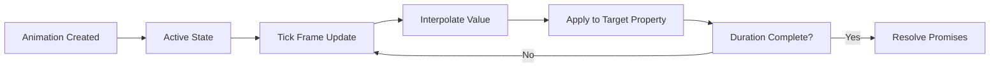
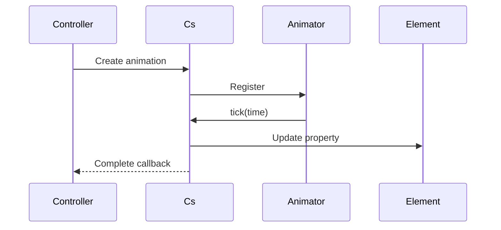
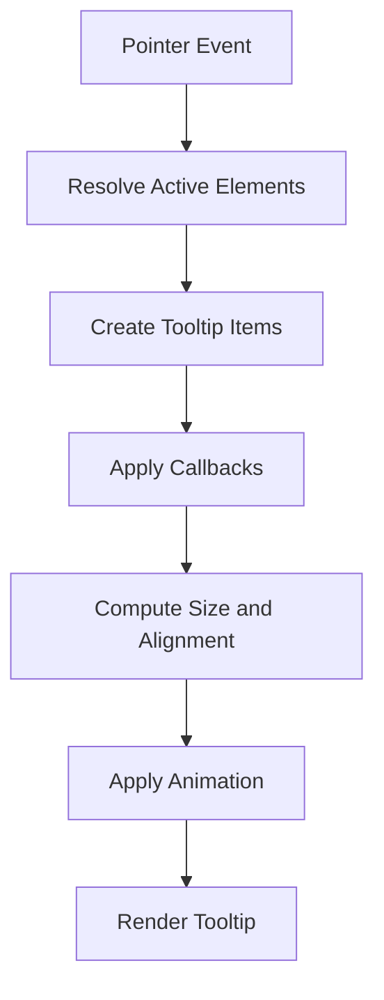
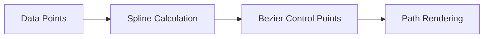
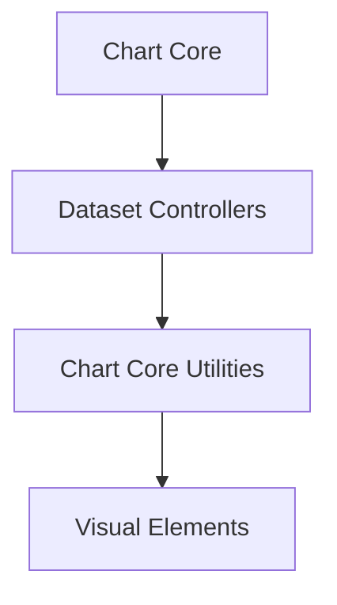
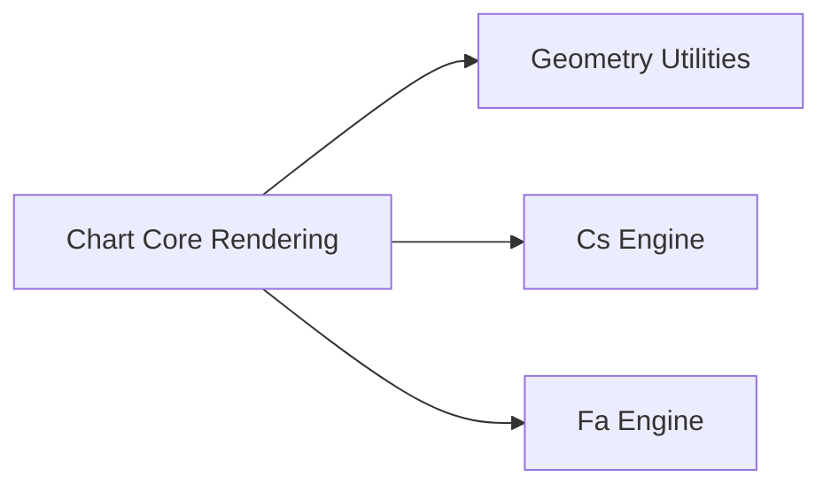
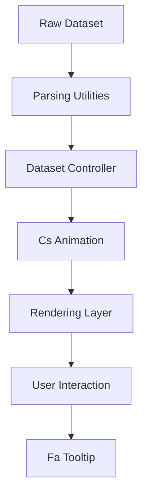

# Chart Core Utilities

Chart Core Utilities provides the foundational utility layer for the Chart Core module. Built on top of the embedded Chart.js v4 engine, this module exposes low-level helpers and animation primitives that power dataset updates, rendering transitions, geometric calculations, and option resolution across the charting system.

At its heart, this module centers around two critical core components:

- `Cs` – The animation primitive for property-level tweening
- `Fa` – The Tooltip engine responsible for contextual data rendering and interaction feedback

These utilities are consumed by higher-level modules such as:

- [Chart Core](../chart-core.md)
- [Chart Core Rendering](../chart-core-rendering/chart-core-rendering.md)

---

## 1. Purpose and Responsibilities

Chart Core Utilities is responsible for:

- Property-level animation orchestration
- Tooltip lifecycle and rendering
- Dataset element interpolation helpers
- Value parsing and formatting support
- Geometry and alignment helpers
- Shared resolver and configuration mechanisms

It acts as the glue between:

- Controllers (dataset logic)
- Elements (visual primitives)
- Rendering pipelines
- Interaction handlers

---

## 2. High-Level Architecture

### Key Observations

- `Cs` provides reusable animation primitives used by controllers.
- `Fa` manages dynamic tooltip state, layout, and drawing.
- Utility helpers are reused by scales, elements, and controllers.

---

## 3. Cs – Animation Engine

`Cs` represents a single animated property transition. It interpolates between values using configurable easing and duration logic.

### Responsibilities

- Store animation metadata (duration, easing, delay)
- Track start and target values
- Apply interpolated values on each frame
- Notify completion callbacks

### Animation Lifecycle

### Core Characteristics

- Supports numeric and color interpolation
- Uses easing functions (linear, cubic, elastic, bounce, etc.)
- Integrates with a shared animator queue
- Can be cancelled or looped

### Integration Flow

This mechanism enables smooth transitions for:

- Dataset value changes
- Tooltip appearance
- Element resizing
- Axis re-scaling

---

## 4. Fa – Tooltip Engine

`Fa` is the Tooltip implementation used across all chart types.

### Responsibilities

- Determine active elements
- Generate formatted label content
- Compute tooltip dimensions
- Position tooltip (average, nearest, custom)
- Animate visibility and movement
- Render tooltip background, caret, and text

### Tooltip Rendering Flow

### Tooltip Positioning

Supported positioners include:

- `average`
- `nearest`

These determine the caret origin and alignment logic.

### Content Structure

Tooltip content is segmented into:

- Title
- Before Body
- Body
- After Body
- Footer

Each section is driven by callback hooks, allowing full customization.

---

## 5. Utility Helper Categories

Beyond animation and tooltip systems, this module includes reusable utilities grouped into functional domains.

### 5.1 Geometry Utilities

- Angle normalization
- Distance calculations
- Pixel alignment
- Spline curve interpolation
- Bezier control point generation

### 5.2 Parsing and Value Resolution

- Primitive parsing
- Object-based dataset parsing
- Radial scale parsing
- Value fallback resolution

These utilities allow datasets to accept:

- Primitive arrays
- Tuple arrays
- Object-based data
- Custom parsing keys

### 5.3 Formatting and Locale Support

- Numeric formatting
- Logarithmic formatting
- Scientific notation
- Tooltip value formatting

---

## 6. Relationship to Chart Core

Chart Core Utilities is consumed by [Chart Core](../chart-core.md) to:

- Animate dataset updates
- Format scale tick labels
- Resolve configuration scopes
- Support plugin extensibility

---

## 7. Relationship to Chart Core Rendering

Rendering logic in [Chart Core Rendering](../chart-core-rendering/chart-core-rendering.md) relies on utilities for:

- Path interpolation
- Pixel alignment
- Control point generation
- Animated transitions

---

## 8. Data Flow Summary

---

## 9. Extension and Customization Points

Chart Core Utilities enables extension via:

- Custom easing functions
- Tooltip callback overrides
- Custom positioners
- Plugin lifecycle hooks
- Custom dataset animation properties

These capabilities allow the broader system to adapt without modifying core rendering or controller logic.

---

## 10. Key Takeaways

- `Cs` provides fine-grained, property-based animation control.
- `Fa` delivers a fully customizable, animated tooltip system.
- Shared geometry and parsing utilities reduce duplication across chart types.
- The module acts as a reusable backbone for both controller logic and rendering.

Chart Core Utilities is therefore a foundational layer that ensures consistency, performance, and extensibility across the entire charting subsystem.