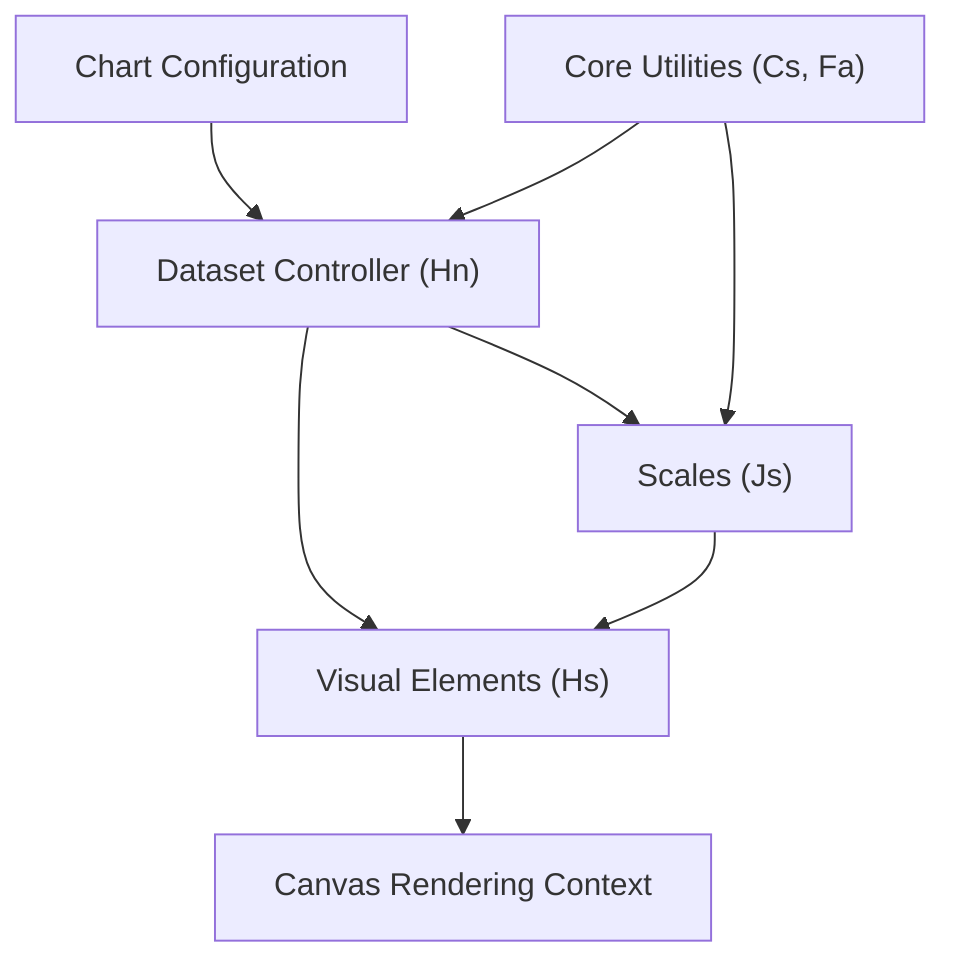
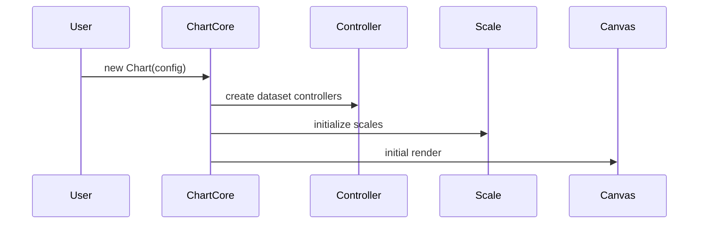
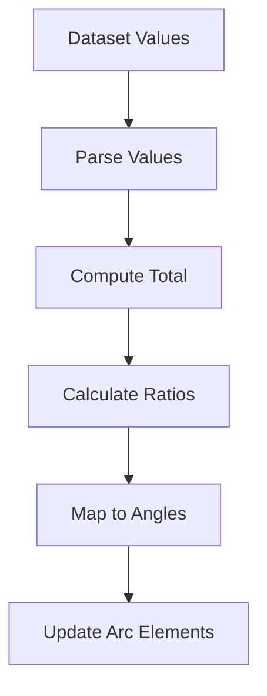
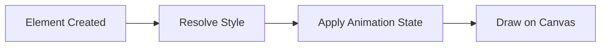
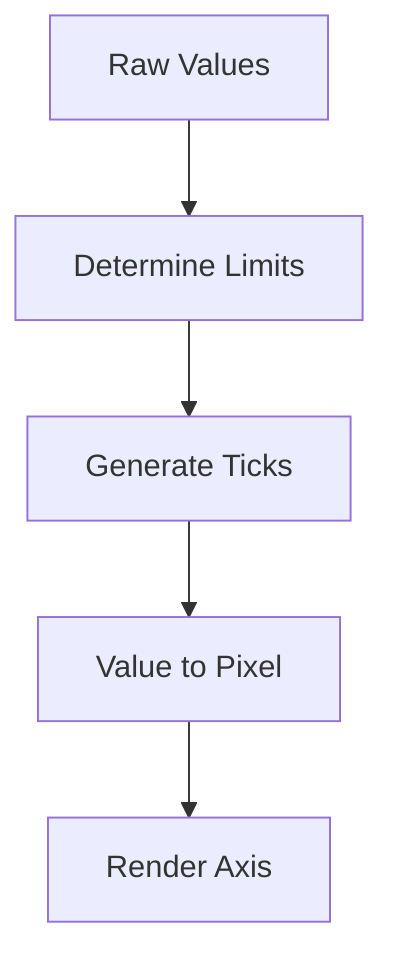
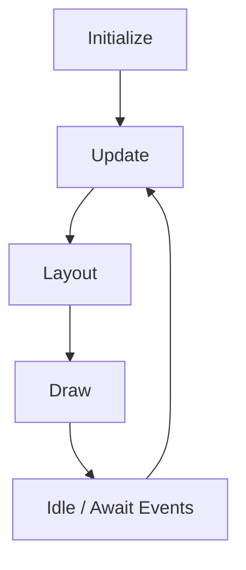
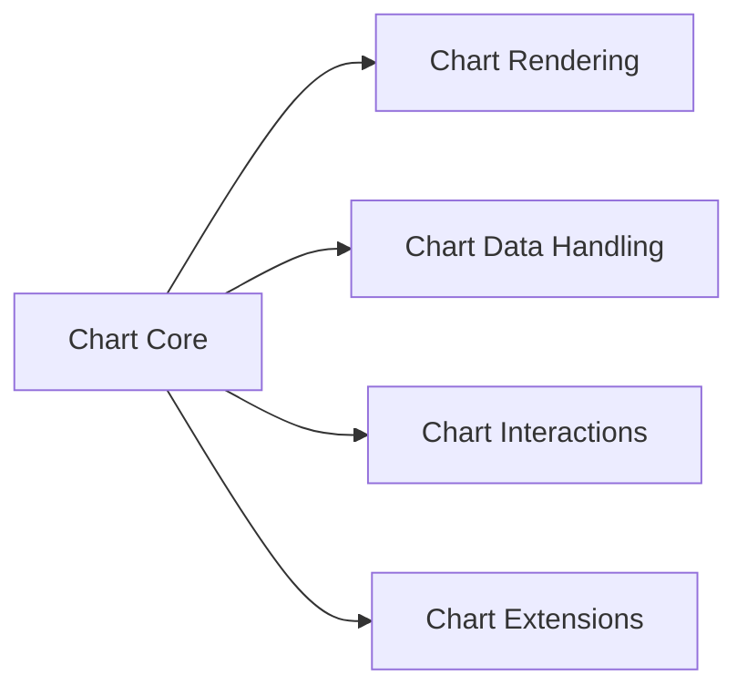

# Chart Core

The **Chart Core** module is the foundational layer of the MeshCentral charting stack. It provides the minimal primitives required to construct, configure, and orchestrate charts before higher-level utilities, rendering enhancements, data handling, and interaction modules are applied.

Chart Core is responsible for:

- Defining the base chart configuration model
- Managing dataset controllers and chart types
- Coordinating chart lifecycle (initialization, update, destroy)
- Providing shared animation and state management primitives
- Acting as the integration point between data, rendering, and interaction layers

It lives under:

```text
public/scripts (charts-components → chart-core)
```

---

## 1. Repository Structure

### Module Path

```text
public/scripts
└── charts (compiled charting bundle)
    └── chart-core
```

### Core Components

The Chart Core module contains the following primary components:

| Component | Responsibility |
|------------|----------------|
| `meshcentral.public.scripts.charts.Cs` | Core animation descriptor / configuration primitive |
| `meshcentral.public.scripts.charts.Fa` | Core registry / shared infrastructure |
| `meshcentral.public.scripts.charts.Hn` | Dataset controller (Doughnut/Pie logic) |
| `meshcentral.public.scripts.charts.Hs` | Base visual element abstraction |
| `meshcentral.public.scripts.charts.Js` | Base scale abstraction |

Subgroup organization:

```text
chart-core
├── chart-core-utilities
│   ├── Cs
│   └── Fa
└── chart-core-rendering
    ├── Hn
    ├── Hs
    └── Js
```

For rendering-specific details, see:  
**Chart Core Rendering** documentation.

---

## 2. Architectural Overview

Chart Core acts as the orchestration hub between:

- Data (datasets and configuration)
- Scales (value-to-pixel mapping)
- Elements (visual primitives)
- Rendering engine (Canvas)
- Interaction system
- Animation system



### Layer Responsibilities

| Layer | Owned by Chart Core? | Purpose |
|--------|----------------------|----------|
| Configuration Model | ✅ | Defines chart type, datasets, options |
| Dataset Controllers | ✅ | Translates data into drawable elements |
| Base Elements | ✅ | Defines drawable primitives |
| Base Scales | ✅ | Handles value-domain transformations |
| Animation Primitives | ✅ | Manages transitions |
| Interaction Handlers | ❌ | Implemented in Chart Interactions |
| Data Processing | ❌ | Implemented in Chart Data Handling |

---

## 3. Core Responsibilities

### 3.1 Chart Initialization

Chart Core initializes the chart instance:

1. Resolve configuration
2. Register required controllers and scales
3. Create dataset controllers
4. Build scale instances
5. Perform first layout and render



---

### 3.2 Dataset Control (Hn)

`Hn` implements dataset-specific behavior (e.g., Doughnut/Pie charts).

It:

- Parses raw numeric values
- Computes totals and proportions
- Converts values into angular geometry
- Updates arc elements



Other chart types follow the same architectural pattern through their respective controllers.

---

### 3.3 Base Element Abstraction (Hs)

`Hs` defines the contract for drawable objects.

Each element:

- Stores animated properties
- Resolves style options
- Implements `draw(ctx)`
- Provides hit detection methods



All concrete chart primitives (bars, arcs, lines, points) extend this abstraction.

---

### 3.4 Base Scale Abstraction (Js)

`Js` defines how values are transformed into pixel coordinates.

Responsibilities:

- Determine min/max limits
- Generate ticks
- Convert value → pixel
- Render grid and labels



Scales operate independently of chart type and are injected into controllers.

---

### 3.5 Core Utilities (Cs, Fa)

The utility subset provides:

- Animation descriptors
- Registry infrastructure
- Shared configuration resolution
- Global chart state coordination

These utilities allow:

- Plugin registration
- Scale and controller discovery
- Centralized animation scheduling

---

## 4. Chart Lifecycle

Chart Core enforces a structured lifecycle:



### Phases

1. **Update**
   - Controllers parse data
   - Scales recompute bounds
   - Elements receive new models

2. **Layout**
   - Allocate space for axes and chart area

3. **Draw**
   - Clear canvas
   - Draw scales
   - Draw datasets
   - Draw overlays

4. **Destroy**
   - Remove listeners
   - Cleanup animation loops

---

## 5. Integration with Other Chart Modules

Chart Core is intentionally minimal and is extended by other modules:

| Module | Role |
|----------|------|
| Chart Utilities | Math helpers, configuration resolution |
| Chart Rendering | Advanced rendering primitives |
| Chart Data Handling | Data parsing and transformation |
| Chart Interactions | Hover, click, tooltip resolution |
| Chart Extensions | Plugins and feature extensions |



Chart Core provides the contract and lifecycle guarantees that all higher-level modules rely on.

---

## 6. Design Principles

The module follows several architectural principles:

- **Separation of concerns** — controllers, scales, and elements are independent.
- **Extensibility-first** — registry-driven architecture.
- **Animation-centric state model** — properties are resolved dynamically.
- **Canvas abstraction boundary** — drawing logic isolated in elements.

---

## 7. Summary

The **Chart Core** module is the structural backbone of the MeshCentral charting system.

It:

- Defines chart configuration and lifecycle
- Manages dataset controllers
- Provides base element abstractions
- Implements scale foundations
- Coordinates animation primitives
- Serves as the integration layer for rendering and interaction

All higher-level chart capabilities build upon this module, making Chart Core the essential engine that transforms structured chart configuration into interactive, animated visual output.