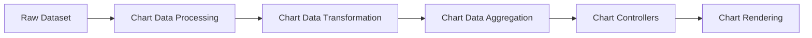
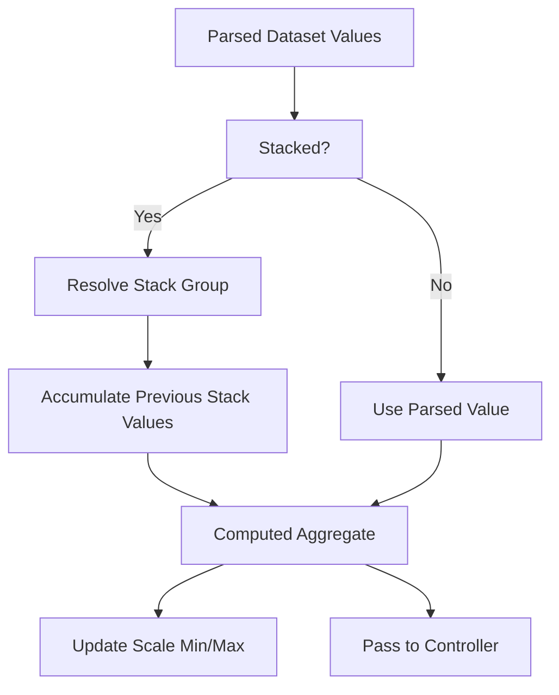
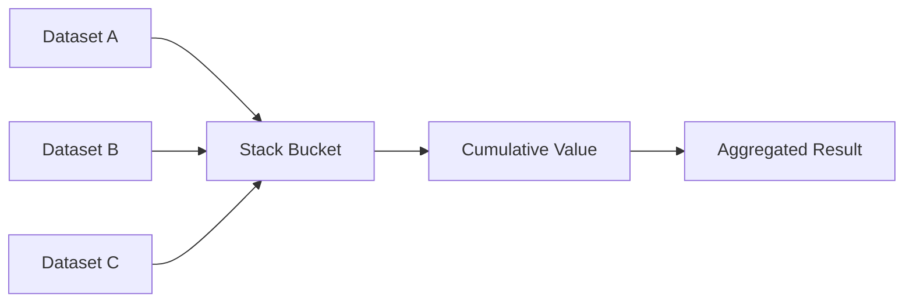
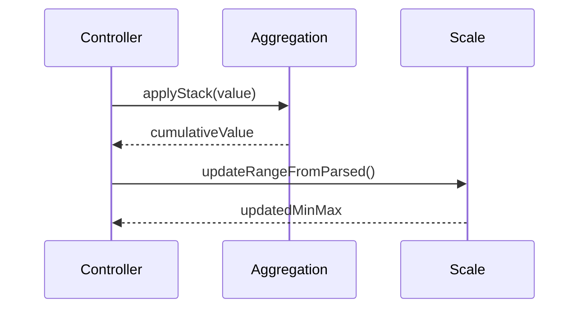
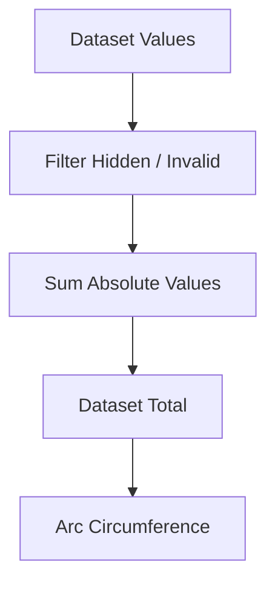
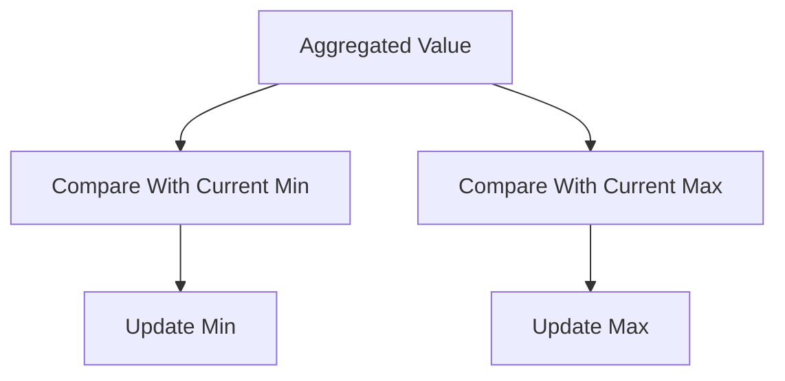
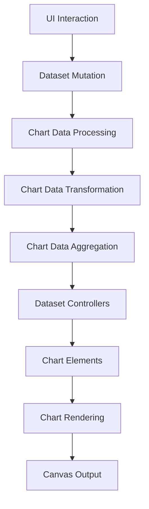

# Chart Data Aggregation

The **Chart Data Aggregation** module is responsible for computing summarized values from processed and transformed datasets before they are rendered in visual chart elements. It plays a critical role in converting raw or normalized data into aggregate metrics such as totals, stacked values, cumulative ranges, and statistical summaries used by chart controllers.

This module is part of the broader **Chart Data Handling** layer and works closely with:

- [Chart Data Processing](../chart-data-processing/chart-data-processing.md)
- [Chart Data Transformation](../chart-data-transformation/chart-data-transformation.md)

Its core implementation is provided by:

- `meshcentral.public.scripts.charts.la`

---

## 1. Purpose and Responsibilities

Chart Data Aggregation is responsible for:

- Computing dataset totals (e.g., pie/doughnut totals)
- Handling stacked values across datasets
- Calculating min/max ranges for scales
- Producing derived values for rendering (e.g., cumulative offsets)
- Supporting grouped and stacked bar calculations

It operates **after parsing and transformation**, but **before rendering and animation**.

---

## 2. Position in the Chart Architecture

The module sits between parsed data and rendering logic.

### Interaction Context

- **Processing** normalizes and parses data.
- **Transformation** reshapes data structures.
- **Aggregation** computes derived numeric values.
- **Controllers** consume aggregated results to build elements.

---

## 3. Core Component: `la`

The `la` component (from `public/scripts/charts.js`) belongs to the internal Chart.js aggregation logic and supports:

- Dataset-level summaries
- Stack resolution across datasets
- Accumulation logic for stacked charts
- Range propagation to scale calculations

It integrates directly with:

- Dataset controllers (e.g., Bar, Line, Doughnut)
- Scale resolution logic
- Parsed dataset metadata (`_parsed`, `_stacks`)

---

## 4. Aggregation Workflow

### 4.1 Standard Aggregation Flow

### 4.2 Stacked Dataset Resolution

When stacking is enabled:

- Values are grouped by stack key
- Each dataset index contributes to cumulative totals
- Positive and negative values are tracked separately
- Visual values are cached for performance

---

## 5. Integration with Dataset Controllers

Aggregation is not isolated — it is invoked by dataset controllers during update cycles.

### Key Responsibilities During Update

- `applyStack()` – Computes cumulative stacked value
- `updateRangeFromParsed()` – Updates scale bounds
- `getMinMax()` – Aggregates dataset min/max

---

## 6. Relationship with Chart Types

Different chart types rely on aggregation differently:

| Chart Type | Aggregation Behavior |
|------------|----------------------|
| Bar (Stacked) | Cumulative stacking per category |
| Line (Stacked) | Running totals per index |
| Doughnut/Pie | Total sum calculation |
| Radar | Radial value accumulation |
| Scatter | Minimal aggregation (direct values) |

Example for doughnut-style total calculation:

---

## 7. Scale Coordination

Aggregation directly impacts scale computation:

- Determines minimum and maximum bounds
- Adjusts for stacking offsets
- Ensures proper baseline alignment
- Supports reversed scales

This guarantees that stacked or cumulative values are fully visible within chart boundaries.

---

## 8. Performance Considerations

Chart Data Aggregation incorporates several optimizations:

- Caching of stack results (`_stacks`, `_visualValues`)
- Early exits for non-visible datasets
- Avoiding redundant recomputation on unchanged datasets
- Integration with decimation (when enabled)

Aggregation is executed during dataset update phases, so minimizing overhead is critical for:

- Large datasets
- Real-time updates
- Animated transitions

---

## 9. Error Handling and Edge Cases

The module accounts for:

- `null` or `NaN` values
- Hidden datasets
- Mixed positive and negative stacks
- Zero-only datasets
- Reversed scale directions

These safeguards ensure visual correctness even under inconsistent data conditions.

---

## 10. How It Fits into the Overall System

Chart Data Aggregation is a **mathematical backbone** of the charting engine:

- It ensures numeric consistency.
- It maintains visual integrity for stacked and cumulative charts.
- It synchronizes dataset values with scale calculations.

Without this layer, rendering logic would operate on incomplete or inconsistent numeric data.

---

## 11. Summary

The **Chart Data Aggregation** module:

- Computes cumulative and stacked values
- Produces totals for radial charts
- Updates scale bounds dynamically
- Bridges parsed data and rendering logic
- Optimizes aggregation for performance

It is a foundational component of the chart system, enabling accurate, performant, and visually correct chart rendering across all supported chart types.