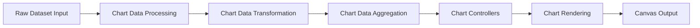
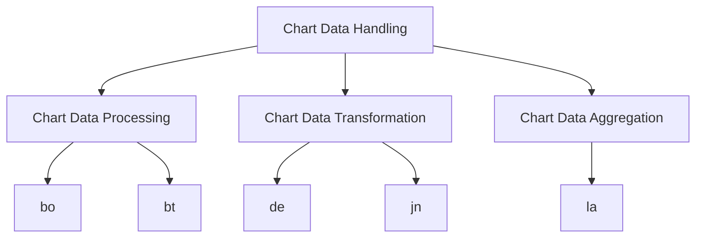
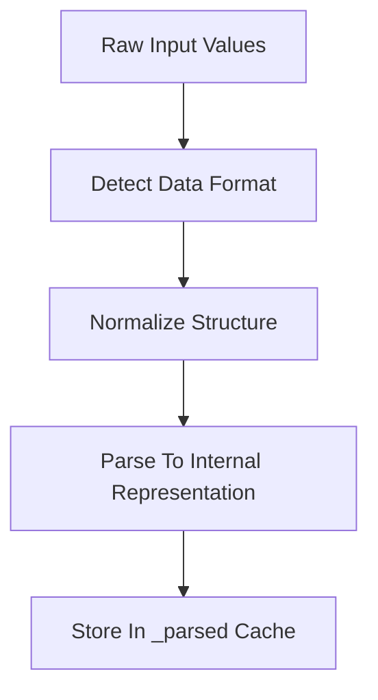
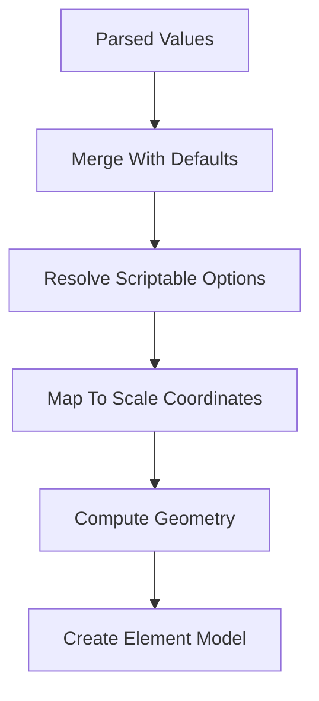
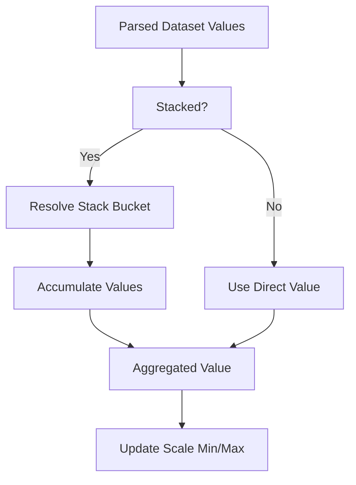
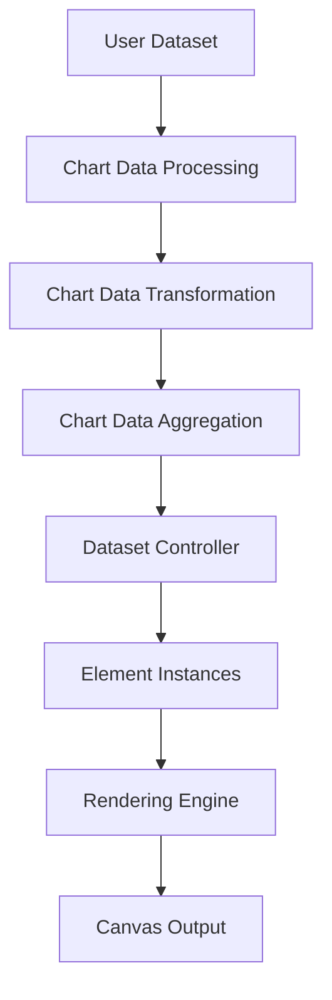

# Chart Data Handling

The **Chart Data Handling** module is responsible for transforming raw dataset input into structured, aggregated, and rendering-ready chart models. It acts as the computational backbone of the charting system within `public/scripts`, ensuring that data is parsed, normalized, transformed, and aggregated before being consumed by the rendering layer.

This module lives under:

```text
public/scripts
└── charts
    └── chart-data-handling
```

It includes the following core components:

- `meshcentral.public.scripts.charts.bo`
- `meshcentral.public.scripts.charts.bt`
- `meshcentral.public.scripts.charts.de`
- `meshcentral.public.scripts.charts.jn`
- `meshcentral.public.scripts.charts.la`

---

## 1. Purpose of the Module

The **Chart Data Handling** module is responsible for:

- Parsing raw dataset values
- Normalizing heterogeneous input formats
- Resolving configuration defaults and scriptable options
- Mapping parsed values to scale coordinates
- Computing stacked and aggregated totals
- Producing element models for rendering
- Supporting animation state transitions

It ensures that chart controllers and rendering components operate on fully prepared, consistent, and optimized data structures.

---

## 2. Architectural Overview

The module sits between user-provided data and the chart rendering system.



### Key Responsibilities by Stage

| Stage | Responsibility |
|--------|----------------|
| Processing | Parse and normalize input |
| Transformation | Resolve options and compute geometry |
| Aggregation | Stack and summarize values |
| Controllers | Build drawable element models |
| Rendering | Draw onto canvas |

---

## 3. Internal Structure

The module is divided into three logical submodules:



---

# 4. Core Submodules

---

## 4.1 Chart Data Processing

**Components:**

- `meshcentral.public.scripts.charts.bo`
- `meshcentral.public.scripts.charts.bt`

### Responsibilities

- Parse raw values (numbers, objects, arrays)
- Normalize dataset formats
- Prepare `_parsed` representations
- Handle null, NaN, and sparse values
- Precompute metadata for scale interaction

### Processing Flow



This stage guarantees consistent numeric structures regardless of input format.

For detailed documentation, see:

- [Chart Data Processing](../chart-data-processing/chart-data-processing.md)

---

## 4.2 Chart Data Transformation

**Components:**

- `meshcentral.public.scripts.charts.de`
- `meshcentral.public.scripts.charts.jn`

### Responsibilities

- Merge defaults with user configuration
- Resolve scriptable and indexable options
- Map parsed values to scale domains
- Compute geometric properties (positions, angles, radii)
- Prepare animation targets
- Produce element model objects

### Transformation Flow



The transformation layer ensures that each visual element receives fully resolved configuration and layout properties.

For detailed documentation, see:

- [Chart Data Transformation](../chart-data-transformation/chart-data-transformation.md)

---

## 4.3 Chart Data Aggregation

**Component:**

- `meshcentral.public.scripts.charts.la`

### Responsibilities

- Compute stacked values
- Accumulate grouped dataset totals
- Calculate min/max ranges for scales
- Provide totals for radial charts (e.g., pie, doughnut)
- Support positive/negative stack separation

### Aggregation Flow



Aggregation guarantees numeric consistency across stacked, grouped, and cumulative charts.

For detailed documentation, see:

- [Chart Data Aggregation](../chart-data-aggregation/chart-data-aggregation.md)

---

# 5. End-to-End Data Lifecycle

The complete data lifecycle within the chart system:



### What This Achieves

- Consistent numeric representation
- Context-aware styling resolution
- Accurate stacking and grouping
- Correct scale range computation
- Efficient animation updates
- Predictable rendering behavior

---

# 6. Design Principles

### Separation of Concerns

- Parsing is isolated from transformation.
- Transformation is isolated from rendering.
- Aggregation is isolated from geometry calculation.
- Animation is decoupled from state computation.

### Context-Aware Configuration

Options may be:

- Static values
- Arrays (index-based)
- Functions (scriptable per data point)

This enables advanced customization and dynamic styling.

### Performance Optimization

- Parsed value caching
- Stack result caching
- Shared option resolution
- Minimal recomputation on updates

---

# 7. Relationship to Other Chart Modules

The **Chart Data Handling** module interacts closely with:

- **Chart Core** – registry, defaults, and controller orchestration
- **Chart Rendering** – consumes element models
- **Chart Utilities** – shared math and helper logic
- **Chart Interactions** – relies on parsed and aggregated metadata for hit testing

It forms the mathematical and structural foundation of the entire chart pipeline.

---

# 8. Summary

The **Chart Data Handling** module:

- Converts raw datasets into normalized structures
- Resolves configuration and styling
- Computes geometry and stack values
- Updates scale bounds
- Produces rendering-ready element models

Without this layer, rendering components would lack the consistent, aggregated, and context-aware data required for accurate chart visualization.

For deeper implementation details, refer to:

- Chart Data Processing
- Chart Data Transformation
- Chart Data Aggregation

This module is the core computational engine that bridges data and visualization within the charting system.