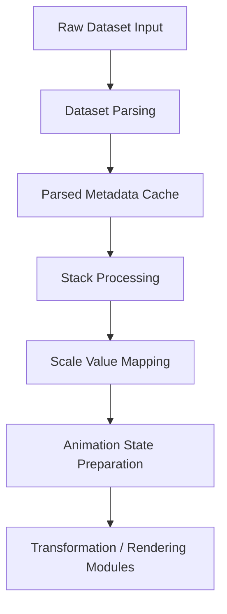
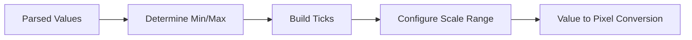
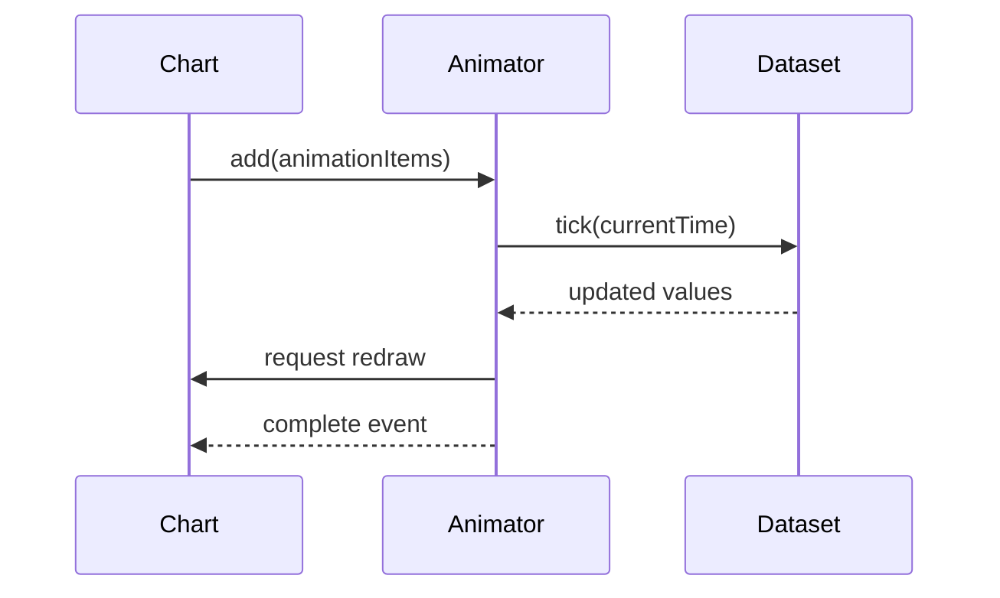
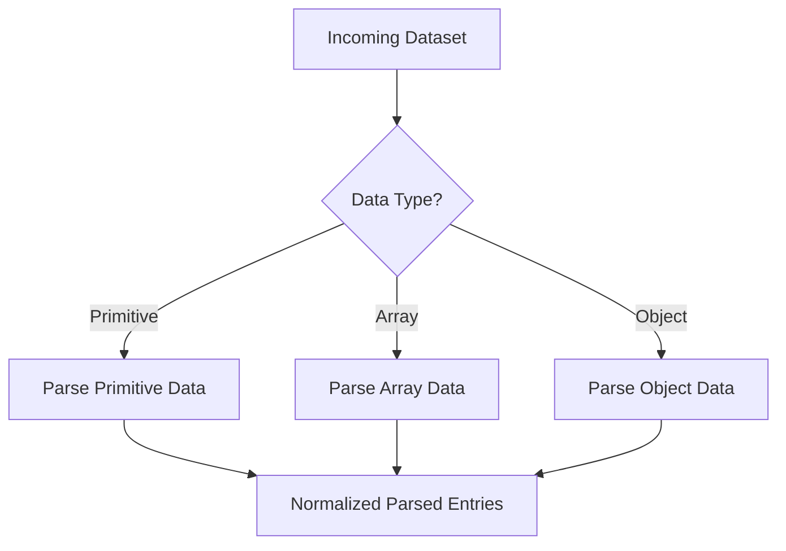
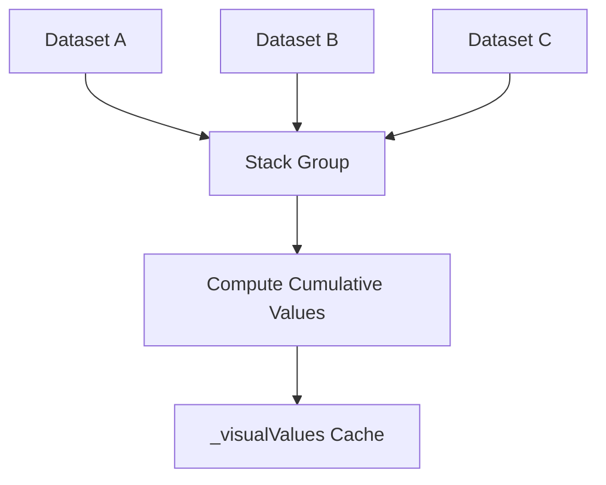
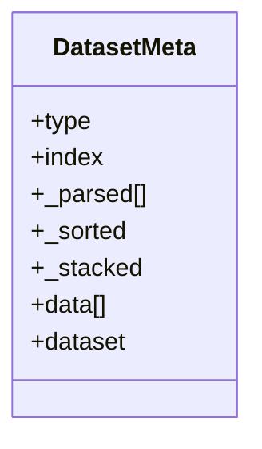
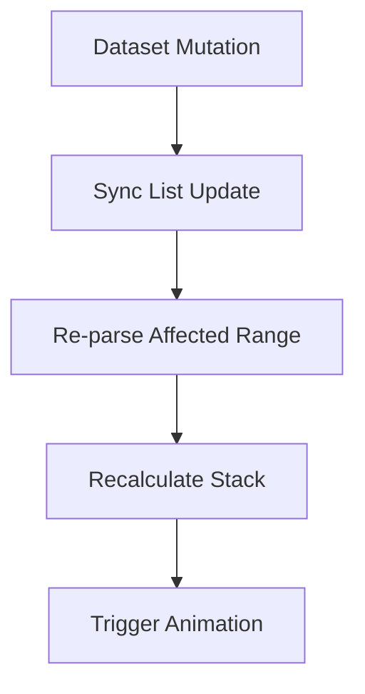

# Chart Data Processing

The **Chart Data Processing** module is responsible for preparing raw dataset values for rendering within the Chart.js-based visualization layer used in MeshCentral. It performs parsing, normalization, stacking preparation, and value computation before data reaches transformation, aggregation, and rendering stages.

This module is built around the core Chart.js dataset controller logic and internal data utilities, primarily implemented through:

- `meshcentral.public.scripts.charts.bo` (Linear Scale logic)
- `meshcentral.public.scripts.charts.bt` (Animation and update orchestration utilities)

Chart Data Processing acts as the bridge between raw dataset input and downstream modules such as:

- [Chart Data Transformation](../chart-data-transformation/chart-data-transformation.md)
- [Chart Data Aggregation](../chart-data-aggregation/chart-data-aggregation.md)
- Parent module: [Chart Data Handling](../chart-data-handling.md)

---

## 1. Responsibilities

The Chart Data Processing module handles:

- Parsing primitive, array, and object-based datasets
- Converting raw values into internal parsed representations
- Maintaining sorted and indexed metadata
- Preparing stacked values for cumulative visualizations
- Managing animation-ready data states
- Supporting incremental dataset updates (push, splice, shift, etc.)

It ensures that all datasets are converted into a normalized internal structure before rendering logic is executed.

---

## 2. High-Level Architecture

### Stage Overview

| Stage | Description |
|--------|-------------|
| Dataset Parsing | Converts input values into normalized `{x, y}` or `{r}` structures |
| Metadata Cache | Stores parsed values and sorting state |
| Stack Processing | Computes cumulative stacked values |
| Scale Mapping | Converts values into scale-domain representations |
| Animation Preparation | Prepares animated transitions for dataset updates |

---

## 3. Core Components

### 3.1 Linear Scale (`bo`)

The Linear Scale implementation is responsible for:

- Determining min/max domain values
- Computing tick limits
- Mapping values to pixel space
- Handling range normalization

Key capabilities:

- Handles `beginAtZero` logic
- Auto-calculates tick density
- Supports numeric formatting callbacks
- Provides `getPixelForValue()` and `getValueForPixel()`

This component ensures consistent numerical scaling across datasets.

---

### 3.2 Animation and Update Engine (`bt`)

The animation manager coordinates:

- Dataset transition states
- Frame updates
- Progress and completion callbacks
- Per-chart animation tracking

This mechanism enables smooth updates when:

- New data is pushed
- Values change
- Datasets are toggled
- Scales are recalculated

---

## 4. Dataset Parsing Workflow

The module supports multiple dataset formats:

- Primitive arrays: `[10, 20, 30]`
- Array tuples: `[[x, y], [x, y]]`
- Object data: `[{x: 1, y: 5}]`

Each entry is converted into an internal structure stored in:

- `_parsed[]` arrays
- `_stacked` metadata
- Dataset-specific caches

This allows efficient access during rendering and interaction.

---

## 5. Stack Processing Logic

For stacked visualizations (e.g., stacked bar charts), Chart Data Processing:

1. Groups datasets by stack key
2. Computes cumulative visual values
3. Stores `_visualValues` per axis

This ensures:

- Correct stacking order
- Accurate tooltip values
- Proper pixel mapping for stacked segments

Stack information is later consumed by the rendering layer.

---

## 6. Metadata Lifecycle

Each dataset maintains a metadata object containing:

- `_parsed` – parsed values
- `_sorted` – sorted state
- `_stacked` – stack participation
- `data[]` – element instances
- `dataset` – dataset-level element

This structure allows separation between:

- Raw input data
- Parsed numerical data
- Rendered graphical elements

---

## 7. Interaction with Other Modules

### 7.1 With Chart Data Transformation

Chart Data Processing provides normalized parsed values to:

- Filtering logic
- Segment computation
- Range slicing

See: [Chart Data Transformation](../chart-data-transformation/chart-data-transformation.md)

---

### 7.2 With Chart Data Aggregation

Aggregation modules depend on processed values to compute:

- Totals
- Averages
- Cumulative values
- Statistical summaries

See: [Chart Data Aggregation](../chart-data-aggregation/chart-data-aggregation.md)

---

### 7.3 With Rendering Layer

Processed values are consumed by:

- Line elements
- Bar elements
- Arc elements
- Point elements

The processing module guarantees:

- Valid numerical bounds
- Correct stacking
- Consistent scale domain mapping

---

## 8. Data Update Handling

The module listens to array mutation methods:

- `push`
- `pop`
- `shift`
- `splice`
- `unshift`

When triggered:

This enables incremental updates instead of full re-processing, improving performance for live data dashboards.

---

## 9. Performance Characteristics

Optimizations include:

- Lazy parsing (only affected segments)
- Cached scale ranges
- Animation batching via shared animator
- Sorted metadata flags
- Minimal recalculation during resize

These mechanisms allow efficient rendering even with large datasets.

---

## 10. Summary

The **Chart Data Processing** module is the computational backbone of the charting pipeline. It:

- Normalizes raw input data
- Maintains parsed metadata
- Supports stacking and scale logic
- Enables animation transitions
- Prepares data for transformation and rendering

By separating parsing, stacking, and animation preparation from rendering logic, the architecture remains modular, scalable, and maintainable within the broader [Chart Data Handling](../chart-data-handling.md) subsystem.
