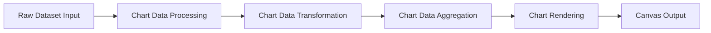
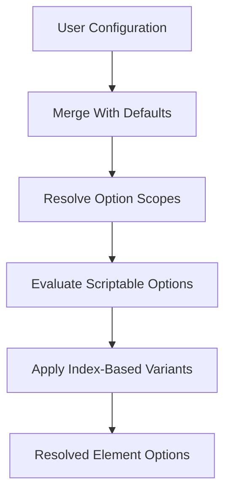
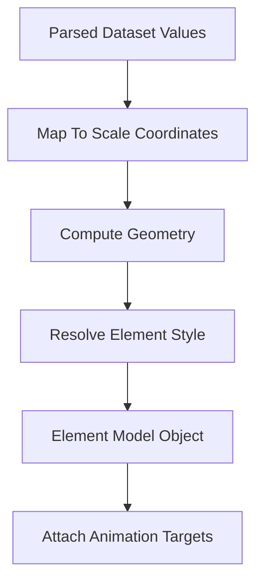
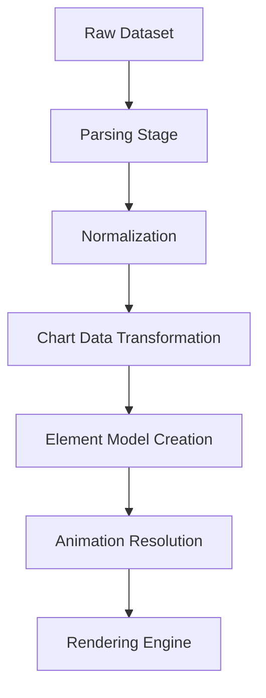

# Chart Data Transformation

The **Chart Data Transformation** module is responsible for converting parsed chart data into fully resolved, animated, and context-aware configuration objects ready for rendering. It bridges raw/parsed dataset values and the visual layer by applying default configurations, resolving scriptable options, handling animations, and preparing computed properties used by rendering components.

This module primarily revolves around the following core components:

- `meshcentral.public.scripts.charts.de`
- `meshcentral.public.scripts.charts.jn`

These components participate in option resolution, dataset normalization, and transformation of raw values into structured chart model objects consumed by rendering and interaction layers.

---

## 1. Purpose and Responsibilities

Within the **Chart Data Handling** layer, the Chart Data Transformation module sits between:

- **Chart Data Processing** – responsible for parsing and normalizing raw input data.
- **Chart Data Aggregation** – responsible for stacking, grouping, or aggregating values.
- **Chart Rendering** – responsible for drawing visual elements on the canvas.

The transformation stage ensures that:

- Parsed values are mapped to scale domains.
- Default and user-provided configuration options are merged.
- Scriptable/indexable options are resolved per data point.
- Animation targets are generated and scheduled.
- Context-aware styling (hover, active, dataset-level overrides) is computed.

---

## 2. Architectural Context

The following diagram shows where Chart Data Transformation fits within the chart pipeline.



### Key Observations

- Transformation operates on already parsed values.
- It enriches data with resolved options and computed layout properties.
- It prepares element models consumed by rendering controllers.

For upstream logic, see:
- [Chart Data Processing](../chart-data-processing/chart-data-processing.md)
- [Chart Data Aggregation](../chart-data-aggregation/chart-data-aggregation.md)

---

## 3. Core Components

### 3.1 Default & Option Resolver (`de`)

The `de` component represents the configuration backbone of the chart system. It:

- Defines default chart-level options.
- Supports nested option scopes (datasets, elements, scales, plugins).
- Enables scriptable and indexable option resolution.
- Handles fallback routing between related properties.

#### Responsibilities

- Merge user config with defaults.
- Support hierarchical option inheritance.
- Route related properties (e.g., scale colors inheriting border color).
- Provide resolver proxies for context-based evaluation.

#### Option Resolution Flow



This flow ensures that each dataset element (point, arc, bar, line, etc.) receives a fully computed option object tailored to its context.

---

### 3.2 Controller Transformation Layer (`jn` and related logic)

The `jn` component (Polar Area controller) illustrates how transformation logic is applied to specific chart types. While each controller is type-specific, the transformation responsibilities follow a shared pattern:

- Parse object-based input values.
- Convert values into scale space.
- Compute geometric properties (angles, radii, positions).
- Generate element models with resolved styling.

#### Transformation Pipeline Inside a Controller



This structured model is then consumed by rendering elements such as arcs, lines, or bars.

---

## 4. Data Transformation Phases

### 4.1 Parsing to Model

Although parsing begins in Chart Data Processing, the transformation layer:

- Retrieves parsed values.
- Applies stacking logic if enabled.
- Computes base values (e.g., baseline for bars).

### 4.2 Scale Domain Mapping

Each data point is translated into pixel coordinates using scale adapters:

- Linear scales
- Logarithmic scales
- Time scales
- Radial scales

Transformation ensures values are:

- Clamped to user-defined bounds.
- Normalized for reversed axes.
- Offset when stacking or grouping is active.

### 4.3 Style Resolution

For each element, transformation resolves:

- `backgroundColor`
- `borderColor`
- `borderWidth`
- Hover/active states
- Dataset-level overrides

Scriptable callbacks are evaluated with contextual metadata:

```text
Context:
- chart
- dataset
- datasetIndex
- dataIndex
- parsed value
- raw value
- element state
```

This enables dynamic styling such as conditional coloring or per-point customization.

---

## 5. Animation Integration

Transformation integrates closely with the animation engine.

Each update cycle:

1. Compares previous element state with new computed values.
2. Generates animation descriptors for changed properties.
3. Registers animations with the animator.
4. Defers final interpolation to the rendering loop.


This decouples logical transformation from visual interpolation.

---

## 6. Interaction with Other Modules

### 6.1 With Chart Core

The transformation layer relies on:

- Chart registry (controllers, elements, scales).
- Global defaults and overrides.
- Animation manager.

### 6.2 With Chart Rendering

After transformation, element models contain:

- Pixel coordinates.
- Dimensions (width, height, radius, angles).
- Fully resolved style options.

Rendering components (e.g., arc, line, bar elements) consume these models directly.

### 6.3 With Chart Data Handling Submodules

| Module | Responsibility | Relationship |
|---------|----------------|-------------|
| Chart Data Processing | Parse raw inputs | Provides parsed values to transformation |
| Chart Data Transformation | Resolve options and compute geometry | Central enrichment stage |
| Chart Data Aggregation | Stack/group totals | Feeds adjusted values into transformation |

---

## 7. Key Design Principles

### 7.1 Context-Aware Configuration

All options can be:

- Static values
- Functions evaluated per data point
- Arrays indexed by dataset index

This makes transformation highly dynamic and extensible.

### 7.2 Separation of Concerns

- Parsing is separate from transformation.
- Transformation is separate from rendering.
- Animation is separate from state calculation.

This modularity allows:

- Custom controllers.
- Custom elements.
- Plugin-based extension.

### 7.3 Performance Optimization

The module includes:

- Option caching.
- Resolver memoization.
- Shared option objects for identical elements.
- Selective animation updates.

These strategies prevent unnecessary recalculation on large datasets.

---

## 8. End-to-End Transformation Flow

The complete lifecycle from raw data to drawable element:



The Chart Data Transformation module is the critical enrichment stage that turns structured data into visual-ready element models.

---

## 9. Summary

The **Chart Data Transformation** module:

- Merges defaults with user configuration.
- Resolves scriptable and indexable options.
- Maps parsed values to scale coordinates.
- Computes geometry and layout properties.
- Prepares animation targets.
- Outputs structured element models for rendering.

It forms the backbone of the dynamic and extensible charting pipeline, ensuring consistent behavior across chart types while enabling fine-grained customization.

For related documentation, refer to:

- [Chart Data Processing](../chart-data-processing/chart-data-processing.md)
- [Chart Data Aggregation](../chart-data-aggregation/chart-data-aggregation.md)
