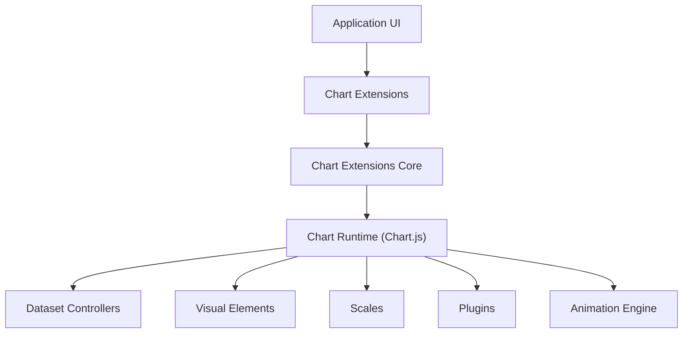
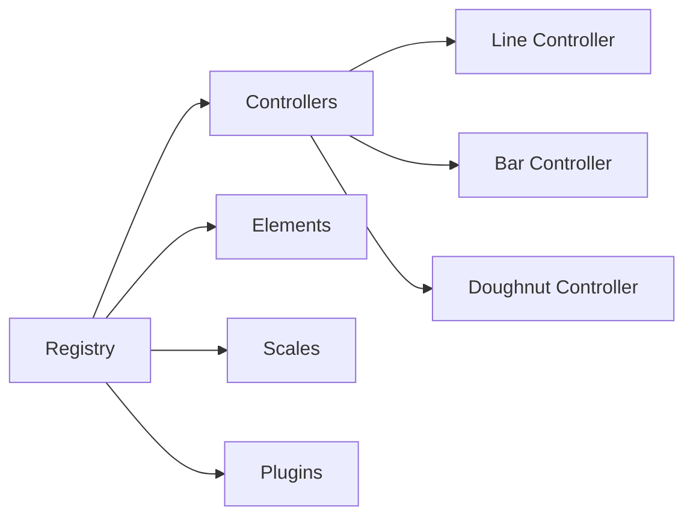
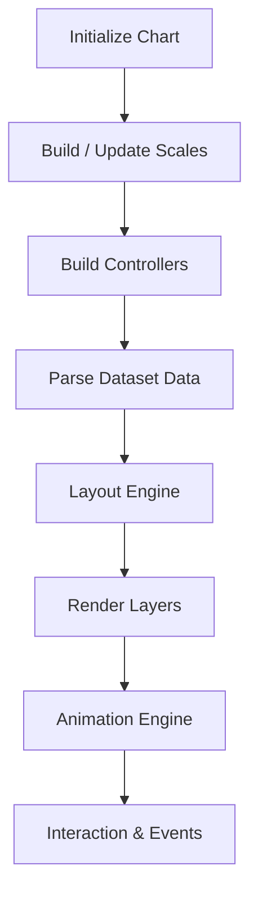
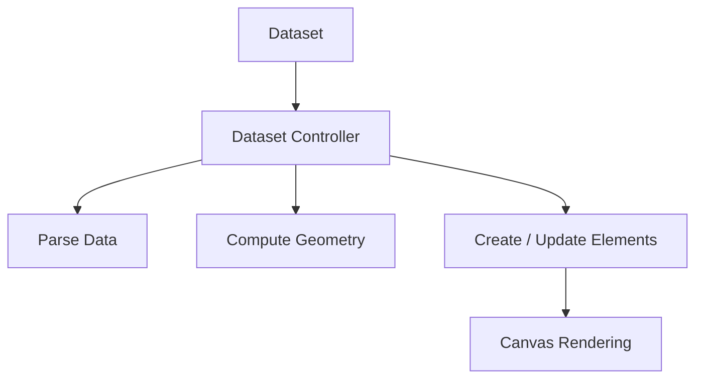
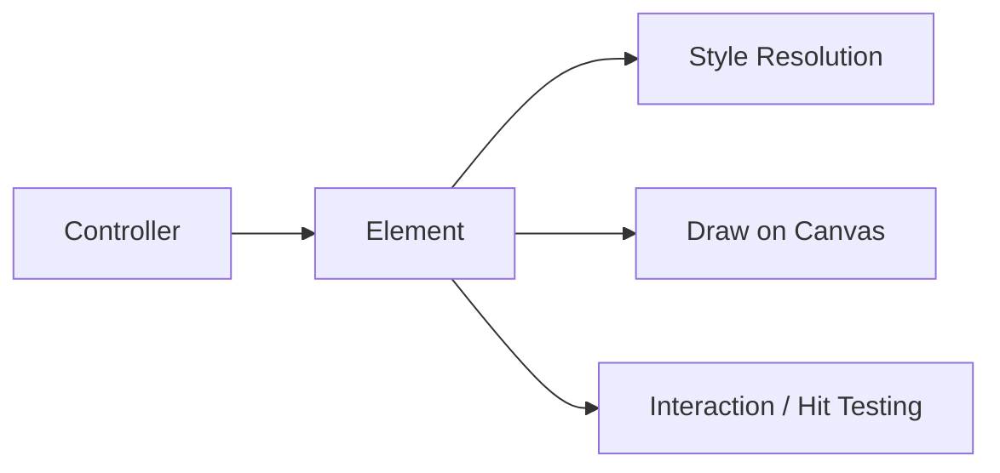
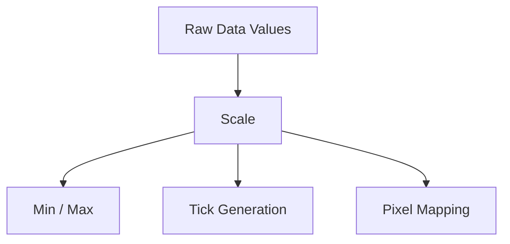
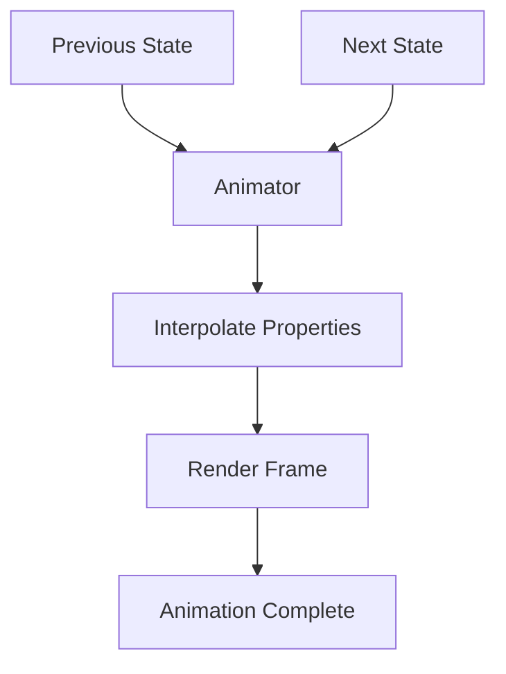
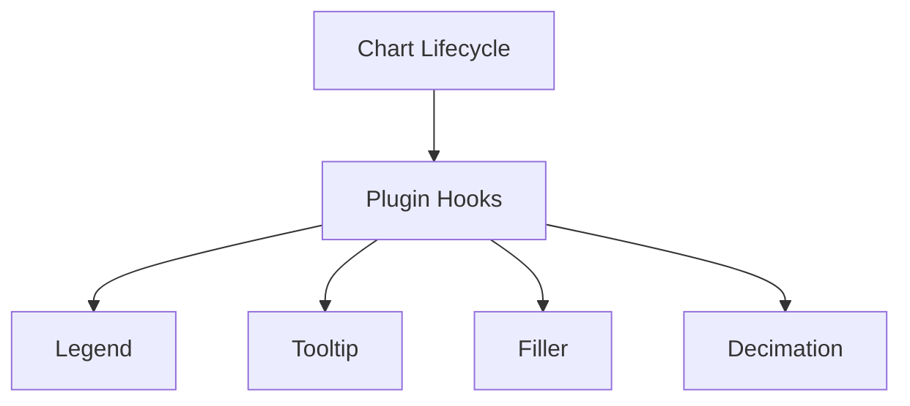
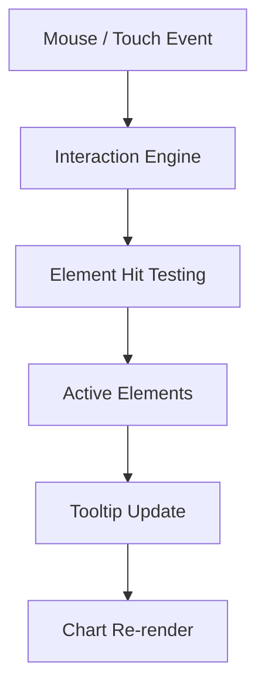
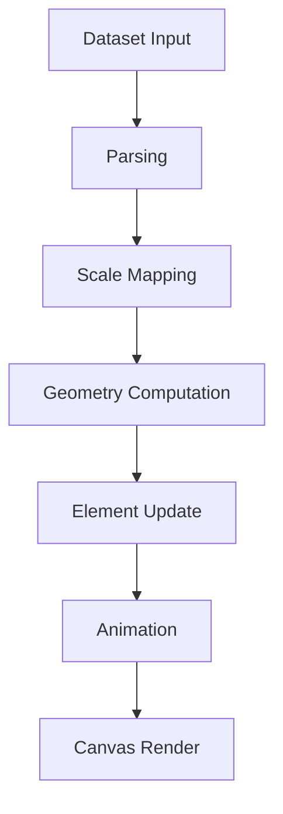

# Chart Extensions Core

The **Chart Extensions Core** module provides the foundational integration layer for Chart.js within the MeshCentral UI. It encapsulates the Chart.js runtime, global registry, controllers, elements, scales, plugins, and animation systems that power all chart-based visualizations across the platform.

This module is responsible for:

- Bootstrapping and exposing the Chart.js runtime
- Registering controllers, elements, scales, and plugins
- Managing chart lifecycle (initialization, update, destroy)
- Coordinating animations and rendering pipelines
- Enabling extensibility through plugins and dataset controllers

At its core, this module wraps and exposes the Chart.js v4 runtime (via `meshcentral.public.scripts.charts.tn` and `meshcentral.public.scripts.charts.wo`) and makes it available to higher-level chart extensions and utilities.

---

## 1. Architectural Overview

The Chart Extensions Core module acts as the runtime engine for all chart components. It provides a layered architecture:

### Layers

- **Application UI** – Dashboards and panels that render charts.
- **Chart Extensions** – Feature-specific enhancements and utilities.
- **Chart Extensions Core** – Runtime orchestration and registration layer.
- **Chart Runtime (Chart.js)** – Rendering, layout, animation, and interaction engine.

---

## 2. Core Components

The module is implemented in `public/scripts/charts.js` and exposes the Chart.js UMD build.

### 2.1 Registry (Component Registration)

The registry system allows dynamic registration of:

- Dataset controllers
- Elements (Line, Arc, Bar, Point, etc.)
- Scales (Linear, Logarithmic, Time, Radial)
- Plugins (Legend, Tooltip, Title, Subtitle, Filler, Decimation, Colors)

The registry enables extensibility by allowing new controllers and plugins to be added without modifying the core runtime.

---

### 2.2 Chart Lifecycle

Each chart instance follows a structured lifecycle:

#### Key Phases

1. **Initialization** – Context acquisition and configuration resolution.
2. **Scale Construction** – Axis resolution and bounds calculation.
3. **Dataset Controller Setup** – Per-dataset rendering logic.
4. **Parsing** – Data normalization and stack computation.
5. **Layout** – Box model resolution (legend, title, scales).
6. **Rendering** – Layered drawing pipeline.
7. **Animation** – Transition management and easing.
8. **Interaction** – Tooltip, hover, and event processing.

---

## 3. Dataset Controllers

Dataset controllers define how each chart type interprets and renders its data.

### Examples

- LineController
- BarController
- DoughnutController
- RadarController
- ScatterController
- PolarAreaController

Each controller:

- Parses raw dataset values
- Computes element geometry
- Applies stacking rules
- Resolves shared and per-element options
- Drives element updates and animations

---

## 4. Elements (Rendering Primitives)

Elements are the visual primitives rendered to canvas:

- LineElement
- ArcElement
- BarElement
- PointElement

Each element:

- Stores geometry (x, y, radius, angles, width, height)
- Applies styling (border, fill, dash, radius)
- Handles hit testing and interaction
- Supports animated transitions via property interpolation

---

## 5. Scales System

Scales convert data values into pixel coordinates.

Supported scale types include:

- CategoryScale
- LinearScale
- LogarithmicScale
- TimeScale
- TimeSeriesScale
- RadialLinearScale

### Scale Responsibilities

- Data limits detection
- Tick generation
- Label formatting
- Pixel ↔ Value mapping

Scales are tightly integrated with controllers and layout logic to ensure consistent chart rendering.

---

## 6. Animation Engine

The animation subsystem manages transitions between states.

Core responsibilities:

- Property interpolation (numbers, colors, booleans)
- Easing functions
- Looping animations
- Frame scheduling via requestAnimationFrame

Animations are registered per property and coordinated globally through a shared animator instance.

---

## 7. Plugin System

The plugin system enables modular feature extensions.

Built-in plugins include:

- Legend
- Tooltip
- Title
- Subtitle
- Filler (area fills)
- Decimation (data reduction)
- Colors (automatic palette)

Plugins hook into lifecycle stages:

- beforeInit
- beforeUpdate
- beforeDraw
- afterDraw
- afterEvent
- destroy

Plugins can:

- Modify layout
- Intercept events
- Inject drawing logic
- Transform datasets

---

## 8. Interaction Model

User interactions are processed through a centralized interaction engine.

### Interaction Modes

- point
- nearest
- index
- dataset
- x / y

The flow:

This system ensures consistent hover, click, and tooltip behavior across chart types.

---

## 9. Data Flow Summary

The end-to-end data flow through the Chart Extensions Core module:

---

## 10. Role Within the Overall System

Within MeshCentral, the Chart Extensions Core module:

- Provides a stable, centralized chart runtime
- Ensures consistent configuration and styling
- Enables advanced visualization types
- Supports large datasets via decimation
- Enables extensibility without modifying core UI code

It is the foundational runtime layer upon which higher-level chart utilities and extensions build additional behaviors.

---

## 11. Key Design Characteristics

- **Extensible** – Registry-based architecture for controllers and plugins
- **Declarative Configuration** – Dataset and scale configuration via options
- **Performance-Oriented** – Decimation and optimized rendering paths
- **Animation-Aware** – Property-level transition engine
- **Interaction-First** – Centralized hit testing and event handling
- **Canvas-Based Rendering** – High-performance drawing pipeline

---

## Conclusion

The **Chart Extensions Core** module encapsulates the complete Chart.js runtime and integration layer for MeshCentral. It manages chart lifecycle, data parsing, scale transformation, rendering, animation, plugins, and user interaction.

All chart visualizations in the system depend on this module for consistent behavior, extensibility, and performance.