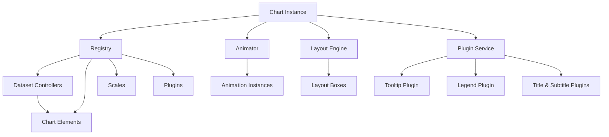
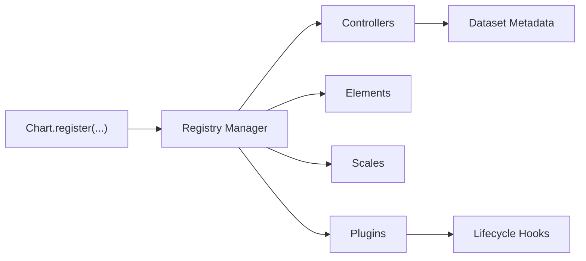
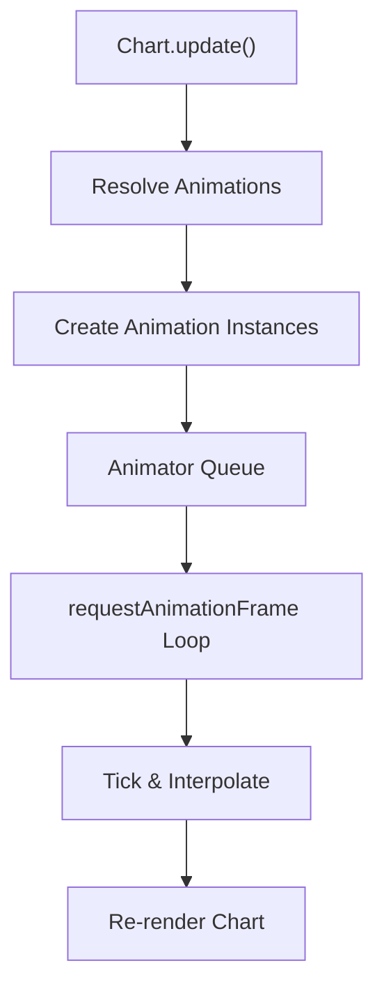
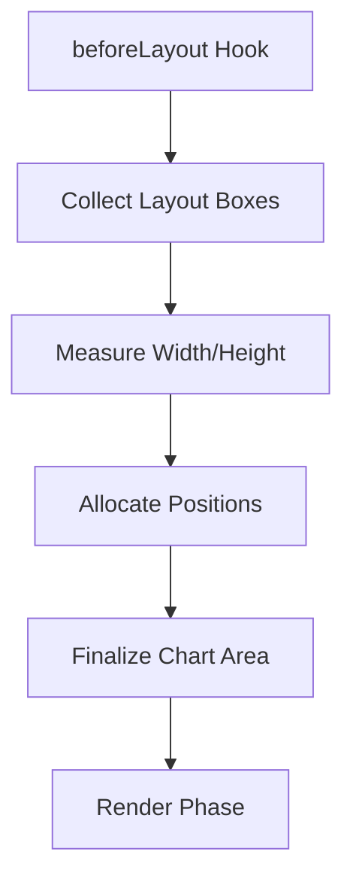
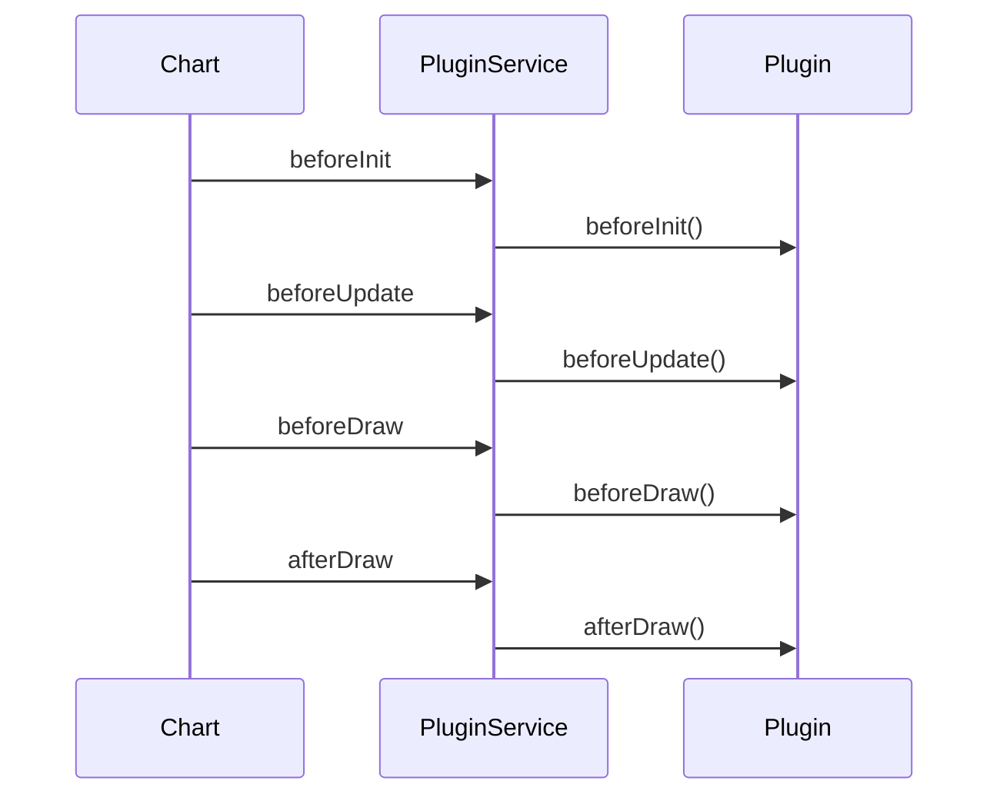
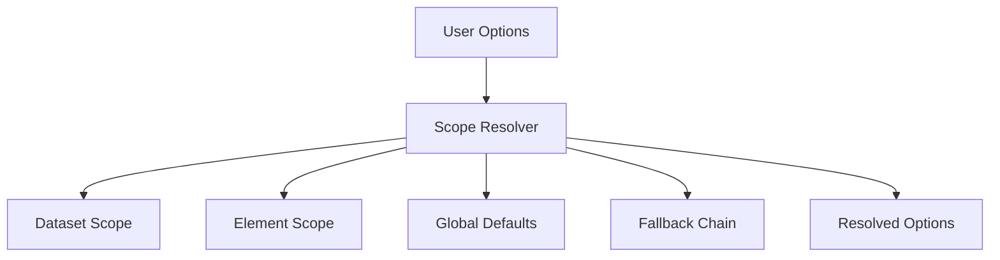
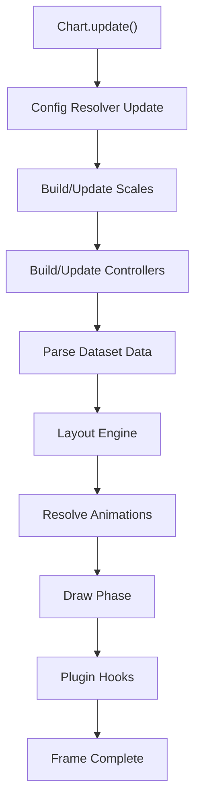

# Chart Extensions Utilities

The **Chart Extensions Utilities** module provides auxiliary functionality for extending and enhancing Chart.js behavior within the MeshCentral UI. Built on top of Chart.js v4.3.3, this module exposes utility layers that support plugin integration, advanced configuration, animation orchestration, layout handling, and scale augmentation.

This module contains the following core components:

- `meshcentral.public.scripts.charts.ws`
- `meshcentral.public.scripts.charts.ya`

These components work alongside the broader Chart.js registry, animation engine, layout system, and plugin infrastructure to enable extensible, modular chart behaviors.

---

## 1. Architectural Context

Chart Extensions Utilities sits within the Chart Extensions layer of the chart subsystem:

- Parent module: [Chart Extensions](../chart-extensions/chart-extensions.md)
- Sibling module: [Chart Extensions Core](../chart-extensions-core/chart-extensions-core.md)

It enhances:

- Plugin lifecycle management
- Animation resolution and orchestration
- Element and scale augmentation
- Registry-based extension patterns

### High-Level Architecture

The Chart Extensions Utilities module primarily contributes to:

- Registry augmentation
- Animation lifecycle control
- Plugin coordination
- Layout box integration

---

## 2. Core Responsibilities

### 2.1 Registry and Extension Infrastructure (`ws`)

The `ws` component contributes to the extensibility backbone of Chart.js by:

- Managing registration of:
  - Controllers
  - Elements
  - Scales
  - Plugins
- Supporting dynamic addition/removal of extensions
- Coordinating default overrides and descriptor routing

#### Registry Flow

The registry enables:

- Type-based lookup (`getController`, `getScale`, etc.)
- Default routing (`defaultRoutes`)
- Descriptor-driven option resolution

This mechanism ensures that new chart types and behaviors can be integrated without modifying core rendering logic.

---

### 2.2 Animation and Transition Management

Chart Extensions Utilities integrates deeply with the animation engine:

- `Animation` instances manage property transitions.
- `Animations` aggregates per-element transitions.
- Animator coordinates frame updates and lifecycle events.

#### Animation Lifecycle

Key behaviors:

- Property-based animation (e.g., `x`, `y`, `width`, `height`)
- Easing resolution via predefined easing functions
- Shared option caching for performance
- Transition modes (`reset`, `resize`, `active`, etc.)

This allows smooth dataset updates, hover effects, tooltip fades, and layout transitions.

---

### 2.3 Layout and Box Model Integration (`ya`)

The `ya` component contributes to layout box behavior (used by title, subtitle, legend, etc.).

Each layout box:

- Registers with the layout engine
- Receives dimension constraints
- Computes its own size
- Participates in layout resolution

#### Layout Processing Flow

Layout boxes can be:

- Horizontal (top/bottom)
- Vertical (left/right)
- Chart-area overlays

This modular box system enables clean integration of new UI overlays without tightly coupling them to the chart renderer.

---

## 3. Plugin Lifecycle Integration

The module cooperates with the plugin service to manage lifecycle hooks.

### Plugin Hook Phases

Extensions can:

- Inject rendering logic
- Modify datasets
- Add overlays
- Control tooltip/legend/title behavior

The Chart Extensions Utilities module ensures consistent descriptor resolution and option routing for plugin configuration.

---

## 4. Option Resolution and Descriptor Routing

A major utility feature is the descriptor-driven option resolver:

- Scriptable options (functions evaluated per context)
- Indexable options (per data index)
- Fallback chains
- Context-aware resolution

### Resolution Flow

This system enables:

- Per-dataset styling
- Per-element customization
- Contextual styling based on interaction state

---

## 5. Data Flow During Chart Update

The following diagram illustrates how Chart Extensions Utilities participates in a full chart update cycle:

Chart Extensions Utilities contributes to:

- Config resolution
- Dataset controller management
- Layout integration
- Animation orchestration
- Plugin coordination

---

## 6. Integration with Other Chart Modules

Within the chart subsystem hierarchy:

- Chart Core handles base rendering and dataset control.
- Chart Rendering handles canvas drawing logic.
- Chart Data Handling manages parsing and transformation.
- Chart Interactions manages hover and gesture logic.
- Chart Extensions Utilities provides extensibility glue and lifecycle management.

This separation ensures:

- Clear layering
- Pluggable architecture
- Reusable extension mechanisms

---

## 7. Key Design Characteristics

### Modular Registry Pattern
- Controllers, scales, elements, and plugins are registered dynamically.
- Encourages extension without forking core.

### Declarative Configuration
- Deep option resolution system.
- Context-driven evaluation.

### Animation-Centric Rendering
- All transitions are property-based.
- Shared animation registry ensures coordinated frames.

### Layout as First-Class System
- Box-based layout model.
- Automatic space allocation and collision handling.

---

## 8. When to Use Chart Extensions Utilities

You interact with this module when:

- Registering custom controllers or plugins.
- Creating new layout boxes (e.g., overlays).
- Customizing animation behaviors.
- Extending tooltip, legend, or title functionality.
- Implementing advanced option resolution logic.

It forms the extensibility backbone of the MeshCentral chart subsystem.

---

## 9. Summary

The **Chart Extensions Utilities** module provides the structural and lifecycle glue that makes the Chart.js-based subsystem extensible, configurable, and animation-aware.

It enables:

- Registry-driven extensibility
- Rich plugin lifecycle hooks
- Animation orchestration
- Layout box integration
- Context-aware option resolution

Without this layer, charts would be static renderers. With it, they become a fully modular, extensible visualization framework within the MeshCentral UI.