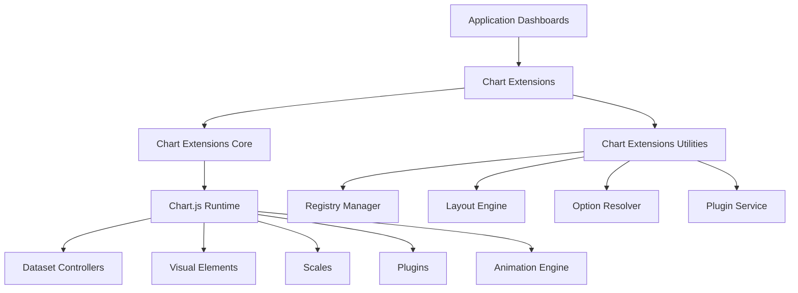
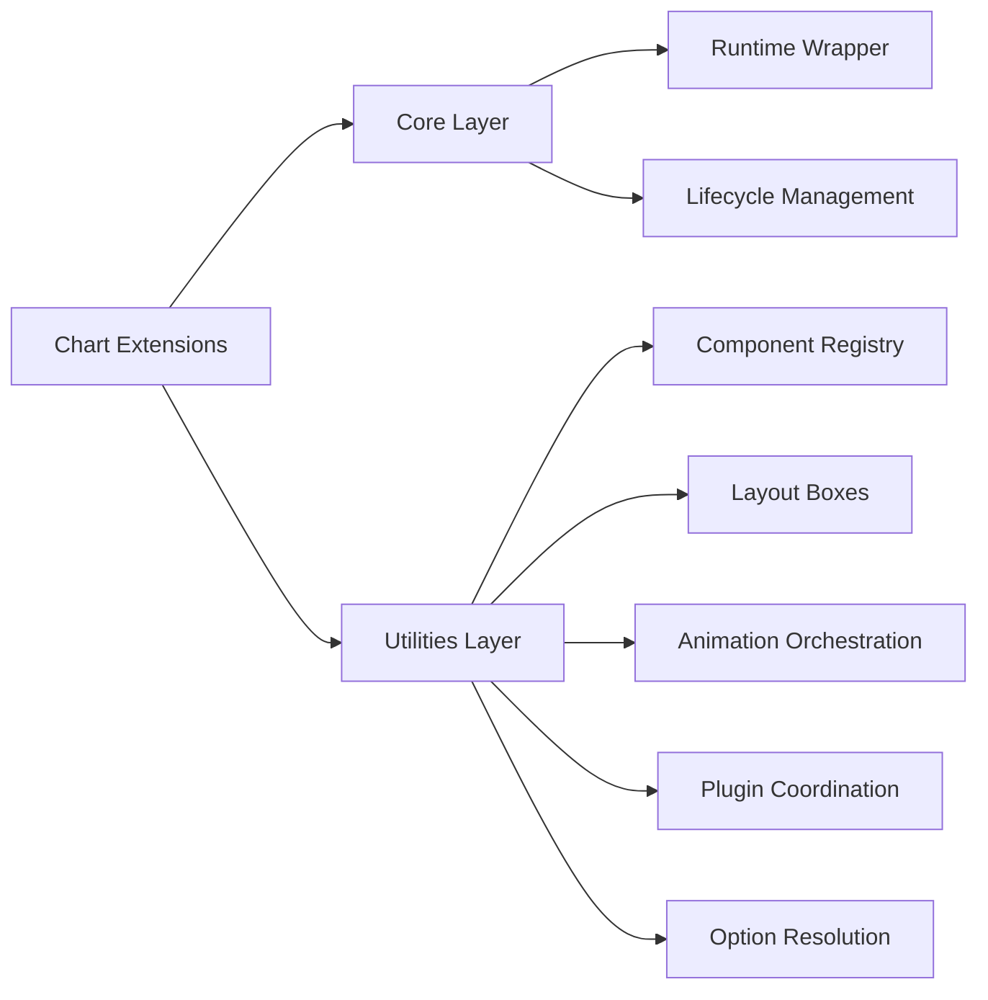
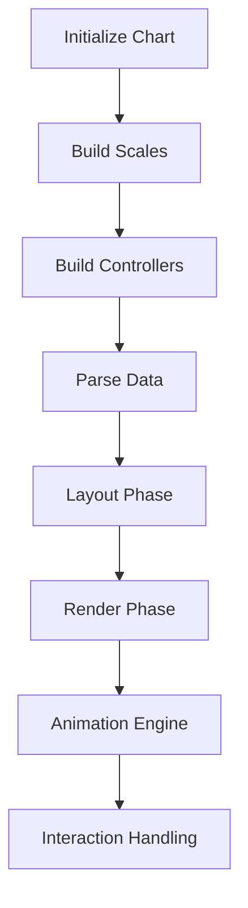
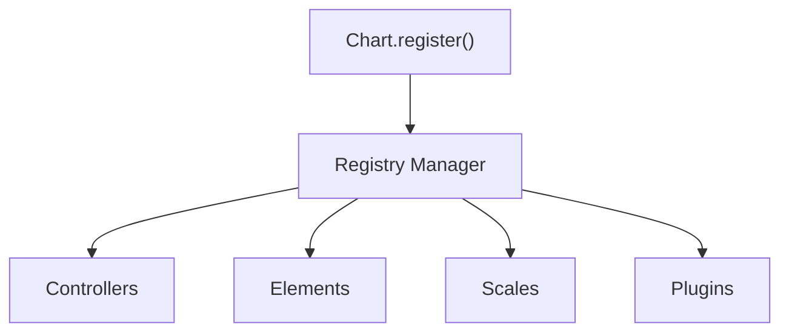
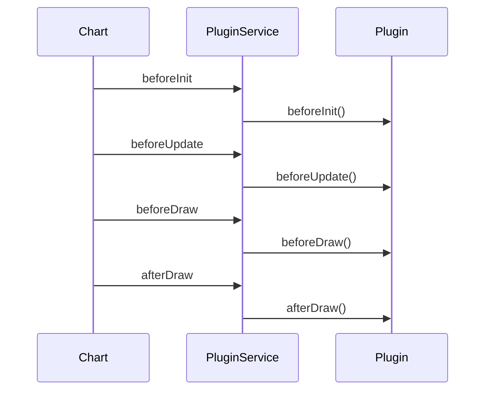
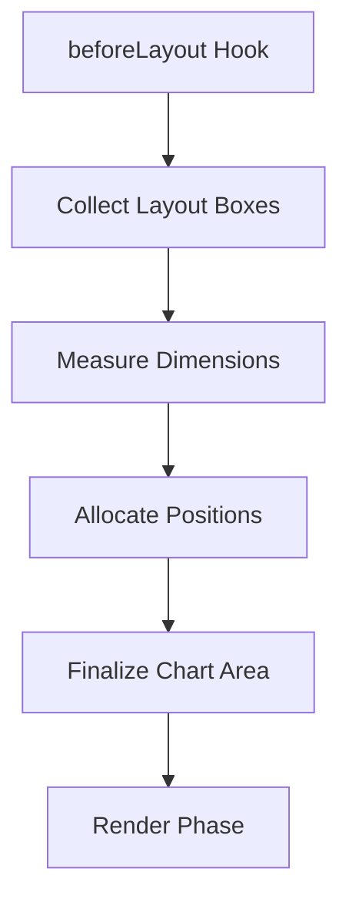
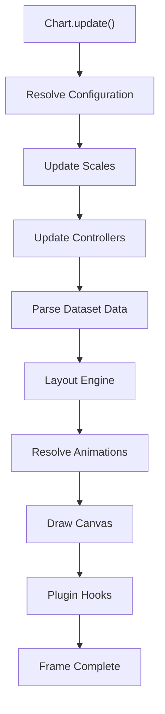
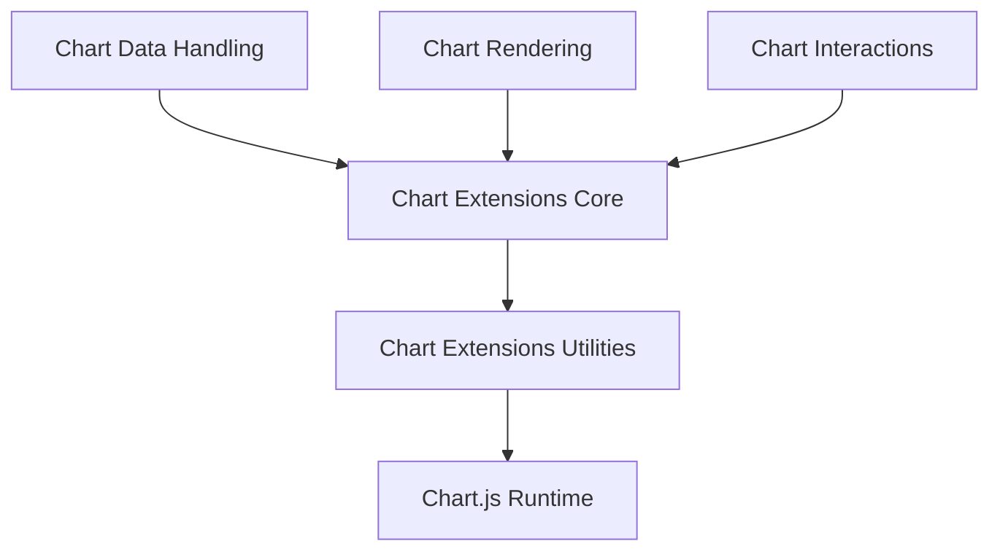

# Chart Extensions

The **Chart Extensions** module provides the extensibility layer for charting within the MeshCentral UI. It builds on top of the Chart.js runtime (via **Chart Extensions Core**) and enhances it with higher-level utilities, lifecycle coordination, layout integration, animation orchestration, and plugin management.

This module enables dashboards, analytics panels, and monitoring views to render rich, interactive, and extensible visualizations without modifying the underlying chart engine.

---

## 1. Purpose of the Module

The Chart Extensions module is responsible for:

- Extending the Chart.js runtime with MeshCentral-specific capabilities
- Managing registration of controllers, elements, scales, and plugins
- Coordinating animation and layout behavior
- Providing utility layers for option resolution and configuration
- Enabling modular chart customization through extension patterns

It acts as the **integration and orchestration layer** between:

- Application UI components
- Chart runtime engine
- Plugins and layout boxes
- Interaction and animation subsystems

---

## 2. Repository Structure

**Base Path:** `public/scripts`

### Chart Extensions Components

- `meshcentral.public.scripts.charts.tn`
- `meshcentral.public.scripts.charts.wo`
- `meshcentral.public.scripts.charts.ws`
- `meshcentral.public.scripts.charts.ya`

### Submodules

#### Chart Extensions Core
- `meshcentral.public.scripts.charts.tn`
- `meshcentral.public.scripts.charts.wo`

See: **Chart Extensions Core** documentation.

#### Chart Extensions Utilities
- `meshcentral.public.scripts.charts.ws`
- `meshcentral.public.scripts.charts.ya`

See: **Chart Extensions Utilities** documentation.

---

## 3. Architectural Overview

The Chart Extensions module sits above the Chart.js runtime and below the UI layer.

### Layer Responsibilities

| Layer | Responsibility |
|-------|---------------|
| Application UI | Configures and renders charts |
| Chart Extensions | Coordinates extensions and lifecycle |
| Chart Extensions Core | Provides runtime and lifecycle management |
| Chart Extensions Utilities | Registry, layout, animation, plugin integration |
| Chart.js Runtime | Rendering and interaction engine |

---

## 4. Internal Module Structure

The internal structure of the Chart Extensions module is organized into two main domains:

---

## 5. Core Responsibilities

### 5.1 Runtime Integration (Core)

The Core layer:

- Wraps and exposes the Chart.js runtime
- Registers controllers, scales, elements, and plugins
- Manages chart lifecycle:
  - Initialization
  - Update
  - Resize
  - Destroy
- Coordinates rendering and animation cycles

Lifecycle overview:

---

### 5.2 Extension Infrastructure (Utilities)

The Utilities layer provides:

- Registry-based extensibility
- Layout box management
- Animation resolution and orchestration
- Plugin lifecycle integration
- Context-aware option resolution

Registry structure:

This design allows new chart types and plugins to be added without modifying core rendering logic.

---

## 6. Plugin & Layout Integration

Chart Extensions integrates deeply with plugin and layout systems.

### Plugin Lifecycle

Plugins can:

- Inject custom rendering
- Modify datasets
- Control tooltips and legends
- Participate in animation and layout phases

---

### Layout Flow

Layout boxes (title, legend, overlays) are modular and independently measurable.

---

## 7. Data & Update Flow

When a chart is updated:

The Chart Extensions module ensures:

- Consistent configuration resolution
- Smooth animated transitions
- Coordinated plugin execution
- Efficient rendering

---

## 8. Relationship to Other Chart Modules

The Chart subsystem is layered as follows:

### Responsibilities Across Modules

- **Chart Data Handling** – Parsing, transformation, aggregation
- **Chart Rendering** – Canvas drawing logic
- **Chart Interactions** – Hover, gestures, hit detection
- **Chart Extensions Core** – Lifecycle and runtime orchestration
- **Chart Extensions Utilities** – Extensibility and configuration glue

---

## 9. Key Design Characteristics

- **Registry-Based Extensibility**  
  Controllers, scales, elements, and plugins are dynamically registered.

- **Lifecycle-Oriented Architecture**  
  All extensions integrate into a structured update and draw pipeline.

- **Animation-Driven Rendering**  
  Property-level transitions coordinated through a shared animator.

- **Modular Layout System**  
  Box-based layout ensures predictable extension integration.

- **Declarative Configuration**  
  Deep option resolution supports scriptable and indexable options.

---

## 10. Summary

The **Chart Extensions** module is the extensibility backbone of the MeshCentral chart subsystem. It integrates the Chart.js runtime with MeshCentral’s UI layer and provides:

- Lifecycle orchestration
- Registry-driven extensibility
- Plugin and layout coordination
- Animation management
- Configuration resolution infrastructure

It ensures that charts within MeshCentral are not just renderers, but fully extensible, animated, interactive visualization components capable of supporting complex dashboard and analytics scenarios.