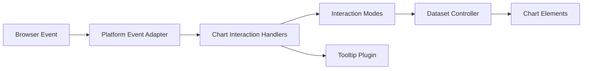
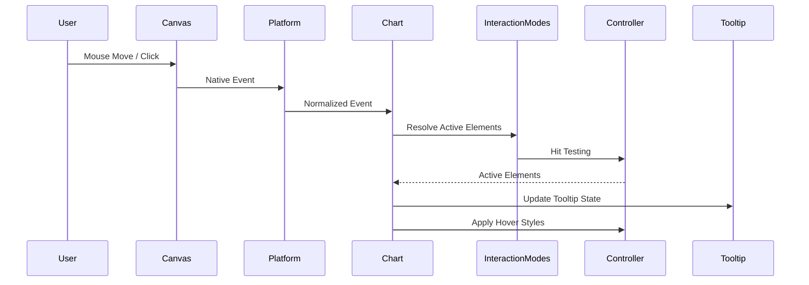
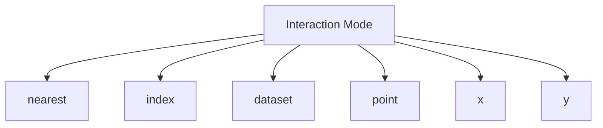
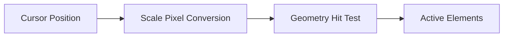
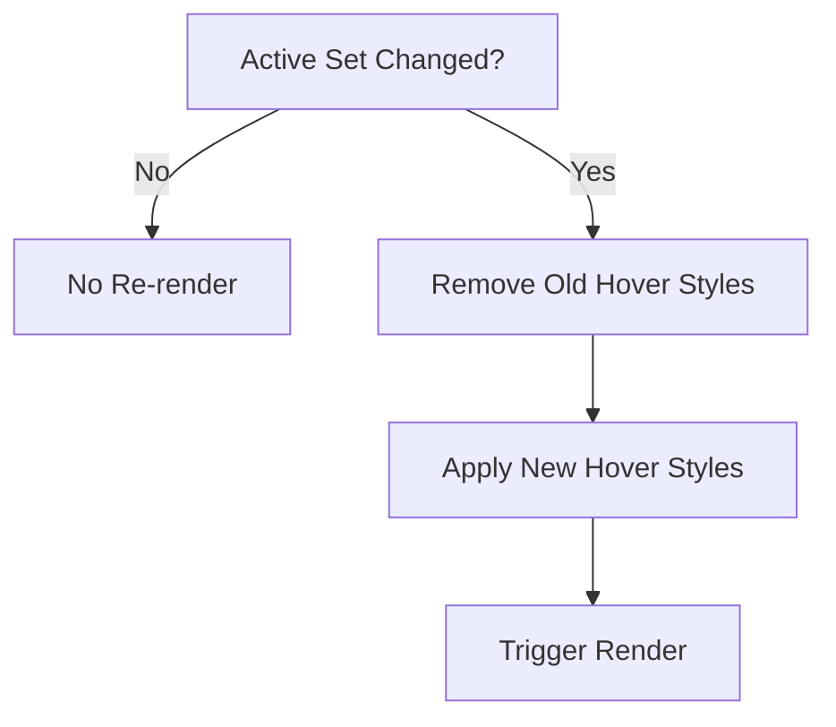
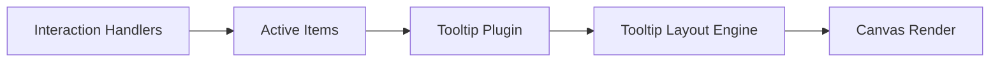

# Chart Interaction Handlers

The **Chart Interaction Handlers** module is responsible for managing user-driven interactions within the charting system. It translates low-level browser events (click, mousemove, touch) into meaningful chart behaviors such as hover states, active elements, dataset highlighting, and tooltip activation.

This module builds on the Chart.js v4 interaction engine and works closely with rendering, data handling, and utility layers to provide responsive and accurate chart interactivity.

Core components:

- `meshcentral.public.scripts.charts.ls`
- `meshcentral.public.scripts.charts.mo`

---

## 1. Purpose and Responsibilities

The Chart Interaction Handlers module provides:

- Event-to-element mapping (hit testing)
- Hover state management
- Click and selection handling
- Interaction mode resolution (nearest, index, dataset, point, x, y)
- Tooltip activation integration
- Delegation to controllers for style updates

It ensures that chart elements respond consistently to user input regardless of chart type (line, bar, pie, radar, etc.).

---

## 2. Architectural Context

The module sits between the platform event system and dataset controllers.

### Upstream Dependencies

- Platform abstraction (DOM or Basic platform)
- Utility helpers (geometry, distance, pixel conversion)
- Dataset metadata and scale systems

### Downstream Consumers

- Dataset controllers (for hover styles)
- Tooltip plugin
- Rendering layer

---

## 3. Core Components

### 3.1 `ls` – Basic Platform

The `ls` component extends the base platform abstraction and provides:

- 2D context acquisition
- Disabling animations in non-DOM environments

This ensures interaction logic can function in environments without a full DOM (e.g., headless rendering).

### 3.2 `mo` – Interaction & Scale Logic

The `mo` component contains logic related to scale parsing and pixel-value mapping. In the context of interactions, it supports:

- Converting pixel positions to data values
- Resolving tick and value ranges
- Supporting hit detection across scales

It enables precise mapping from mouse coordinates to chart data coordinates.

---

## 4. Interaction Processing Flow

When a user interacts with a chart, the system executes the following pipeline:

### Step Breakdown

1. **Event Normalization**  
   The platform adapter converts DOM or pointer events into chart-relative coordinates.

2. **Mode Resolution**  
   The interaction mode (e.g., `nearest`, `index`, `dataset`) determines how elements are selected.

3. **Hit Testing**  
   Each visible dataset meta is evaluated to determine which elements are within range.

4. **State Update**  
   - Active elements array is updated.
   - Hover styles are applied.
   - Tooltip state is recalculated.

5. **Re-render Trigger**  
   If active elements change, the chart is re-rendered.

---

## 5. Interaction Modes

The interaction engine supports multiple strategies for resolving elements.

### Mode Behaviors

- **nearest** – Finds the closest element by Euclidean distance.
- **index** – Activates elements at the same index across datasets.
- **dataset** – Activates all elements in a dataset.
- **point** – Activates elements directly under the cursor.
- **x / y** – Activates elements aligned along one axis.

Each mode uses shared utilities for distance calculation and range checking.

---

## 6. Hit Testing and Geometry

Hit detection relies on:

- Bounding box checks (bars, rectangles)
- Radius-based checks (points, arcs)
- Angle and distance calculations (radial charts)
- Scale-aware pixel-to-value transformations

### Geometry Examples

- **Line & Point charts** – Radius comparison with hit radius.
- **Bar charts** – Rectangle containment checks.
- **Doughnut / Pie charts** – Angle + radial distance checks.

---

## 7. Hover and Active State Management

Active elements are stored internally and compared against previous state.

If changes are detected:

- Previous hover styles are removed.
- New hover styles are applied.
- Animations are triggered (if enabled).

Hover styling is delegated to dataset controllers to ensure element-type-specific rendering.

---

## 8. Tooltip Integration

The Chart Interaction Handlers module does not render tooltips directly. Instead, it:

- Computes active elements.
- Passes them to the Tooltip plugin.
- Allows the tooltip plugin to compute layout and positioning.

This separation ensures:

- Interaction logic remains independent of presentation.
- Tooltip behavior can be customized or replaced.

---

## 9. Animation Awareness

Interaction state changes are passed through the animation system:

- Property transitions (opacity, position)
- Hover border width changes
- Color transitions

If animations are disabled (e.g., in `ls` platform mode), interaction updates are applied immediately.

---

## 10. Error Handling and Edge Cases

The module accounts for:

- Out-of-bounds cursor positions
- Null or NaN data values
- Hidden datasets
- Reversed scales
- Circular vs non-circular radial grids

All hit detection is guarded against invalid geometry.

---

## 11. Integration with Other Chart Modules

The Chart Interaction Handlers module collaborates closely with:

- Rendering logic in chart elements (line, bar, arc, point)
- Scale implementations (linear, category, time, radial)
- Tooltip and legend plugins

It does not:

- Perform rendering itself
- Modify dataset data
- Persist state outside the chart instance

---

## 12. Summary

The **Chart Interaction Handlers** module provides the core infrastructure that enables charts to feel interactive and responsive. By:

- Abstracting event handling
- Implementing flexible interaction modes
- Delegating style updates to controllers
- Integrating seamlessly with tooltips and animations

It ensures consistent behavior across all supported chart types while remaining extensible and plugin-friendly.

This module is essential for transforming static visualizations into dynamic, user-driven data exploration tools.