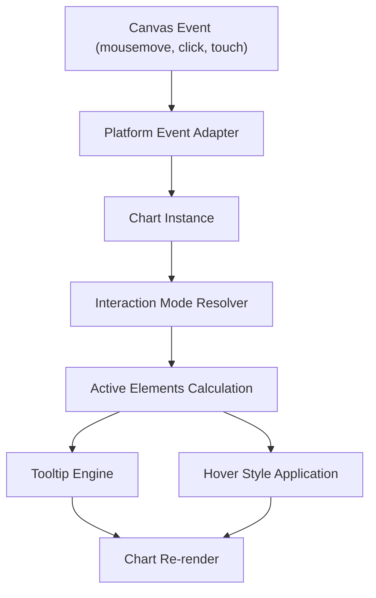
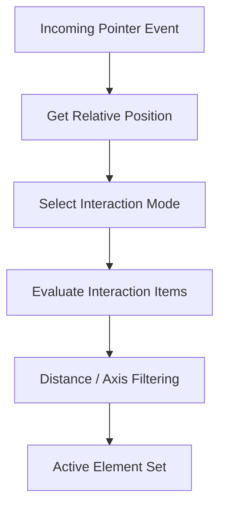
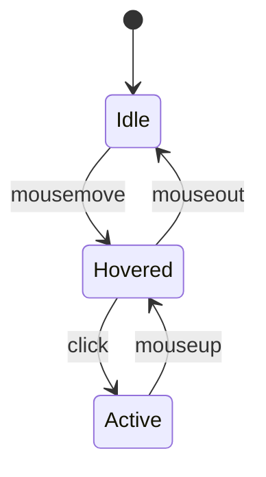
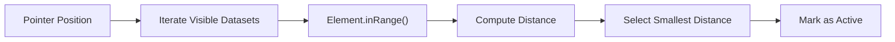
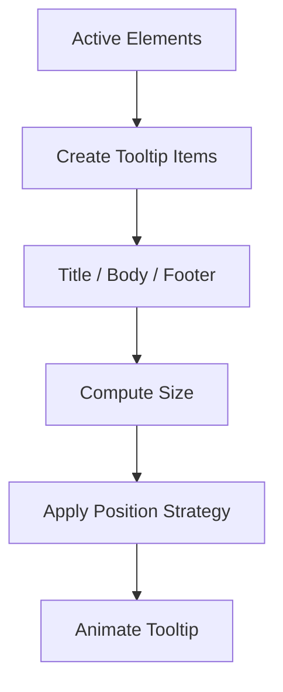
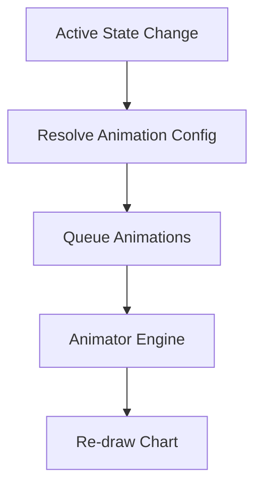

# Chart Interaction Handlers

The **Chart Interaction Handlers** module is responsible for managing user-driven interactions within chart components, such as hover, click, nearest-point detection, dataset highlighting, and tooltip activation.

Built on top of Chart.js (v4.x), this module orchestrates how pointer events are translated into semantic chart interactions. It acts as the bridge between low-level canvas events and high-level behaviors such as:

- Element hit testing
- Interaction modes (nearest, index, dataset, x, y, point)
- Active element state management
- Tooltip triggering and updates

This module is part of the larger [Chart Interactions](../chart-interactions.md) layer and works closely with:

- [Chart Interaction Utilities](../chart-interaction-utilities/chart-interaction-utilities.md)
- [Chart Rendering](../../chart-rendering/chart-rendering.md)
- [Chart Core](../../chart-core/chart-core.md)

---

## 1. Architectural Overview

At runtime, interaction handling follows a deterministic flow:



### Responsibilities

| Layer | Responsibility |
|-------|----------------|
| Platform Adapter | Normalizes DOM / pointer events into chart events |
| Interaction Resolver | Selects and executes interaction mode logic |
| Dataset Controller | Performs hit detection on elements |
| Tooltip Engine | Builds contextual tooltip model |
| Animator | Applies transitions and state updates |

---

## 2. Core Interaction Engine

The interaction engine is powered by the internal interaction registry (e.g., `Interaction.modes`). These modes determine how active elements are computed.

### Supported Interaction Modes

- `nearest`
- `index`
- `dataset`
- `point`
- `x`
- `y`

Each mode defines how chart elements are selected based on:

- Axis constraints
- Distance calculation
- Intersection requirement
- Inclusion of invisible elements

### Interaction Mode Resolution Flow



---

## 3. Active Element Lifecycle

Active elements represent the current hovered or clicked chart items.

### State Transition



### Key Behaviors

- Maintains `_active` element list
- Compares previous vs new active elements
- Triggers hover styling updates
- Requests animation frame if needed

---

## 4. Hit Detection Mechanics

Hit detection is delegated to dataset elements (e.g., Point, Bar, Arc).

Each element implements methods such as:

- `inRange(x, y)`
- `inXRange(x)`
- `inYRange(y)`
- `getCenterPoint()`

### Distance-Based Selection



Distance calculations use Euclidean distance or axis-specific filtering depending on the mode.

---

## 5. Tooltip Integration

The Chart Interaction Handlers module feeds active elements into the tooltip subsystem.

### Tooltip Update Flow



The tooltip supports:

- Custom callbacks
- Per-dataset styling
- External rendering hooks
- Animated transitions

---

## 6. Animation Coordination

Interactions are animation-aware. The Animator component:

- Tracks active animations
- Interpolates property transitions
- Synchronizes hover state changes

### Animation Update Cycle



This ensures smooth transitions for:

- Point radius changes
- Bar highlighting
- Arc expansion
- Tooltip fade-in / fade-out

---

## 7. Interaction with Other Modules

### Chart Core
Provides:
- Dataset metadata
- Scale access
- Parsed data
- Rendering cycle control

See: [Chart Core](../../chart-core/chart-core.md)

### Chart Rendering
Handles:
- Element drawing
- Path generation
- Clipping
- Canvas state management

See: [Chart Rendering](../../chart-rendering/chart-rendering.md)

### Chart Interaction Utilities
Provides:
- Geometry utilities
- Distance calculations
- Segment handling
- Helper methods

See: [Chart Interaction Utilities](../chart-interaction-utilities/chart-interaction-utilities.md)

---

## 8. Extension & Customization Points

The module allows customization via:

- Custom interaction modes
- Tooltip callback overrides
- External tooltip rendering
- Dataset-level hover options

### Custom Interaction Mode Pattern

```javascript
Chart.Interaction.modes.customMode = function(chart, event, options) {
  // Custom selection logic
  return [];
};
```

---

## 9. Summary

The **Chart Interaction Handlers** module transforms raw canvas events into structured, animated, and customizable chart behaviors.

It:

- Interprets pointer events
- Executes interaction mode logic
- Manages active element state
- Coordinates tooltip rendering
- Synchronizes animations

By separating interaction resolution from rendering and data logic, the module ensures high extensibility while maintaining predictable performance and animation fidelity.
