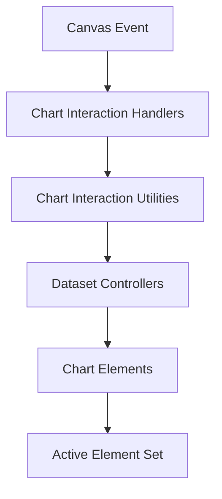
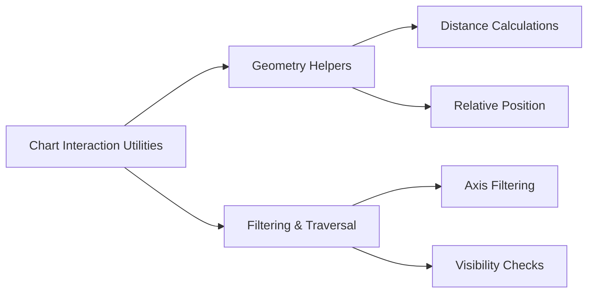
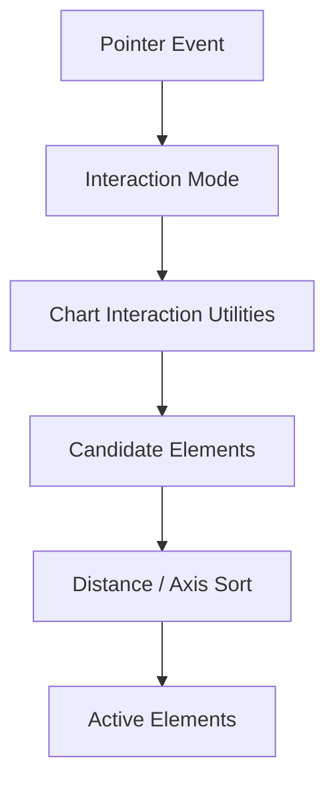
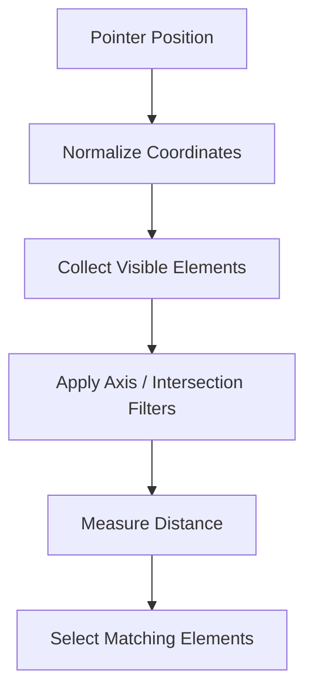

# Chart Interaction Utilities

The **Chart Interaction Utilities** module provides the low-level computational and geometric helpers that power interactive behavior inside the charting system.  

It supports the **Chart Interaction Handlers** by supplying reusable logic for:

- Distance and proximity calculations  
- Axis-based filtering (x, y, radial)  
- Hit-testing helpers  
- Dataset traversal utilities  
- Interaction mode support functions  

This module ensures that interaction logic remains deterministic, reusable, and decoupled from rendering concerns.

---

## 📍 Module Location

```text
public/scripts
└── charts
    └── chart-interactions
        └── chart-interaction-utilities
            ├── meshcentral.public.scripts.charts.sn
            └── meshcentral.public.scripts.charts.so
```

### Core Components

- `meshcentral.public.scripts.charts.sn`
- `meshcentral.public.scripts.charts.so`

These components expose utility functions consumed by:

- Chart Interaction Handlers  
- Chart Core  
- Chart Rendering  
- Dataset Controllers  

---

# 1. Purpose of the Module

The Chart Interaction Utilities module acts as the **mathematical and geometric foundation** for chart interactivity.

It provides:

- Coordinate normalization
- Relative position computation
- Distance metrics (Euclidean, axis-restricted)
- Dataset iteration helpers
- Element filtering strategies

Without this layer, interaction handlers would contain duplicated logic for hit detection and selection strategies.

---

# 2. High-Level Architecture

The utilities layer sits between event handling and dataset-level hit detection.



### Architectural Role

| Layer | Responsibility |
|-------|----------------|
| Interaction Handlers | Interprets pointer events |
| Interaction Utilities | Computes geometry & filtering logic |
| Dataset Controllers | Delegates element-level checks |
| Rendering | Applies visual updates |

---

# 3. Internal Responsibility Breakdown

The utilities module can be logically divided into two sub-areas:



## 3.1 Geometry Helpers

Responsible for:

- Converting DOM event coordinates to chart-relative coordinates  
- Computing distances between pointer and elements  
- Supporting radial and cartesian charts  

These helpers allow interaction modes such as `nearest`, `x`, and `y` to behave consistently.

---

## 3.2 Filtering & Traversal Utilities

Responsible for:

- Iterating visible datasets  
- Skipping hidden elements  
- Applying axis constraints  
- Returning candidate element sets  

This ensures performance efficiency when working with large datasets.

---

# 4. Interaction Mode Support

The utilities module provides shared logic used by multiple interaction modes.



Supported patterns include:

- Nearest element selection  
- Index-based selection  
- Dataset-wide selection  
- Axis-restricted detection  
- Point-only detection  

By isolating the computation logic here, interaction modes remain lightweight and extensible.

---

# 5. Data Flow During Hit Detection

The following illustrates how the utilities participate in hit detection:



### Key Behaviors

- Uses axis-aware distance strategies  
- Supports intersection-only and non-intersect modes  
- Minimizes unnecessary element evaluation  
- Returns stable and predictable result sets  

---

# 6. Relationship to Other Modules

## Chart Interaction Handlers

The handlers interpret events and call utility functions to compute active elements.

See:  
`../chart-interaction-handlers/chart-interaction-handlers.md`

---

## Chart Core

Provides:

- Dataset metadata  
- Scale definitions  
- Parsed data  

Utilities rely on Chart Core for scale translation and metadata access.

See:  
`../../chart-core/chart-core.md`

---

## Chart Rendering

Rendering reacts to updated active states computed via utilities.

See:  
`../../chart-rendering/chart-rendering.md`

---

# 7. Design Principles

The module follows several architectural principles:

### ✅ Separation of Concerns  
Geometry and filtering logic are isolated from event handling and rendering.

### ✅ Reusability  
Multiple interaction modes share the same utility functions.

### ✅ Deterministic Output  
Given the same pointer position and dataset state, results are predictable.

### ✅ Performance Awareness  
Traversal logic minimizes expensive distance computations.

---

# 8. Extension Model

Developers can introduce new interaction strategies by leveraging existing utilities rather than reimplementing hit detection logic.

```javascript
// Conceptual pattern for custom interaction logic
function customInteraction(chart, event, options) {
  const position = getRelativePosition(event, chart);
  const candidates = collectVisibleElements(chart);
  return filterByDistance(position, candidates, options);
}
```

This pattern preserves consistency with built-in interaction modes.

---

# 9. Summary

The **Chart Interaction Utilities** module is the computational backbone of chart interactivity.

It:

- Translates pointer coordinates into chart space  
- Provides geometry and distance calculations  
- Filters and evaluates candidate elements  
- Enables consistent interaction modes  
- Supports scalable performance across datasets  

By isolating interaction mathematics from event orchestration and rendering, the module ensures maintainable, extensible, and performant chart behavior across the system.