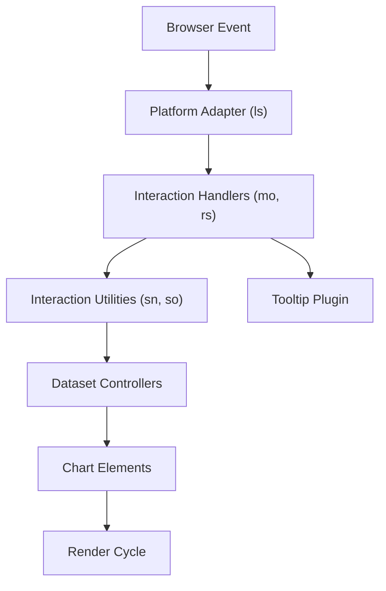
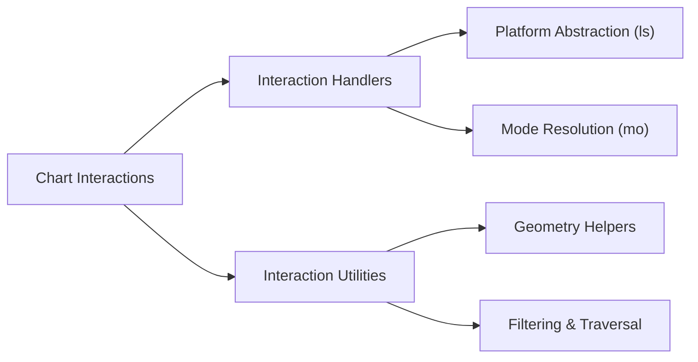
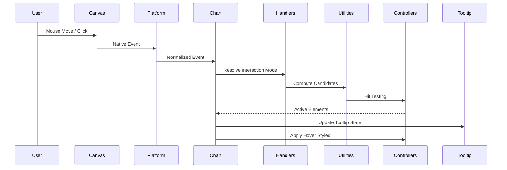
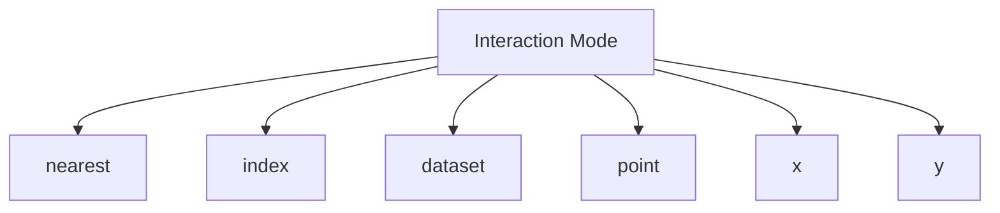
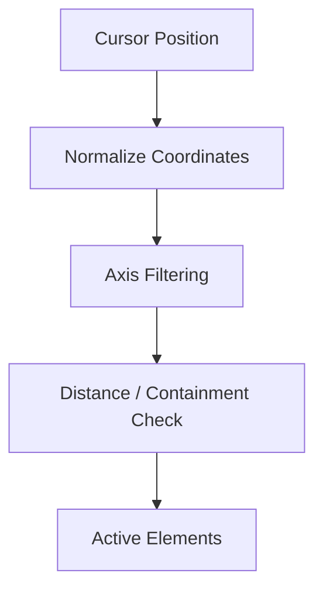
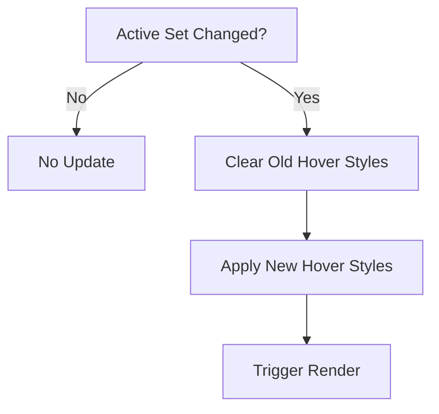
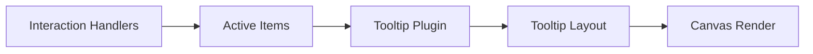

# Chart Interactions

The **Chart Interactions** module is responsible for enabling interactive behavior within the charting system. It connects user input (mouse, touch, pointer events) with chart elements, translating low-level events into meaningful actions such as hover effects, active states, tooltip activation, and dataset highlighting.

Located under `public/scripts/charts/chart-interactions`, this module works in close collaboration with:

- **Chart Core**
- **Chart Data Handling**
- **Chart Rendering**
- **Chart Extensions (Tooltip & Plugins)**

It ensures charts are not static visualizations but responsive, user-driven exploration tools.

---

## Module Location

```text
public/scripts
└── charts
    └── chart-interactions
        ├── ls
        ├── mo
        ├── rs
        ├── sn
        └── so
```

### Core Components

**Interaction Handlers**
- `meshcentral.public.scripts.charts.ls`
- `meshcentral.public.scripts.charts.mo`

**Interaction Utilities**
- `meshcentral.public.scripts.charts.rs`
- `meshcentral.public.scripts.charts.sn`
- `meshcentral.public.scripts.charts.so`

---

# 1. Purpose of the Module

The Chart Interactions module provides:

- Event normalization
- Interaction mode resolution
- Hit detection and element matching
- Hover and active state management
- Tooltip integration
- Delegation to dataset controllers for styling updates

It abstracts platform-specific input handling and guarantees consistent behavior across chart types (line, bar, pie, radar, etc.).

---

# 2. High-Level Architecture

The module acts as a bridge between the browser event system and chart rendering.



### Architectural Layers

| Layer | Responsibility |
|-------|---------------|
| Platform Adapter | Normalize DOM or headless events |
| Interaction Handlers | Resolve interaction modes & active elements |
| Interaction Utilities | Geometry & filtering logic |
| Dataset Controllers | Element-level hit detection |
| Rendering | Apply visual updates |

---

# 3. Internal Structure

The module is divided into two main subsystems.



---

# 4. Interaction Processing Flow

When a user interacts with a chart, the system executes a deterministic pipeline:



### Step Breakdown

1. **Event Normalization**  
   The `ls` platform adapter translates native events into chart-relative coordinates.

2. **Mode Resolution**  
   The handler (`mo`, `rs`) determines how elements should be selected.

3. **Hit Testing**  
   Utilities (`sn`, `so`) compute geometry and filter candidate elements.

4. **State Update**  
   Active elements are updated and hover styles applied.

5. **Render Trigger**  
   If the active set changes, the chart re-renders.

---

# 5. Interaction Modes

The module supports multiple interaction strategies:



### Mode Characteristics

- **nearest** — Closest element by Euclidean distance  
- **index** — All elements at the same data index  
- **dataset** — Entire dataset activated  
- **point** — Direct intersection only  
- **x / y** — Axis-aligned matching  

All modes reuse shared utilities to ensure consistency.

---

# 6. Hit Detection & Geometry

Hit testing is geometry-aware and scale-aware.



### Supported Geometry Checks

- **Points** — Radius comparison  
- **Bars** — Rectangle containment  
- **Arcs (Pie/Doughnut)** — Angle + radial distance  
- **Line segments** — Distance to segment  

Scale transformation ensures pixel positions correctly map to data values.

---

# 7. Hover & Active State Lifecycle

Active element sets are diffed against previous state:



Hover styling is delegated to dataset controllers to preserve element-type logic.

---

# 8. Tooltip Integration

The module computes active elements but does not render tooltips directly.



This separation ensures:

- Customizable tooltip behavior
- Clean separation of logic and presentation
- Plugin extensibility

---

# 9. Relationship to Other Chart Modules

## Chart Core

Provides:

- Dataset metadata
- Scale definitions
- Parsed data
- Controller registry

See:
`../chart-core/chart-core.md`

---

## Chart Data Handling

Provides:

- Data parsing
- Aggregation
- Transformation
- Dataset visibility tracking

See:
`../chart-data-handling/chart-data-handling.md`

---

## Chart Rendering

Responsible for:

- Element drawing
- Animation execution
- Canvas updates

See:
`../chart-rendering/chart-rendering.md`

---

## Chart Extensions

Tooltip and plugin hooks integrate with active state changes.

See:
`../chart-extensions/chart-extensions.md`

---

# 10. Design Principles

The Chart Interactions module follows these principles:

### ✅ Separation of Concerns  
Event handling, geometry logic, and rendering are strictly separated.

### ✅ Deterministic Behavior  
Same input + same state → same active element set.

### ✅ Extensibility  
New interaction modes can reuse existing utility functions.

### ✅ Performance Awareness  
Efficient dataset traversal and minimal distance calculations.

---

# 11. Summary

The **Chart Interactions** module transforms static visualizations into dynamic, interactive experiences.

It:

- Normalizes platform events  
- Resolves flexible interaction modes  
- Performs geometry-based hit detection  
- Manages hover and active states  
- Integrates with tooltip and animation systems  
- Delegates rendering responsibilities to controllers  

By separating interaction orchestration from computation and rendering, the module ensures scalable, maintainable, and extensible chart interactivity across the entire system.