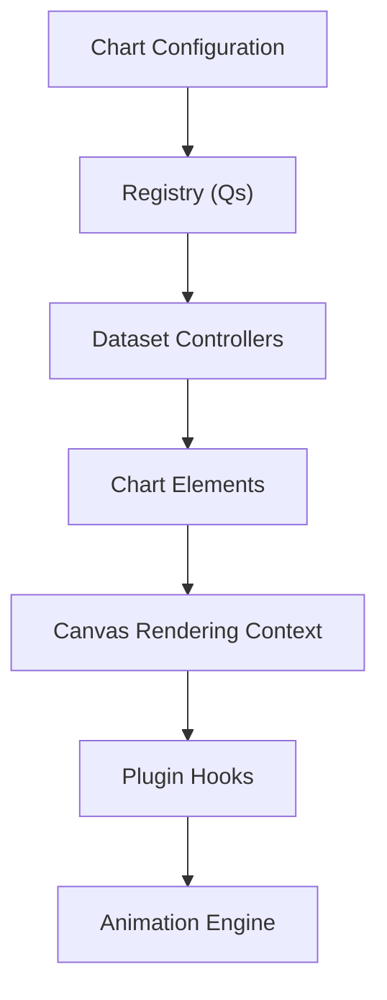
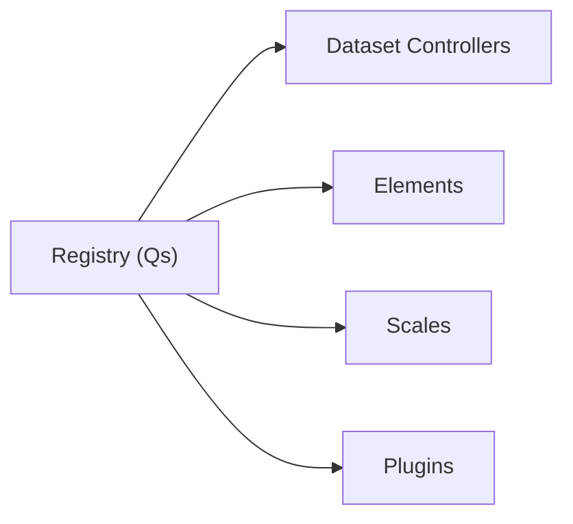
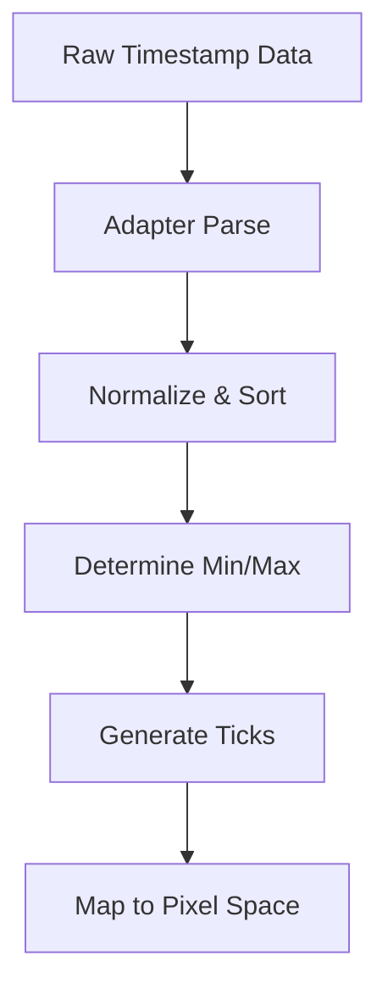
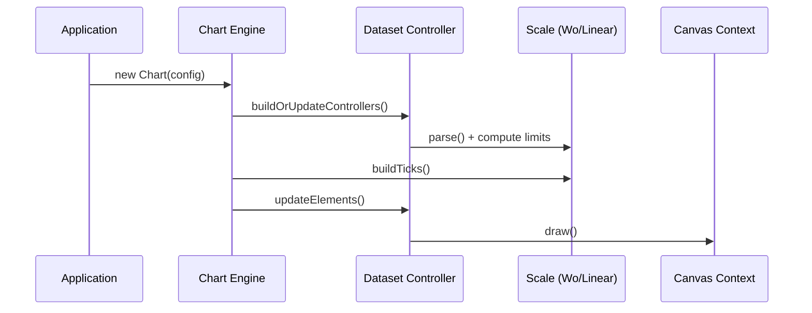
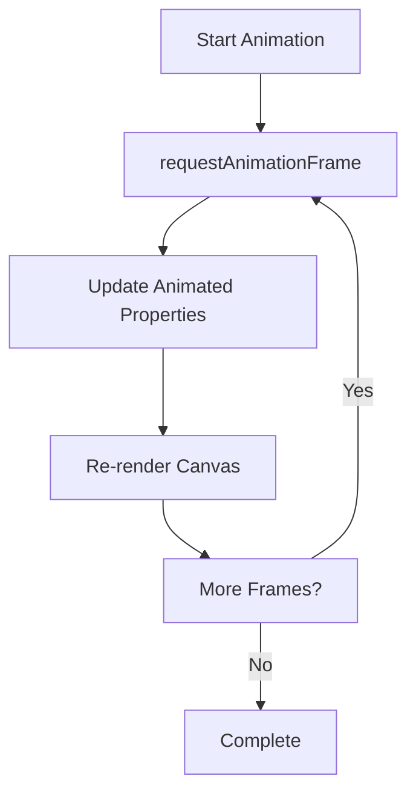

# Chart Rendering Core

The **Chart Rendering Core** module provides the low-level rendering engine for all chart types in the MeshCentral UI. It is built on top of Chart.js v4 and is responsible for canvas drawing, animation orchestration, element lifecycle management, layout integration, and plugin coordination.

At its core, this module exposes the primary rendering primitives and engine classes used by higher-level chart modules such as:

- [Chart Rendering](../chart-rendering.md)
- [Chart Rendering Utilities](../chart-rendering-utilities/chart-rendering-utilities.md)
- [Chart Core](../../chart-core/chart-core.md)

It contains the foundational classes that transform parsed datasets into animated, interactive canvas visuals.

---

## 1. Core Components

This module is implemented inside `public/scripts/charts.js` and exposes the following key components:

- `meshcentral.public.scripts.charts.Qs`
- `meshcentral.public.scripts.charts.Wo`
- `meshcentral.public.scripts.charts.Zt`

These correspond to:

| Component | Responsibility |
|------------|----------------|
| `Qs` | Registry system for controllers, elements, plugins, and scales |
| `Wo` | Time-based scale implementation (TimeScale) |
| `Zt` | Color parsing and manipulation utility |

Together, they enable dynamic chart rendering, scale management, and visual styling.

---

## 2. High-Level Architecture

The Chart Rendering Core sits at the center of the chart lifecycle:

### Responsibilities

1. **Registry Management (Qs)**
   - Registers controllers (bar, line, pie, etc.)
   - Registers elements (arc, line, point, bar)
   - Registers scales (linear, logarithmic, time, radial)
   - Registers plugins (legend, tooltip, filler, colors)

2. **Rendering Lifecycle**
   - Dataset parsing
   - Layout computation
   - Element instantiation
   - Canvas drawing
   - Animation updates

3. **Scale Computation**
   - Linear scale
   - Logarithmic scale
   - Time scale (Wo)
   - Radial scale

4. **Visual Styling**
   - Color resolution (Zt)
   - Border calculations
   - Fill strategies
   - Gradient/pattern handling

---

## 3. Registry System (Qs)

The `Qs` class acts as a typed registry used internally by the Chart engine.

### Key Capabilities

- Type-safe registration
- Default configuration routing
- Override support
- Runtime extension support

This enables modular extension of the chart system without modifying the core rendering engine.

---

## 4. Time Scale (Wo)

The `Wo` class implements a time-aware scale used for time-series charts.

### Features

- Date parsing through adapter layer
- Automatic unit detection (millisecond → year)
- Tick generation with bounds support
- Label formatting using display formats
- Major/minor tick support

### Time Scale Flow

The Time Scale ensures consistent mapping between temporal values and canvas coordinates.

---

## 5. Color Utility (Zt)

The `Zt` class provides a flexible color abstraction layer.

### Supported Formats

- Hex (`#RRGGBB`, `#RGB`)
- RGB / RGBA
- HSL / HSLA
- Named CSS colors

### Capabilities

- Alpha manipulation
- Lighten / darken
- Saturate / desaturate
- Interpolation between colors
- Conversion to string formats

This abstraction ensures consistent color behavior across all chart types.

---

## 6. Rendering Pipeline

The rendering lifecycle inside the Chart Rendering Core follows a deterministic flow.

### Key Phases

1. Configuration resolution
2. Dataset parsing
3. Scale domain calculation
4. Layout computation
5. Element update
6. Animation scheduling
7. Canvas rendering
8. Plugin execution

---

## 7. Animation Integration

The Chart Rendering Core integrates a centralized animation engine.

- Property-based animation descriptors
- Per-element animations
- Dataset-level animations
- Tooltip animations

Animations are driven by a requestAnimationFrame loop and update element properties incrementally.

---

## 8. Integration with Other Modules

The Chart Rendering Core is consumed by higher-level chart modules:

- **Chart Rendering** orchestrates rendering logic and chart types
- **Chart Rendering Utilities** provides helper drawing utilities
- **Chart Core** manages shared chart configuration and base logic

This module does not define business-specific charts. Instead, it provides the rendering infrastructure required by those modules.

---

## 9. Design Principles

1. **Modular Registry Architecture** – Extensible without modifying core code.
2. **Separation of Concerns** – Parsing, scaling, rendering, and animation are isolated.
3. **Canvas-first Rendering** – Optimized for 2D context drawing.
4. **Plugin-Driven Extensions** – Legend, tooltip, filler, and color logic are plugins.
5. **Declarative Configuration** – Chart behavior is driven by structured configuration objects.

---

## 10. Summary

The **Chart Rendering Core** module is the foundational rendering engine for MeshCentral chart components. It:

- Manages registries for controllers, elements, and scales
- Implements time-aware and numeric scaling
- Handles animation and lifecycle orchestration
- Provides advanced color manipulation utilities
- Coordinates plugin-based extensions

All higher-level chart modules rely on this core for accurate, animated, and extensible canvas-based chart rendering.