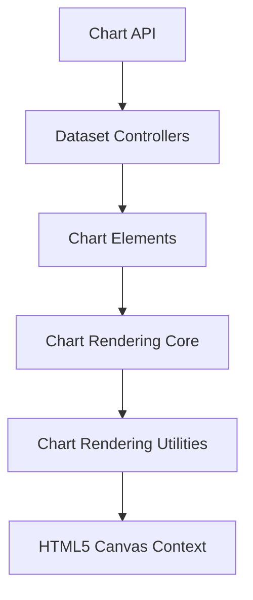
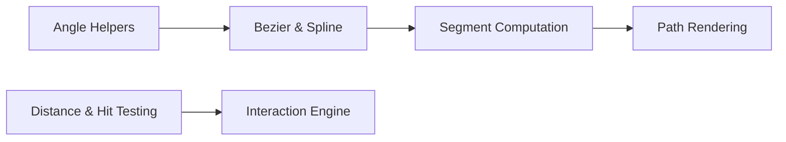
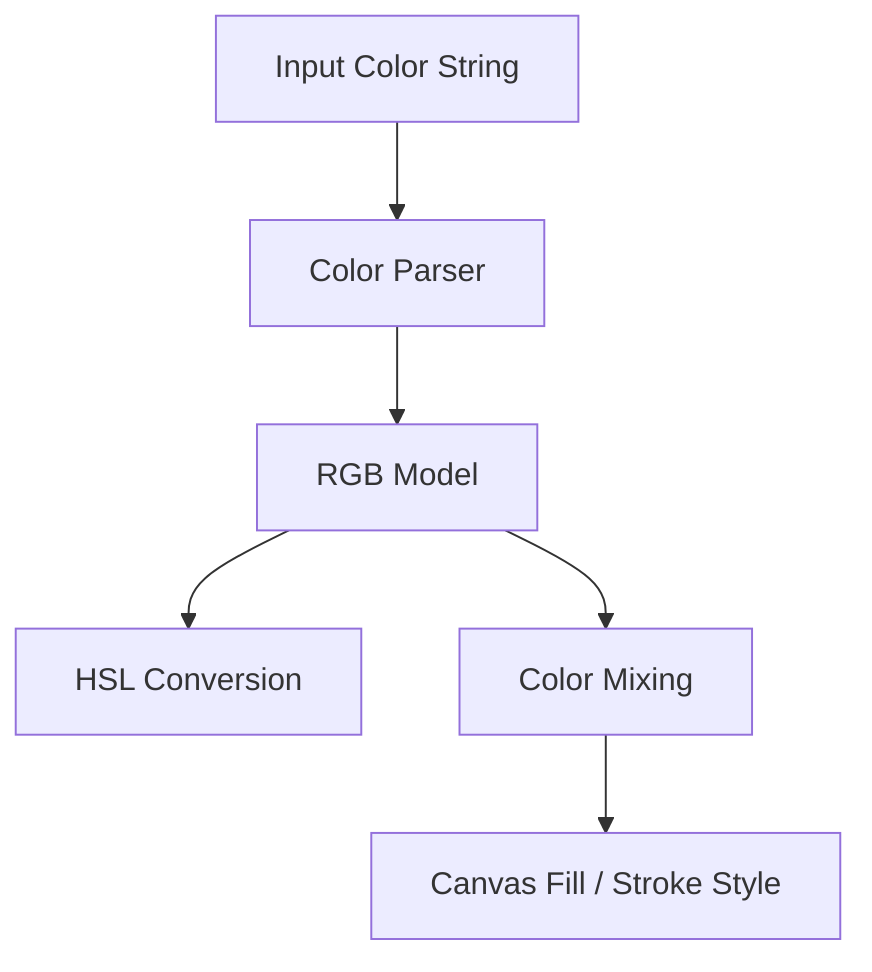
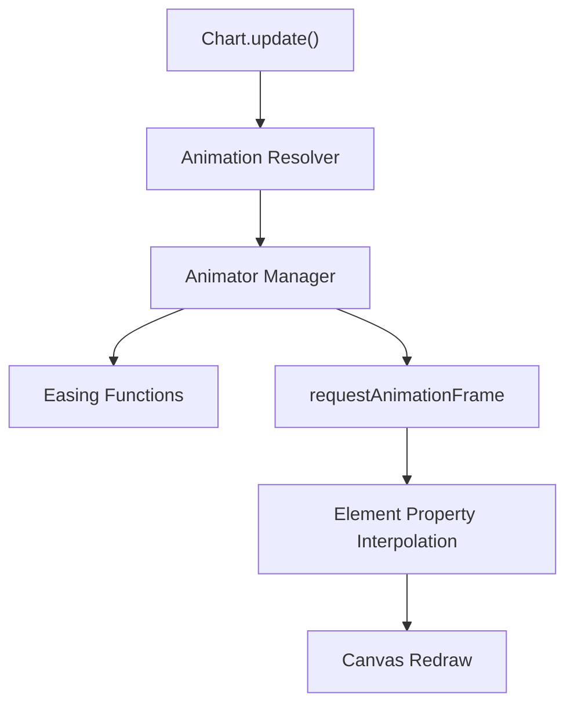
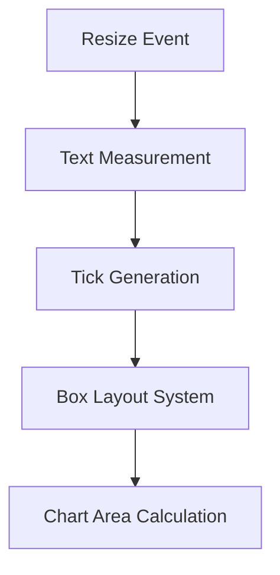
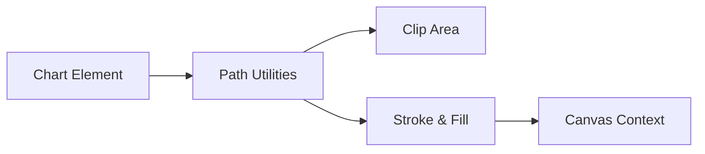
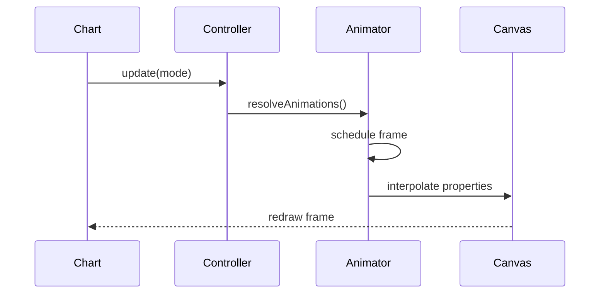
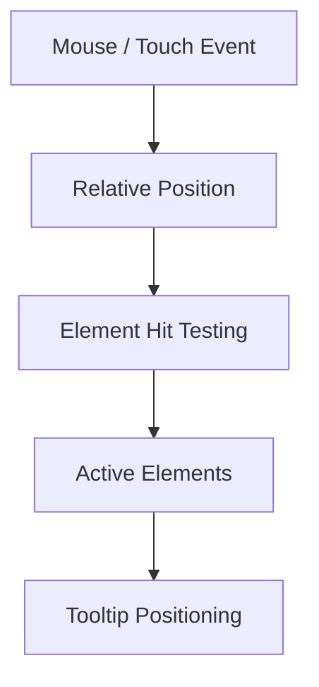

# Chart Rendering Utilities

The **Chart Rendering Utilities** module provides low-level drawing, color processing, geometry, animation, and canvas helper logic that underpins the Chart.js rendering engine embedded in MeshCentral.

It complements the higher-level rendering orchestration defined in [Chart Rendering](../chart-rendering.md) and works closely with the drawing primitives implemented in [Chart Rendering Core](../chart-rendering-core/chart-rendering-core.md).

At its core, this module exposes:

- Canvas drawing helpers (paths, clipping, text, shapes)
- Color parsing and transformation utilities
- Geometry and math helpers for arcs, lines, and interpolation
- Animation engine and easing functions
- Layout, scale, and tick computation utilities
- Interaction helpers (hit testing, coordinate transforms)

These utilities are primarily implemented via:

- `meshcentral.public.scripts.charts.ba`
- `meshcentral.public.scripts.charts.bn`

---

## 1. Architectural Role

Within the charts subsystem, Chart Rendering Utilities sit below controllers and elements but above the raw Canvas API.

### Responsibilities by Layer

| Layer | Responsibility |
|--------|----------------|
| Dataset Controllers | Translate datasets into drawable primitives |
| Chart Elements | Represent arcs, lines, bars, points |
| Chart Rendering Core | Orchestrates drawing lifecycle |
| **Chart Rendering Utilities** | Math, layout, color, animation, clipping |
| Canvas API | Pixel-level rendering |

---

## 2. Core Functional Domains

### 2.1 Geometry & Math Utilities

This module implements reusable math primitives used across all chart types:

- Angle normalization and conversion (degrees ↔ radians)
- Bezier interpolation and spline calculation
- Distance and hit detection helpers
- Bounding and clamping utilities
- Segment splitting and interpolation logic

These functions are used extensively by:

- Arc drawing (pie/doughnut charts)
- Line smoothing (line & radar charts)
- Bar bounding box calculations
- Tooltip positioning logic

---

### 2.2 Color Processing Engine

The module embeds a full color utility system (derived from `@kurkle/color`) that supports:

- RGB / RGBA parsing
- HSL conversions
- Hex serialization
- Alpha blending and interpolation
- Lighten / darken / saturate operations

This ensures consistent styling across:

- Dataset elements
- Hover states
- Legend markers
- Tooltip color boxes

---

### 2.3 Animation Engine

Chart Rendering Utilities implement a centralized animation manager:

- Property tweening
- Easing functions
- Frame scheduling via `requestAnimationFrame`
- Dataset-level animation orchestration

Supported easing families include:

- Linear
- Quadratic / Cubic / Quartic
- Elastic / Bounce
- Exponential / Circular

This animation layer is shared across all chart types.

---

### 2.4 Layout & Scale Computation

The module contains internal layout engines for:

- Axis tick spacing
- Label measurement and auto-skipping
- Padding and margin computation
- Responsive resizing logic

These utilities power:

- Linear, logarithmic, time, and radial scales
- Legend layout calculations
- Title and subtitle positioning

See scale-specific implementations in:

- [Chart Core](../../chart-core/chart-core.md)

---

### 2.5 Path & Shape Rendering

Reusable path helpers support:

- Rounded rectangle drawing
- Arc segment construction
- Line segment stitching
- Clipping regions
- Text rendering with backdrop and stroke

These utilities ensure consistent behavior for:

- Bars with rounded corners
- Donut arc borders
- Tooltip background boxes
- Legend markers

---

## 3. Animation Lifecycle Integration

The animation subsystem integrates tightly with controller updates.

Key responsibilities handled here:

- Property-level diffing
- Shared vs element-specific animation resolution
- Cancellation and replay logic
- Active/hover state transitions

---

## 4. Interaction Utilities

Chart Rendering Utilities also provide:

- Hit detection (`inRange`, `distanceBetweenPoints`)
- Relative coordinate calculation
- Event normalization
- Tooltip positioning strategies

This logic is consumed by the Tooltip and Interaction systems defined in higher modules.

---

## 5. Relationship to Other Modules

### Parent Module

- [Chart Rendering](../chart-rendering.md)

### Sibling Module

- [Chart Rendering Core](../chart-rendering-core/chart-rendering-core.md)

### Higher-Level Dependencies

- [Chart Core](../../chart-core/chart-core.md)
- [Chart Utilities](../../chart-utilities/chart-utilities.md)
- [Chart Data Handling](../../chart-data-handling/chart-data-handling.md)
- [Chart Interactions](../../chart-interactions/chart-interactions.md)

The Chart Rendering Utilities module does not directly manage datasets or user interactions; instead, it provides the reusable infrastructure those modules depend upon.

---

## 6. Why This Module Matters

Without Chart Rendering Utilities:

- Every chart type would need its own math and interpolation code
- Animations would be inconsistent across controllers
- Color handling would vary between components
- Layout behavior would diverge across scales
- Interaction logic would become duplicated and fragile

This module ensures:

- ✅ Consistent rendering semantics
- ✅ Reusable animation infrastructure
- ✅ Centralized geometry logic
- ✅ Stable layout and measurement system
- ✅ Unified color transformation pipeline

---

## Summary

The **Chart Rendering Utilities** module is the foundational rendering toolkit for the MeshCentral Chart.js integration. It abstracts mathematical computation, canvas drawing helpers, animation orchestration, color processing, layout measurement, and hit detection into a reusable infrastructure layer.

It enables the higher-level chart controllers and rendering core to remain declarative and focused on chart semantics, while this module handles the heavy computational and graphical lifting beneath the surface.