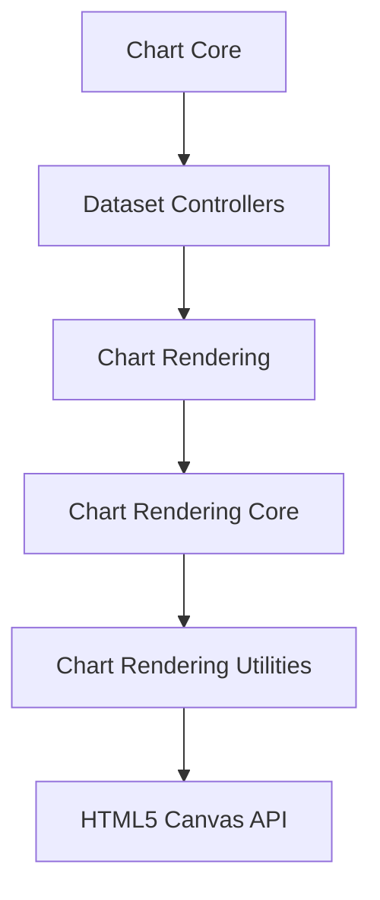
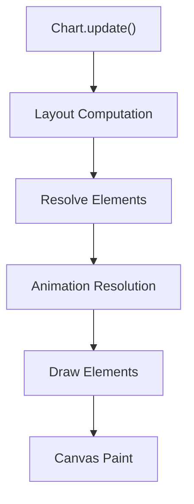
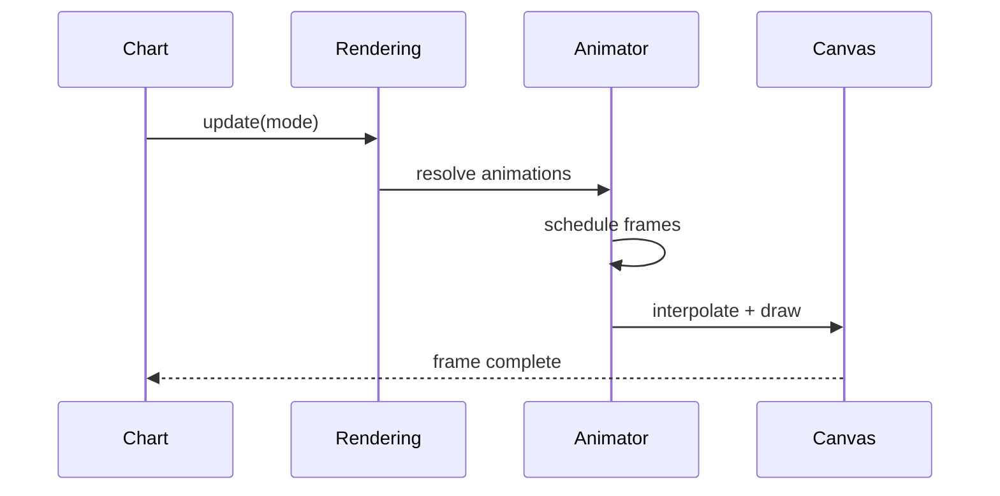
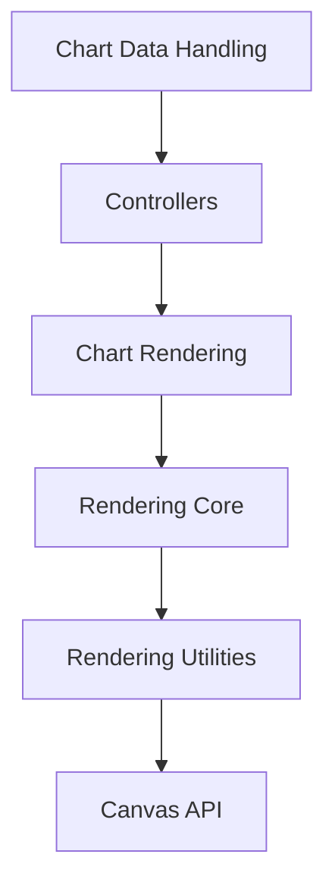

# Chart Rendering

The **Chart Rendering** module is responsible for transforming processed chart data and configuration into actual visual output on the HTML5 Canvas. It acts as the rendering engine of the charts subsystem in MeshCentral, bridging high-level chart controllers and the low-level canvas drawing API.

Located under:

```text
public/scripts
```

Primary namespace:

```text
meshcentral.public.scripts.charts.*
```

This module coordinates rendering orchestration, element drawing, animation integration, and rendering utilities to produce consistent and high-performance visualizations.

---

## 1. Purpose of the Module

The Chart Rendering module:

- Converts chart elements into drawable canvas paths
- Manages the rendering lifecycle (initial draw, update, resize, animation)
- Integrates animation and transition handling
- Delegates low-level drawing operations to rendering utilities
- Ensures consistent visual behavior across chart types (bar, line, pie, etc.)

It does **not** process raw datasets (see Chart Data Handling) and does **not** define chart semantics (see Chart Core). Instead, it focuses strictly on the visual rendering pipeline.

---

## 2. Architectural Position

Within the charts subsystem, Chart Rendering sits between controllers and the canvas context.



### Responsibility Layers

| Layer | Responsibility |
|--------|----------------|
| Chart Core | Configuration, plugin system, chart lifecycle |
| Dataset Controllers | Map datasets to chart elements |
| **Chart Rendering** | Orchestrates drawing and updates |
| Rendering Core | Element-level drawing implementation |
| Rendering Utilities | Math, color, animation, layout helpers |
| Canvas API | Pixel rendering |

---

## 3. Module Structure

### Location

```text
public/scripts
```

### Chart Rendering Components

#### Core Rendering

- `meshcentral.public.scripts.charts.Qs`
- `meshcentral.public.scripts.charts.Wo`
- `meshcentral.public.scripts.charts.Zt`

These components implement:

- Render orchestration
- Element drawing coordination
- Animation integration
- Redraw scheduling
- Canvas state management

#### Rendering Utilities

- `meshcentral.public.scripts.charts.ba`
- `meshcentral.public.scripts.charts.bn`

These provide:

- Path construction helpers
- Color processing
- Geometry and interpolation logic
- Animation engine
- Layout and measurement helpers

For detailed low-level implementation, see:

- [Chart Rendering Core](./chart-rendering-core/chart-rendering-core.md)
- [Chart Rendering Utilities](./chart-rendering-utilities/chart-rendering-utilities.md)

---

## 4. Internal Architecture

### 4.1 Rendering Flow

The module coordinates the full draw lifecycle:



**Phases explained:**

1. **Layout Phase**
   - Chart area computation
   - Axis and scale positioning
   - Padding and legend offsets

2. **Element Resolution**
   - Dataset controllers prepare drawable elements
   - Geometry and styles are finalized

3. **Animation Phase**
   - Property interpolation setup
   - Frame scheduling

4. **Draw Phase**
   - Canvas state configuration
   - Path generation
   - Stroke and fill operations

---

### 4.2 Rendering Core Interaction

The Chart Rendering module delegates actual drawing logic to the rendering core layer.


- **Rendering Core**: Implements how bars, arcs, lines, and points are drawn.
- **Rendering Utilities**: Supplies math, clipping, and animation helpers.
- **Canvas Context**: Executes `fill()`, `stroke()`, and transform operations.

---

## 5. Animation Integration

Animation is centrally coordinated during updates.



Key responsibilities:

- Resolving animation configurations
- Managing shared vs per-element transitions
- Coordinating `requestAnimationFrame`
- Cancelling or replaying animations
- Ensuring smooth state transitions

The rendering layer ensures animations remain consistent across all chart types.

---

## 6. Interaction with Other Chart Modules

The Chart Rendering module collaborates closely with:

### Upstream Modules

- **Chart Core**  
  Configuration, plugin hooks, lifecycle control

- **Chart Data Handling**  
  Dataset normalization and transformation

- **Chart Utilities**  
  Shared configuration and helper utilities

- **Chart Interactions**  
  Tooltip, hover, and active element handling

### Downstream Modules

- **Chart Rendering Core**  
  Element drawing logic

- **Chart Rendering Utilities**  
  Geometry, color, animation, and layout helpers



---

## 7. Design Principles

The Chart Rendering module is designed with:

- ✅ Clear separation of concerns  
- ✅ Rendering lifecycle orchestration  
- ✅ Animation-first architecture  
- ✅ Canvas abstraction layer  
- ✅ Reusable rendering primitives  

It ensures that:

- Chart types remain consistent
- Visual transitions are predictable
- Drawing logic is modular
- Rendering behavior is extensible

---

## 8. Why This Module Matters

Without the Chart Rendering layer:

- Controllers would need to directly manipulate the canvas
- Animation logic would be duplicated across chart types
- Rendering updates would become inconsistent
- Layout and drawing responsibilities would blur together

By centralizing rendering orchestration, this module:

- Guarantees visual consistency
- Simplifies extension and plugin development
- Enables performance optimizations
- Keeps chart semantics separate from drawing mechanics

---

## Summary

The **Chart Rendering** module is the visual engine of the MeshCentral charts subsystem. It translates resolved chart elements into animated, canvas-based graphics through a structured rendering lifecycle.

It coordinates:

- Layout computation
- Element rendering
- Animation management
- Canvas drawing

While higher-level modules define *what* to draw, the Chart Rendering module defines *how* it is drawn — efficiently, consistently, and extensibly.

For deeper implementation details:

- See **Chart Rendering Core**
- See **Chart Rendering Utilities**