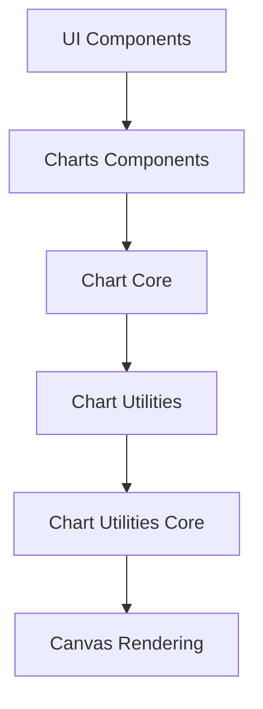
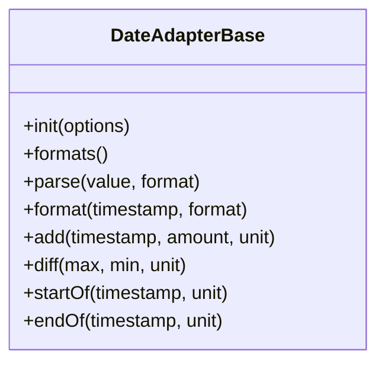
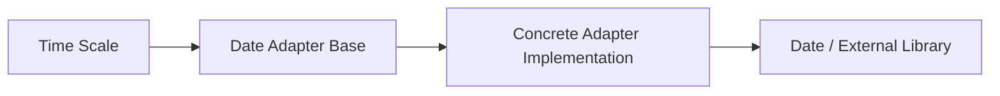
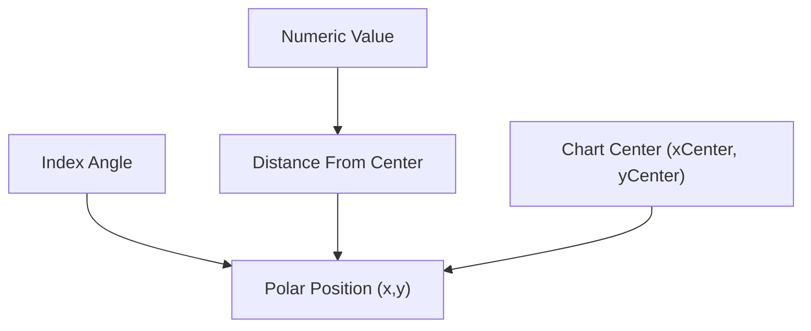
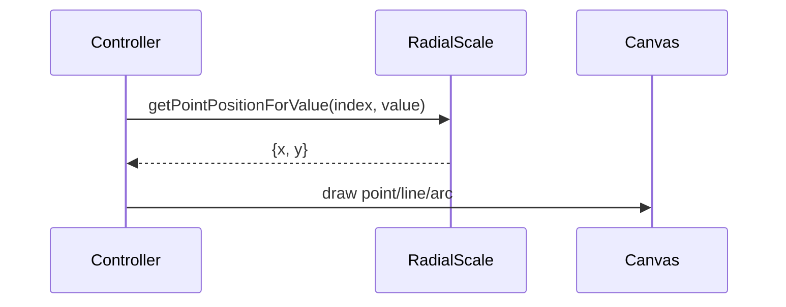
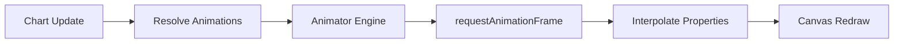
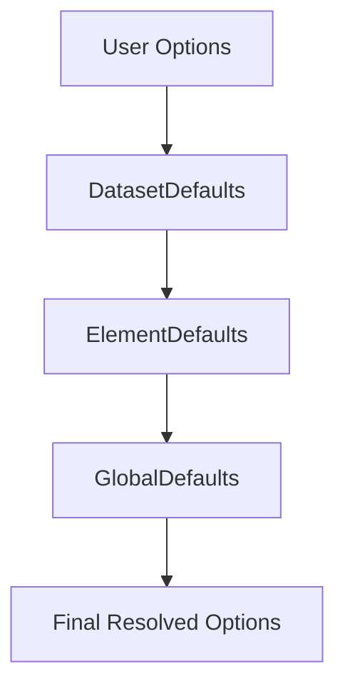
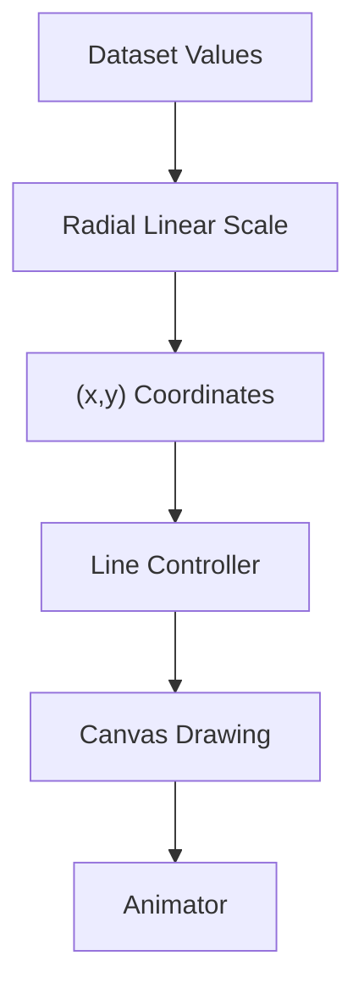

# Chart Utilities Core

The **Chart Utilities Core** module provides foundational utility primitives used by the Chart.js integration inside MeshCentral. It encapsulates low-level helper logic for:

- Type checking and value normalization
- Object/array traversal and merging
- Mathematical helpers (angles, interpolation, bounds)
- Animation scheduling and state tracking
- Color parsing and manipulation
- Configuration resolution and option routing

This module is a thin wrapper around core Chart.js utility internals and is consumed by higher-level chart modules such as:

- [Chart Utilities](../chart-utilities.md)
- [Chart Utilities Operations](../chart-utilities-operations/chart-utilities-operations.md)
- Chart Core and Chart Rendering layers

It does **not** render charts directly. Instead, it provides reusable building blocks that power dataset controllers, scales, elements, plugins, and layout systems.

---

## Core Components

From `public/scripts/charts.js`:

- `meshcentral.public.scripts.charts.Ln`
- `meshcentral.public.scripts.charts.Lo`

These correspond to:

- **Date Adapter Base (Ln)** – abstract date adapter interface
- **Radial Linear Scale (Lo)** – radial scale implementation used by radar and polar area charts

---

# 1. Architectural Role

Chart Utilities Core sits at the bottom of the charting stack and provides:

- Mathematical primitives
- Parsing and normalization helpers
- Scale computation logic
- Rendering geometry utilities
- Animation and easing logic
- Configuration resolution

## Layer Position



**Chart Utilities Core** is dependency-heavy but feature-light: it powers everything above it.

---

# 2. Date Adapter Base (Ln)

## Purpose

The `Ln` class defines the **abstract date adapter interface** used by time-based scales. It standardizes how dates are:

- Parsed
- Formatted
- Rounded
- Offset (add/diff)
- Aligned to time units

Concrete adapters (e.g., moment.js, luxon, native Date) override this interface.

## Interface Overview



## Responsibilities

- Provide consistent date handling across environments
- Abstract away timezone and formatting differences
- Support Time Scale and Time Series Scale

## Integration Flow



This design ensures chart time logic remains framework-agnostic.

---

# 3. Radial Linear Scale (Lo)

## Purpose

The `Lo` class implements a **radial linear scale**, used by:

- Radar charts
- Polar Area charts

It converts numeric values into distances from a chart center.

## Key Responsibilities

- Calculate min/max bounds
- Compute tick positions
- Map values → radius
- Convert radius → value
- Provide geometry for angle-based positioning

## Coordinate Model



## Core Calculations

### Distance from Center

Value-to-radius mapping:

```text
radius = drawingArea * (value - min) / (max - min)
```

### Polar Conversion

```text
x = xCenter + cos(angle) * radius
y = yCenter + sin(angle) * radius
```

## Rendering Interaction



---

# 4. Utility Categories in Chart Utilities Core

Although only `Ln` and `Lo` are exposed as core components in this sub-module, the file provides many utility domains:

## 4.1 Mathematical Utilities

- Angle normalization
- Distance calculations
- Bezier interpolation
- Clamp and bounds enforcement
- Logarithmic scaling helpers

Used by:

- Line interpolation
- Arc rendering
- Scale calculations

---

## 4.2 Geometry & Drawing Helpers

Canvas-level utilities:

- Arc path creation
- Rounded rectangle drawing
- Text measurement and layout
- Clipping regions
- Pixel alignment

These are shared by:

- Arc elements
- Bar elements
- Line elements
- Tooltip rendering

---

## 4.3 Animation Engine

Core animation primitives include:

- Property interpolation
- Easing functions
- Animation scheduling
- Frame throttling

### Animation Lifecycle



This system ensures smooth transitions across:

- Dataset updates
- Tooltip motion
- Scale changes

---

## 4.4 Configuration Resolution

Chart Utilities Core contains a layered option resolver:

- Global defaults
- Dataset defaults
- Element defaults
- Plugin overrides
- Instance overrides

### Resolution Strategy



This cascading system allows highly flexible configuration without duplication.

---

# 5. Interaction with Other Chart Modules

## With Chart Utilities

- Provides mathematical and parsing helpers
- Supplies scale infrastructure

## With Chart Rendering

- Supplies geometry calculations
- Supplies polar coordinate conversions

## With Chart Data Handling

- Provides normalization utilities
- Supports stacked calculations

---

# 6. Data Flow Through the Module

Example: Rendering a Radar Chart



1. Dataset values are parsed.
2. Radial Linear Scale converts values into radii.
3. Polar coordinates are calculated.
4. Line element draws polygon.
5. Animator interpolates transitions.

---

# 7. Performance Considerations

Chart Utilities Core is optimized for:

- Minimal object allocations during animation
- Cached computations (e.g., tick lookup tables)
- Efficient numeric interpolation
- Avoiding redundant parsing

Particularly important for:

- Large datasets
- High-frequency updates
- Real-time dashboards

---

# 8. Summary

The **Chart Utilities Core** module provides:

- Foundational scale logic (Radial Linear Scale)
- Abstract date handling (Date Adapter Base)
- Math, geometry, and animation primitives
- Configuration resolution framework

It is a **low-level infrastructure layer** that enables higher chart modules to focus on:

- Dataset logic
- Rendering orchestration
- UI interaction

Without this module, the charting system would lack consistent:

- Value mapping
- Animation behavior
- Time handling
- Polar coordinate support

This makes Chart Utilities Core a critical internal dependency for all chart types in the MeshCentral charting subsystem.