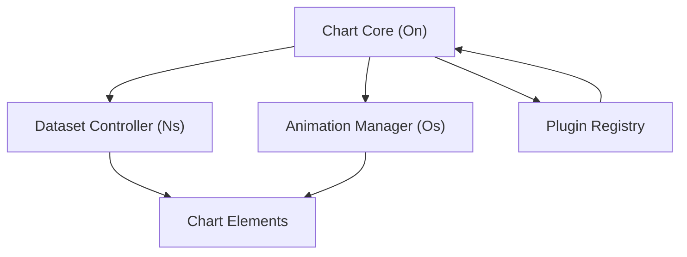
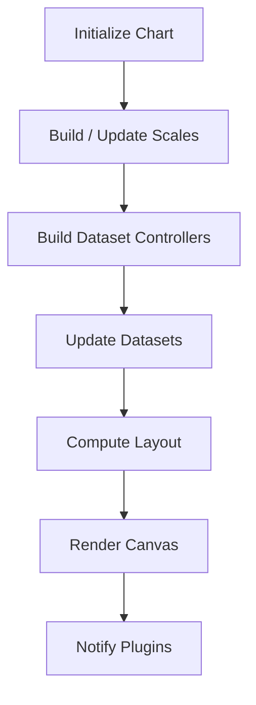
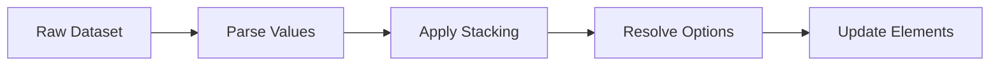
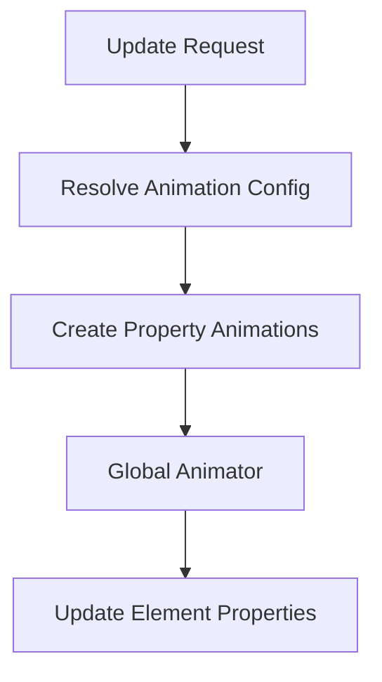
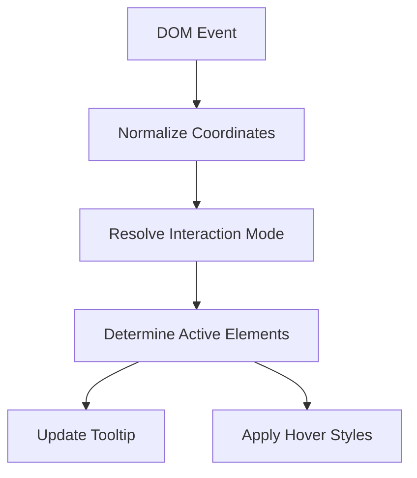
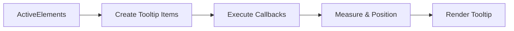
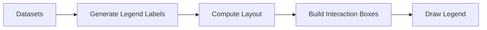
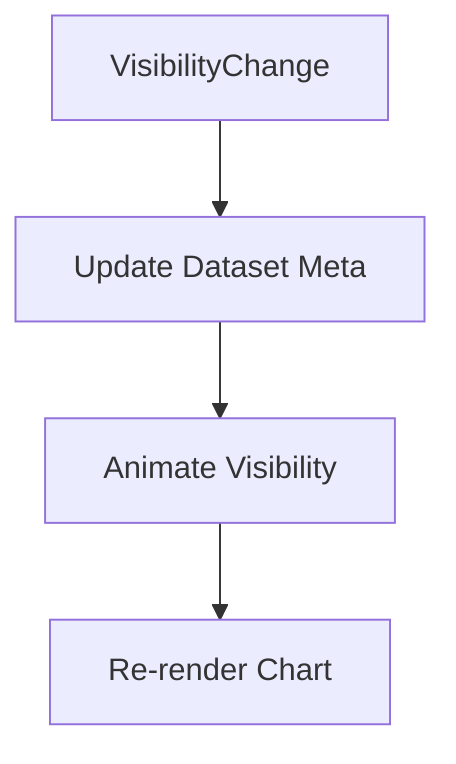
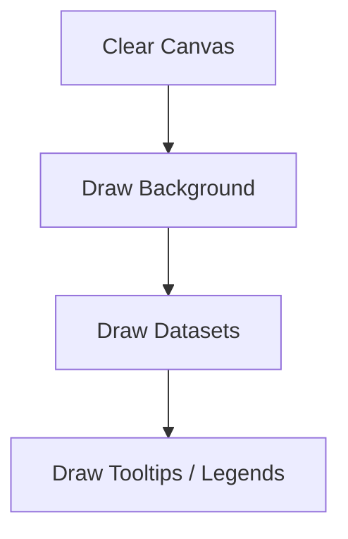
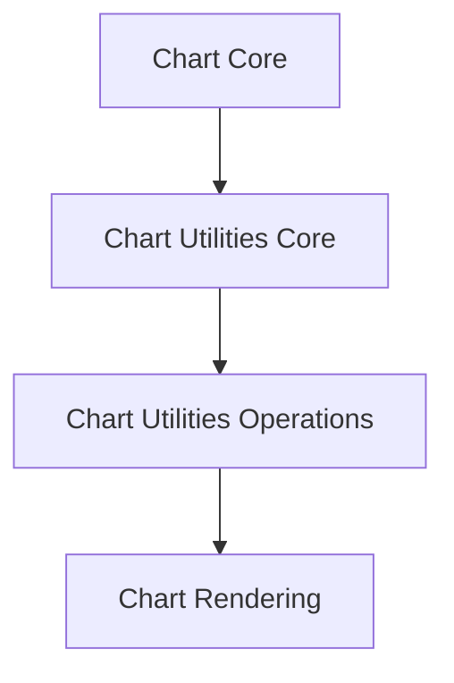

# Chart Utilities Operations

The **Chart Utilities Operations** module encapsulates advanced runtime operations that power Chart.js-based visualizations within the MeshCentral UI. It focuses on:

- Dataset lifecycle management
- Animation orchestration
- Interaction handling
- Tooltip, legend, and plugin coordination
- Rendering pipeline control

This module is implemented through the following core components:

- `meshcentral.public.scripts.charts.Ns` → Base Dataset Controller
- `meshcentral.public.scripts.charts.On` → Chart Core Class
- `meshcentral.public.scripts.charts.Os` → Animation Manager

It builds upon foundational utilities defined in [Chart Utilities Core](../chart-utilities-core/chart-utilities-core.md) and integrates tightly with higher-level chart logic from [Chart Core](../../chart-core/chart-core.md).

---

## 1. Architectural Overview

At runtime, Chart Utilities Operations coordinates controllers, elements, plugins, and animation subsystems.

### Responsibilities by Component

| Component | Responsibility |
|------------|----------------|
| Chart Core (On) | Chart lifecycle, layout, rendering, events |
| Dataset Controller (Ns) | Dataset parsing, stacking, element updates |
| Animation Manager (Os) | Property animations, transitions |

---

## 2. Chart Core (On)

The Chart Core class is the operational heart of the visualization system.

### Key Capabilities

- Canvas context acquisition and lifecycle control
- Dataset controller instantiation
- Scale management
- Plugin coordination
- Event binding and interaction dispatch
- Rendering orchestration

### Lifecycle Flow

The Chart Core ensures deterministic ordering:

1. Scales
2. Controllers
3. Layout
4. Dataset drawing
5. Plugin hooks

---

## 3. Dataset Controller (Ns)

The Dataset Controller manages a single dataset within a chart.

### Responsibilities

- Parsing raw data
- Managing stacked values
- Creating and updating elements
- Resolving dataset-level options
- Handling shared animation options

### Data Processing Pipeline

### Update Modes

The controller supports multiple update modes:

- `default`
- `reset`
- `active`
- `none`

Each mode alters how animations and element states are applied.

---

## 4. Animation Manager (Os)

The Animation Manager provides property-level animation resolution.

### Core Features

- Declarative animation configuration
- Per-property animation binding
- Transition support (`show`, `hide`, `resize`)
- Shared option animation caching

### Animation Resolution Flow

The Animation Manager integrates with the global animator to schedule frame updates efficiently.

---

## 5. Interaction & Event Handling

Chart Core handles event binding and delegates interaction resolution.

### Event Processing Flow

Supported interaction modes include:

- `nearest`
- `index`
- `dataset`
- `point`
- `x`
- `y`

---

## 6. Tooltip & Legend Integration

Although defined as plugins, tooltips and legends are operationally coordinated here.

### Tooltip Workflow

### Legend Workflow

Both rely on plugin hooks triggered by Chart Core.

---

## 7. Dataset Visibility & State Management

Chart Utilities Operations manages dataset visibility dynamically.

### Visibility Controls

- `setDatasetVisibility(index, visible)`
- `toggleDataVisibility(index)`
- `show()` / `hide()` transitions

### State Synchronization

---

## 8. Rendering Pipeline

Rendering occurs in layers.

### Dataset Drawing Order

- Sorted by `order`
- Then by dataset index
- Reverse traversal for stacked rendering

---

## 9. Integration Within Charts Components

Within the broader charts architecture:

This module:

- Executes runtime behavior
- Manages state transitions
- Coordinates animations
- Bridges data and rendering

---

## 10. Key Design Characteristics

### 1. Modular Controllers
Each chart type uses a specialized controller derived from the Dataset Controller.

### 2. Declarative Animations
Animations are defined in configuration and resolved dynamically.

### 3. Plugin-Driven Extensibility
Legend, Tooltip, Filler, and other systems hook into lifecycle events.

### 4. Data Normalization
Parsing supports:
- Primitive arrays
- Object datasets
- Stacked values
- Time-based axes

---

## 11. Relationship to Sibling Modules

- Foundational helpers: [Chart Utilities Core](../chart-utilities-core/chart-utilities-core.md)
- Higher-level orchestration: [Chart Utilities](../chart-utilities.md)
- Rendering implementations: [Chart Rendering](../../chart-rendering/chart-rendering.md)
- Dataset logic: [Chart Data Handling](../../chart-data-handling/chart-data-handling.md)

Chart Utilities Operations is the runtime engine that activates configuration, rendering, animation, and interaction into a cohesive charting experience.

---

## Summary

The **Chart Utilities Operations** module is the execution layer of the charting subsystem. It:

- Drives dataset updates
- Manages animations
- Coordinates interaction modes
- Executes plugin hooks
- Controls the render lifecycle

Without this layer, charts would lack dynamic behavior, animation, and user interaction. It transforms static configuration into responsive, animated, interactive visualizations.