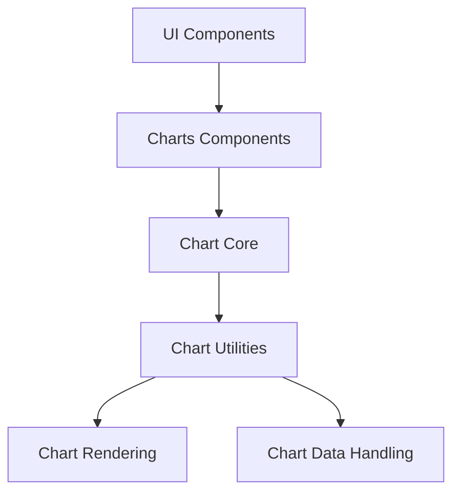
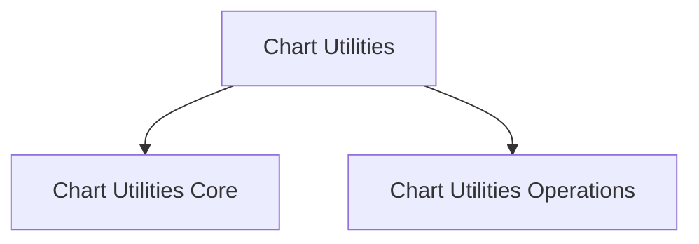
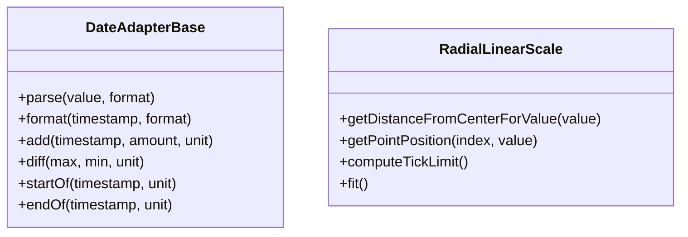
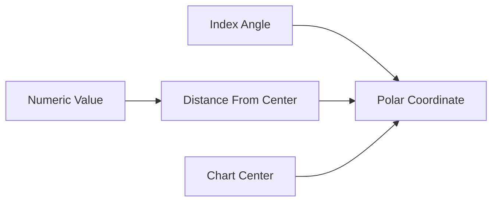
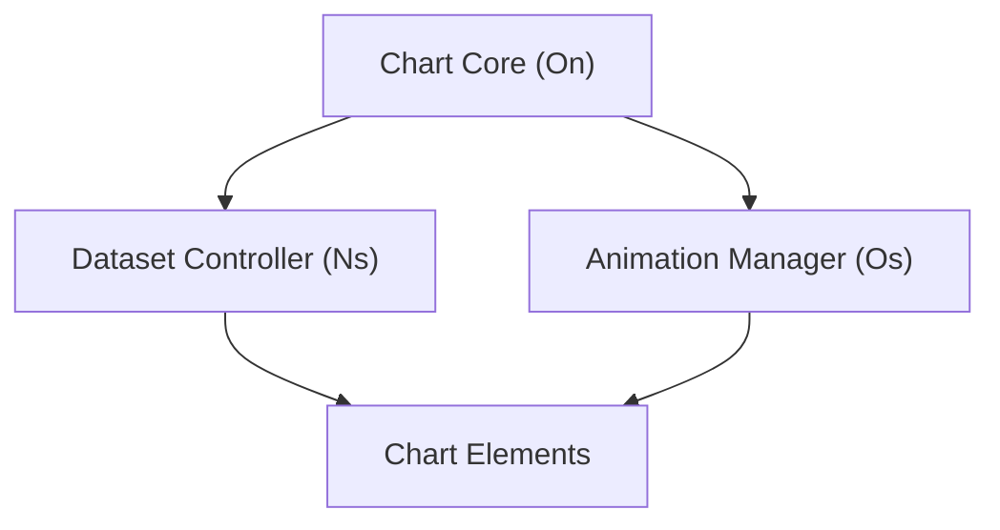
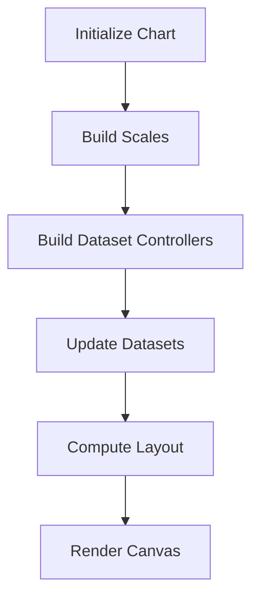
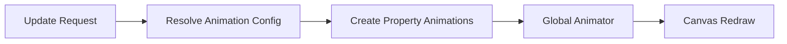
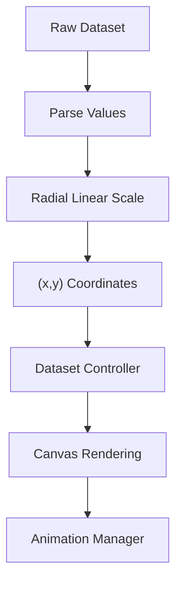
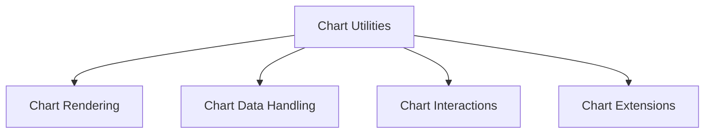

# Chart Utilities

The **Chart Utilities** module provides shared infrastructure and operational logic for the Chart.js-based visualization system embedded within MeshCentral. It acts as the bridge between low-level chart primitives and high-level rendering behavior, consolidating:

- Core scale and date abstractions  
- Runtime dataset lifecycle management  
- Animation orchestration  
- Interaction coordination  
- Chart instance lifecycle control  

This module lives under:

```text
public/scripts
```

and includes the following primary components:

- `meshcentral.public.scripts.charts.Ln`
- `meshcentral.public.scripts.charts.Lo`
- `meshcentral.public.scripts.charts.Ns`
- `meshcentral.public.scripts.charts.On`
- `meshcentral.public.scripts.charts.Os`

It is divided into two major internal layers:

- **Chart Utilities Core**
- **Chart Utilities Operations**

---

# 1. Purpose of the Module

The **Chart Utilities** module provides the runtime backbone of the charting subsystem. It ensures:

- Consistent date handling and scale computation  
- Dataset parsing and state management  
- Smooth animations and transitions  
- Plugin coordination (tooltip, legend, extensions)  
- Deterministic rendering order  

It does **not** directly implement drawing primitives (handled in Chart Rendering) nor raw data transformation (handled in Chart Data Handling). Instead, it orchestrates the execution lifecycle of charts.

---

# 2. Architectural Position

The module sits between chart configuration and canvas rendering.



Within the Charts Components subsystem:



---

# 3. Internal Structure

## 3.1 Chart Utilities Core

**Components:**

- `meshcentral.public.scripts.charts.Ln` → Date Adapter Base  
- `meshcentral.public.scripts.charts.Lo` → Radial Linear Scale  

### Responsibilities

- Abstract date interface for time-based scales  
- Radial coordinate transformations  
- Scale boundary calculations  
- Math and geometry helpers  
- Configuration resolution utilities  

### Core Abstractions



### Radial Coordinate Flow



For detailed documentation, see:

- [Chart Utilities Core](./chart-utilities-core/chart-utilities-core.md)

---

## 3.2 Chart Utilities Operations

**Components:**

- `meshcentral.public.scripts.charts.Ns` → Dataset Controller  
- `meshcentral.public.scripts.charts.On` → Chart Core Class  
- `meshcentral.public.scripts.charts.Os` → Animation Manager  

### Responsibilities

- Chart instance lifecycle management  
- Dataset parsing and stacking  
- Animation scheduling and property interpolation  
- Interaction dispatch  
- Plugin lifecycle coordination  

### Runtime Coordination



### Chart Lifecycle



### Animation Resolution



For detailed documentation, see:

- [Chart Utilities Operations](./chart-utilities-operations/chart-utilities-operations.md)

---

# 4. Data and Control Flow

Example: Rendering a Radar Chart



The module ensures:

1. Data is parsed and normalized  
2. Scales convert values into renderable coordinates  
3. Controllers update elements  
4. Animations interpolate state changes  
5. Rendering executes in correct order  

---

# 5. Integration with Other Chart Subsystems

The **Chart Utilities** module depends on and interacts with:

- **Chart Core** → Structural chart definitions  
- **Chart Rendering** → Canvas drawing primitives  
- **Chart Data Handling** → Transformation and aggregation  
- **Chart Interactions** → Event processing  
- **Chart Extensions** → Plugin-based augmentation  



It acts as the orchestration layer connecting these subsystems into a cohesive runtime engine.

---

# 6. Design Characteristics

The module is built around several key principles:

### 1. Layered Responsibility
- Core utilities provide pure logic.
- Operations layer executes runtime behavior.

### 2. Declarative Animations
Animation behavior is resolved dynamically from configuration.

### 3. Deterministic Rendering
Explicit ordering of:
- Scales  
- Controllers  
- Datasets  
- Plugins  

### 4. Extensibility
Plugin hooks allow:
- Tooltip customization  
- Legend customization  
- Custom controllers  
- Rendering overrides  

---

# 7. Summary

The **Chart Utilities** module is the operational backbone of the MeshCentral charting system. It:

- Provides date and scale abstractions  
- Manages dataset lifecycle and visibility  
- Orchestrates animations  
- Coordinates plugins and interactions  
- Bridges configuration and rendering  

It is not a UI layer and not a pure rendering layer — instead, it is the execution engine that transforms chart configuration and data into animated, interactive visualizations within the MeshCentral interface.

For deeper technical details, refer to:

- **Chart Utilities Core**
- **Chart Utilities Operations**