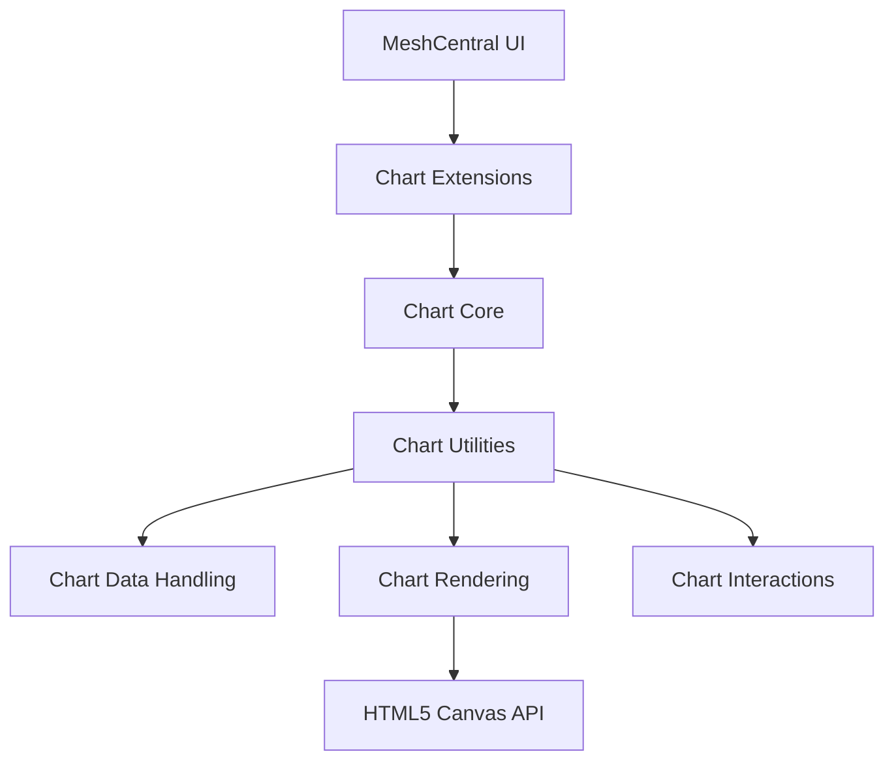
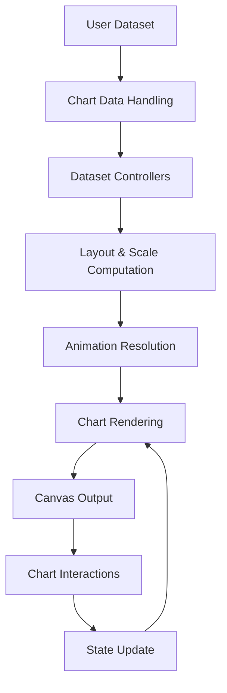
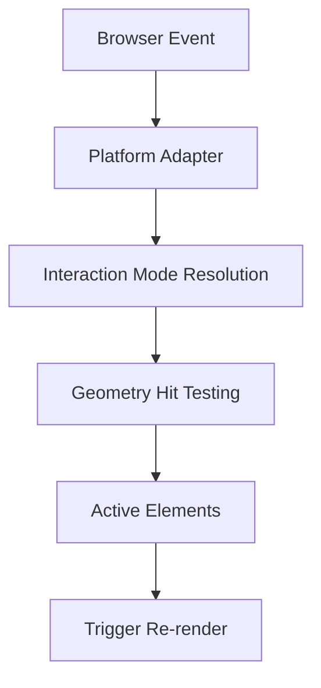
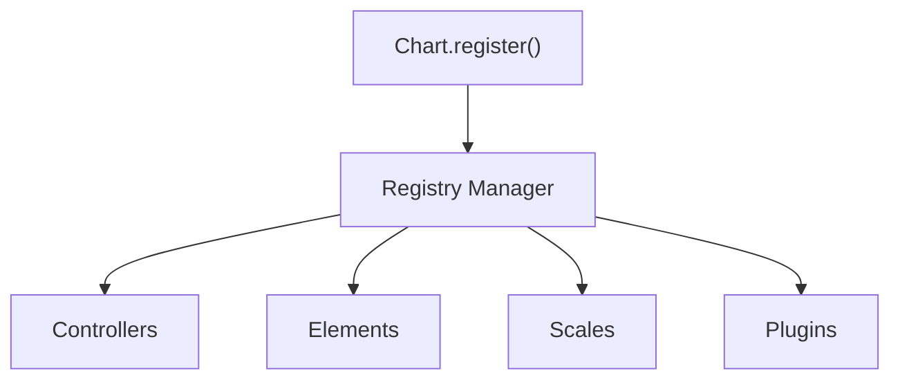

# Charts Components

The **Charts Components** module provides the complete charting subsystem used within the MeshCentral web interface. It is responsible for transforming structured datasets into animated, interactive, and extensible visualizations rendered on HTML5 Canvas.

Located under:

```text
public/scripts
└── charts
```

The module encapsulates the full visualization pipeline:

- Chart configuration and lifecycle management  
- Data parsing, normalization, and aggregation  
- Scale computation and geometric transformation  
- Canvas-based rendering  
- User interaction handling  
- Extension and plugin infrastructure  

It serves as the analytics and visualization engine for dashboards, reports, monitoring views, and statistical panels in the MeshCentral UI.

---

# 1. Repository Structure

## Base Path

```text
public/scripts
```

## Namespace

```text
meshcentral.public.scripts.charts.*
```

## High-Level Module Structure

```text
charts-components
├── chart-core
├── chart-utilities
├── chart-rendering
├── chart-data-handling
├── chart-interactions
└── chart-extensions
```

---

# 2. Architectural Overview

The **Charts Components** module is built as a layered architecture where each subsystem has a clearly defined responsibility.



### Layer Responsibilities

| Layer | Responsibility |
|--------|----------------|
| Chart Core | Configuration model, base abstractions, lifecycle |
| Chart Utilities | Runtime orchestration, scale/date abstractions |
| Chart Data Handling | Parsing, transformation, aggregation |
| Chart Rendering | Canvas drawing and animation |
| Chart Interactions | Hover, click, hit detection |
| Chart Extensions | Plugin, layout, and registry extensibility |

---

# 3. End-to-End Data & Render Flow

The complete rendering lifecycle of a chart follows a deterministic pipeline:



This architecture ensures:

- Clean separation between computation and rendering  
- Deterministic updates  
- Animation-aware state transitions  
- Extensibility without modifying core logic  

---

# 4. Core Submodules

## 4.1 Chart Core

**Purpose:** Foundational abstractions and lifecycle control.

### Key Components

- `meshcentral.public.scripts.charts.Cs`
- `meshcentral.public.scripts.charts.Fa`
- `meshcentral.public.scripts.charts.Hn`
- `meshcentral.public.scripts.charts.Hs`
- `meshcentral.public.scripts.charts.Js`

### Responsibilities

- Base chart configuration model  
- Dataset controller definitions  
- Scale abstractions  
- Visual element base classes  
- Animation primitives  

For full details, see:

- **Chart Core** documentation  

---

## 4.2 Chart Utilities

**Purpose:** Runtime orchestration and operational backbone.

### Key Components

- `meshcentral.public.scripts.charts.Ln`
- `meshcentral.public.scripts.charts.Lo`
- `meshcentral.public.scripts.charts.Ns`
- `meshcentral.public.scripts.charts.On`
- `meshcentral.public.scripts.charts.Os`

### Responsibilities

- Date and radial scale abstractions  
- Chart instance lifecycle  
- Animation management  
- Dataset controller coordination  

For full details, see:

- **Chart Utilities**
- **Chart Utilities Core**
- **Chart Utilities Operations**

---

## 4.3 Chart Rendering

**Purpose:** Convert element models into canvas drawing operations.

### Key Components

- `meshcentral.public.scripts.charts.Qs`
- `meshcentral.public.scripts.charts.Wo`
- `meshcentral.public.scripts.charts.Zt`
- `meshcentral.public.scripts.charts.ba`
- `meshcentral.public.scripts.charts.bn`

### Responsibilities

- Render orchestration  
- Element drawing  
- Animation frame scheduling  
- Canvas state management  

For full details, see:

- **Chart Rendering**
- **Chart Rendering Core**
- **Chart Rendering Utilities**

---

## 4.4 Chart Data Handling

**Purpose:** Transform raw dataset input into rendering-ready models.

### Key Components

- `meshcentral.public.scripts.charts.bo`
- `meshcentral.public.scripts.charts.bt`
- `meshcentral.public.scripts.charts.de`
- `meshcentral.public.scripts.charts.jn`
- `meshcentral.public.scripts.charts.la`

### Responsibilities

- Dataset parsing  
- Option resolution  
- Geometry computation  
- Stack aggregation  
- Scale range updates  

For full details, see:

- **Chart Data Handling**
- **Chart Data Processing**
- **Chart Data Transformation**
- **Chart Data Aggregation**

---

## 4.5 Chart Interactions

**Purpose:** Enable interactive chart behavior.

### Key Components

- `meshcentral.public.scripts.charts.ls`
- `meshcentral.public.scripts.charts.mo`
- `meshcentral.public.scripts.charts.rs`
- `meshcentral.public.scripts.charts.sn`
- `meshcentral.public.scripts.charts.so`

### Responsibilities

- Event normalization  
- Interaction mode resolution  
- Hit detection  
- Hover state management  
- Tooltip activation  



For full details, see:

- **Chart Interactions**

---

## 4.6 Chart Extensions

**Purpose:** Extensibility and plugin infrastructure.

### Key Components

- `meshcentral.public.scripts.charts.tn`
- `meshcentral.public.scripts.charts.wo`
- `meshcentral.public.scripts.charts.ws`
- `meshcentral.public.scripts.charts.ya`

### Responsibilities

- Runtime wrapper integration  
- Registry-based component registration  
- Plugin lifecycle management  
- Layout box coordination  
- Option resolution  



For full details, see:

- **Chart Extensions**
- **Chart Extensions Core**
- **Chart Extensions Utilities**

---

# 5. Design Principles

The **Charts Components** module is built around:

### ✅ Layered Architecture  
Clear separation between data, rendering, interaction, and extension.

### ✅ Deterministic Lifecycle  
Explicit update → layout → draw → animate pipeline.

### ✅ Animation-First State Model  
Property interpolation is centrally coordinated.

### ✅ Extensibility  
Registry-driven architecture allows new chart types and plugins without modifying core logic.

### ✅ Canvas Abstraction  
Drawing logic is isolated from configuration and computation.

---

# 6. Summary

The **Charts Components** module is the complete visualization engine of the MeshCentral UI.

It:

- Converts raw datasets into normalized internal representations  
- Computes scales and geometry  
- Produces animated, canvas-rendered charts  
- Handles user interactions and hover states  
- Supports plugin and extension mechanisms  
- Maintains a deterministic and extensible lifecycle  

By separating concerns across clearly defined subsystems, the module ensures scalability, maintainability, performance, and extensibility across all chart-driven interfaces in MeshCentral.