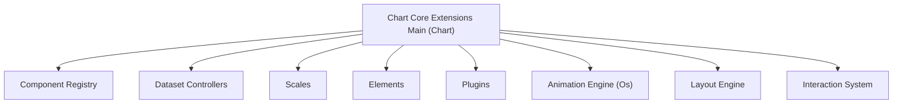
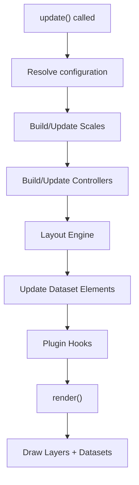
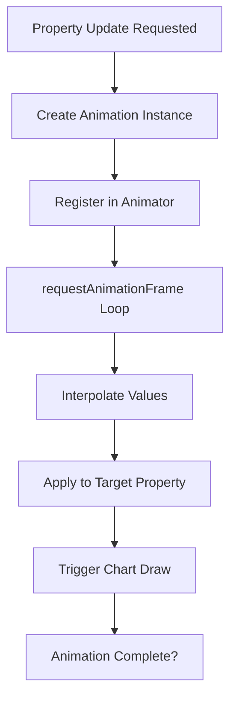
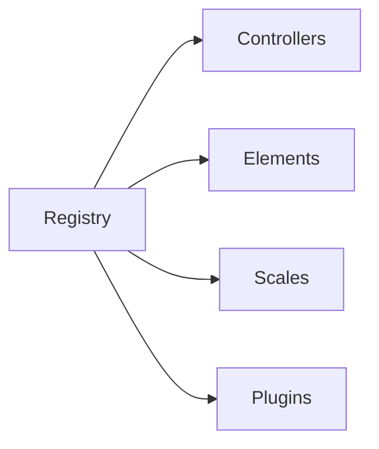
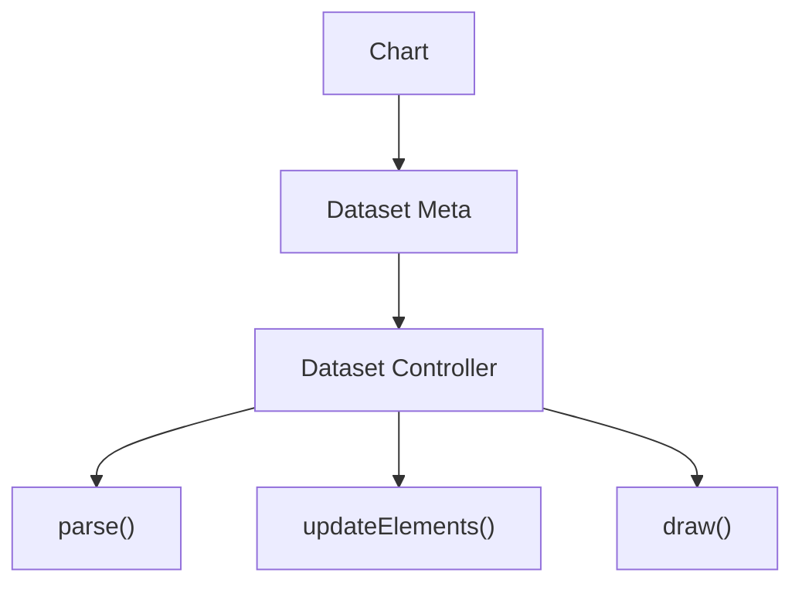
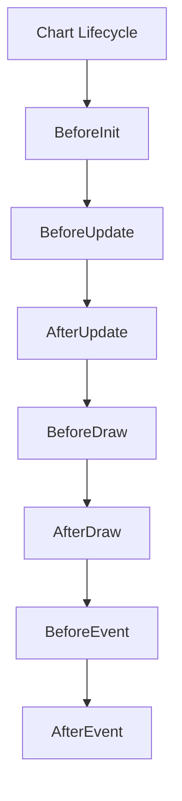

# Chart Core Extensions Main

Chart Core Extensions Main is the primary extension layer of the Chart Core subsystem. It encapsulates the central extension logic built on top of Chart.js v4.3.3 and provides the runtime glue between core chart controllers, elements, animations, scales, plugins, and rendering pipelines.

This module is responsible for:

- Registering and exposing core Chart.js components
- Managing controllers, elements, scales, and plugins
- Coordinating animation lifecycles
- Handling layout, rendering, and event dispatch
- Providing extensibility hooks for higher-level chart features

The core components implemented in this module are:

- `meshcentral.public.scripts.charts.On` → Chart (main orchestrator class)
- `meshcentral.public.scripts.charts.Os` → Animation registry and animation coordinator

---

## 1. Architectural Overview

Chart Core Extensions Main acts as the runtime kernel of the charting system. It binds together:

- Dataset controllers (Bar, Line, Pie, etc.)
- Scale implementations (Linear, Time, Logarithmic, Radial)
- Elements (Arc, Line, Point, Bar)
- Layout engine
- Plugin system
- Animation engine
- Interaction system

### High-Level Architecture

The Chart class (`On`) coordinates all subsystems and ensures consistent rendering and state transitions.

---

## 2. Core Component: Chart (On)

The Chart class is the top-level runtime controller. It:

- Owns canvas context and rendering lifecycle
- Manages dataset metadata
- Builds and updates scales
- Executes layout passes
- Triggers animations
- Dispatches plugin hooks
- Processes user interaction events

### Internal Responsibilities

1. **Initialization**
   - Acquire rendering context
   - Detect platform (DOM or basic platform)
   - Register listeners with animation engine
   - Initialize plugins

2. **Update Cycle**
   - Update configuration
   - Rebuild scales
   - Sync dataset controllers
   - Compute layout
   - Update elements
   - Trigger animations

3. **Render Cycle**
   - Clear canvas
   - Draw background
   - Draw datasets
   - Draw overlays (legend, tooltip, titles)

### Update Lifecycle Flow

---

## 3. Core Component: Animation Engine (Os)

The `Os` class manages animation definitions and property transitions. It works with:

- Element properties (x, y, width, height, radius, angles)
- Dataset visibility transitions
- Tooltip transitions
- Layout resize animations

### Animation Model

Each animation consists of:

- Target object
- Property
- From value
- To value
- Duration
- Easing function

The animation engine:

- Registers animations per chart instance
- Batches frame updates via requestAnimationFrame
- Emits progress and completion events
- Integrates with dataset controller updates

### Animation Flow

---

## 4. Registry and Extensibility Model

Chart Core Extensions Main registers and exposes all major subsystems:

- Controllers
- Elements
- Scales
- Plugins
- Platforms

The registry system enables:

- Dynamic registration of new chart types
- Custom scale injection
- Plugin-based lifecycle hooks
- Custom element drawing logic

### Registry Structure

Each registered component is keyed by `id` and instantiated dynamically during chart configuration.

---

## 5. Dataset Controller Integration

Dataset controllers are responsible for:

- Parsing raw data
- Mapping values to scale coordinates
- Updating visual elements
- Handling stacking logic
- Resolving styling options

The Chart class:

- Instantiates controllers per dataset
- Supplies scale references
- Calls `update()` during render cycle
- Delegates drawing to controllers

### Controller Interaction

---

## 6. Scale Coordination

Scales are dynamically created based on configuration. Chart Core Extensions Main:

- Determines axis type (linear, time, category, radial)
- Configures tick generation
- Computes pixel mapping functions
- Manages min/max resolution
- Integrates scale bounds into layout

Scales influence:

- Element geometry
- Tooltip positioning
- Interaction hit detection

---

## 7. Plugin Lifecycle Integration

The plugin system provides hooks such as:

- beforeInit
- beforeUpdate
- afterUpdate
- beforeDraw
- afterDraw
- beforeEvent
- afterEvent
- beforeDestroy

Plugins are resolved via the registry and notified during key lifecycle phases.

This allows extension features like:

- Legend
- Tooltip
- Title / Subtitle
- Filler
- Decimation
- Color assignment

---

## 8. Interaction and Event Processing

Chart Core Extensions Main handles:

- Mouse and touch events
- Active element resolution
- Hover styles
- Click handling
- Tooltip activation

The interaction engine maps pointer coordinates to dataset elements using spatial checks and scale-aware hit detection.

---

## 9. Rendering Model

Rendering is layered:

1. Background
2. Scales
3. Dataset elements
4. Overlays (Legend, Tooltip, Titles)

The chart uses a retained model:

- Elements maintain state
- Updates mutate properties
- Animations interpolate properties
- Draw phase renders current state

---

## 10. How This Module Fits into the Overall System

Within the broader chart architecture:

- **Chart Core Utilities** provide helpers and low-level math.
- **Chart Core Logic** handles data parsing and computation.
- **Chart Core Extensions Main** orchestrates runtime execution.
- Higher-level chart modules depend on this runtime kernel.

Chart Core Extensions Main is therefore the execution backbone of the entire chart subsystem. It transforms configuration and data into animated, interactive visualizations while maintaining extensibility through registries and plugins.

---

## Summary

Chart Core Extensions Main:

- Implements the main Chart runtime
- Coordinates controllers, scales, and elements
- Manages animation lifecycles
- Executes layout and rendering passes
- Dispatches plugin hooks
- Handles interaction and tooltips

It is the central execution layer that turns structured dataset definitions into fully interactive and animated charts.