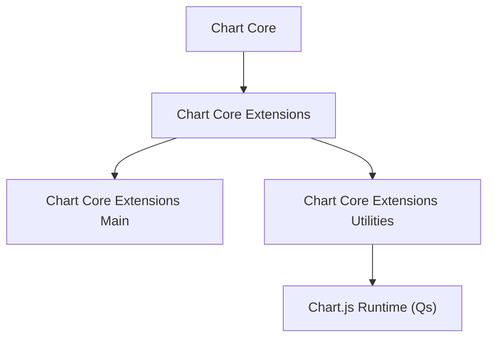
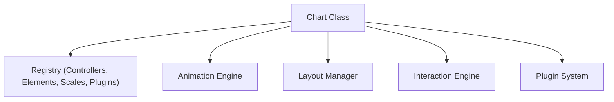
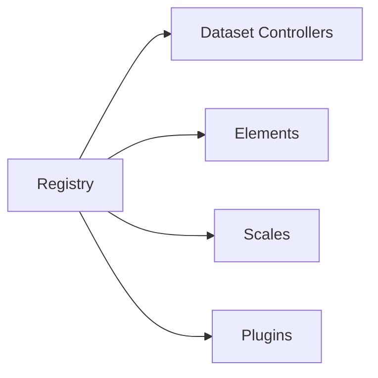
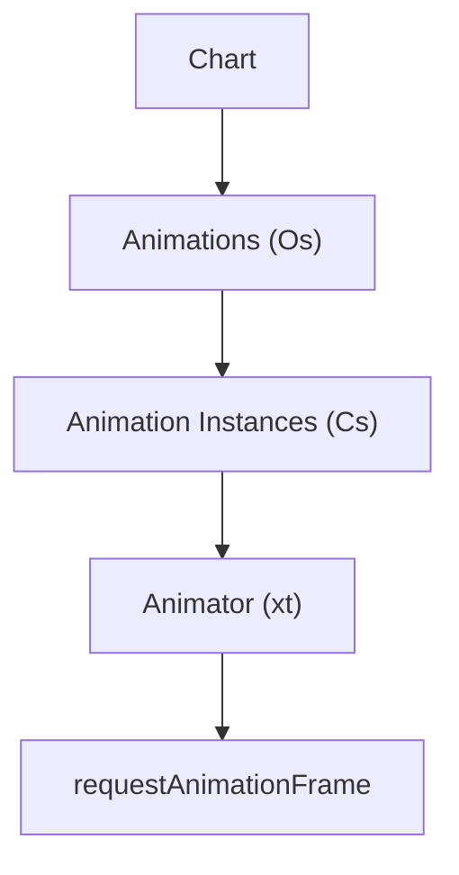
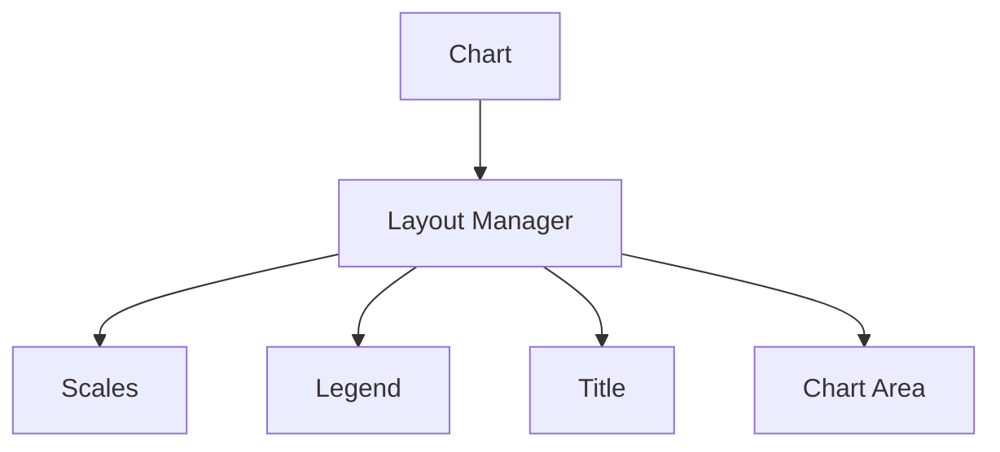
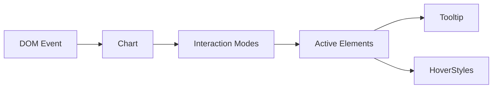
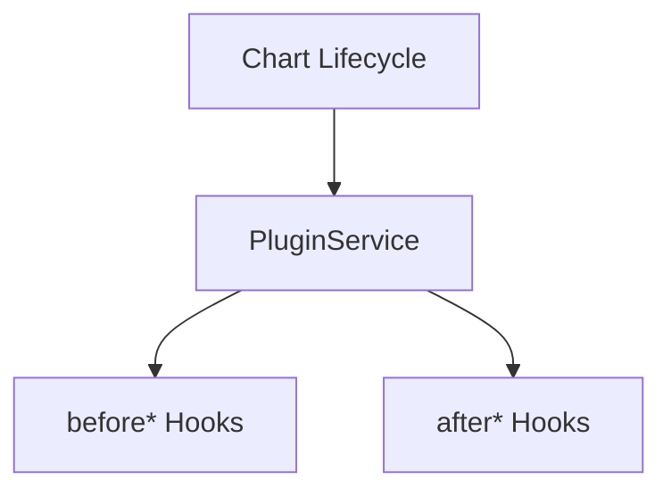
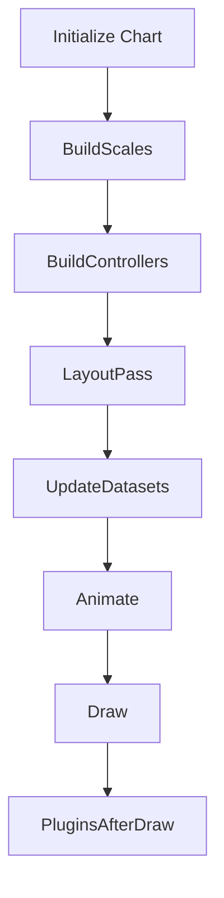
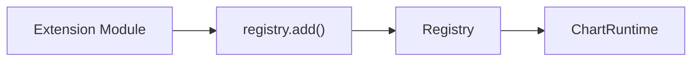

# Chart Core Extensions Utilities

The **Chart Core Extensions Utilities** module provides the low-level utility layer that powers Chart.js integration within the chart core extension system. It encapsulates the UMD build of Chart.js (v4.x) and exposes the `meshcentral.public.scripts.charts.Qs` component, which acts as the foundational registry and extension utility entry point for charts.

This module is responsible for:

- Bootstrapping the Chart.js runtime
- Registering controllers, elements, scales, and plugins
- Providing animation, layout, interaction, and rendering utilities
- Exposing extension hooks for higher-level chart modules

It sits at the bottom of the chart extension hierarchy and supports the higher-level modules such as [Chart Core Extensions Main](../chart-core-extensions-main/chart-core-extensions-main.md).

---

## 1. Architectural Role

Within the chart module tree, Chart Core Extensions Utilities provides the runtime engine and extension plumbing used by all chart types.

### Module Hierarchy Context

- **Chart Core Extensions Main** defines higher-level extension behaviors.
- **Chart Core Extensions Utilities** embeds and configures the Chart.js runtime.
- `Qs` represents the compiled Chart.js UMD bundle entry point.

---

## 2. Core Component: Qs (Chart.js UMD Runtime)

**Component:** `meshcentral.public.scripts.charts.Qs`

This component encapsulates the entire Chart.js runtime, including:

- Chart class (`Chart`)
- Controllers (Line, Bar, Pie, Radar, etc.)
- Elements (Arc, Line, Point, Bar)
- Scales (Linear, Logarithmic, Time, Radial)
- Plugins (Legend, Tooltip, Title, Subtitle, Filler, Decimation, Colors)
- Animation engine and layout system

### High-Level Runtime Structure

The `Chart` class coordinates:

- Dataset controllers
- Rendering lifecycle
- Event handling
- Plugin notifications
- Layout passes
- Animation frames

---

## 3. Internal Subsystems

The bundled runtime inside Qs includes several distinct subsystems.

### 3.1 Registry System

The registry (`tn`) manages:

- Dataset controllers
- Elements
- Scales
- Plugins

This enables:

- Runtime registration of extensions
- Modular addition/removal of components
- Strong decoupling between chart types

---

### 3.2 Animation Engine

The animation engine is composed of:

- `Cs` (Animation instance)
- `Os` (Animation collection)
- `xt` (Global animator loop)

Responsibilities:

- Property interpolation
- Easing functions
- Batched frame updates
- Dataset transition effects

---

### 3.3 Layout System

The layout manager (`as`) coordinates positioning of:

- Scales
- Legends
- Titles
- Subtitles
- Chart area

This ensures:

- Responsive resizing
- Automatic padding
- Consistent placement of UI components

---

### 3.4 Interaction System

The interaction module (`Xi`) handles:

- Hover detection
- Nearest point calculation
- Index and dataset modes
- Click handling

Interaction modes include:

- `nearest`
- `index`
- `dataset`
- `point`
- `x` / `y`

---

### 3.5 Plugin System

The plugin service (`sn`) allows lifecycle hooks:

- `beforeInit`
- `beforeUpdate`
- `beforeDraw`
- `afterDraw`
- `beforeEvent`
- `afterEvent`

Built-in plugins included in this module:

- Legend
- Tooltip
- Title
- Subtitle
- Filler
- Decimation
- Colors

---

## 4. Rendering Pipeline

The rendering lifecycle follows a deterministic sequence.

### Key Phases

1. Configuration resolution
2. Scale construction
3. Dataset parsing
4. Layout computation
5. Animation preparation
6. Canvas rendering
7. Plugin post-processing

---

## 5. Extension Integration Model

Chart Core Extensions Utilities enables higher-level modules to:

- Register custom controllers
- Register custom elements
- Register custom scales
- Attach custom plugins
- Override defaults

### Registration Flow

This design ensures:

- Safe modular extension
- No modification of core runtime
- Clean separation of responsibilities

---

## 6. Relationship with Chart Core Extensions Main

- **Chart Core Extensions Main** defines how extensions are structured and applied.
- **Chart Core Extensions Utilities** provides the actual execution engine and extension plumbing.

In other words:

- Utilities = Runtime + Infrastructure
- Main = Behavioral Extension Layer

Refer to:

- [Chart Core Extensions Main](../chart-core-extensions-main/chart-core-extensions-main.md)

---

## 7. Responsibilities Summary

| Responsibility | Description |
|---------------|-------------|
| Runtime Bootstrapping | Initializes Chart.js and global registry |
| Animation Engine | Handles interpolated transitions |
| Layout Management | Computes legend/title/scale layout |
| Interaction Engine | Resolves hover/click behaviors |
| Plugin Framework | Enables lifecycle extensions |
| Rendering Pipeline | Coordinates canvas drawing |
| Extension Registration | Supports modular chart augmentation |

---

## 8. When to Modify This Module

This module should be modified only when:

- Upgrading Chart.js version
- Adjusting global runtime behavior
- Adding low-level custom controllers or scales
- Extending plugin registration at the core level

Most feature-level enhancements should be implemented in higher modules (e.g., Chart Core Extensions Main), not here.

---

## Conclusion

The **Chart Core Extensions Utilities** module is the foundational runtime layer for the chart system. By embedding and configuring Chart.js, it provides:

- A fully modular chart engine
- A pluggable extension architecture
- Animation and interaction infrastructure
- Layout and rendering orchestration

All higher-level chart extension modules depend on this layer to execute visualizations consistently and efficiently.