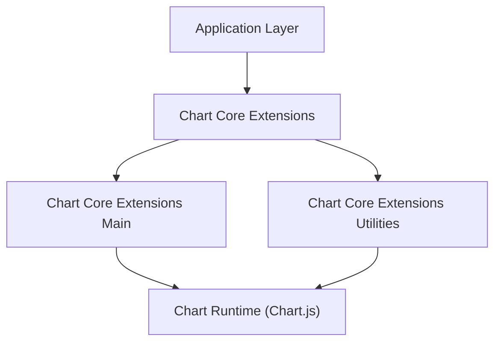
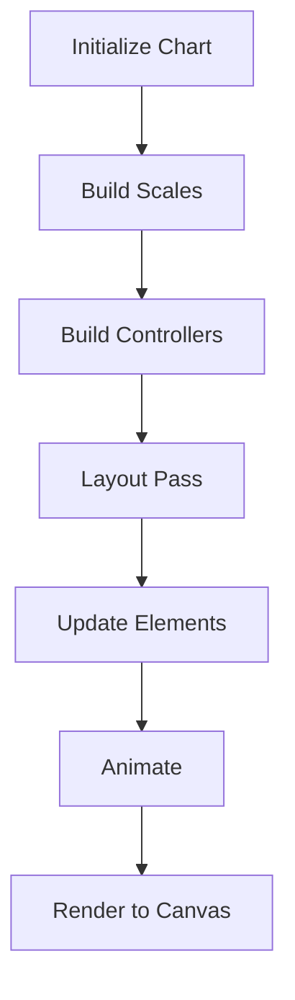
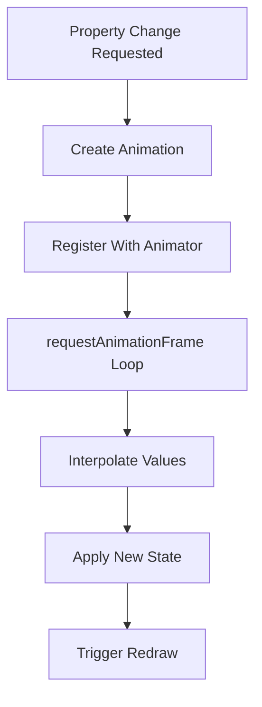
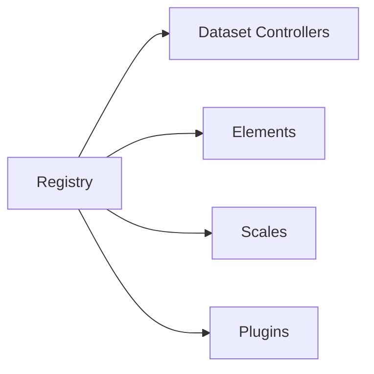
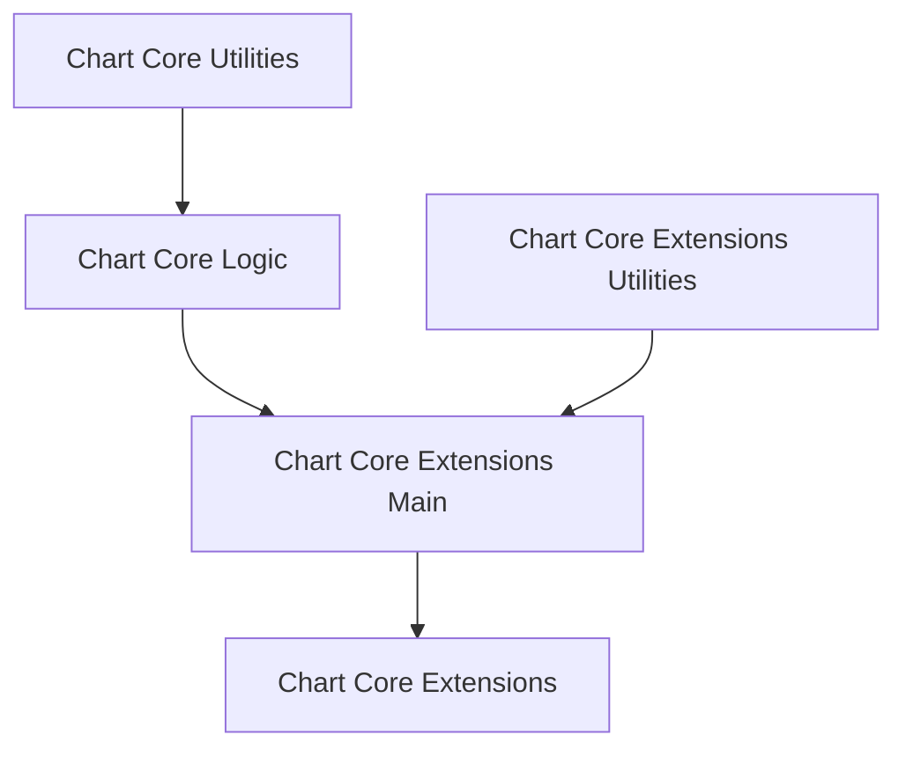
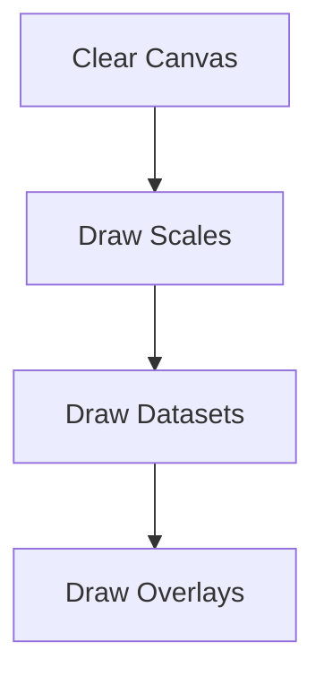
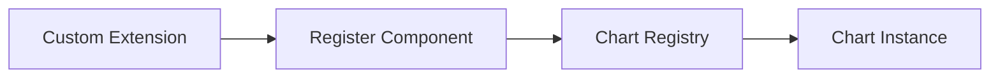

# Chart Core Extensions

The **Chart Core Extensions** module is the top-level extension layer of the chart subsystem located under:

```text
public/scripts/charts
```

It builds on top of:

- **Chart Core Utilities**
- **Chart Core Logic**
- **Chart Core Extensions Main**
- **Chart Core Extensions Utilities**

This module provides the orchestration layer that connects the Chart.js runtime with higher-level extension features used across the MeshCentral UI.

---

## Purpose of the Module

The **Chart Core Extensions** module is responsible for:

- Exposing the extended chart runtime to the application layer  
- Registering and coordinating extension components  
- Providing structured separation between:
  - Core runtime behavior
  - Extension logic
  - Utility infrastructure  
- Enabling modular expansion of chart features without modifying the base runtime  

It acts as the **integration boundary** between the Chart.js-based runtime and feature-level chart extensions used by the UI.

---

## Module Structure

### Location

```text
public/scripts/charts
```

### Core Components

The module consists of:

- `meshcentral.public.scripts.charts.On`
- `meshcentral.public.scripts.charts.Os`
- `meshcentral.public.scripts.charts.Qs`

### Internal Submodules

```text
chart-core-extensions
├── chart-core-extensions-main
│   ├── On (Chart runtime orchestrator)
│   └── Os (Animation engine coordinator)
└── chart-core-extensions-utilities
    └── Qs (Chart.js runtime bundle + registry utilities)
```

---

## Architectural Overview

The module sits on top of the chart runtime and exposes a structured extension layer.



- **Chart Core Extensions** coordinates extension boundaries.
- **Chart Core Extensions Main** provides runtime orchestration.
- **Chart Core Extensions Utilities** embeds and configures Chart.js.
- The **Chart Runtime** executes rendering, animation, and interaction.

---

## Component Responsibilities

### 1. Chart Runtime Orchestrator (`On`)

Component:
- `meshcentral.public.scripts.charts.On`

Responsibilities:

- Owns chart lifecycle
- Manages dataset controllers
- Builds and updates scales
- Executes layout passes
- Dispatches plugin hooks
- Handles rendering pipeline
- Integrates animation engine

Lifecycle flow:



---

### 2. Animation Engine (`Os`)

Component:
- `meshcentral.public.scripts.charts.Os`

Responsibilities:

- Registers property animations
- Interpolates element state
- Manages frame loop
- Coordinates transition effects
- Emits animation lifecycle events

Animation execution model:



---

### 3. Chart.js Runtime Bundle (`Qs`)

Component:
- `meshcentral.public.scripts.charts.Qs`

Responsibilities:

- Embeds Chart.js runtime
- Registers:
  - Controllers
  - Elements
  - Scales
  - Plugins
- Provides registry infrastructure
- Enables runtime extensibility

Registry structure:



---

## Interaction with Core Chart Modules

The **Chart Core Extensions** module depends on:

- **Chart Core Utilities** – Low-level helpers and math utilities  
- **Chart Core Logic** – Dataset parsing and transformation logic  
- **Chart Core Extensions Main** – Runtime orchestration layer  
- **Chart Core Extensions Utilities** – Chart.js runtime and registry layer  

High-level dependency map:



---

## Rendering Model

The rendering pipeline follows a layered model:

1. Background
2. Scales
3. Dataset elements
4. Overlays (Legend, Tooltip, Titles)



This ensures:

- Deterministic rendering order  
- Plugin extensibility  
- Animation-aware drawing  
- Clean separation between data and presentation  

---

## Extensibility Model

The module supports extension through:

- Dynamic component registration
- Plugin lifecycle hooks
- Custom controllers
- Custom scales
- Animation overrides

Extension flow:



This architecture allows feature modules to extend charts without altering core runtime logic.

---

## Summary

The **Chart Core Extensions** module:

- Provides the structured extension boundary for the chart subsystem  
- Integrates the Chart.js runtime into MeshCentral  
- Coordinates lifecycle, animation, layout, and rendering  
- Enables plugin-driven customization  
- Maintains separation between runtime infrastructure and higher-level features  

It is the **execution and integration layer** that transforms structured datasets and configuration into fully interactive, animated, and extensible chart visualizations across the UI.