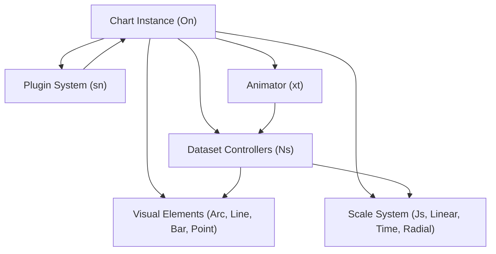
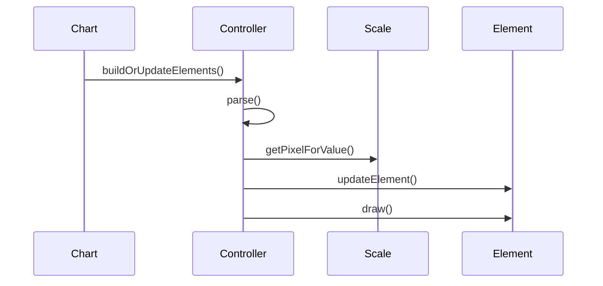
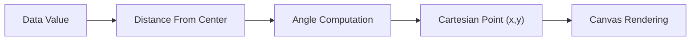
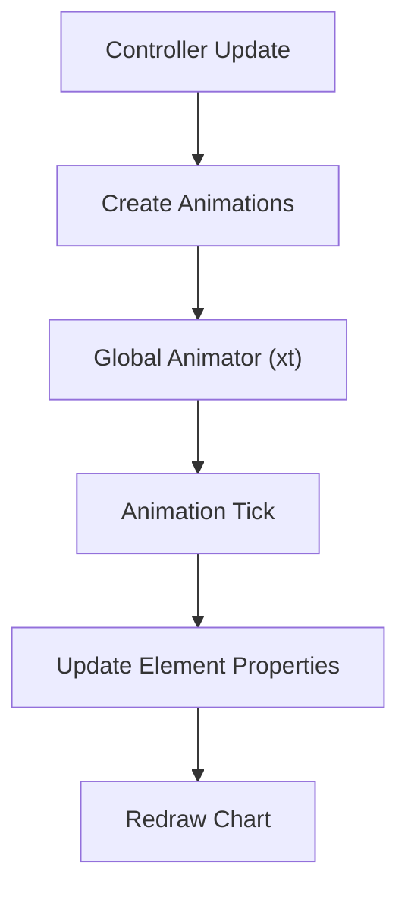
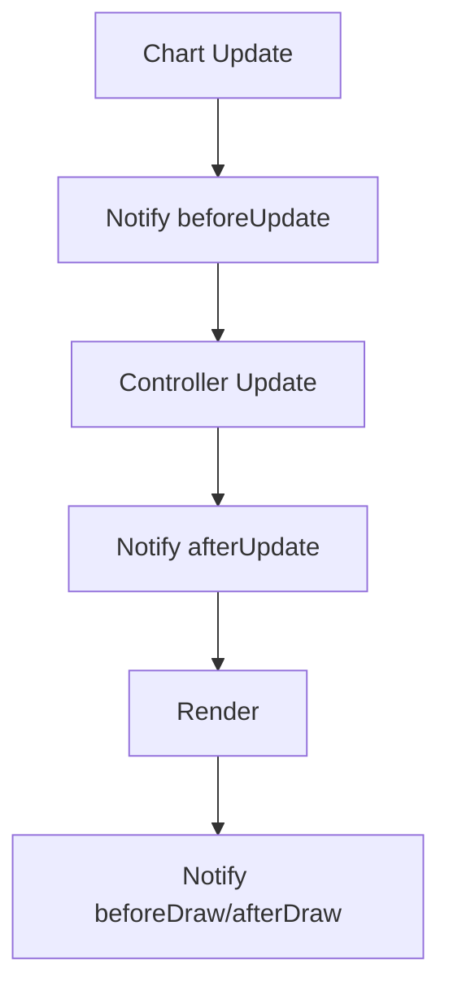
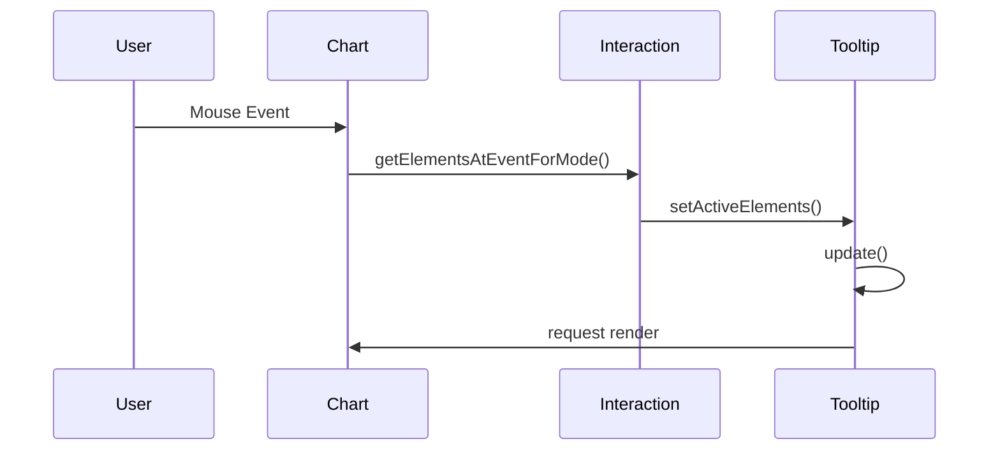
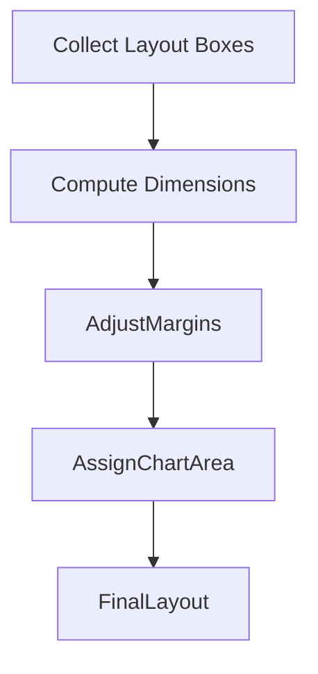
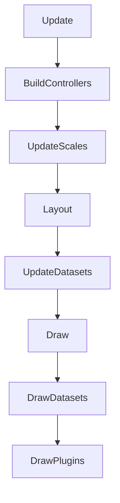

# Chart Core Logic Extensions

The **Chart Core Logic Extensions** module extends the foundational dataset and rendering logic of the charting system. Built on top of Chart.js v4.3.3, it provides advanced controller behaviors, animation orchestration, interaction modes, plugin integration, and layout coordination.

This module is part of the Chart Core Logic layer and complements the primary dataset orchestration implemented in [Chart Core Logic Main](../chart-core-logic-main/chart-core-logic-main.md).

---

## 1. Purpose and Responsibilities

The Chart Core Logic Extensions module is responsible for:

- Extending dataset controller behavior (`Ns`)
- Managing advanced animations (`Cs`, `Os`, `xt` animator)
- Handling plugin lifecycle and notification flow
- Coordinating layout boxes (legend, title, subtitle, tooltip)
- Providing interaction strategies (hover, nearest, index, dataset modes)
- Implementing scale systems (linear, logarithmic, time, radial)
- Rendering advanced elements (Arc, Line, Bar, Point)

It acts as the **execution engine** of the chart runtime, coordinating rendering, interaction, animation, and plugin extensibility.

---

## 2. High-Level Architecture

### Key Observations

- The **Chart instance (`On`)** orchestrates everything.
- Controllers (`Ns`) transform datasets into drawable elements.
- Scales (`Js` and derived classes) map values to pixels.
- Elements (`Hs` and subclasses) encapsulate drawing logic.
- Animator (`xt`) drives smooth transitions.
- Plugins hook into lifecycle events.

---

## 3. Core Components

This module includes two primary compiled components:

- `meshcentral.public.scripts.charts.Lo`
- `meshcentral.public.scripts.charts.Ns`

From the source, these correspond to:

- **Lo** → `RadialLinearScale`
- **Ns** → `DatasetController` (base controller class)

These two components anchor scale logic and dataset logic respectively.

---

## 4. Dataset Controller Extension (Ns)

The `Ns` class defines the base behavior for all dataset types:

- Parsing input data
- Resolving element options
- Synchronizing elements
- Updating and animating elements
- Applying stacking rules
- Managing hover states

### Controller Lifecycle

### Responsibilities

- Data normalization (`parsePrimitiveData`, `parseObjectData`)
- Stack resolution (`applyStack`)
- Shared option resolution
- Animation integration
- Event synchronization

Controllers are specialized into Bar, Line, Pie, Radar, etc., each inheriting from `Ns`.

---

## 5. Scale Extension – Radial Linear (Lo)

The `Lo` component implements the **Radial Linear Scale**, used in radar and polar charts.

### Responsibilities

- Map values to radial distances
- Compute angular positions
- Generate circular grid lines
- Render point labels
- Handle polar coordinate geometry

### Key Features

- Supports circular grid rendering
- Handles angle-based label positioning
- Calculates dynamic drawing radius
- Integrates with tooltip and legend systems

---

## 6. Animation System

The animation system is composed of:

- `Cs` → Individual property animation
- `Os` → Animation manager per controller
- `xt` → Global animator

### Animation Flow

Animations are:

- Time-based
- Easing-enabled
- Property-scoped
- Cancelable
- Loop-capable

This enables smooth transitions for:

- Dataset updates
- Hover states
- Resizing
- Show/hide actions

---

## 7. Plugin Lifecycle Integration

The module integrates tightly with the plugin manager (`sn`).

Plugins can hook into:

- `beforeInit`
- `beforeUpdate`
- `beforeDraw`
- `afterDraw`
- `beforeDatasetDraw`
- `afterEvent`

Built-in plugins in this module include:

- Colors
- Decimation
- Filler
- Legend
- Title
- Subtitle
- Tooltip

---

## 8. Interaction and Tooltip System

Interaction logic resolves active elements using:

- Nearest mode
- Index mode
- Dataset mode
- X/Y mode

The Tooltip element (`Fa`) manages:

- Active element tracking
- Position calculation
- Alignment resolution
- Animation transitions
- Drawing caret and background

---

## 9. Layout Coordination

Layout is managed via box registration:

- Legend
- Title
- Subtitle
- Scales

The layout engine calculates:

- Margins
- Padding
- Chart area
- Box stacking

---

## 10. Rendering Pipeline

Rendering respects:

- Z-index ordering
- Dataset visibility
- Clipping areas
- Animation state

---

## 11. Integration Within Chart Core

Position in hierarchy:

- Parent: [Chart Core Logic](../chart-core-logic.md)
- Sibling: [Chart Core Logic Main](../chart-core-logic-main/chart-core-logic-main.md)

### Division of Responsibility

| Module | Responsibility |
|--------|----------------|
| Chart Core Logic Main | Core dataset orchestration |
| Chart Core Logic Extensions | Advanced behaviors, scales, animations, plugins |

The Extensions module enhances and operationalizes the base logic layer.

---

## 12. Summary

The **Chart Core Logic Extensions** module is the advanced runtime engine of the charting system. It:

- Extends dataset controllers
- Implements scale systems
- Manages animation lifecycles
- Integrates plugin infrastructure
- Coordinates layout boxes
- Implements interaction and tooltip rendering

It transforms static dataset definitions into interactive, animated, extensible visualizations.

This module is central to enabling rich data visualization capabilities within the overall UI system.