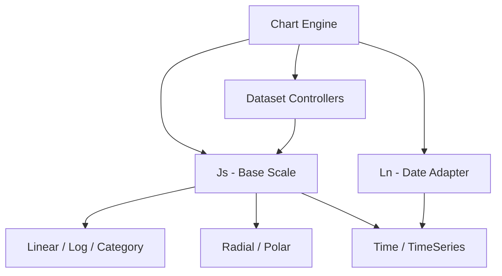
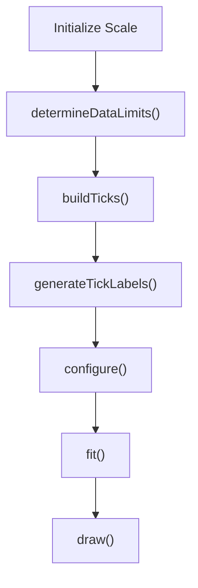
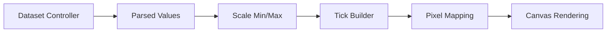
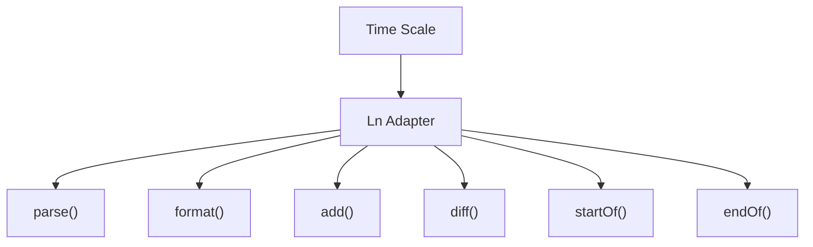
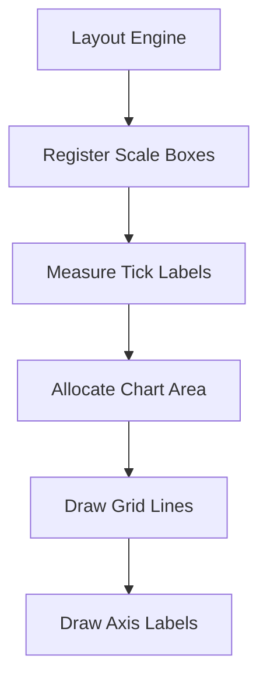
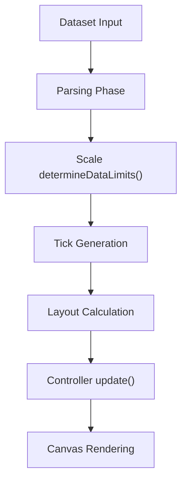
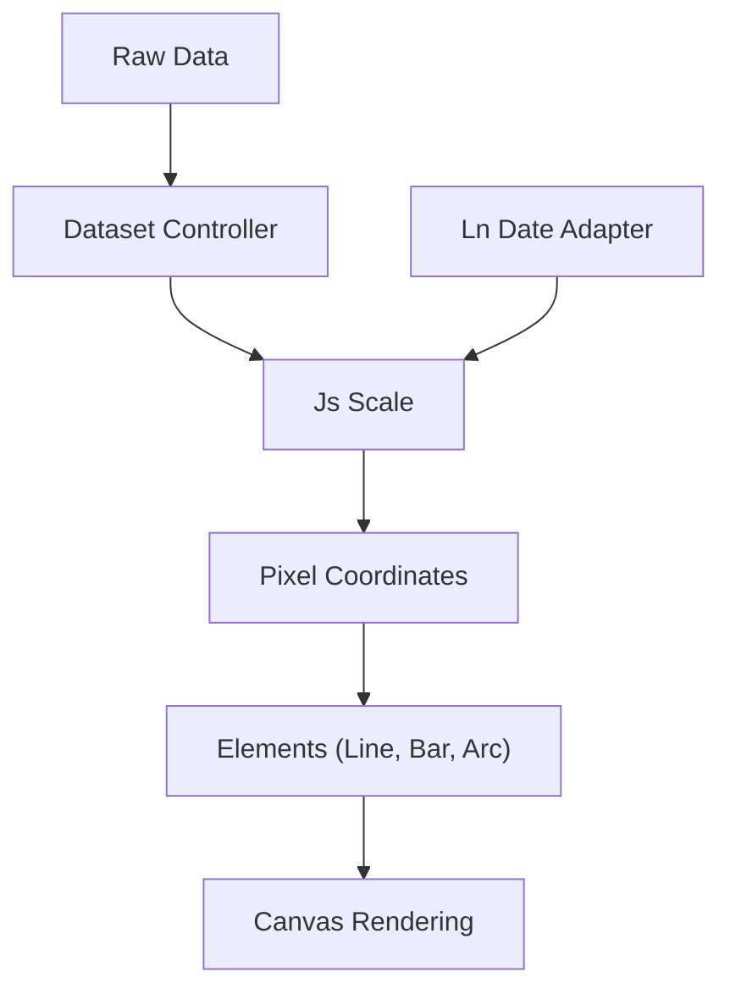

# Chart Core Logic Main

Chart Core Logic Main is the primary orchestration layer for the Chart.js runtime embedded in MeshCentral. It is responsible for coordinating scale management, dataset controllers, animation lifecycle, layout calculation, plugin execution, and rendering flow.

This module is built around two core components:

- `meshcentral.public.scripts.charts.Js` → Base Scale implementation
- `meshcentral.public.scripts.charts.Ln` → Date Adapter abstraction

Together, these components anchor the chart lifecycle by handling coordinate systems (scales) and time-based parsing/formatting (date adapter).

This module is part of the Chart Core Logic layer and works closely with:

- [Chart Core Logic](../chart-core-logic.md)
- [Chart Core Logic Extensions](../chart-core-logic-extensions/chart-core-logic-extensions.md)

---

## 1. Architectural Role

Chart Core Logic Main sits at the center of the Chart.js runtime. It:

- Defines the **Scale base class** (`Js`)
- Defines the **Date Adapter interface** (`Ln`)
- Coordinates tick generation and pixel/value mapping
- Supports cartesian, radial, logarithmic, time, and category scales
- Enables plugin-driven extensibility

### High-Level Architecture

---

## 2. Core Component: Js (Base Scale)

`Js` is the foundational scale abstraction used by all scale types.

It provides:

- Tick generation lifecycle
- Label measurement and rotation
- Pixel ↔ value transformations
- Layout integration
- Grid, border, and label rendering
- Context-aware styling via scriptable options

### Scale Lifecycle

### Responsibilities

#### 2.1 Data Limits
- Computes `min` and `max` from visible datasets
- Respects user-defined overrides
- Handles stacking logic

#### 2.2 Tick Generation
- Supports auto tick calculation
- Supports bounds modes (`data`, `ticks`)
- Applies formatting callbacks
- Supports rotation and auto-skip

#### 2.3 Coordinate Mapping

Core transformations:

- `getPixelForValue(value)`
- `getValueForPixel(pixel)`
- `getPixelForTick(index)`

These allow dataset controllers to render visual elements at correct positions.

### Scale Interaction with Dataset Controllers

---

## 3. Core Component: Ln (Date Adapter)

`Ln` defines the abstract interface used by time-based scales.

It standardizes date operations without binding to a specific library.

### Date Adapter Contract

### Key Capabilities

- Parse input timestamps or formatted strings
- Format timestamps for tick labels and tooltips
- Compute differences between dates
- Normalize values to units (day, week, month, year)

This abstraction allows Chart.js to support multiple date libraries via adapter overrides.

---

## 4. Rendering and Layout Integration

Scales are registered as layout boxes and participate in the layout engine.

Key operations include:

- Measuring longest label text
- Auto-rotation of ticks
- Handling padding and margins
- Drawing grid lines and borders

---

## 5. Scale Types Built on Js

The base scale (`Js`) is extended by multiple concrete scale implementations:

- Linear Scale
- Logarithmic Scale
- Category Scale
- Radial Linear Scale
- Time Scale
- Time Series Scale

All share:

- Tick lifecycle
- Context resolution
- Layout participation
- Rendering contract

Differences lie in:

- Data parsing
- Value normalization
- Tick spacing logic

---

## 6. Data Flow Through Chart Core Logic Main

The Scale (`Js`) acts as the mathematical backbone that converts raw values into renderable coordinates.

---

## 7. Plugin and Animation Interaction

Chart Core Logic Main integrates with:

- Animation system
- Layout engine
- Interaction modes
- Tooltip system
- Legend system

Scales:

- Expose context-aware scriptable options
- Participate in animation transitions
- Provide pixel lookups for interaction hit-testing

---

## 8. Performance Considerations

This module includes optimizations such as:

- Cached label measurement
- Lazy segment computation
- Tick auto-skip
- Optional data decimation (via plugins)
- Animation batching

These ensure responsive rendering even with large datasets.

---

## 9. How It Fits in the Overall Chart Stack

- `Js` provides coordinate logic.
- `Ln` enables time-based value normalization.
- Controllers convert parsed data into elements.
- Elements render to canvas.

---

# Summary

Chart Core Logic Main is the mathematical and structural backbone of the Chart.js runtime inside MeshCentral.

It provides:

- The foundational Scale abstraction (`Js`)
- The Date Adapter interface (`Ln`)
- Tick generation and formatting
- Coordinate transformations
- Layout integration
- Rendering orchestration support

Every dataset controller, interaction system, tooltip, and legend ultimately depends on the scale logic defined in this module.

It forms the core execution layer that transforms raw data into visual representations.