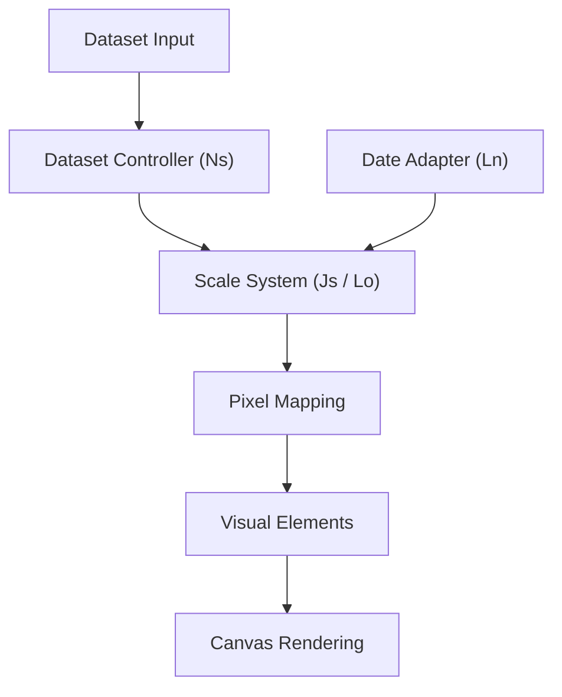
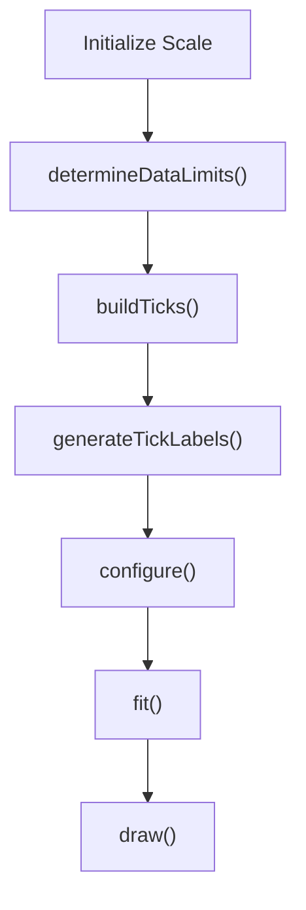
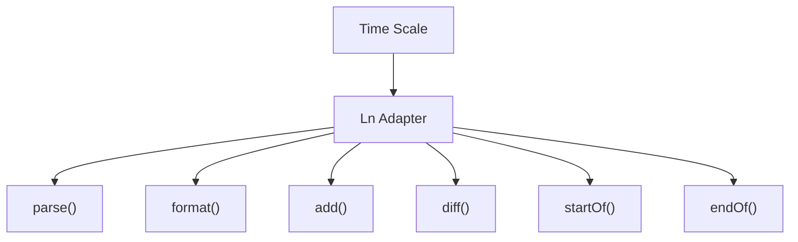
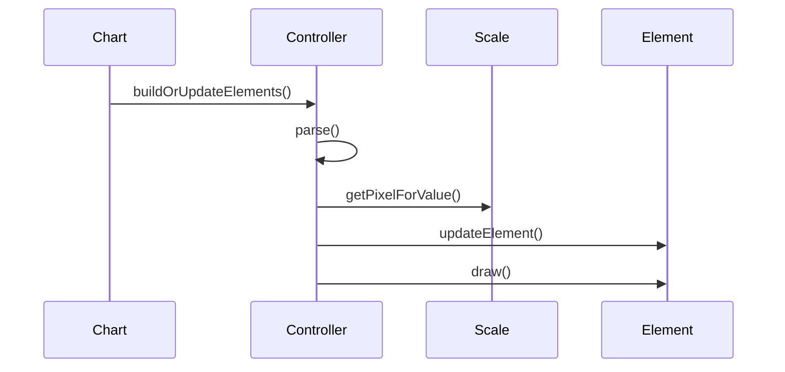
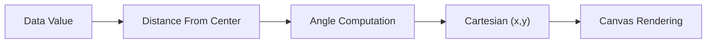
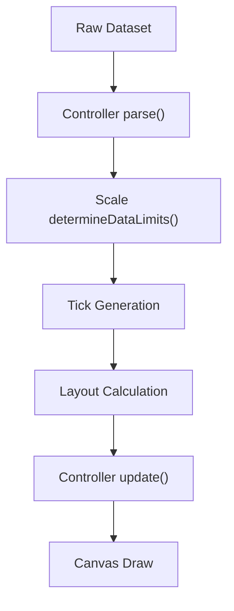
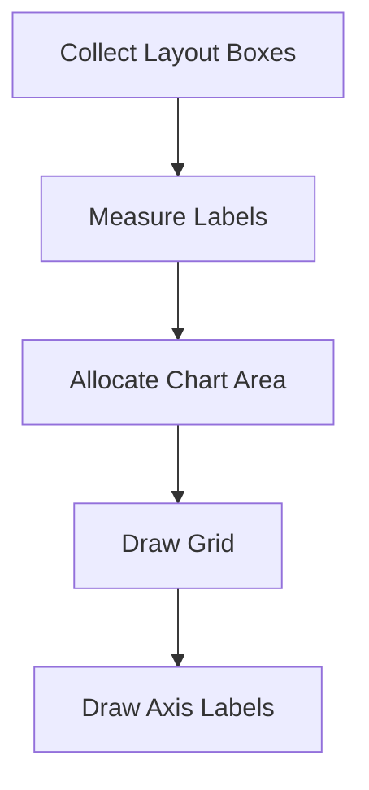
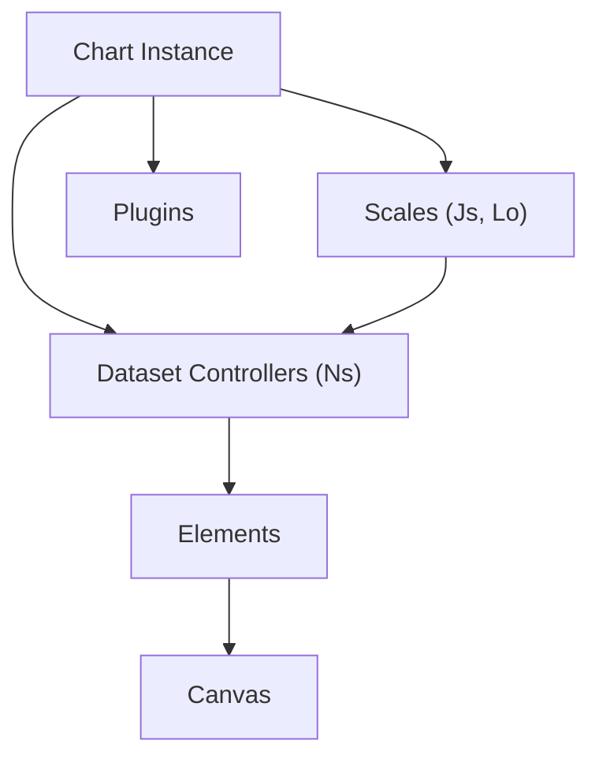

# Chart Core Logic

The **Chart Core Logic** module is the central orchestration layer of the Chart.js runtime embedded in MeshCentral. It is responsible for coordinating scale management, dataset transformation, layout negotiation, animation lifecycle, and rendering flow.

This module lives under:

```text
public/scripts (charts namespace)
```

It aggregates the core runtime components that transform structured datasets into rendered canvas visualizations.

---

## 1. Purpose of the Module

Chart Core Logic provides:

- The **Scale system foundation**
- The **Dataset controller base abstraction**
- Rendering coordination
- Tick generation and coordinate mapping
- Plugin lifecycle hooks
- Animation and update orchestration

It acts as the mathematical and structural backbone of the chart engine.

---

## 2. Repository Structure

```text
public/scripts
└── charts
    └── chart-core
        ├── chart-core-utilities
        │   ├── Cs
        │   ├── Fa
        │   ├── Hn
        │   └── Hs
        │
        ├── chart-core-logic
        │   ├── Js
        │   ├── Ln
        │   ├── Lo
        │   └── Ns
        │
        │   ├── chart-core-logic-main
        │   │   ├── Js
        │   │   └── Ln
        │   │
        │   └── chart-core-logic-extensions
        │       ├── Lo
        │       └── Ns
        │
        └── chart-core-extensions
```

### Core Components of Chart Core Logic

- `meshcentral.public.scripts.charts.Js`
- `meshcentral.public.scripts.charts.Ln`
- `meshcentral.public.scripts.charts.Lo`
- `meshcentral.public.scripts.charts.Ns`

---

## 3. Architectural Overview

Chart Core Logic sits between raw data input and canvas rendering.



### Responsibilities by Layer

| Layer | Responsibility |
|-------|---------------|
| Dataset Controller (`Ns`) | Parses and normalizes data |
| Scale Base (`Js`) | Value ↔ pixel transformation |
| Radial Scale (`Lo`) | Polar coordinate mapping |
| Date Adapter (`Ln`) | Time parsing and formatting |
| Elements | Drawing primitives |
| Canvas | Final rendering target |

---

## 4. Core Components

### 4.1 Js — Base Scale

`Js` defines the foundational scale abstraction.

It handles:

- `determineDataLimits()`
- `buildTicks()`
- `generateTickLabels()`
- `getPixelForValue()`
- `getValueForPixel()`
- Layout box integration
- Grid and axis rendering

#### Scale Lifecycle



The scale converts numeric or categorical data into pixel coordinates used by dataset controllers.

---

### 4.2 Ln — Date Adapter

`Ln` defines the abstraction layer for time-based scales.



This allows the chart engine to:

- Parse timestamps
- Format tick labels
- Normalize date units
- Compute time differences

The abstraction prevents direct coupling to any specific date library.

---

### 4.3 Ns — Dataset Controller

`Ns` is the base controller for all dataset types.

Responsibilities:

- Data parsing
- Option resolution
- Element synchronization
- Animation integration
- Stack management
- Hover state handling

#### Controller Execution Flow



All chart types inherit from this base controller.

---

### 4.4 Lo — Radial Linear Scale

`Lo` implements the radial linear scale used in radar and polar charts.



Features:

- Circular grid generation
- Angular positioning
- Dynamic radius calculation
- Tooltip integration

---

## 5. Data Flow Through Chart Core Logic



The Scale system (`Js`) acts as the mathematical backbone that enables rendering precision.

---

## 6. Layout and Rendering Coordination

Scales are registered as layout boxes and participate in chart layout resolution.



Chart Core Logic ensures:

- Proper axis placement
- Padding and margin negotiation
- Tick rotation
- Grid drawing order

---

## 7. Integration with Extensions

Chart Core Logic integrates closely with:

- **Chart Core Logic Main**
- **Chart Core Logic Extensions**
- Animation system
- Plugin system
- Interaction modes
- Tooltip engine

Division of responsibility:

| Module | Responsibility |
|--------|---------------|
| Chart Core Logic Main | Scale base and date adapter |
| Chart Core Logic Extensions | Advanced controllers and radial logic |
| Chart Core Logic | Orchestration layer |

---

## 8. Execution Hierarchy



Everything converges into coordinated canvas rendering.

---

# Summary

The **Chart Core Logic** module is the foundational execution layer of the MeshCentral chart runtime.

It provides:

- Base scale abstraction (`Js`)
- Date adapter interface (`Ln`)
- Dataset controller foundation (`Ns`)
- Radial scale implementation (`Lo`)
- Tick generation and coordinate mapping
- Layout and rendering orchestration

By transforming parsed dataset values into precise pixel coordinates, this module enables accurate, extensible, and interactive chart rendering throughout the MeshCentral UI.